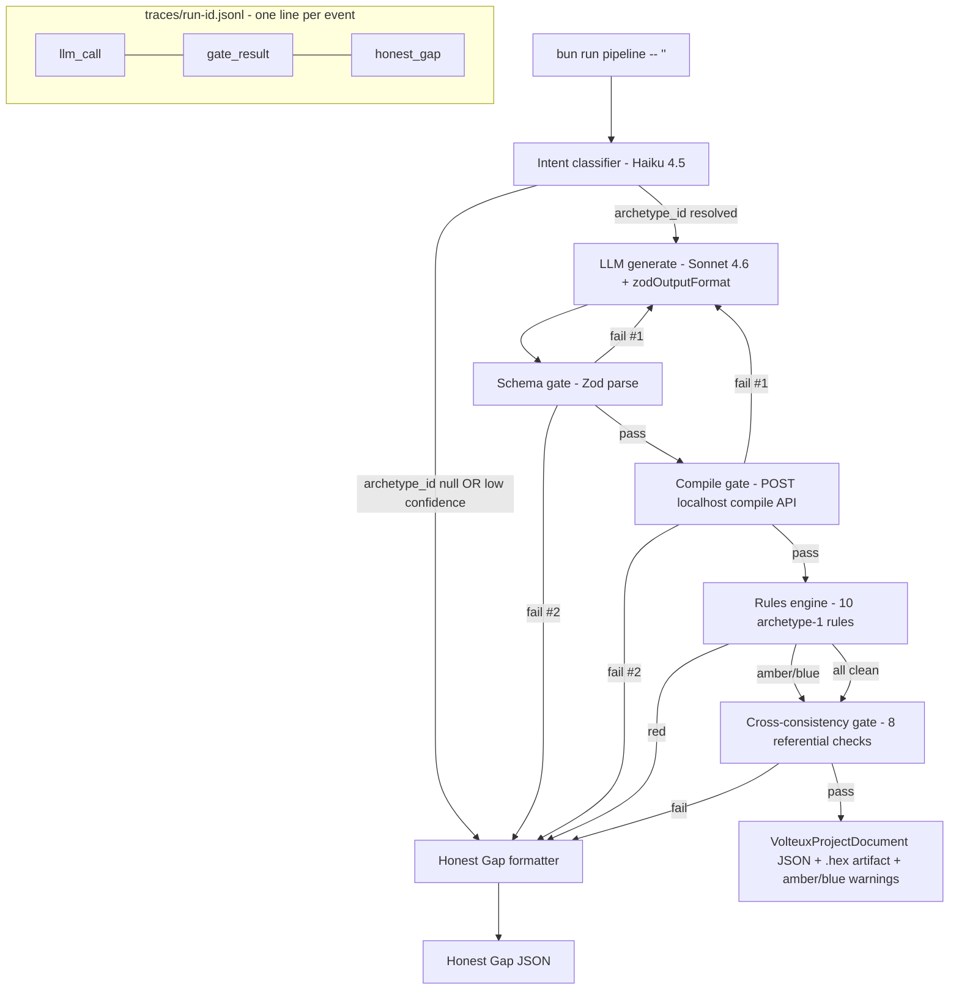

# feat: v0.1-pipeline — schema-validated, compile-gated archetype-1 generation

## Overview

Build the Track 2 / Pipeline half of the Volteux v0 stack, scoped to archetype 1 (Uno + HC-SR04 + servo). At the end, `bun run pipeline -- "<prompt>"` takes a beginner's plain-English prompt, classifies it, calls Claude Sonnet 4.6 with a Zod-shaped structured output contract, runs the result through schema → compile → rules → cross-consistency gates, and either emits a validated `VolteuxProjectDocument` JSON (with a compiled `.hex` artifact) or a structured Honest Gap message. ≥4/5 of the hand-written demo prompts must pass end-to-end. The avrgirl-arduino WebUSB spike on a real Uno is a Day 1 timeboxed unit because it is the v0 keystone risk.

## Problem Frame

Volteux's v0 demo (week 10-12) requires a friend who has never touched Arduino to type a project description and watch JSON flow through both tracks into a flashable Uno. The pipeline track owns producing that JSON. Without a working pipeline by week 4, neither track can integrate (week 5-7 in PLAN.md). v0.1-pipeline is the track-isolated milestone: pipeline ships its half against fixtures, with no UI dependency, so Talia's UI track can run in parallel against the same fixtures.

The non-obvious constraint: the JSON document is the integration contract. Schema discipline is the only thing keeping two tracks from drifting. Every gate in this plan exists because some downstream consumer (Talia's UI, the eval harness in v0.5, the meta-harness in v0.9) will silently break if the pipeline emits "valid JSON but referentially wrong" output.

## Requirements Trace

- **R1** — `bun run pipeline -- "<prompt>"` produces schema-valid JSON for ≥4/5 hand-written archetype-1 prompts (90% threshold per origin doc § Success Criteria week 4)
- **R2** — Each emitted JSON compiles to a real `.hex` via `arduino-cli compile --fqbn arduino:avr:uno`
- **R3** — Out-of-scope prompts (load cells, mains voltage, archetypes 2-5) emit a structured Honest Gap, never a hallucinated archetype-1 document
- **R4** — Schema gate, compile gate, ~10 archetype-1 rules, cross-consistency gate, and intent classifier are all functional and individually testable
- **R5** — avrgirl-arduino WebUSB Uno flashing proven on at least 3 host platforms by end of week 1 (origin doc § Success Criteria, week-4 milestone)
- **R6** — Schema lives in `schemas/document.zod.ts` as single source of truth; `schemas/document.schema.json` is generated; both signatures + `schemas/CHANGELOG.md` entry required for any change (per CLAUDE.md § Schema discipline)
- **R7** — Pipeline output includes JSON-lines execution traces shaped to be consumed by the v0.5 eval harness without rework
- **R8** — Static component metadata lives only in `components/registry.ts`; runtime JSON `components[]` carries only `{id, sku, quantity}` (per CLAUDE.md § Schema discipline)

## Scope Boundaries

- **No UI integration.** Pipeline ships as a CLI + library. Talia's track consumes fixtures, not pipeline output, until v1.0
- **No archetypes 2-5.** The intent classifier rejects them with Honest Gap. Library allowlist is archetype-1 only (`["Servo"]`)
- **No `.hex` download fallback.** WebUSB-only is committed (per CLAUDE.md § Coding conventions)
- **No retries beyond one.** Schema gate, compile gate retry once with error context, then Honest Gap. Multi-retry pipelines are explicitly out
- **No telemetry beyond JSON-lines.** OpenTelemetry / Langfuse / Sentry are deferred until v0.5 eval harness lands

### Deferred to Separate Tasks

- **Wokwi headless behavior eval** → v0.5 (see origin doc § Track 2 weeks 5-7). v0.1-pipeline writes traces in a shape the eval harness can consume, but the harness itself is not built here.
- **Meta-harness proposer loop** → v0.9 (see origin doc § Meta-Harness loop). v0.1-pipeline emits prompt source and rule definitions in version-controlled files so a future proposer has something to read and propose against.
- **Compile API VPS deployment** → v0.2. v0.1-pipeline ships the `Dockerfile` + `Hono` server runnable locally. Real Hetzner provisioning + auth + rate limiting are a separate milestone.
- **UI integration (frontend hooks pipeline output)** → v1.0. The Compile API contract shape is locked here, but actual fetch wiring is Talia's track later.
- **AvantLink affiliate IDs, share service, eval CI policy** → v1.5+ per origin doc.

## Context & Research

### Relevant Code and Patterns

There is no existing source code in this repo (greenfield). The two anchors are:
- `docs/PLAN.md` — full design with locked schema (§ "v0 JSON schema (draft)") and pipeline architecture (§ "Pipeline Architecture")
- `CLAUDE.md` — track ownership, schema discipline, coding conventions, stack choices

### Institutional Learnings

No `docs/solutions/` exists. Two relevant skill files in the user's installed plugin set worth re-reading at implementation time:
- `~/.claude/skills/claude-api/SKILL.md` — current Anthropic SDK structured-output patterns
- `~/.claude/skills/cost-aware-llm-pipeline/SKILL.md` — `CostTracker` shape that the trace format should mirror

### External References

| Topic | Reference | Key takeaway |
|---|---|---|
| Anthropic structured output | [platform.claude.com/docs/build-with-claude/structured-outputs](https://platform.claude.com/docs/en/build-with-claude/structured-outputs.md) | Use `client.messages.parse()` + `zodOutputFormat()` from `@anthropic-ai/sdk/helpers/zod`. Native, typed, no Vercel AI SDK needed |
| Prompt caching | [platform.claude.com/docs/build-with-claude/prompt-caching](https://platform.claude.com/docs/en/build-with-claude/prompt-caching.md) | 1h TTL, place `cache_control` on last system block. Sonnet 4.6 needs ≥2048 prefix tokens; Haiku 4.5 needs ≥4096. Never interpolate `Date.now()` into system prompt |
| arduino-cli compile flags | [arduino.github.io/arduino-cli/0.34/commands/arduino-cli_compile/](https://arduino.github.io/arduino-cli/0.34/commands/arduino-cli_compile/) | `--json --no-color --build-cache-path` for warm-cache wins. **Don't share `--build-path` and `--output-dir`** — produces empty artifacts ([arduino-cli #2318](https://github.com/arduino/arduino-cli/issues/2318)) |
| arduino-cli sketch sandbox | [arduino-cli #758](https://github.com/arduino/arduino-cli/issues/758) | Strip `arduino-cli.yaml`, `hardware/`, `platform.txt` from incoming sketches — they let untrusted input override platform recipe and execute arbitrary commands |
| Reference Dockerfile | [MacroYau/arduino-cli-compile-docker](https://github.com/MacroYau/arduino-cli-compile-docker) | Pattern for image with cores baked in |
| Severity model | [github.com/Haizzz/lentil](https://github.com/Haizzz/lentil), ESLint conventions | Red/amber/blue maps cleanly to error/warn/info. Hand-written predicate functions scale fine to 50 rules |

### Slack / Organizational Context

Not searched (no Slack tools wired up in this workspace, and not requested).

## Key Technical Decisions

- **Zod is the single source of truth for the JSON schema.** `schemas/document.zod.ts` is hand-authored from `docs/PLAN.md § v0 JSON schema (draft)`. `schemas/document.schema.json` is **generated** at build time via `zod-to-json-schema` and committed for documentation/UI-side consumers. **Why:** Anthropic SDK's `zodOutputFormat()` consumes Zod natively; CLAUDE.md § Coding conventions says "Zod is law." A handwritten JSON Schema would drift.
- **Anthropic SDK native, not Vercel AI SDK — including for the schema gate.** Vercel AI SDK's `generateObject()` was specifically considered for the schema gate because it bundles parse-and-retry. Rejected because (a) the gate is a 20-line Zod parse wrapper that doesn't justify the dep, (b) the auto-repair retry shape we want (fresh user turn with prior assistant content + ZodIssues) needs custom orchestration that Vercel AI SDK's built-in retry doesn't expose cleanly, and (c) one provider, one SDK keeps the trace event shape (`usage.cache_read_input_tokens`) consistent across `generate.ts` and `classify.ts`.
- **Auto-repair retry shape: fresh user turn with prior assistant content + Zod errors.** Not multi-turn, not assistant-prefill. **Why:** assistant-prefill returns 400 on Sonnet 4.6+ ([structured outputs docs](https://platform.claude.com/docs/en/build-with-claude/structured-outputs.md)); multi-turn balloons context cost on every retry.
- **Hand-rolled gate composition (~150 LOC), not a framework.** ESLint-shaped rules array `{id, severity, check}`. BAML, Inngest, and Outlines were considered. **Why:** the four gates are heterogeneous (Zod sync, arduino-cli subprocess, JSON walks, referential checks); no framework models that mix, and BAML's retry policies fire only on transport failures, not custom validators ([BAML #1415](https://github.com/BoundaryML/baml/issues/1415)).
- **Compile API uses Hono, not raw `Bun.serve()`.** Hono adds ~14kb gzipped for typed routing, middleware composition (auth, error handling, request logging), and a portable handler shape that runs unchanged on Bun, Node, or Cloudflare Workers. **Why:** the v0.2 Hetzner deploy will need auth middleware, rate-limiting middleware, and request logging — re-implementing those on `Bun.serve()` would cost more LOC than the dep saves, and the portable handler shape preserves an exit ramp if v0.2 ops shifts to Fly.io edge or a Workers shim.
- **Compile API runs locally in v0.1; VPS deferred to v0.2.** Dockerfile + Hono server are built; pipeline gate calls `localhost:PORT/api/compile`. **Why:** per user decision in planning. Removes ~half day of provisioning + €6/mo from this milestone; the production shape (image, auth contract) is still designed.
- **arduino-cli runs inside Docker, not as a statically-linked binary on the host.** The static-binary alternative would skip image build and shave cold-start. Rejected because the host filesystem would couple to the AVR core version, the Servo library version, and the `arduino-cli` version — three pieces of state that drift silently across deploys. The Dockerfile pins all three at build time and makes "rebuild from scratch on a new VPS" a one-command operation, which matters for a solo dev with no ops on-call.
- **Concurrency: in-process `p-limit(2)` queue inside one long-lived container, not a fresh container per request.** Spawning a container per request adds 200-500ms overhead — on a 1-3s arduino-cli compile that's 10-50% latency tax for zero isolation gain on a single-tenant v0.2 box. **Why:** the sketch sanitizer + per-request temp dir already provide the isolation a fresh container would; `p-limit(2)` matches CX22 vCPU count; and `--build-cache-path` only stays warm if the same process owns it across requests. Container-per-request is the right model once we have multi-tenant or untrusted public traffic — explicitly not v0.2.
- **Sketch sanitization: strip `arduino-cli.yaml`, `hardware/`, `platform.txt` before compile.** **Why:** these files let untrusted sketch input override the platform recipe. Even with a trusted LLM, defense in depth.
- **Library allowlist enforcement: parse `#include` lines AND validate `libraries[]` field.** Reject if either references something off-list. **Why:** arduino-cli auto-resolves includes; the `libraries[]` field is advisory.
- **Compile cache key: `sha256(arduino_cli_version + avr_core_version + sorted(library_versions) + fqbn + main_ino + sorted(extra_files) + sorted(libraries))`. Filesystem store at `/var/cache/volteux/<sha>.{hex,json}`, ~5GB cap, LRU by `atime`. SQLite was considered and rejected** — the cache stores binary `.hex` blobs (not queryable rows), eviction is a `find -atime +N -delete` cron one-liner in v0.2, and filesystem reads land in the page cache for free. SQLite would add a dep, a schema migration story, and a write-lock contention surface on the `p-limit(2)` queue without buying any query power we'd use. **Toolchain versions are part of the key** (corrected from origin doc which omitted them) — bumping `arduino-cli`, the AVR core, or the Servo library must invalidate every cached artifact built with the older toolchain. Store these once at server boot via `arduino-cli version --json` + `arduino-cli core list --json` + `arduino-cli lib list --json` and prefix every key with the resulting hash.
- **Prompt caching: 1h TTL on system+schema block.** **Why:** ~50-200 calls/day during dev hits the 1h window enough to amortize the 2× write cost; the 5min default would constantly expire.
- **JSON-lines traces from day 1 at `traces/{run_id}.jsonl`.** One line per event (`llm_call`, `gate_result`, `honest_gap`). **Why:** v0.5 eval harness will consume these without rework; cheap to write now, expensive to retrofit.
- **`bun:test` for unit and integration tests.** **Why:** Bun is the chosen runtime; `bun:test` is built-in, fast, no extra config.

## Open Questions

### Resolved During Planning

- **VPS deployment in v0.1?** → **No.** Docker image only; local execution. VPS is v0.2. (User decision.)
- **avrgirl-arduino WebUSB spike owner?** → **Kai (this plan, Unit 2).** Resolved per user; the contradiction between PLAN.md (pipeline track) and CLAUDE.md (Talia's WebUSB UX) was a wording artifact — Talia owns the *integrated* WebUSB UI; Kai owns the *spike* that proves the underlying library works.
- **Schema v1.5 fields emit policy** (PLAN.md unresolved) → **Allow at schema level (already optional in spec); warn via rule when archetype_id ∈ {archetype 1} and any v1.5 field is present.** This preserves the locked schema and pushes enforcement into the rules engine where it can be tuned per-archetype. Decision documented in `schemas/CHANGELOG.md`.
- **Hetzner CX22 vs Fly.io shared-cpu-2x** → **Hetzner CX22 (Gen3)** is the v0.2 deployment target. No Volume gymnastics, predictable disk for build cache. Documented in `infra/deploy.md` for v0.2 work; not provisioned in v0.1.
- **Vercel AI SDK vs Anthropic SDK native** → **Anthropic SDK native** with `messages.parse()` + `zodOutputFormat()`. Single provider; Vercel AI SDK adds an unjustified abstraction.

### Deferred to Implementation

- **Exact rule thresholds** (current budget mA, voltage tolerance windows): finalized when authoring each rule against the fixture. Documented in each rule file's header comment.
- **Number of few-shot examples in the Sonnet generation prompt:** start with 1 (the canonical fixture); add more if quality drops. Decision deferred until first prompt iteration.
- **Compile cache eviction cron interval:** not needed in v0.1 since dev volume is low. A `find -atime +30 -delete` cron is a v0.2 task once the VPS exists.
- **Whether Haiku classifier needs a fallback to a button-based picker** (origin doc weeks 1-2 contingency): defer until end of week 4 measurement. If the classifier hits ≥90% accuracy on 10 hand-classified prompts, ship it; if not, escalate to Talia's UI track for a button picker (Talia's call).

## Output Structure

```
volteux/
├── package.json                          # Bun, TypeScript strict, deps below
├── tsconfig.json                         # strict mode, no `any` without justification
├── bunfig.toml
├── .env.example                          # ANTHROPIC_API_KEY, COMPILE_API_URL, COMPILE_API_SECRET
├── .gitignore                            # adds traces/, .env
├── components/
│   └── registry.ts                       # 5 archetype-1 components, single source of static metadata
├── fixtures/
│   └── uno-ultrasonic-servo.json         # canonical hand-crafted document
├── schemas/
│   ├── document.zod.ts                   # SOURCE OF TRUTH
│   ├── document.schema.json              # generated from Zod
│   ├── generate-json-schema.ts           # build script
│   └── CHANGELOG.md                      # v0.1 entry
├── pipeline/
│   ├── cli.ts                            # `bun run pipeline -- "<prompt>"` entry point
│   ├── index.ts                          # orchestrator: classify → generate → schema → compile → rules → cross-consistency
│   ├── types.ts                          # Severity, GateResult, RuleResult, Rule (single shared types file)
│   ├── honest-gap.ts                     # formatter for {scope, missing_capabilities, explanation}
│   ├── repair.ts                         # single auto-repair retry helper used by schema + compile gates
│   ├── trace.ts                          # JSON-lines writer; event union has JSDoc contract for v0.5 eval
│   ├── gates/
│   │   ├── schema.ts                     # Zod parse wrapper
│   │   ├── compile.ts                    # POST to compile API
│   │   ├── cross-consistency.ts          # 8 referential-integrity checks (registry passed as param)
│   │   └── library-allowlist.ts          # per-archetype allowlist + #include parsing + filename allowlist regex
│   ├── llm/
│   │   ├── anthropic-client.ts           # shared client + cache_control config
│   │   ├── generate.ts                   # Sonnet 4.6 + zodOutputFormat + auto-repair (try/catch around messages.parse)
│   │   └── classify.ts                   # Haiku 4.5 intent classifier
│   ├── prompts/
│   │   ├── archetype-1-system.md         # version-controlled prompt source
│   │   └── intent-classifier-system.md   # version-controlled prompt source
│   └── rules/
│       ├── index.ts                      # runner over registered rules
│       ├── CHANGELOG.md                  # severity changes during weeks 3-4 logged here
│       └── archetype-1/
│           ├── voltage-match.ts
│           ├── current-budget.ts
│           ├── breadboard-rail-discipline.ts
│           ├── no-floating-pins.ts
│           ├── wire-color-discipline.ts
│           ├── pin-uniqueness.ts
│           ├── servo-pwm-pin.ts
│           ├── sensor-trig-output-pin.ts
│           ├── sensor-echo-input-pin.ts
│           ├── sketch-references-pins.ts
│           └── no-v15-fields-on-archetype-1.ts
├── infra/
│   ├── Dockerfile                        # debian-slim + arduino-cli + AVR core + Servo
│   ├── server/
│   │   └── compile-api.ts                # Hono POST /api/compile (run locally in v0.1)
│   └── deploy.md                         # v0.2 Hetzner CX22 provisioning notes (drafted, not executed)
├── spikes/
│   └── avrgirl-webusb/                   # Day 1-2 spike: nested package.json, Vite page, blink + servo flash tests (Unit 2)
└── tests/
    ├── schema.test.ts
    ├── pipeline.test.ts                  # smoke + Honest Gap trigger coverage
    ├── pipeline-repair.test.ts           # tests the shared repair() helper independently
    ├── compile-server.test.ts            # gated by local Docker via `bun run compile:up`
    ├── gates/
    │   ├── schema.test.ts
    │   ├── cross-consistency.test.ts
    │   └── library-allowlist.test.ts
    ├── rules/archetype-1/                # 11 .test.ts files mirroring rule names
    ├── llm/
    │   ├── generate.test.ts
    │   └── classify.test.ts
    └── acceptance/
        ├── archetype-1-prompts.test.ts   # the 4/5-overall + 1/2-holdout gate
        ├── calibration.test.ts           # 30-prompt FN/FP measurement; reports, doesn't block
        ├── prompts/
        │   ├── tuning/
        │   │   ├── 01-distance-servo.txt
        │   │   ├── 02-pet-bowl.txt
        │   │   └── 03-wave-on-approach.txt
        │   └── holdout/                  # sealed Day 1 — do not open during prompt iteration
        │       ├── 04-doorbell.txt
        │       └── 05-trash-can.txt
        ├── calibration/                  # 30 prompts (15 in-scope + 15 out-of-scope)
        └── calibration-labels.json

scripts/
└── regenerate-fixtures.ts                # re-runs 5 acceptance prompts and writes fixtures/generated/

fixtures/generated/                       # 5 outputs from Unit 10 — committed for Talia's UI snapshot tests

# gitignored
traces/                                   # runtime JSON-lines per pipeline run (prompt_hash only)
traces-raw/                               # raw prompts keyed by run-id, accessed by explicit retrieval
docs/spikes/                              # week-1 spike report (created in Unit 2)
```

## High-Level Technical Design

> *This illustrates the intended approach and is directional guidance for review, not implementation specification. The implementing agent should treat it as context, not code to reproduce.*



**Auto-repair retry contract (gates D and E):** on first `red` failure, the orchestrator re-invokes the LLM generate step (C) with the original user prompt, the prior assistant output as an `assistant` turn, and a fresh `user` turn containing the structured errors. One retry max per gate. Cumulative retries across gates: at most 2 per pipeline run. The orchestrator passes the gate name and error payload to a single `repair()` helper so the retry logic lives in one place.

**Severity model:** `red` = Honest Gap (block). `amber` = pass-through with warning attached to output. `blue` = pass-through with info attached. Only `red` triggers retry; `amber` and `blue` flow into the final document under a `warnings[]` field added at orchestrator stage.

## Implementation Units

- [ ] **Unit 1: Repo scaffolding + schema-as-Zod + canonical fixture (Day 1, joint with Talia)**

**Goal:** Bootstrap the repo with the locked schema in Zod, generate the JSON Schema mirror, commit `fixtures/uno-ultrasonic-servo.json`, and seed `components/registry.ts` with 5 archetype-1 components. Both signatures + `schemas/CHANGELOG.md` v0.1 entry per CLAUDE.md schema discipline.

**Requirements:** R6, R8

**Dependencies:** None (this is Day 1)

**Files:**
- Create: `package.json`, `tsconfig.json`, `bunfig.toml`, `.env.example`, `.gitignore`
- Create: `schemas/document.zod.ts` (port from `docs/PLAN.md` § "v0 JSON schema (draft)")
- Create: `schemas/generate-json-schema.ts` (build script using `zod-to-json-schema`)
- Create: `schemas/document.schema.json` (generated artifact, committed)
- Create: `schemas/CHANGELOG.md` with v0.1 entry naming Zod as source of truth
- Create: `fixtures/uno-ultrasonic-servo.json` (the abbreviated fixture in PLAN.md, completed with all required fields)
- Create: `components/registry.ts` with entries for Uno R3 (SKU "50"), HC-SR04 (SKU "3942"), Micro servo SG90 (SKU "169"), 830-tie breadboard (SKU TBD), and jumper wire pack (SKU TBD)
- Test: `tests/schema.test.ts`

**Approach:**
- Hand-author Zod first; let JSON Schema be derived. Pin `zod` and `zod-to-json-schema` versions in `package.json`
- Use `z.object().strict()` so unknown fields fail (forces LLM discipline)
- **Empty-payload defenses on required arrays/strings:** `components: z.array(...).min(1)`, `connections: z.array(...).min(1)`, `breadboard_layout.components: z.array(...).min(1)`, `sketch.main_ino: z.string().min(1)`. Catches the LLM degenerate "valid envelope, empty contents" failure mode at the cheap schema gate instead of the expensive compile gate.
- Add `bun run gen:schema` script that regenerates `schemas/document.schema.json` and a CI check that verifies it's up-to-date
- `components/registry.ts`: `export const COMPONENTS = { ... } as const` with TypeScript-typed entries including `pin_metadata`, `pin_layout`, `education_blurb`, `model_url` placeholder

**Patterns to follow:**
- CLAUDE.md § Coding conventions: TypeScript strict, no `any` without comment justification
- `~/.claude/rules/web/coding-style.md` for file organization

**Test scenarios:**
- Happy path — `fixtures/uno-ultrasonic-servo.json` parses cleanly through `VolteuxProjectDocumentSchema.parse()` with no errors
- Edge case — fixture stripped of optional `external_setup.captive_portal_ssid` still parses (optional fields)
- Edge case — fixture with extra unknown top-level field `foo: "bar"` fails parse (strict mode)
- Error path — fixture with `archetype_id: "not-an-archetype"` fails with a clear enum error
- Edge case — every SKU in `fixtures/uno-ultrasonic-servo.json` `components[]` resolves against `registry.COMPONENTS` (sanity check the registry covers the fixture)

**Verification:**
- `bun run gen:schema` produces a `schemas/document.schema.json` that diff-matches the version committed in PR
- `bun test tests/schema.test.ts` is green
- `schemas/CHANGELOG.md` v0.1 entry contains both signatures (Kai + Talia)

---

- [ ] **Unit 2: Browser-direct Uno flash spike on real hardware (Day 1-2 go/no-go, then Day 3-5 cross-platform)**

**Goal:** By end of Day 2 on Kai's primary Mac (Apple Silicon), prove the v0 flash path works end-to-end with both a hand-curated blink hex AND a Servo-using sketch (the kind the pipeline will actually emit). By end of week 1, confirm the same flow works on at least 2 additional host platforms. The library choice is part of what the spike resolves — it is NOT a given that `avrgirl-arduino` is the answer.

**Library reality check** (must do before writing any spike code): `avrgirl-arduino` was last published 2021-02-07; its current browser support is **alpha-stage Web Serial** (NOT WebUSB) per its README. The plan and PLAN.md say "WebUSB" by historical convention; the actual API path for a 2026 Chrome tab is most likely Web Serial. If avrgirl's alpha web-serial transport works, great. If not, the candidate alternatives — verified to exist as of writing — are: a fork of avrgirl with a custom Web Serial transport; `serialport` polyfilled via `web-serial-polyfill`; or the `stk500-v1`/`stk500-v2` npm packages (Node-only) wrapped behind a thin Web Serial driver. **`arduino-stk500-v1` and `chrome-arduino-fu` are NOT real npm packages** — they were named in PLAN.md from generic memory; remove them from the candidate list.

**Requirements:** R5

**Dependencies:** Unit 1 (uses repo for the spike folder), but parallel-able with Units 3-7. Day 1-2 IS the keystone risk window — if the spike fails by EOD Day 2 on Kai's machine, work on Units 3-7 pauses for re-planning rather than continuing in parallel.

**Execution note:** Hardware-in-the-loop. Spike code is exploratory and lives in `spikes/avrgirl-webusb/` with its own nested `package.json` (Vite + chosen transport library — kept isolated from the pipeline scope so neither bleeds into the other). The production browser-direct flash UX is Talia's track in v1.0; the spike's only deliverable is "yes this can work" + a documented library + a captured error contract for Talia's error boundary.

**Files:**
- Create: `spikes/avrgirl-webusb/package.json` (nested; isolates Vite + transport dep from pipeline scope)
- Create: `spikes/avrgirl-webusb/index.html` (Vite page with two buttons: "Flash blink" and "Flash servo")
- Create: `spikes/avrgirl-webusb/main.ts` (transport library import + flash call)
- Create: `spikes/avrgirl-webusb/blink-known-good.hex` (precompiled blink sketch with a distinctive pattern, e.g., 200ms on / 800ms off)
- Create: `spikes/avrgirl-webusb/servo-known-good.hex` (hand-authored sketch using `Servo.h` that sweeps the servo from 0° to 180° once after boot — compiled locally with `arduino-cli`; mirrors the shape of pipeline-emitted sketches so the spike de-risks the actual production .hex layout, not just blink)
- Create: `spikes/avrgirl-webusb/README.md` (how to run the spike, which library was chosen, how to wire the Uno + servo)
- Create: `docs/spikes/2026-04-XX-browser-flash-uno.md` (spike report — Web API used, library + version, outcomes per platform, captured error strings)

**Approach:**
- Day 1: prepare the Uno + servo on Kai's desk before any code is written. Hand-compile both .hex files via `arduino-cli` locally (no pipeline needed yet — this proves the toolchain end-to-end).
- Day 1-2: write the spike on Mac Apple Silicon; flash blink first (proves library works at all), then flash servo (proves library works on the .hex shape we'll actually emit). **If servo fails but blink works, the spike has surfaced a real risk and Units 3-7 pause for re-planning.**
- Day 3-5: cross-platform validation. Test platforms in priority order: Mac Intel → Windows x86 → Linux x86 → Windows ARM. Pick 2 the team can access.
- Spike report template per platform: `{platform, OS version, Chrome version, web API used (Web Serial / WebUSB / other), library + version, blink result, servo result, error strings captured}`
- Capture the failure-mode error strings (no Uno connected, permission denied, mid-flash disconnect) verbatim — they become Talia's v1.0 error boundary copy in CLAUDE.md.

**Patterns to follow:**
- Origin doc § Critical risk to track section
- CLAUDE.md § Critical risk to track section

**Test scenarios:**
- Happy path (blink) — clicking "Flash blink" with a connected Uno results in the distinctive LED pattern within 8s on each test platform
- Happy path (servo) — clicking "Flash servo" with a connected Uno + servo results in a single 0°→180° sweep within 8s on each test platform
- Error path — clicking "Flash" with no Uno connected surfaces a clear error class; capture the error string verbatim
- Error path — clicking "Flash" with the wrong board (e.g., a ESP32) connected surfaces a board-mismatch error; capture
- Edge case — clicking "Flash" twice in 100ms (double-click) does not corrupt the flash sequence (capture behavior whatever it is)
- Edge case — pulling the USB cable mid-flash leaves the Uno in a recoverable state (re-flashing after re-connecting works); capture
- Test expectation: hardware-in-the-loop only; no automated test added to CI

**Verification:**
- End of Day 2: `docs/spikes/2026-04-XX-browser-flash-uno.md` exists with PASS on Kai's Mac for both blink AND servo. If servo fails (regardless of blink result), an explicit re-plan note is added and Units 3-7 pause.
- End of Week 1: 3 platforms total documented, ≥2 PASS for both blink and servo.
- Spike report names the chosen library + version explicitly; if no candidate works, the v0 blocker is escalated to the user with a re-plan request.
- Spike outcome shared with Talia at end of week 1 sync (Friday EOD per CLAUDE.md cadence).

---

- [ ] **Unit 3: Schema gate**

**Goal:** Wrap Zod parse in a `Gate<unknown> → Result<VolteuxProjectDocument>` interface that the orchestrator can call. Returns either `{ok: true, doc}` or `{ok: false, severity: "red", errors: ZodIssue[]}`. The errors are passed verbatim into the LLM auto-repair turn.

**Requirements:** R4

**Dependencies:** Unit 1

**Files:**
- Create: `pipeline/gates/schema.ts` (consumes shared types from `pipeline/types.ts`, created in Unit 9)
- Test: `tests/gates/schema.test.ts`

**Approach:**
- Single function `runSchemaGate(input: unknown): GateResult<VolteuxProjectDocument>` — no class, no DI, just a function
- On failure, return `errors: ZodIssue[]` directly; the orchestrator decides how to format them for the LLM repair turn

**Patterns to follow:**
- ESLint-style result shape (per pipeline-patterns research)
- CLAUDE.md § Coding conventions: explicit error handling

**Test scenarios:**
- Happy path — fixture passes, returns `{ok: true, doc}` with `doc.archetype_id === "uno-ultrasonic-servo"`
- Error path — fixture with missing `board.fqbn` returns `{ok: false, severity: "red", errors: [...]}` and `errors[0].path` includes `["board", "fqbn"]`
- Error path — JSON with `archetype_id: 42` (wrong type) returns `errors[0].code === "invalid_type"`
- Edge case — empty object `{}` returns multiple errors, one per missing required field
- Edge case — `null` input returns `{ok: false}` without throwing
- Edge case — string input `"hello"` returns `{ok: false}` without throwing
- Edge case — `{archetype_id: "uno-ultrasonic-servo", board: {...}, components: [], connections: [], breadboard_layout: {components: []}, sketch: {main_ino: ""}, external_setup: {needs_wifi: false, needs_aio_credentials: false}}` (valid envelope, empty contents) returns `{ok: false}` with errors naming the empty-array and empty-string violations — caught at schema gate, not later

**Verification:**
- All 6 test scenarios green
- `runSchemaGate` is the only export; type signature is `(input: unknown) => GateResult<VolteuxProjectDocument>`

---

- [ ] **Unit 4: Library allowlist + cross-consistency gate**

**Goal:** Implement the 8-check cross-consistency gate per origin doc § Definitions, plus a per-archetype library allowlist enforced via both `#include` parsing and the `libraries[]` field.

**Requirements:** R4

**Dependencies:** Unit 1, Unit 3

**Files:**
- Create: `pipeline/gates/library-allowlist.ts`
- Create: `pipeline/gates/cross-consistency.ts`
- Test: `tests/gates/library-allowlist.test.ts`
- Test: `tests/gates/cross-consistency.test.ts`

**Approach:**
- Cross-consistency gate signature: `runCrossConsistencyGate(doc: VolteuxProjectDocument, registry: typeof COMPONENTS): GateResult` — registry passed as parameter (not imported from singleton) so tests can swap a stub registry for check (g) and check (e). This keeps the gate a pure function of its inputs.
- Cross-consistency gate runs 8 deterministic checks (a-h from origin doc § Definitions); each check is a small named function so tests can target them individually. **Check (e) — "every non-wire component has a `breadboard_layout` entry" — requires resolving each component's `type` from the registry** (since the runtime JSON's `components[]` only carries `{id, sku, quantity}` per the schema/registry split). The registry parameter makes this explicit.
- Library allowlist: `ARCHETYPE_LIBRARIES = { "uno-ultrasonic-servo": ["Servo"] }`. Parse `#include\s+["<]([^">]+)["\s]` from `sketch.main_ino` + `sketch.additional_files` values, intersect with allowlist via library-name → header mapping (e.g., `Servo.h` → `Servo`). Strip line comments (`//`) and block comments (`/* */`) before parsing so commented-out includes don't trip the allowlist
- **Reject sketches whose `additional_files` keys fail the allowlist regex** `^[A-Za-z0-9_.-]+\.(ino|h|cpp|c)$` (defense-in-depth allowlist; matches the compile-server allowlist in Unit 6 — the policy lives in BOTH places intentionally because cross-consistency runs before the compile API call)

**Patterns to follow:**
- Origin doc § Definitions for the 8 checks (a-h)
- arduino-cli sketch sandbox guidance from research

**Test scenarios:**
- Happy path — fixture passes all 8 cross-consistency checks
- Error path (one per check, a-h) — fixture mutated to fail check N returns `{ok: false}` with an error message naming check N. Eight scenarios:
  - (a) duplicate `components[].id`
  - (b) `connections[].from.component_id` references unknown component
  - (c) `connections[].from.pin_label` not in source component's `pin_metadata`
  - (d) `breadboard_layout.components[].component_id` not in `components[]`
  - (e) component of type `sensor` lacks a `breadboard_layout.components[]` entry
  - (f) `board.fqbn` not in `["arduino:avr:uno", "esp32:esp32:esp32", "esp32:esp32:esp32c3", "rp2040:rp2040:rpipico"]`
  - (g) `components[].sku` not present in `registry.COMPONENTS`
  - (h) `sketch.libraries[]` references library outside archetype-1 allowlist
- Library allowlist scenarios:
  - Happy path — sketch with `#include <Servo.h>` and `libraries: ["Servo"]` passes
  - Error path — sketch with `#include <WiFi.h>` and `libraries: ["WiFi"]` fails with explicit "WiFi not in archetype-1 allowlist"
  - Error path — sketch with `#include <Servo.h>` but `libraries: []` fails ("Servo header included but library not declared")
  - Error path — sketch with `additional_files["arduino-cli.yaml"] = "..."` fails ("forbidden file in sketch")
  - Edge case — sketch with `// #include <Evil.h>` (commented out) does NOT fail (parser handles comments)

**Verification:**
- All 8 cross-consistency scenarios + 5 allowlist scenarios green
- Each check is testable in isolation (named exports per check)

---

- [ ] **Unit 5: Rules engine + 10 archetype-1 rules**

**Goal:** Build the rules engine with red/amber/blue severity, register 10 archetype-1 rules, and run them over a `VolteuxProjectDocument`. Red rules trigger Honest Gap; amber/blue surface as warnings on the final document.

**Requirements:** R4

**Dependencies:** Unit 1, Unit 3

**Files:**
- Create: `pipeline/rules/index.ts` (runner; consumes Rule/RuleResult from `pipeline/types.ts`)
- Create: `pipeline/rules/CHANGELOG.md` (severity changes during weeks 3-4 must be logged here per Severity-locking discipline below)
- Create: `pipeline/rules/archetype-1/voltage-match.ts`
- Create: `pipeline/rules/archetype-1/current-budget.ts`
- Create: `pipeline/rules/archetype-1/breadboard-rail-discipline.ts`
- Create: `pipeline/rules/archetype-1/no-floating-pins.ts`
- Create: `pipeline/rules/archetype-1/wire-color-discipline.ts`
- Create: `pipeline/rules/archetype-1/pin-uniqueness.ts`
- Create: `pipeline/rules/archetype-1/servo-pwm-pin.ts`
- Create: `pipeline/rules/archetype-1/sensor-trig-output-pin.ts`
- Create: `pipeline/rules/archetype-1/sensor-echo-input-pin.ts`
- Create: `pipeline/rules/archetype-1/sketch-references-pins.ts`
- Test: `tests/rules/archetype-1/<rule-name>.test.ts` (10 files)

**Approach:**
- ESLint-style: each rule exports `{id: string, severity: Severity, check: (doc: VolteuxProjectDocument) => RuleResult}`
- `RuleResult` shape: `{passed: boolean, message?: string, context?: Record<string, unknown>}`
- Runner returns `{red: RuleResult[], amber: RuleResult[], blue: RuleResult[]}` so the orchestrator can decide what to do with each
- Each rule file has a header comment explaining the underlying invariant (current draw thresholds, voltage tolerance, pin classifications) and citing the source (Uno datasheet, HC-SR04 datasheet, etc.)
- **One additional v0.1 rule** (warning level): `no-v15-fields-on-archetype-1` — fires amber when any of `external_setup.{captive_portal_ssid, aio_feed_names, mdns_name}` is non-empty AND `archetype_id === "uno-ultrasonic-servo"`. Closes the schema-v1.5-emit policy decision (allow at schema level; warn at rule level). Total = 11 rules; preserve "~10" wording loosely.

**Rule severity assignments (initial; LOCKED before week 4 acceptance run):**
- Red (block): voltage-match, no-floating-pins, pin-uniqueness, sensor-trig-output-pin, sensor-echo-input-pin, sketch-references-pins
- Amber (warn): current-budget (close to limit), wire-color-discipline (non-conventional but functional), servo-pwm-pin (works on non-PWM but jitters), no-v15-fields-on-archetype-1
- Blue (info): breadboard-rail-discipline (cosmetic but worth noting)

**Severity-locking discipline:** Once Unit 5 is complete, severity assignments are locked for the remainder of v0.1. **Any severity downgrade during week 3-4 (e.g., red → amber to make a stuck acceptance prompt pass) requires an explicit `// SEVERITY DOWNGRADED ON YYYY-MM-DD: <evidence-the-issue-is-benign>` comment in the rule file and a one-line rationale in `pipeline/rules/CHANGELOG.md`.** This treats severity changes with the same friction as schema changes — without the discipline, the acceptance gate is self-validating (Kai writes the rules, the rules grade Kai's prompts, Kai owns the dial; tightening the dial is the path of least resistance to "passing" the milestone).

**Patterns to follow:**
- ESLint rule shape (per pipeline-patterns research)
- Origin doc § Track 2 weeks 3: "current budget, voltage match, breadboard rail discipline, no-floating-pins, etc."

**Test scenarios:**
- Per rule (10 rules × 2 scenarios each = 20 scenarios):
  - Happy path — fixture (clean) passes the rule
  - Error path — minimally-mutated fixture violates the rule and returns `{passed: false, message: <descriptive>}`
- Runner-level scenarios:
  - Integration — running all 10 rules on the canonical fixture returns no red, no amber, no blue
  - Integration — running all 10 rules on a fixture with 2 violations returns exactly 2 results in their respective severity buckets
  - Edge case — empty rules array returns `{red: [], amber: [], blue: []}`

**Verification:**
- All 23 test scenarios green
- Each rule file has a header comment with rationale + datasheet reference
- `pipeline/rules/index.ts` exports `runRules(doc, rules?) => {red, amber, blue}`

---

- [ ] **Unit 6: arduino-cli compile gate (Docker image + Hono server, local-only)**

**Goal:** Build a Docker image with `arduino-cli` + AVR core + Servo pre-installed and a Hono HTTP server exposing `POST /api/compile`. The pipeline gate calls this server (locally during v0.1; same contract works against a remote VPS in v0.2). Includes sketch sanitization, library allowlist enforcement, per-request temp dirs, p-limit concurrency, and a SHA256 filesystem cache. Ships with a deploy README documenting Hetzner CX22 provisioning for v0.2.

**Requirements:** R2, R4

**Dependencies:** Unit 1, Unit 4 (uses library-allowlist module)

**Files:**
- Create: `infra/Dockerfile`
- Create: `infra/server/compile-api.ts` (Hono server)
- Create: `infra/server/sketch-fs.ts` (per-request temp dir + sanitization)
- Create: `infra/server/cache.ts` (SHA256 filesystem cache with LRU)
- Create: `infra/server/run-compile.ts` (arduino-cli subprocess wrapper)
- Create: `infra/deploy.md` (Hetzner CX22 provisioning steps for v0.2; not executed in v0.1)
- Create: `pipeline/gates/compile.ts` (client that calls the API)
- Test: `tests/compile-server.test.ts` (runs against local Docker container)

**Approach:**
- **Dockerfile:** `debian:bookworm-slim` base; install `arduino-cli@1.4.1`, `arduino-cli core install arduino:avr@1.8.6`, `arduino-cli lib install Servo@1.2.2`. Verify install at build time so a broken image fails CI.
- **API contract** (matches origin doc § Compile API contract):
  ```
  POST /api/compile
  Headers: { Authorization: "Bearer <COMPILE_API_SECRET>" }
  Body: { fqbn, sketch_main_ino, additional_files?, libraries: string[] }
  Response: { ok: bool, stderr: string, artifact_b64?: string, artifact_kind: "hex" }
  ```
- **Sanitization:** before writing files to the per-request temp dir, validate every `additional_files` key against an **allowlist regex** `^[A-Za-z0-9_.-]+\.(ino|h|cpp|c)$` (filenames only, no path separators, no `..`, no leading `/`, no null bytes, no empty string). Reject any key that fails the allowlist. This is stricter than the previous blocklist (`arduino-cli.yaml | hardware/ | platform.txt | ..`) and fails closed by default. Reject the request with 400 + clear error before invoking the compiler.
- **Concurrency:** `p-limit(2)` (matches CX22 vCPU count) so concurrent requests don't trash each other's compiles
- **Compile invocation:** `arduino-cli compile --fqbn <fqbn> --output-dir /tmp/req-<id>/out --build-path /tmp/req-<id>/build --build-cache-path /var/cache/arduino-build --warnings default --jobs 2 --no-color --json /tmp/req-<id>/sketch`. **Critical: `--build-path` and `--output-dir` MUST be different directories** ([arduino-cli #2318](https://github.com/arduino/arduino-cli/issues/2318))
- **Cache:** key = `sha256(toolchain_version_hash + fqbn + main_ino + sorted(extra_files) + sorted(libraries))` where `toolchain_version_hash = sha256(arduino-cli version JSON + core list JSON + lib list JSON)` is computed once at server boot. Storage at `/var/cache/volteux/<sha>.hex` + `<sha>.json` (stderr). Size cap ~5GB; eviction by `atime`. Cache reads happen ONLY inside the authenticated POST `/api/compile` handler — there is NO separate GET endpoint for cache retrieval. Cache hit returns artifact directly without invoking arduino-cli.
- **Auth:** `Bearer <secret>` from `COMPILE_API_SECRET` env. **Server validates at startup that the secret is at least 32 bytes (64 hex chars or equivalent base64) and refuses to start otherwise** — prevents the "test" placeholder from ever shipping past local dev. Per-secret rate limiting + Turnstile deferred to v0.2 deploy. **A small in-process token bucket (10 requests / 60s per secret) IS shipped in v0.1** — ~20 LOC, ensures the absent-rate-limit doesn't replicate unchanged into v0.2 under time pressure.
- **Pipeline-side gate** (`pipeline/gates/compile.ts`): POSTs to `COMPILE_API_URL` (default `http://localhost:8787`), surfaces stderr to caller, base64-decodes artifact on success.

**Patterns to follow:**
- arduino-cli VPS research § Recommended Dockerfile shape
- arduino-cli sketch sandbox guidance ([arduino-cli #758](https://github.com/arduino/arduino-cli/issues/758))
- Hono routing conventions

**Test scenarios:**
- Happy path — POST with the canonical `fixtures/uno-ultrasonic-servo.json` `sketch.main_ino` + `libraries: ["Servo"]` returns `{ok: true, artifact_b64: "...", artifact_kind: "hex"}` and the artifact is non-empty
- Happy path — second identical POST hits cache and returns in <100ms (vs ~3-8s cold)
- Error path — POST with `sketch.main_ino` containing a syntax error returns `{ok: false, stderr: <gcc message>}`
- Error path — POST with `additional_files["arduino-cli.yaml"]` returns 400 with "filename not in allowlist" before invoking compiler
- Error path — POST with `libraries: ["WiFi"]` returns 400 with "library not in allowlist" before invoking compiler
- Error path — POST without Authorization header returns 401
- Error path — server fails to start when `COMPILE_API_SECRET` < 32 bytes; clear error message names the requirement
- Edge case (allowlist) — POST with `additional_files["../etc/passwd"]` returns 400 (path separator in key)
- Edge case (allowlist) — POST with `additional_files["/etc/passwd"]` returns 400 (leading slash)
- Edge case (allowlist) — POST with `additional_files["sketch.ino"]` returns 400 (null byte)
- Edge case (allowlist) — POST with `additional_files[""]` returns 400 (empty key)
- Edge case (allowlist) — POST with `additional_files["valid_file.ino"]` is accepted (allowlist passes)
- Error path (rate limit) — 11th POST within 60s for the same secret returns 429
- Integration — `pipeline/gates/compile.ts` against a local server: happy path produces artifact; failure path surfaces stderr verbatim
- Integration — auto-repair retry: gate called twice in sequence with the prior stderr returns `{ok: false}` cleanly without infinite loops
- Integration (latency injection) — `pipeline/gates/compile.ts` against a localhost proxy that adds 200ms RTT (simulating future Hetzner→dev-machine latency) still completes within the orchestrator's timeout; documents the v0.2 latency budget assumption
- Integration (cache key version drift) — re-run a previously-cached compile after manually changing the toolchain-version-hash file → cache miss; previous cache entry is NOT served

**Verification:**
- `docker build -f infra/Dockerfile -t volteux-compile .` succeeds and image size <1GB
- `docker run -p 8787:8787 -e COMPILE_API_SECRET=test volteux-compile` starts the server
- `bun test tests/compile-server.test.ts` is green against the running container
- `infra/deploy.md` documents the Hetzner CX22 provisioning steps (not executed; ready for v0.2)

---

- [ ] **Unit 7: LLM generation (Sonnet 4.6) with structured output and auto-repair**

**Goal:** Wrap `client.messages.parse({ model: "claude-sonnet-4-6", output_config: { format: zodOutputFormat(VolteuxProjectDocumentSchema) } })` with a versioned system prompt, prompt caching, and an auto-repair retry that feeds prior assistant content + Zod errors back as a fresh user turn.

**Requirements:** R1, R3

**Dependencies:** Unit 1, Unit 3

**Files:**
- Create: `pipeline/llm/anthropic-client.ts` (shared client + cache_control config)
- Create: `pipeline/llm/generate.ts`
- Create: `pipeline/prompts/archetype-1-system.md` (version-controlled prompt source — meta-harness reads this file)
- Test: `tests/llm/generate.test.ts`

**Approach:**
- System prompt is composed from two text blocks: the versioned `pipeline/prompts/archetype-1-system.md` content + a schema/registry primer (component list, valid pin labels, allowed libraries)
- **Cache `cache_control: { type: "ephemeral", ttl: "1h" }` on the LAST system block** (caches everything before it including the schema primer)
- Verify cache hits in tests by inspecting `response.usage.cache_read_input_tokens > 0` on second call
- Pin SDK to `@anthropic-ai/sdk@^0.88.0` (required for `messages.parse()` + `zodOutputFormat`)
- Auto-repair shape:
  1. First call: user turn = original prompt
  2. On Zod failure: `response.content` (assistant turn) + new user turn = "Your previous output failed schema validation with these errors: <ZodIssue[]>. Return a corrected JSON document. Do not explain — emit JSON only."
  3. One retry max; on second failure return `{ok: false, errors}` for the orchestrator to convert to Honest Gap
- **Do NOT use assistant-turn prefill** — returns 400 on Sonnet 4.6+
- Watch `stop_reason === "max_tokens"` — set `max_tokens: 16000` for the document; surface as a distinct error class (different from schema fail)
- **Wrap `client.messages.parse()` in try/catch** that maps SDK parse exceptions onto the same `{ok: false, errors: ZodIssue[]}` shape the orchestrator expects. The SDK throws (rather than returning state) when `output_config.format` parse fails, so without the wrap the orchestrator's `repair()` helper never sees these failures.
- **Check the prompt+schema-primer token count before relying on cache hits.** Sonnet 4.6 caches only at ≥2048 prefix tokens; a slim system prompt + small schema primer (registry of 5 components, ~10 rules) might land at ~1500 tokens and never write the cache. Either pad the primer with the relevant Uno datasheet excerpt + 1-2 more curated few-shot examples to clear 2048, or accept "no cache in v0.1" and remove the cache verification test. Decision deferred until first prompt iteration when token count is measurable.
- The system prompt is loaded from `pipeline/prompts/archetype-1-system.md` at module load (not per-call) so the prompt source can be edited without a rebuild

**Patterns to follow:**
- Anthropic SDK structured outputs research § Canonical pattern
- `~/.claude/skills/claude-api/SKILL.md`

**Test scenarios:**
- Integration (gated by `ANTHROPIC_API_KEY` env, skipped otherwise) — calling `generate("a robot that waves when something gets close")` returns `{ok: true, doc}` with `doc.archetype_id === "uno-ultrasonic-servo"`
- Integration — second call within 1h returns `usage.cache_read_input_tokens > 0` (cache working)
- Unit (mocked client) — first call succeeds, returns `{ok: true, doc}` without retry
- Unit (mocked client) — first call fails Zod parse, second call succeeds, retry message includes the prior assistant content + ZodIssues
- Unit (mocked client) — both calls fail Zod parse, returns `{ok: false, errors}` after exactly 2 calls (no infinite retry)
- Unit (mocked client) — `stop_reason === "max_tokens"` returns a distinct error class `{ok: false, kind: "truncated"}`
- Edge case — empty user prompt is rejected at the function boundary before calling Anthropic

**Verification:**
- `bun test tests/llm/generate.test.ts` green (integration tests skip if no `ANTHROPIC_API_KEY`)
- `pipeline/prompts/archetype-1-system.md` has a header noting "edited via PR; meta-harness reads this file" so future contributors don't bypass the version-control discipline
- Cache hit verified manually with two consecutive calls and a console log of `usage.cache_read_input_tokens`

---

- [ ] **Unit 8: Intent classifier (Haiku 4.5)**

**Goal:** Use Haiku 4.5 with structured output to classify a user prompt into `{archetype_id: string | null, confidence: number, reasoning: string}`. Out-of-scope or low-confidence inputs route to Honest Gap with `scope: "out-of-scope"` before any Sonnet call.

**Requirements:** R3

**Dependencies:** Unit 1

**Files:**
- Create: `pipeline/llm/classify.ts`
- Create: `pipeline/prompts/intent-classifier-system.md` (version-controlled, meta-harness consumable)
- Test: `tests/llm/classify.test.ts`

**Approach:**
- Define a small Zod schema `IntentClassificationSchema = z.object({ archetype_id: z.enum([...]).nullable(), confidence: z.number().min(0).max(1), reasoning: z.string() })`
- Call Haiku 4.5 (`claude-haiku-4-5-20251001` or alias `claude-haiku-4-5`) with `messages.parse()` + `zodOutputFormat(IntentClassificationSchema)`
- System prompt: brief description of the 5 archetypes (only archetype 1 is in scope for v0.1; the other 4 are listed so the classifier can route them to "out-of-scope" rather than misroute to archetype 1)
- **Confidence threshold: ≥0.6 is a placeholder, not a calibrated number.** LLM self-reported confidence is not a calibrated probability. Unit 10 ships a 30-prompt calibration set that measures end-to-end pipeline behavior across the threshold; the threshold is locked from the calibration data before week-4 acceptance, not from intuition. Default 0.6 if calibration is missing.
- **Stronger primary signal: `archetype_id === null` from the model itself.** Treat that as the dominant out-of-scope route and use the confidence threshold only as a secondary gate (filter `archetype_id !== null` results with confidence < threshold). The model's "I don't know" is more informative than its self-reported confidence.
- **Important:** Haiku 4.5 needs ≥4096 prefix tokens for prompt caching to engage. The classifier system prompt is short (~500-800 tokens) and likely won't cache. That's fine for v0; revisit if classifier latency becomes a bottleneck.
- `max_tokens: 1024` is plenty for this small response

**Patterns to follow:**
- Same Anthropic SDK + Zod pattern as Unit 7
- Origin doc § Track 2 week 4: "Haiku 4.5 with a structured-output prompt that returns `{ archetype_id | null, confidence, reasoning }`"

**Test scenarios:**
- Integration (gated by `ANTHROPIC_API_KEY`) — happy path: "a robot that waves when something gets close" → `{archetype_id: "uno-ultrasonic-servo", confidence > 0.7}`
- Integration — happy path: "I want to measure how close my dog gets to the food bowl" → `{archetype_id: "uno-ultrasonic-servo"}` (free-form variant)
- Integration — out of scope: "a scale that weighs my packages" → `{archetype_id: null, confidence < 0.6, reasoning includes "load cell"}`
- Integration — out of scope: "control my house lights from my phone" → `{archetype_id: null}` (mains voltage / smart home, out of scope)
- Integration — wrong-archetype-but-classifier-knows: "a temperature display that texts me" → `{archetype_id: null}` (matches archetype 4 which is v1.5 / out of scope for v0)
- Unit (mocked client) — classifier returns `{archetype_id: "uno-ultrasonic-servo", confidence: 0.4}` → orchestrator-side filter converts to null because below threshold
- Edge case — empty prompt rejected at function boundary
- Edge case — prompt > 5000 chars rejected at function boundary (hard cap before LLM call)

**Verification:**
- Test scenarios green
- Manual measurement: 10 hand-classified prompts (5 archetype-1, 5 out-of-scope) → ≥9/10 correct. If <9/10, escalate to Talia for v0 fallback to button-based picker

---

- [ ] **Unit 9: Honest Gap formatter + pipeline orchestrator + Bun CLI + tracing**

**Goal:** Wire all gates together in a single orchestrator function. Provide the `bun run pipeline -- "<prompt>"` CLI entry. Emit JSON-lines traces shaped for the v0.5 eval harness to consume without rework. Honest Gap formatter centralizes the `{scope, missing_capabilities, explanation}` contract.

**Requirements:** R1, R3, R4, R7

**Dependencies:** Units 3, 4, 5, 6, 7, 8

**Files:**
- Create: `pipeline/types.ts` (single Severity, GateResult, RuleResult, Rule — replaces the previously-separate `pipeline/gates/types.ts` and `pipeline/rules/types.ts`; one shared types file is all v0.1 needs)
- Create: `pipeline/honest-gap.ts`
- Create: `pipeline/repair.ts` (the single auto-repair retry helper that the orchestrator calls for both schema-gate and compile-gate failures; named export, tested independently in `tests/pipeline-repair.test.ts`)
- Create: `pipeline/index.ts` (orchestrator)
- Create: `pipeline/cli.ts` (Bun script entry)
- Create: `pipeline/trace.ts` (JSON-lines writer; trace event union type carries a JSDoc block describing every event kind so the v0.5 eval harness has an in-source contract — no separate `pipeline/trace.md` is shipped)
- Update: `package.json` add `"scripts": { "pipeline": "bun pipeline/cli.ts", "compile:up": "docker run --rm -p 8787:8787 -e COMPILE_API_SECRET=$COMPILE_API_SECRET volteux-compile" }`
- Test: `tests/pipeline.test.ts`
- Test: `tests/pipeline-repair.test.ts`

**Approach:**
- Orchestrator signature: `runPipeline(prompt: string, opts?: { traceTo?: string }) => Promise<PipelineResult>` where `PipelineResult = { kind: "ok", doc, artifact_b64, warnings } | { kind: "honest-gap", gap }`
- Sequence: classifier → (if classified) generate → schema gate → (if pass) compile gate → (if pass) rules → (if no red) cross-consistency → emit
- Each gate failure that exhausts retries emits Honest Gap via the formatter
- Honest Gap formatter accepts `{scope, missing_capabilities, source}` where `source` is one of `"intent-classifier" | "schema-gate" | "compile-gate" | "rules-engine" | "cross-consistency"` and produces `{scope, missing_capabilities, explanation}`. v0.1 uses one explanation template per source; consolidation deferred per origin doc § Definitions ("Type contract")
- Trace writer: `traces/{ISO8601-run-id}.jsonl`. **Prompts are stored as `prompt_hash` (sha256) in the trace; the raw prompt is written to a sibling file `traces-raw/{run-id}.txt` accessed only by explicit retrieval.** This isolates redaction risk from observability — eval harness in v0.5 can read the raw prompt via the explicit path, but a leaked or copied trace file alone reveals nothing about user content. Events: `{kind: "pipeline_start", prompt_hash}`, `{kind: "llm_call", model, input_tok, output_tok, cached_tok, latency_ms}`, `{kind: "gate_result", gate, attempt, ok, severity?, latency_ms}`, `{kind: "repair_attempt", gate, prior_error_summary}` (per ADV-008 — surfaces the retry rate as a quality metric so "passes after retry" doesn't masquerade as "passes cleanly"), `{kind: "honest_gap", source, scope}`, `{kind: "pipeline_end", outcome}`. Append-only; close on completion.
- CLI: parse positional argument as prompt, call `runPipeline`, pretty-print result, exit code 0 on `kind: "ok"`, exit code 1 on `kind: "honest-gap"` (so CI can assert). **Wrap `runPipeline` in an outer try/catch/finally in `cli.ts`** so a thrown env-var-validation error before the orchestrator starts still emits a well-formed JSON-lines trace with `{kind: "pipeline_end", outcome: "unhandled_throw"}`.

**Patterns to follow:**
- Pipeline-patterns research § Recommended pipeline shape (function composition, ~150 LOC)
- Origin doc § Definitions for the 6 Honest Gap triggers (a-f)

**Test scenarios:**
- Happy path — `runPipeline("a robot that waves when something gets close")` returns `{kind: "ok", doc, artifact_b64}` (integration, gated)
- Honest Gap (a) — classifier returns `archetype_id: null` → `{kind: "honest-gap", gap: {scope: "out-of-scope", source: "intent-classifier"}}`
- Honest Gap (c) — schema gate fails twice → `{kind: "honest-gap", gap: {source: "schema-gate"}}` (mocked LLM)
- Honest Gap (d) — compile gate fails twice → `{kind: "honest-gap", gap: {source: "compile-gate"}}` (mocked compile API)
- Honest Gap (e) — rules engine returns red → `{kind: "honest-gap", gap: {source: "rules-engine"}}` (mocked LLM emitting voltage-mismatched doc)
- Honest Gap (f) — cross-consistency gate fails → `{kind: "honest-gap", gap: {source: "cross-consistency"}}` (mocked LLM emitting referential mismatch)
- Integration — pipeline run produces a `traces/<run-id>.jsonl` file with at least `pipeline_start`, one `llm_call`, ≥1 `gate_result`, and `pipeline_end` lines
- Integration — amber/blue rule results pass through to `result.warnings[]` and do NOT trigger Honest Gap
- CLI — `bun pipeline/cli.ts "a robot that waves..."` exits 0 on success, exits 1 on Honest Gap, prints structured output to stdout

**Verification:**
- All 9 test scenarios green
- Manual run: `bun run pipeline -- "a robot that waves when something gets close"` produces an OK result and a trace file
- Trace file is valid JSON-lines (one valid JSON object per line, parseable by `JSON.parse` line-by-line)

---

- [ ] **Unit 10: Acceptance prompts (3 tuning + 2 holdout) + classifier calibration set + commit pipeline outputs as fixtures for Talia**

**Goal:** Three deliverables collapse into this unit because they're all "what does week-4 acceptance actually measure":
1. Author 5 archetype-1 prompts split into a **tuning set (3, visible during prompt iteration)** and a **holdout set (2, sealed Day 1, never inspected during prompt-source iteration)**. Acceptance: ≥4/5 overall AND ≥1/2 holdout. The holdout requirement prevents the trivial overfit failure mode where Kai tunes the system prompt against the prompts that grade it.
2. Author a **classifier calibration set of 30 hand-labeled prompts** (15 in-scope archetype-1, 15 out-of-scope) and measure end-to-end pipeline behavior — not just classifier accuracy, but full `runPipeline` outcomes. Confidence threshold ≥0.6 in Unit 8 is a placeholder; this measurement either confirms it or replaces it with a calibrated number.
3. After acceptance passes, **commit the 5 generated `VolteuxProjectDocument` outputs as `fixtures/generated/*.json`** so Talia's UI snapshot tests exercise the realistic shape distribution alongside the canonical hand-curated fixture (closes the "Talia gets one fixture, pipeline emits a wider distribution" gap).

**Requirements:** R1, R2 (plus implicit: closes the integration-readiness gap with Talia's track)

**Dependencies:** Units 1-9

**Execution note:** This unit IS the week-4 demo gate. The holdout-set discipline is what makes the gate meaningful. Lock the classifier confidence threshold + rule severity assignments BEFORE running acceptance — see Risks table for the discipline rationale.

**Files:**
- Create: `tests/acceptance/prompts/tuning/01-distance-servo.txt` (visible during prompt iteration)
- Create: `tests/acceptance/prompts/tuning/02-pet-bowl.txt`
- Create: `tests/acceptance/prompts/tuning/03-wave-on-approach.txt`
- Create: `tests/acceptance/prompts/holdout/04-doorbell.txt` (sealed Day 1; do not open during prompt iteration)
- Create: `tests/acceptance/prompts/holdout/05-trash-can.txt` (sealed Day 1; do not open during prompt iteration)
- Create: `tests/acceptance/calibration/in-scope-*.txt` (15 prompts)
- Create: `tests/acceptance/calibration/out-of-scope-*.txt` (15 prompts)
- Create: `tests/acceptance/calibration-labels.json` (`{prompt_filename: "in-scope" | "out-of-scope"}` mapping; never inspected by `runPipeline`)
- Create: `tests/acceptance/archetype-1-prompts.test.ts` (per-prompt + summary tests)
- Create: `tests/acceptance/calibration.test.ts` (false-positive / false-negative measurement; reports — does NOT block)
- Create: `fixtures/generated/<archetype-1-prompt-id>.json` (5 files, generated by acceptance run, committed for Talia)
- Create: `scripts/regenerate-fixtures.ts` (Bun script: re-runs the 5 acceptance prompts and overwrites `fixtures/generated/`; manual to run, but reproducible)

**Approach:**
- **Day 1 (joint with Unit 1):** author all 5 acceptance prompts AND the 30 calibration prompts BEFORE writing any system-prompt source. Variety enforced by structure: at least 2 idiomatic ("a robot that waves..."), 1 literal ("turn a servo when an HC-SR04 detects something close"), at least 1 with hedging language ("maybe a thing that..."), at least 1 with a misspelling. The holdout set goes into a directory the implementer agrees to not open during weeks 3-4 — there is no technical lock; this is professional discipline.
- Each acceptance test asserts: `result.kind === "ok"`, `result.doc.archetype_id === "uno-ultrasonic-servo"`, `result.artifact_b64.length > 0`, `result.warnings.filter(w => w.severity === "red").length === 0`
- Calibration test reports per-prompt outcome and aggregate `{true_positive, true_negative, false_positive, false_negative}` — does NOT fail the build; it's a measurement that informs the classifier confidence threshold tuning
- Tests gated by `ANTHROPIC_API_KEY` and `COMPILE_API_URL` env vars; skip with a message if missing. **These integration tests are MANDATORY for the week-4 acceptance run by Kai locally; OPTIONAL for any developer not running the acceptance gate** (because they cost real API tokens). Document this in the test file header.
- Expected wall time: ~3 min for the 5-prompt acceptance suite + ~12 min for the 30-prompt calibration. Run sequentially (not `Promise.all`) to avoid Anthropic rate-limit churn.
- After acceptance passes, run `bun scripts/regenerate-fixtures.ts` and commit the 5 outputs to `fixtures/generated/` so Talia's UI snapshot tests pick them up

**Patterns to follow:**
- Origin doc § Success Criteria week 4: "90%+ of 5 hand-written test prompts"
- CLAUDE.md § Schema discipline: "Fixtures keep both sides honest" — `fixtures/generated/` extends the contract surface

**Test scenarios:**
- Happy path × 3 (tuning) — each tuning prompt produces `{kind: "ok", doc}` with archetype 1 and a non-empty artifact
- Happy path × 2 (holdout) — each holdout prompt produces `{kind: "ok", doc}` ; failure is informative (means the system prompt overfit) but only ≥1/2 is required to pass
- Acceptance summary — ≥4/5 overall AND ≥1/2 holdout pass; any deviation logs the failing prompt to stdout for analysis
- Calibration measurement — outputs aggregate counts to stdout and to `traces/calibration-<run-id>.json`; never fails the suite
- Test expectation: integration only, real Anthropic API, real local compile API

**Verification:**
- `bun test tests/acceptance/archetype-1-prompts.test.ts` is green with ≥4/5 individual passes AND ≥1/2 holdout passes
- `bun test tests/acceptance/calibration.test.ts` runs to completion; output reviewed by Kai; if FP+FN rate >20%, the classifier confidence threshold is tuned and the test re-run before declaring acceptance
- `fixtures/generated/` contains 5 valid `VolteuxProjectDocument` files; each parses against `schemas/document.zod.ts` and is compatible with Talia's snapshot-test harness contract
- Manual demo: `bun run pipeline -- "$(cat tests/acceptance/prompts/tuning/01-distance-servo.txt)"` produces a flashable `.hex`

## System-Wide Impact

- **Interaction graph:** The pipeline is a closed loop. The only inbound edge is the CLI / future HTTP wrapper; the only outbound edges are (a) the Compile API (HTTP, contract locked), (b) the Anthropic API (SDK), and (c) `traces/*.jsonl` files. No callbacks, no observers, no middleware in v0.1.
- **Error propagation:** Every gate failure either returns a `GateResult` to the orchestrator OR (for unrecoverable infra failure like Anthropic 5xx) throws. The orchestrator catches throws and emits an `error_boundary` trace event + a generic Honest Gap. There is no silent error swallowing — all errors surface in traces.
- **State lifecycle risks:**
  - Per-request temp dirs in the compile server MUST be cleaned up after compile (success or failure). Use `try/finally` with `rm -rf`. A leak crashes the VPS in v0.2 within hours of traffic.
  - Compile cache: writes are atomic (`write-temp + rename`); reads tolerate missing entries.
  - Traces: opened on `pipeline_start`, closed on `pipeline_end` even on throw (use `try/finally`).
- **API surface parity:** The schema (`schemas/document.zod.ts`) is the contract Talia consumes. The Compile API contract (`POST /api/compile` shape) is the second contract. Both are documented; both have version markers (`schemas/CHANGELOG.md`; the Compile API will get `infra/CHANGELOG.md` when deployed in v0.2).
- **Integration coverage:** Unit tests on individual gates won't catch ordering bugs in the orchestrator. `tests/pipeline.test.ts` covers end-to-end with mocked LLM/compile to assert sequencing. `tests/acceptance/` covers real-LLM real-compile.
- **Unchanged invariants:**
  - `components/registry.ts` is the only authoritative source of static component metadata. Pipeline emits SKUs only; registry resolution happens in cross-consistency gate and (later) UI.
  - The JSON schema is locked at v0 commit; any change requires both Talia's and Kai's signatures + `schemas/CHANGELOG.md` entry. v0.1 must NOT silently change the schema.
  - The Honest Gap shape `{scope, missing_capabilities, explanation}` is the contract every Honest-Gap-emitting surface must produce. Per-source `explanation` copy is allowed; the wrapper shape is not.

## Risks & Dependencies

| Risk | Mitigation |
|------|------------|
| **avrgirl-arduino is a 2021-stale Node.js library; "WebUSB" claim in PLAN.md is inaccurate** (likely Web Serial alpha, not WebUSB). The library reality differs from how PLAN.md describes the path. | Unit 2 explicitly treats library choice as part of what the spike resolves. The previously-named fallbacks (`arduino-stk500-v1`, `chrome-arduino-fu`) don't exist on npm and have been removed; the candidate alternatives are explicit avrgirl-Web-Serial-fork, `serialport` + `web-serial-polyfill`, or `stk500-v1`/`stk500-v2` wrapped behind Web Serial. PLAN.md and CLAUDE.md will need a follow-up edit if the spike confirms the library / API path is different from "avrgirl-arduino + WebUSB" — flagged as an open question for Kai+Talia after the spike completes. |
| **Browser-direct Uno flash fails entirely on real hardware** (v0 keystone risk per origin doc) | Unit 2 timeboxed Day 1-2 for go/no-go on Kai's primary Mac (with BOTH blink AND a Servo-using sketch — not just blink, per ADV-002), then Day 3-5 for cross-platform validation. If servo flash fails on Day 2, work on Units 3-7 pauses for re-planning rather than continuing in parallel. v0.1-pipeline can still ship and prove the bun-run-pipeline acceptance criterion in isolation, but the integrated v0 demo (week 10-12) requires this spike to succeed. |
| **Sonnet 4.6 hallucinates v1.5 fields (`mdns_name`, `aio_feed_names`) on archetype 1 prompts** | Schema gate allows them (per locked schema); the `no-v15-fields-on-archetype-1` rule flags them as amber. If false-positive rate is high in measurement, tighten to red in v0.2. Decision documented in `schemas/CHANGELOG.md`. |
| **Haiku 4.5 classifier accuracy below 90% on free-form beginner prompts** | Unit 10 ships a 30-prompt calibration set measuring end-to-end FP/FN rate (not just classifier-only). Threshold is locked from calibration data before week-4 acceptance, not from intuition. If end-to-end accuracy <90%, escalate to Talia for fallback to button-based archetype picker per origin doc § Track 2 week 4 contingency. The fallback is a v0 UI change, not a v0.1-pipeline blocker. |
| **arduino-cli sketch sandbox bypass via `arduino-cli.yaml` or `hardware/` injection** | Unit 4 (cross-consistency gate) and Unit 6 (compile API) both enforce the strict filename allowlist regex `^[A-Za-z0-9_.-]+\.(ino|h|cpp|c)$`. Allowlist-based (not blocklist-based) — fails closed. Test scenarios cover null bytes, leading slashes, traversal, empty keys. |
| **Prompt cache invalidates due to schema/registry changes** | Acceptable in v0.1: cache misses are slower but still functional. v0.2 should add a "cache namespace" prefix tied to schema version so deploys explicitly invalidate. Not built in v0.1 because the schema is locked for the milestone. |
| **Five hand-written test prompts overfit the LLM** | Unit 10 splits the 5 prompts into 3 tuning + 2 holdout (sealed Day 1, never opened during prompt iteration). Acceptance is ≥4/5 overall AND ≥1/2 holdout — overfit shows as the holdout failing while tuning passes, which surfaces the gap 6 weeks before the friend demo would. v0.5 eval harness scales to 30-50 cases and replaces the holdout-set discipline. |
| **Acceptance gate measures compile-pass, not runtime behavior** | Compile-pass + rules-clean is the strongest signal achievable in v0.1 without Wokwi. v0.1-pipeline gate language explicitly says "integration-ready, not demo-ready" — Talia consuming pipeline output for snapshot tests is the week-4 milestone, NOT a beginner flashing a real Uno (that's the v0 demo gate at week 10-12, gated separately by avrgirl spike + Wokwi behavior eval landing in v0.5). The gap is acknowledged, not pretended away. |
| **Rule severity self-tuning during weeks 3-4** (Kai writes the rules + the prompts; downgrading a stuck rule is the path of least resistance to "passing") | Severity assignments are LOCKED in Unit 5 before week 3. Any downgrade requires an explicit `// SEVERITY DOWNGRADED ON YYYY-MM-DD: <evidence-the-issue-is-benign>` comment in the rule file plus a `pipeline/rules/CHANGELOG.md` entry. Treats severity changes with the same friction as schema changes. |
| **Compile cache returns stale artifacts after toolchain version bump** (e.g., bumping Servo 1.2.2 → 1.2.3 silently serves the 1.2.2-compiled hex) | Cache key includes `arduino-cli version` + `core list` + `lib list` hashes computed at server boot. Bumping any toolchain component invalidates every cached entry. Test scenario in Unit 6 verifies this. |
| **Compile API local-only in v0.1 means production deploy path is unproven by week 4** | `infra/Dockerfile` and `infra/server/compile-api.ts` are built and tested locally with the same shape as the future remote API. `infra/deploy.md` documents the Hetzner CX22 provisioning steps. Unit 6 includes a 200ms-injected-latency integration test simulating future Hetzner→dev RTT. The v0.2 milestone is "lift the local server to a Hetzner box, swap `localhost` for the public URL." CORS handling for browser-based UI in v1.0 is documented as a known v0.2 gap, not a surprise. |
| **Schema PR drift (Talia changes schema without Kai's signature)** | Joint Day 1 commit + the Schema discipline rule in CLAUDE.md. **As soon as the repo is pushed to a remote (which should happen before week 4 integration), add a CODEOWNERS entry on `schemas/` immediately — this is a one-line change, do not wait for v0.2.** The "no CODEOWNERS until v0.2" framing in earlier drafts was wrong: branch protection requiring both reviewers on `schemas/` is a day-2-after-remote task. |
| **Talia gets one fixture but the pipeline emits a wider distribution of valid shapes** (silent killer of parallel work) | After Unit 10 acceptance passes, the 5 generated `VolteuxProjectDocument` outputs are committed as `fixtures/generated/*.json`. Talia's UI snapshot tests exercise both the canonical fixture AND these 5 realistic shapes. Closes the shape-distribution gap before week-5 integration. |
| **Cumulative LLM cost during prompt iteration exceeds budget** (worst case 4-6× the stated $/call due to retries) | New trace event `repair_attempt` (per ADV-008) makes retry rate visible. If acceptance suite consistently needs >20% of runs to use a retry, the prompt isn't ready even if 4/5 pass — investigate before chalking up another retry budget. Cost cap not implemented in v0.1; manual review of API usage console weekly during weeks 3-4. |
| **Trace files leak sensitive prompt content** | v0.1 traces store `prompt_hash` only; raw prompts live at `traces-raw/{run-id}.txt` accessed by explicit retrieval. Eval harness in v0.5 reads raw prompts via the explicit path; a leaked trace file alone reveals nothing about user content. Both `traces/` and `traces-raw/` are gitignored in v0.1. v0.2 deploy adds retention policy + access controls on `traces-raw/`. |
| **`COMPILE_API_SECRET=test` shipped to v0.2 deploy** | Server now refuses to start unless `COMPILE_API_SECRET` is at least 32 bytes. Verification in Unit 6 includes a "fails to start with short secret" test. Documentation requires regenerating the secret for each environment. |

## Documentation / Operational Notes

- **Day 1 joint session deliverables:** `schemas/document.zod.ts`, `schemas/document.schema.json`, `schemas/CHANGELOG.md` v0.1, `fixtures/uno-ultrasonic-servo.json`, `components/registry.ts`. Both signatures on the commit per CLAUDE.md schema discipline.
- **Spike report:** `docs/spikes/2026-04-XX-browser-flash-uno.md` (renamed from `avrgirl-webusb-uno` since the library and Web API path are part of what the spike resolves). Share with Talia at end of week 1 sync (Friday EOD per CLAUDE.md cadence).
- **Prompt source files** (`pipeline/prompts/*.md`): version-controlled because the v0.9 meta-harness will read these and propose edits. Add a header comment to each: `<!-- This prompt is consumed by the meta-harness. Edit via PR; the proposer reads the latest committed version. -->`
- **Trace format contract:** the JSDoc block on the trace event union type in `pipeline/trace.ts` is the contract for the v0.5 eval harness. No standalone `pipeline/trace.md` is shipped — keeping the contract in-source means it cannot drift from the implementation.
- **No CI in v0.1.** Origin doc § Eval CI policy says CI runs on PRs touching `pipeline/prompts/`, `rules/`, `meta/`, `schemas/` — but the eval harness itself doesn't exist until v0.5. v0.1-pipeline runs tests locally only. CI is a v0.5 milestone task.
- **Compile API local-run:** `bun run compile:up` script in `package.json` starts the local Docker container with the dev `COMPILE_API_SECRET`. Run before `bun test tests/compile-server.test.ts` and before the Unit 10 acceptance suite. Document this in each test file header so missing-Docker is the obvious failure mode.
- **Cost watch:** Anthropic API calls during dev. Sonnet 4.6 generation ~$0.05-0.15/call without cache, ~$0.01-0.03 with 1h cache. Haiku classifier ~$0.001/call. Budget for 100-200 dev calls/day during weeks 3-4 — but see "Cumulative LLM cost" risk: worst-case with retries is 4-6× the per-call cost. Set `ANTHROPIC_API_KEY` to a separate dev key with a $5/day usage alert; the production key (when v0.2 deploys) MUST be a different Anthropic Workspaces key with its own alert threshold.

## Sources & References

- **Origin document:** [docs/PLAN.md](../PLAN.md) (full design), [CLAUDE.md](../../CLAUDE.md) (track ownership and conventions)
- **Test plan reference:** [docs/TEST-PLAN.md](../TEST-PLAN.md) (UI-side scenarios; pipeline acceptance test in Unit 10 mirrors the relevant edge cases)
- **Anthropic SDK structured outputs:** [platform.claude.com/docs/build-with-claude/structured-outputs](https://platform.claude.com/docs/en/build-with-claude/structured-outputs.md)
- **Anthropic prompt caching:** [platform.claude.com/docs/build-with-claude/prompt-caching](https://platform.claude.com/docs/en/build-with-claude/prompt-caching.md)
- **arduino-cli compile reference:** [arduino.github.io/arduino-cli/0.34/commands/arduino-cli_compile/](https://arduino.github.io/arduino-cli/0.34/commands/arduino-cli_compile/)
- **arduino-cli sketch sandbox issue:** [github.com/arduino/arduino-cli/issues/758](https://github.com/arduino/arduino-cli/issues/758)
- **arduino-cli build-path/output-dir bug:** [github.com/arduino/arduino-cli/issues/2318](https://github.com/arduino/arduino-cli/issues/2318)
- **Reference Dockerfile:** [github.com/MacroYau/arduino-cli-compile-docker](https://github.com/MacroYau/arduino-cli-compile-docker)
- **Hetzner CX Gen3 specs:** [cloudfleet.ai 2025-10 announcement](https://cloudfleet.ai/blog/partner-news/2025-10-hetzner-cloud-introduces-new-shared-vcpu-server-families-cx-gen3-and-cpx-gen2/)
- **Local skills referenced:**
  - `~/.claude/skills/claude-api/SKILL.md`
  - `~/.claude/skills/cost-aware-llm-pipeline/SKILL.md`
  - `~/.claude/skills/eval-harness/SKILL.md`
- **Prior art for gate composition:** [github.com/dottxt-ai/outlines](https://github.com/dottxt-ai/outlines), [github.com/instructor-ai/instructor-js](https://github.com/instructor-ai/instructor-js)
- **Severity convention reference:** ESLint rule shape, [github.com/Haizzz/lentil](https://github.com/Haizzz/lentil)
