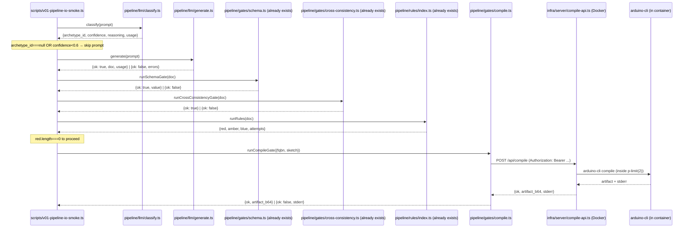

# feat: v0.1-pipeline-io — LLM generation, intent classifier, and Compile API (Units 6, 7, 8)

## Overview

Land the input/output edges of the pipeline that the foundation gates already validate. This batch wires three things in:

1. **Unit 6 — Compile API.** A Docker image (debian-bookworm-slim + arduino-cli + AVR core + Servo) plus a Hono HTTP server exposing `POST /api/compile`. The pipeline-side gate `pipeline/gates/compile.ts` POSTs to it and surfaces `stderr`. SHA256 cache keyed on a toolchain-version hash computed at server boot, plus `fqbn`, sketch source, extras, and libraries.
2. **Unit 7 — LLM generation (Sonnet 4.6).** `messages.parse()` + `zodOutputFormat(VolteuxProjectDocumentSchema)` from the Anthropic SDK, a versioned system prompt at `pipeline/prompts/archetype-1-system.md`, 1h prompt caching on the system+schema block, and a single auto-repair retry that carries prior assistant content + Zod errors as a fresh user turn (no prefill).
3. **Unit 8 — Intent classifier (Haiku 4.5).** A small structured-output call returning `{archetype_id|null, confidence, reasoning}`. `archetype_id === null` is the dominant out-of-scope signal; the `≥0.6` confidence threshold is a placeholder that Unit 10 calibrates.

Two deferred review batches fold in opportunistically:
- **Paired with Unit 6:** SEC-002 (filename regex permits leading-dash) + ADV-003 (multi-dot filenames pass). Same regex lives in `pipeline/gates/library-allowlist.ts` and the Compile API mirror — fix together so they cannot drift.
- **Paired with Unit 7:** COR-002 (voltage-match silently passes when supply isn't an MCU) + COR-003 (sensor-trig/echo silently pass when wired to non-MCU) + M-002 (extract a shared `resolveEndpoint` helper that all three rule fixes use). LLM-generated content will exercise these rules harder than fixture-driven tests did, so closing them now de-risks the next batch.

End-state: a manual demo invocation (`bun run compile:up &` + a small Bun script that calls `classify()` → `generate()` → `runSchemaGate` → `runCrossConsistencyGate` → `runRules` → `pipeline/gates/compile.ts`) produces, on at least 3 of 5 smoke prompts, a schema-valid `VolteuxProjectDocument` plus a non-empty `.hex` artifact. **This is a wiring milestone, not the v0.1-pipeline acceptance gate** — holdout discipline and the calibration set are deferred to Unit 10.

## Problem Frame

Foundation already shipped on `feat/v01-pipeline` (PR #1 against `taliamekh/Volteux`): the Zod schema, the schema gate, the library + cross-consistency gates, and the rules engine with 11 archetype-1 rules. 142 tests pass; `tsc --strict` is clean. Talia's signoff on the schema is pending but not blocking — none of this batch changes the schema.

Foundation alone is plumbing. Without LLM generation it cannot turn a prompt into a document; without the Compile API it cannot turn a document into a `.hex`; without the intent classifier it cannot reject out-of-scope prompts before burning a Sonnet call. This batch closes the input edge (intent + LLM) and the output edge (compile) so the next batch (Unit 9 orchestrator) can wire all six gates into a single `runPipeline()` call.

The non-obvious constraint: Unit 9 is *next batch*, so this batch ships the three units as independently exercisable modules with a manual demo script as the integration proof. That keeps the diff reviewable and lets calibration / orchestrator design happen against working components rather than against speculation.

## Requirements Trace

- **R1** — `bun run pipeline -- "<prompt>"` produces schema-valid JSON for ≥4/5 archetype-1 prompts (this batch advances toward R1; Unit 9 lands the CLI; Unit 10 is the gate)
- **R2** — Each emitted JSON compiles to a real `.hex` via `arduino-cli compile --fqbn arduino:avr:uno` (Unit 6 of the predecessor plan; this batch ships it)
- **R3** — Out-of-scope prompts emit a structured Honest Gap (Unit 8 ships the classifier; Unit 9 wires the formatter)
- **R4** — Schema, compile, rules, cross-consistency, intent classifier all functional and individually testable (this batch ships compile + classifier)
- **R6** — Schema in `schemas/document.zod.ts` as single source of truth; both signatures + CHANGELOG for any change (no schema change in this batch — preserved)
- **R7** — Pipeline output includes JSON-lines traces shaped for the v0.5 eval harness (Unit 9 next batch; this batch leaves a hook for it — the `generate()` and `classify()` return shapes carry `usage` so the orchestrator can emit `llm_call` events)
- **Origin Unit 6** — Compile API contract per `docs/PLAN.md § Compile API contract`; `infra/Dockerfile` + `infra/server/compile-api.ts` runnable locally
- **Origin Unit 7** — Sonnet 4.6 generation with `zodOutputFormat`, 1h prompt cache on the system+schema block, auto-repair retry shape
- **Origin Unit 8** — Haiku 4.5 classifier with `{archetype_id|null, confidence, reasoning}`
- **Folded Reviews** — SEC-002, ADV-003, COR-002, COR-003, M-002 (P2 from `/ce:review` on commits 0879969..5408d42)

## Scope Boundaries

- **No orchestrator (`pipeline/index.ts` / `pipeline/cli.ts`)**, no Honest Gap formatter (`pipeline/honest-gap.ts`), no auto-repair helper (`pipeline/repair.ts`), no JSON-lines trace writer (`pipeline/trace.ts`). All deferred to the next batch (Unit 9).
- **No acceptance gate.** Holdout discipline (3 tuning + 2 holdout, sealed Day 1) and 30-prompt calibration set are Unit 10. This batch ships a 5-prompt smoke test against the wiring; passing 3/5 is the bar, not 4/5 + ≥1/2 holdout.
- **No avrgirl WebUSB spike.** That is Unit 2 in the predecessor plan, on Talia's parallel hardware track. This batch produces `.hex` artifacts via the Compile API regardless of which library wins the spike — surface the dependency, do not block on it.
- **No VPS deploy.** `infra/Dockerfile` + `infra/deploy.md` ship; Hetzner CX22 provisioning is v0.2.
- **No Wokwi behavior eval, no meta-harness, no UI integration, no archetypes 2-5.** v0.5, v0.9, v1.0, v1.5 respectively per origin doc.
- **No CI changes.** Eval CI policy lands with the eval harness in v0.5. v0.1 is local-only.

### Deferred to Separate Tasks

- **Unit 9 — orchestrator + Bun CLI + JSON-lines tracing**: next batch.
- **Unit 10 — acceptance prompts (3 tuning + 2 holdout) + 30-prompt calibration set + `fixtures/generated/` for Talia**: final batch of v0.1.
- **Agent-Native Gap 1 / KT-002 / AC-004** — `GateResult.errors` union not discriminated; cross-consistency gate stringifies structured per-check errors. Refactor when `pipeline/repair.ts` lands in Unit 9 — that's the consumer that benefits.
- **M-001** (inline `bucketBySeverity`), **M-005** (FQBN map silent-pass guard), **M-006** (`SERVO_SKU`/`HC_SR04_SKU` constants in registry): minor maintainability cleanups; address opportunistically while in adjacent code, otherwise defer.
- **VPS deploy of the Compile API**: v0.2.
- **CORS handling for the Compile API**: v1.0 when the UI integrates; documented in `infra/deploy.md` so the v0.2 deploy doesn't ship the wrong CORS posture by accident.

## Context & Research

### Relevant Code and Patterns

- [pipeline/gates/library-allowlist.ts](../../pipeline/gates/library-allowlist.ts) — current filename regex (target of SEC-002 + ADV-003 fix); export site for the regex constant the Compile API will import.
- [pipeline/gates/cross-consistency.ts](../../pipeline/gates/cross-consistency.ts) — calls `runAllowlistChecks`; demonstrates the gate signature shape (`(doc, registry?) => GateResult`) the new compile gate should mirror.
- [pipeline/rules/archetype-1/voltage-match.ts](../../pipeline/rules/archetype-1/voltage-match.ts), [sensor-trig-output-pin.ts](../../pipeline/rules/archetype-1/sensor-trig-output-pin.ts), [sensor-echo-input-pin.ts](../../pipeline/rules/archetype-1/sensor-echo-input-pin.ts) — all three rules contain the same `find component → lookupBySku → find pin` triplet. M-002 extracts this to a shared helper.
- [pipeline/types.ts](../../pipeline/types.ts) — `GateResult<TValue>` + `Severity`. New compile gate uses this type unchanged.
- [components/registry.ts](../../components/registry.ts) — `lookupBySku`, `ComponentRegistryEntry`, `PinMetadata`. `resolveEndpoint` helper consumes these.
- [.env.example](../../.env.example) — already declares `ANTHROPIC_API_KEY`, `COMPILE_API_URL=http://localhost:8787`, `COMPILE_API_SECRET`. No env additions in this batch.

### Institutional Learnings

- [docs/solutions/best-practices/c-preprocessor-modelling-in-llm-output-gates-2026-04-25.md](../solutions/best-practices/c-preprocessor-modelling-in-llm-output-gates-2026-04-25.md) — the bar this batch must clear. The Compile API's filename allowlist is the *second* line of defense against the same class of bypass that SEC-001 closed in `parseIncludes()`. The pattern: replicate the relevant compiler-pipeline phases before regex-matching, and fail closed (allowlist) rather than open (blocklist).

### External References

| Surface | Reference (verified 2026-04-25) | Key takeaway |
|---|---|---|
| Anthropic SDK current latest | [github.com/anthropics/anthropic-sdk-typescript releases](https://github.com/anthropics/anthropic-sdk-typescript/releases) | `0.91.1` is current as of 2026-04-24. Plan's `^0.88.0` works under semver `^`; bump to `^0.91.1` for fresh installs. No structured-output API breaks 0.86 → 0.91. |
| Structured outputs canonical pattern | [platform.claude.com/docs/build-with-claude/structured-outputs](https://platform.claude.com/docs/en/build-with-claude/structured-outputs.md) | `messages.parse({ output_config: { format: zodOutputFormat(Schema) }})`. Read result from `r.parsed_output`. |
| Prompt caching minimums | [platform.claude.com/docs/build-with-claude/prompt-caching](https://platform.claude.com/docs/en/build-with-claude/prompt-caching.md) | Sonnet 4.6: ≥2048 prefix tokens; Haiku 4.5: ≥4096. Verify cache hits via `response.usage.cache_read_input_tokens`. |
| Auto-repair retry shape | not in upstream docs | The "fresh user turn carrying prior assistant content + ZodIssues, NOT assistant-prefill" pattern is internally documented in the predecessor plan. Verify the 400-on-prefill behavior empirically in Unit 7's first integration test. |
| Hono Bearer auth | `hono/bearer-auth` | Idiom: `app.use("/api/*", bearerAuth({ token: secret }))`. 32-byte minimum is hand-rolled (no built-in). |
| Hono Zod request body validation | `@hono/zod-validator` | `zValidator("json", Schema)` middleware; pairs with `client.req.valid("json")`. |
| Concurrency cap | `p-limit` v6.x (ESM-only since v4) | `const limit = pLimit(2); await limit(() => runCompile(...))`. Right tool for raw caps; `p-queue` is overkill here. |
| Docker base image for arduino-cli | `debian:bookworm-slim` | Alpine breaks AVR-GCC's musl-incompatible prebuilt binaries. Distroless can't run Go runtime probes. |
| arduino-cli build-time install verification | hand-rolled `RUN` line | `RUN arduino-cli core install arduino:avr@1.8.6 && arduino-cli compile --fqbn arduino:avr:uno /opt/canary && test -f /opt/out/canary.ino.hex`. Fails image build on broken core install. |
| arduino-cli `--build-path` vs `--output-dir` collision (#2318) | status unknown for 1.4.x | Mitigation (different dirs) is safe regardless. Verify if relevant during Unit 1 implementation. |
| arduino-cli sketch sandbox (#758) | strict allowlist regex | `^[A-Za-z0-9_][A-Za-z0-9_.-]*\.(ino|h|cpp|c)$` after SEC-002 fix; rejects leading-dash *and* leading-dot (hidden files) in one change. |

### Slack / Organizational Context

Not searched (no Slack tools wired up in this workspace, and not requested).

## Key Technical Decisions

- **Filename regex lives in one place: `pipeline/gates/library-allowlist.ts`. The Compile API imports it.** The predecessor plan called for two literal copies "intentionally because cross-consistency runs before the compile API call" (defense-in-depth via two separate gates). That defense is preserved by *running* the regex twice (once at the cross-consistency gate, once at the API server) — not by *defining* the regex twice. A single export site eliminates the drift risk SEC-002 + ADV-003 already demonstrated. **Why:** the policy is the same; only the call site is different. Two literals = two future bugs.
- **The hardened regex anchors a leading alphanumeric/underscore and rejects consecutive dots.** `^[A-Za-z0-9_][A-Za-z0-9_.-]*\.(ino|h|cpp|c)$` closes SEC-002 (no leading dash → no CLI flag injection) and partial-closes ADV-003 (leading-dot hidden files rejected). Consecutive dots like `test..h` still pass that regex; the additional check `!filename.includes("..")` (already present in `filenameViolationReason`, currently dead code per ADV-003) is *promoted to a primary check* run before the regex. **Why:** the dead-code review finding was the smoking gun — the check existed but wasn't reachable. Two predicates side by side, both fail-closed.
- **`@anthropic-ai/sdk` pinned to `^0.91.1`.** Predecessor plan named `^0.88.0`. Research surfaced `0.91.1` as current with no breaking structured-output changes 0.86 → 0.91. Bump now so the install date doesn't drift further.
- **`messages.parse()` + `zodOutputFormat()` is the only structured-output path.** No Vercel AI SDK, no `instructor-js`, no hand-rolled JSON-mode prompt. The predecessor plan resolved this; carry the decision forward unchanged.
- **System prompt loaded from `pipeline/prompts/archetype-1-system.md` at module load, not per-call.** Edits to the prompt source file take effect on next Bun run; no rebuild needed; the v0.9 meta-harness reads this file to propose edits.
- **Token-count measure step + padding-as-default.** Run the first integration test; log `usage.input_tokens`. If `< 2048`, the implementer **must** pad with a frozen few-shot example (committed inline in the prompt source, NOT read from `fixtures/`) to clear the threshold. **Choosing "no cache" is allowed only with an explicit ADR comment in `pipeline/prompts/archetype-1-system.md` containing a cost projection** (per-call delta × estimated weekly call volume × N weeks until v0.5). **Why:** the cost differential between cache-on (0.1× read) and cache-off (1× standard) is 5-10×; at v0.5 eval-CI volumes (30 prompts × multiple PRs/week) the burn compounds quickly. "Defer" is the path of least resistance for an end-of-day implementer; the discipline of writing the ADR forces a real choice. Padding is the default.
- **`classify()` returns the raw model output. The threshold filter lives in the orchestrator (Unit 9), not in `classify()`.** `classify()` returns `{archetype_id, confidence, reasoning, usage}` exactly as the model emits it. The orchestrator (next batch) treats `archetype_id === null` as the dominant out-of-scope signal and applies the secondary `confidence < 0.6` filter. **The principle is: input-validation cost guards (empty prompt, >5000-char prompt cap) live local to `classify()`; calibration thresholds (the model-output interpretation) live in the caller.** The boundary distinguishes "before we burn an API call" (function-local: cheap to fail fast) from "what to do with the result" (caller: tunable as we calibrate). **Why:** baking the threshold into `classify()` would put the calibration knob in two places (Unit 10's calibration would have to update both `classify.ts` and the orchestrator); putting input caps in the caller would force every caller to repeat the same defensive code.
- **The compile gate's auto-repair retry, when wired by Unit 9, will *not* invalidate the prompt cache.** Auto-repair sends the prior assistant content as one assistant turn and the ZodIssues as a new user turn — both *after* the cached system+schema block. The cache control point sits on the last system block; user/assistant turns after it do not invalidate the prefix. **Why:** verifying this is a Unit 9 concern, but Unit 7 must shape `generate()`'s message construction so Unit 9 can layer retry on top without changing the cached-block boundary. **Cache discipline failure mode to avoid:** if the implementer accidentally puts the auto-repair instruction *inside* the cached system block (rather than as a fresh user turn), every retry mutates the prefix and `cache_read_input_tokens` drops to 0 silently. Unit 3's tests assert `cache_read_input_tokens > 0` on the *retry* call, not just on the second cold call.
- **`runCompileGate()` returns a *discriminated* failure union, not just `{ok: false, message: string}`.** The orchestrator (Unit 9) needs to distinguish "compile API down at the network level" from "auth rejected" from "request body rejected by server-side Zod" from "compiler emitted stderr" from "rate-limited" from "request timed out" — they require different recovery (re-run pipeline, surface infra error, route to Honest Gap, back off, retry). Concrete shape: `{ok: false, severity: "red", kind: "transport" | "auth" | "bad-request" | "rate-limited" | "compile-error" | "timeout", message, errors}`. **Why information preservation, not premature abstraction:** the HTTP layer naturally surfaces 5 distinct response signals (transport throw, 401, 400 from `zValidator`, 429, 200-with-stderr) plus the AbortController-driven timeout. Mapping to a 2-way `transport | operational` union *throws away* information that's already there at zero implementation cost — and Unit 9's `repair()`, landing immediately in the next batch, will need every kind back. A 5th/6th kind surfacing later (the `bad-request` and `timeout` cases were added after adversarial review surfaced them) is exactly the contract churn the union shape is designed to absorb. The smoke script (Unit 5) needs *only* `transport` vs everything else; it ignores the richer discriminators and is unaffected by their presence.
- **Few-shot padding source is a frozen committed string at the prompt version, NOT `fixtures/uno-ultrasonic-servo.json` parsed at module load.** If the prompt needs padding to clear Sonnet's 2048-token cache minimum, the few-shot example lives *inline* in `pipeline/prompts/archetype-1-system.md` (or a sibling `pipeline/prompts/archetype-1-fewshot.md`) as a hand-frozen string. **Why:** Unit 10 will commit `fixtures/generated/*.json` produced by `generate()`; if the cached prompt reads from that directory at module load, regenerating the fixtures invalidates the cache silently. The padding source must rev only via PR.
- **Toolchain hash computed at server boot REQUIRES the AVR core to be present.** `infra/server/cache.ts` runs `arduino-cli core list --json` and asserts a non-empty `arduino:avr` entry before hashing. **Why:** if the Dockerfile build broke and the core is absent, the empty-list hash is a deterministic-looking value that locks every subsequent compile to a poisoned cache namespace. Refuse to start (clear stderr message naming the missing core) so the operator catches it before any request lands. The Dockerfile's canary-compile step makes a missing AVR core a build-time failure rather than a boot-time failure, but the boot assertion is a defense-in-depth backstop.
- **Smoke script (Unit 5) is strictly sequential.** Each prompt's pipeline runs `await ... await ... await` end-to-end before the next prompt starts. **Why:** `p-limit(2)` on the Compile API serializes compiles; if the smoke script issues a `Promise.all` over 5 prompts, two will share compile slots and the cache (which is keyed by sketch content, not prompt) may serve A's `stderr` to B's caller in the rare case where two prompts produce byte-identical sketches. Sequentiality also keeps the per-prompt outcome table interpretable in the demo.
- **Demo wiring smoke test ships in this batch as `scripts/v01-pipeline-io-smoke.ts`, not in the orchestrator.** The smoke script is throwaway scaffolding to prove the three new units interoperate; Unit 9's orchestrator replaces it. **Why:** the user's demo acceptance is a wiring milestone — having it as a script keeps the integration proof explicit in the diff and gives Unit 9 a working baseline to refactor against.
- **Compile API regex import requires no Docker filesystem gymnastics.** `infra/server/compile-api.ts` is bundled by Bun and runs inside the container; the import path `../../pipeline/gates/library-allowlist.ts` resolves at bundle time, not runtime. The Dockerfile's `COPY` step pulls the whole repo (or relevant subdirs); the `import` is a normal TypeScript import. **Why:** alternatives (publishing a shared package, replicating the constant) add ceremony for no benefit at v0.1 scale.
- **Toolchain version hash computed once at server boot, not per request.** `arduino-cli version --json`, `arduino-cli core list --json`, `arduino-cli lib list --json` once on startup; `sha256` of the concatenated JSON; prefix every cache key. The predecessor plan caught this bug (cache stale-after-bump); preserve the fix here. **Why:** the v0.2 deploy will rebuild the image when toolchain bumps, which restarts the server, which recomputes the hash, which invalidates every prior cache entry — the desired behavior.

## Open Questions

### Resolved During Planning

- **`@anthropic-ai/sdk` version pin:** `^0.91.1` (research confirmed current; no API breaks since `^0.88.0`).
- **Where does the threshold filter live (`classify()` or caller)?** → Caller (orchestrator, Unit 9). `classify()` is pure model output.
- **Single-source-of-truth for the filename regex?** → `pipeline/gates/library-allowlist.ts`; Compile API imports.
- **Smoke script lives where?** → `scripts/v01-pipeline-io-smoke.ts`; throwaway scaffolding for this batch only.
- **Does padding the prompt with the canonical fixture as a few-shot example violate prompt discipline?** → No. The fixture is committed source; padding with it is the same as inlining schema descriptions. The v0.9 meta-harness reads the prompt file; it will see whatever's in there.

### Deferred to Implementation

- **Whether Sonnet's 1h prompt cache actually engages.** Measured at first integration run. If `input_tokens < 2048`, pad with fixture few-shot OR drop the cache test. Decision in `pipeline/prompts/archetype-1-system.md` header.
- **Whether `arduino-cli` 1.4.x still has the `--build-path`/`--output-dir` collision (#2318).** Verify by running the canary compile in the Dockerfile build step. If resolved, the plan's "different dirs" mitigation is still safe.
- **Exact `max_tokens` for `generate()`.** `16000` is the predecessor plan's number; verify at first integration run that the canonical document fits comfortably (it should — 16k is generous for one VolteuxProjectDocument). Truncation surfaces as a distinct error class (`{ok: false, kind: "truncated"}`), not a Zod failure.
- **Whether the hand-rolled rate limiter (10 req / 60s per secret) needs Hono middleware integration vs ad-hoc check in the route handler.** Either works at the v0.1 scale; pick during implementation based on which keeps the route handler readable.

## Output Structure

```text
volteux/
├── infra/
│   ├── Dockerfile                          # NEW — debian-bookworm-slim + arduino-cli@1.4.1 + AVR + Servo + canary verify
│   ├── server/
│   │   ├── compile-api.ts                  # NEW — Hono POST /api/compile + bearer auth + p-limit + rate limit
│   │   ├── sketch-fs.ts                    # NEW — per-request temp dir, sanitization, imports the regex from library-allowlist
│   │   ├── cache.ts                        # NEW — SHA256 filesystem cache, toolchain hash at boot
│   │   └── run-compile.ts                  # NEW — arduino-cli subprocess wrapper
│   └── deploy.md                           # NEW — Hetzner CX22 provisioning notes (drafted; not executed)
├── pipeline/
│   ├── gates/
│   │   ├── compile.ts                      # NEW — pipeline-side client; POST to localhost:8787
│   │   └── library-allowlist.ts            # MODIFY — hardened regex (SEC-002 + ADV-003); export the regex constant
│   ├── llm/
│   │   ├── anthropic-client.ts             # NEW — shared client + cache_control config + dev key safety check
│   │   ├── generate.ts                     # NEW — Sonnet 4.6 + zodOutputFormat; auto-repair shape
│   │   └── classify.ts                     # NEW — Haiku 4.5 + IntentClassificationSchema
│   ├── prompts/
│   │   ├── archetype-1-system.md           # NEW — version-controlled prompt source for generate()
│   │   └── intent-classifier-system.md     # NEW — version-controlled prompt source for classify()
│   └── rules/
│       ├── rule-helpers.ts                 # NEW — resolveEndpoint() (M-002)
│       └── archetype-1/
│           ├── voltage-match.ts            # MODIFY — require MCU on supply side (COR-002)
│           ├── sensor-trig-output-pin.ts   # MODIFY — fail when wired to non-MCU (COR-003)
│           └── sensor-echo-input-pin.ts    # MODIFY — fail when wired to non-MCU (COR-003)
├── scripts/
│   └── v01-pipeline-io-smoke.ts            # NEW — throwaway: classify→generate→gates→compile across 5 prompts
├── tests/
│   ├── compile-server.test.ts              # NEW — gated by `bun run compile:up`; happy path + sanitization + cache
│   ├── gates/
│   │   ├── compile.test.ts                 # NEW — pipeline-side client; mocked HTTP + integration against local server
│   │   └── library-allowlist.test.ts       # MODIFY — add SEC-002 + ADV-003 scenarios
│   ├── llm/
│   │   ├── generate.test.ts                # NEW — mocked + integration (gated by ANTHROPIC_API_KEY)
│   │   └── classify.test.ts                # NEW — mocked + integration (gated by ANTHROPIC_API_KEY)
│   └── rules/archetype-1/
│       └── all-rules.test.ts               # MODIFY — add COR-002 + COR-003 scenarios; assert resolveEndpoint behavior
├── package.json                            # MODIFY — add @anthropic-ai/sdk, hono, @hono/zod-validator, p-limit; add `compile:up` + `smoke` scripts
└── .env.example                            # already populated; no changes
```

## High-Level Technical Design

> *This illustrates the intended approach and is directional guidance for review, not implementation specification. The implementing agent should treat it as context, not code to reproduce.*

### Demo wiring sequence (this batch's integration proof)



The smoke script intentionally does NOT include auto-repair retry, Honest Gap formatting, or trace writing — those land in Unit 9 next batch. It exists to prove the three new units interoperate end-to-end.

### Auto-repair retry shape inside `generate()` (sketch only)

> *This pseudo-code shows the intended message construction; the implementer should not copy-paste it. The point is the boundary: retry sends a fresh user turn carrying ZodIssues, never an assistant prefill.*

```text
generate(userPrompt):
  attempt 1:
    messages = [
      system: [archetype-1-system.md content, schema-and-registry primer + cache_control]
      user:   userPrompt
    ]
    response = client.messages.parse({ ..., messages, output_config: zodOutputFormat(Schema) })
    if response.parsed_output: return { ok: true, doc, usage }
    capture (response.content as priorAssistant, response.parse_error as zodIssues)

  attempt 2 (auto-repair):
    messages = [
      system: [unchanged — cache hit expected]
      user:   userPrompt
      assistant: priorAssistant       # NOT a prefill; this is a completed turn
      user:   "Your previous output failed schema validation: <zodIssues>. Return a corrected JSON document. JSON only."
    ]
    response = client.messages.parse({ ..., messages, output_config: zodOutputFormat(Schema) })
    if response.parsed_output: return { ok: true, doc, usage }
    return { ok: false, errors: zodIssues }   # orchestrator decides Honest Gap

  on stop_reason === "max_tokens" at any attempt:
    return { ok: false, kind: "truncated" }
```

Cache invariant: the cached prefix is the system block. Adding turns *after* the system block does not change the cache key. Adding/changing the user prompt does change cache hit % only on the user turn's tokens, not on the system block.

## Implementation Units

- [ ] **Unit 1: Compile API + filename regex hardening (SEC-002, ADV-003)**

**Goal:** Ship the Docker image (debian-bookworm-slim + arduino-cli + AVR core + Servo) and the Hono HTTP server, plus the pipeline-side gate client. Harden the filename allowlist regex in `pipeline/gates/library-allowlist.ts` and import it from the Compile API so the policy lives in one source-of-truth.

**Requirements:** R2, R4, plus folded SEC-002 + ADV-003

**Dependencies:** Foundation (already shipped) — schema, library-allowlist, cross-consistency. Independent of Units 2-4 in this batch.

**Files:**
- Modify: `pipeline/gates/library-allowlist.ts` — tighten `ADDITIONAL_FILE_NAME_REGEX` to `/^[A-Za-z0-9_][A-Za-z0-9_.-]*\.(ino|h|cpp|c)$/`; promote `filename.includes("..")` to a primary check before the regex (was dead code per ADV-003); export both the regex constant and a `validateAdditionalFileName(name) => string | null` predicate (returns reason string on fail, `null` on pass). The header comment explicitly names `infra/server/sketch-fs.ts` as the consumer and explains that names like `arduino-cli.yaml`, `sketch.json`, `library.properties`, `hardware/platform.txt` are blocked *implicitly* by the extension allowlist — they don't end in `.ino|.h|.cpp|.c` — so they need not appear as explicit deny entries. **Documenting this explicitly prevents a future contributor from "simplifying" the regex by removing the extension constraint and silently re-opening the arduino-cli sandbox bypass surface (#758).**
- Modify: `tests/gates/library-allowlist.test.ts` — add scenarios for `-flag.h` (SEC-002), `--anything.ino`, `.hidden.h` (rejected leading dot), `test..h` (ADV-003), `foo.bar.baz.ino` (legitimate single-extension-with-dots-in-stem still allowed only if no consecutive dots); refactor existing scenarios to call `validateAdditionalFileName` directly.
- Create: `infra/Dockerfile` — `debian:bookworm-slim` base; install `arduino-cli@1.4.1`, `arduino-cli core install arduino:avr@1.8.6`, `arduino-cli lib install Servo@1.2.2`; canary compile a tiny blink sketch in a build step and `test -f` the resulting hex (so a broken core install fails the image build, not runtime); explicit `COPY` of `pipeline/`, `schemas/`, `components/`, `infra/` (transitive closure of imports — `infra/server/sketch-fs.ts` imports from `pipeline/gates/library-allowlist.ts` which imports from `schemas/document.zod.ts` which references `components/registry.ts`); `RUN useradd -u 1000 -m volteux && mkdir -p /var/cache/volteux /var/cache/arduino-build && chown -R volteux:volteux /var/cache/volteux /var/cache/arduino-build`; `USER volteux` (server runs non-root inside the container — defense-in-depth against arduino-cli filesystem-escape vulns); `EXPOSE 8787`; `CMD ["bun", "run", "infra/server/compile-api.ts"]`.
- Create: `infra/server/compile-api.ts` — Hono app; `app.use("/api/*", bearerAuth({ token: COMPILE_API_SECRET }))`; startup assertion `COMPILE_API_SECRET.length >= 32` (refuses to start otherwise with a clear stderr message naming the requirement); `app.post("/api/compile", zValidator("json", CompileRequestSchema), handler)`; handler runs request through `validateAdditionalFileName` for every key, then through the per-archetype library allowlist (imported from `pipeline/gates/library-allowlist.ts`), then through the in-process token bucket (`Map<secret, {count, resetAt}>`), then through `pLimit(2)(() => runCompile(...))`; cache lookup before invoking `runCompile`. **Logger discipline:** the Hono request logger MUST NOT log the `Authorization` header (configure the logger middleware's redaction list explicitly); error responses MUST NOT echo request headers; no `process.env` value is ever printed in any code path. This protects both `COMPILE_API_SECRET` and (downstream, via the same logger config in `anthropic-client.ts`) `ANTHROPIC_API_KEY` from accidental leak via a verbose error.
- Create: `infra/server/sketch-fs.ts` — `createPerRequestSketchDir({fqbn, main_ino, additional_files}) => Promise<{path, cleanup}>`; writes files to `os.tmpdir() + "/volteux-compile-" + crypto.randomUUID()`; cleanup is a `try/finally`-friendly closure using `rm -rf`.
- Create: `infra/server/cache.ts` — `computeToolchainVersionHash()` (called once at server boot via `arduino-cli version --json`, `core list --json`, `lib list --json`); the function ASSERTS a non-empty `arduino:avr` entry in the core list before hashing — if missing, the server refuses to start with a clear stderr message naming the requirement (defense-in-depth backstop for a broken image build OR a runtime volume mount that masks the pre-installed core, e.g., `-v /host/empty:/root/.arduino15`). `cacheKey({toolchainHash, fqbn, main_ino, additional_files, libraries}) => string`; `cacheGet(key) => Promise<{hex_b64, stderr} | null>`; `cachePut(key, {hex_b64, stderr})`; storage at `/var/cache/volteux/<key>.{hex,json}` with `umask 077` (mode 0700 owned by `volteux` user) and atomic write-temp-and-rename; ~5GB cap as documented (eviction is v0.2's cron one-liner, not implemented now). At server boot, log the current cache directory size; emit a stderr WARN if size > 4GB so the operator catches the bound before it becomes a compile failure that looks like a toolchain bug.
- Create: `infra/server/run-compile.ts` — wraps `arduino-cli compile --fqbn <fqbn> --output-dir <out> --build-path <build> --build-cache-path /var/cache/arduino-build --warnings default --jobs 2 --no-color --json <sketch>`; **`--build-path` and `--output-dir` are different directories** (#2318 mitigation, regardless of fix status); reads the `.hex` artifact, returns `{ok, stderr, hex_b64?}`.
- Create: `infra/deploy.md` — Hetzner CX22 provisioning notes for v0.2 (not executed in this batch); document the `COMPILE_API_SECRET` rotation policy; document CORS-handling-for-UI-integration as a known v1.0 gap; document **secret-handling discipline for v0.2**: `-e COMPILE_API_SECRET=$X` in `docker run` exposes the value via `/proc/<pid>/environ` and `docker inspect` — for v0.2 VPS, switch to Docker secrets or a runtime mount (`docker run --env-file <file>` is also acceptable; `RUN ENV` in the Dockerfile is forbidden because it persists in image layer history); the v0.1 localhost-with-trusted-developer threat model accepts the env-var exposure but flags the v0.2 upgrade as a deploy gate. Also document the **shared `--build-cache-path` DoS** (a malicious sketch could fill `/var/cache/arduino-build`; size-cap monitoring is v0.2's eviction-cron concern).
- Create: `pipeline/gates/compile.ts` — exports `runCompileGate(req: CompileRequest, opts?: {fetch?, baseUrl?, secret?}): Promise<CompileGateResult>` where:
  ```text
  CompileGateResult =
    | { ok: true; value: { hex_b64: string; stderr: string } }
    | { ok: false; severity: "red"; kind: "transport"; message: string; errors: [string] }       // ECONNREFUSED, DNS failure, socket reset
    | { ok: false; severity: "red"; kind: "timeout"; message: string; errors: [] }               // AbortController fires before response
    | { ok: false; severity: "red"; kind: "auth"; message: string; errors: [] }                  // 401 from server (bad/missing secret)
    | { ok: false; severity: "red"; kind: "bad-request"; message: string; errors: [string] }     // 400 from `zValidator` (request shape rejected)
    | { ok: false; severity: "red"; kind: "rate-limited"; message: string; errors: [] }          // 429 from server
    | { ok: false; severity: "red"; kind: "compile-error"; message: string; errors: [string] }   // 200 with {ok:false, stderr}
  ```
  The discriminated `kind` is what Unit 9's `repair()` helper switches on: `compile-error` is worth one repair turn through `generate()`; `bad-request` is also worth one repair turn (the LLM emitted a malformed request body); `transport`/`timeout`/`auth`/`rate-limited` are infra failures the orchestrator surfaces without retry. `errors` carries `stderr` verbatim on `compile-error`, the parsed Zod issues on `bad-request`. Default `baseUrl` from `COMPILE_API_URL` env; default request timeout 30s via `AbortController`; the `fetch`, `baseUrl`, and `timeoutMs` options exist so tests can swap in a mock without touching env.
- Create: `tests/compile-server.test.ts` — gated by an env var like `VOLTEUX_COMPILE_SERVER_LIVE=1` or by a `before` hook that pings `/api/health`; if not reachable, the suite is skipped with a clear log line.
- Create: `tests/gates/compile.test.ts` — pure-mock tests using Bun's mock for `fetch`; one integration test reusing the live-server gate.
- Modify: `package.json` — add deps `@anthropic-ai/sdk@^0.91.1`, `hono@^4`, `@hono/zod-validator@^0.4`, `p-limit@^7` (ESM-only since v4; current as of 2026-04-25 is v7.3.0); add scripts `"compile:up": "docker run --rm -p 8787:8787 -e COMPILE_API_SECRET=$COMPILE_API_SECRET volteux-compile"`, `"compile:build": "docker build -f infra/Dockerfile -t volteux-compile ."`.

**Approach:**
- Land the regex hardening and its tests *first* in the diff so the Compile API can `import { ADDITIONAL_FILE_NAME_REGEX, validateAdditionalFileName } from "../../pipeline/gates/library-allowlist.ts"` from the moment it exists.
- Single source-of-truth for the regex: one export, one consumer set (cross-consistency gate + Compile API). The defense-in-depth comes from running the *same* policy at *two* sites (gate before compile slot, server before compile invocation), not from defining it twice.
- Compile API server: keep handler ~50 LOC. Auth → validate filenames → validate libraries → rate limit → cache lookup → p-limit → arduino-cli → cache write → respond.
- Add `GET /api/health` (no auth required) returning `{ok: true, toolchain_version_hash}`. Unit 5's smoke script pings this before any Anthropic call so a missing container surfaces in <100ms instead of as a transport error mid-pipeline.
- Cache key prefix is `${toolchainVersionHash}-` (computed once at server boot from `arduino-cli version --json` + `core list --json` + `lib list --json`). The hash is the *first* component of the key, so a toolchain bump invalidates the entire cache namespace — no per-entry comparison needed.
- Dockerfile canary: `RUN echo 'void setup() {} void loop() {}' > /opt/canary/canary.ino && arduino-cli compile --fqbn arduino:avr:uno --output-dir /opt/canary-out /opt/canary/canary.ino && test -f /opt/canary-out/canary.ino.hex && rm -rf /opt/canary /opt/canary-out`. A broken core install or library version conflict fails the build, not the first runtime request.
- Rate limit: hand-rolled `Map<secret, {count, resetAt}>`. Lookup → if `now > resetAt`, reset count to 0 and `resetAt = now + 60_000`; if `count >= 10`, return `429`; else `count++`.
- The `runCompile` subprocess uses `Bun.spawn` (or `node:child_process` if the bundler shrugs) with `arduino-cli` invoked via *argument array*, never shell-interpolated string. Even with the hardened regex, never trust filenames as shell-safe.

**Patterns to follow:**
- The compound learning at [docs/solutions/best-practices/c-preprocessor-modelling-in-llm-output-gates-2026-04-25.md](../solutions/best-practices/c-preprocessor-modelling-in-llm-output-gates-2026-04-25.md) — the regex must replicate the relevant pre-tokenization phase, not just match the surface text. For filenames the relevant phase is the OS path resolver; the policy "leading-dash is unsafe in CLI arg context" is the analogue.
- `pipeline/gates/library-allowlist.ts` existing structure (see how `runAllowlistChecks` exports a pure-function gate; mirror the shape).
- Hono Bearer-auth middleware as the standard pattern.

**Test scenarios:**
- *Happy path* — POST with the canonical `fixtures/uno-ultrasonic-servo.json` `sketch.main_ino` + `libraries: ["Servo"]` → `{ok: true, artifact_b64: <non-empty>, artifact_kind: "hex"}`.
- *Happy path* — second identical POST hits cache and returns in <100ms (vs ~3-8s cold).
- *Error path (compile)* — POST with `sketch.main_ino` containing a syntax error returns `{ok: false, stderr: <gcc message>}`.
- *Error path (auth)* — POST without `Authorization` header → 401; POST with malformed header → 401.
- *Error path (auth startup)* — server fails to start when `COMPILE_API_SECRET.length < 32`; the stderr message names the requirement explicitly.
- *Error path (filename, SEC-002)* — POST with `additional_files["-flag.h"]` returns 400 before invoking compiler; reason names `does not match` and the leading-dash specifically (the new error reason or the regex source).
- *Error path (filename, SEC-002)* — POST with `additional_files["--no-color.ino"]` returns 400.
- *Error path (filename, ADV-003)* — POST with `additional_files["test..h"]` returns 400; reason names `consecutive dots not allowed` (the promoted check, not the regex).
- *Error path (filename, hidden file)* — POST with `additional_files[".hidden.h"]` returns 400.
- *Error path (filename, traversal)* — POST with `additional_files["../etc/passwd"]` returns 400 (path-separator check fires first); same for `additional_files["/etc/passwd"]`.
- *Error path (filename, null byte)* — POST with `additional_files["sketch\0.ino"]` returns 400.
- *Error path (filename, empty key)* — POST with `additional_files[""]` returns 400.
- *Edge case (filename, allowed)* — POST with `additional_files["foo.h"]`, `["bar_baz.cpp"]`, `["FILE-1.ino"]` are all accepted (alphanumeric/underscore-led, single-extension, allowed). Specifically test `["a.b.ino"]` — single dot in stem, single extension at end, no consecutive dots → ALLOWED (this is the legitimate boundary case for ADV-003's fix).
- *Predicate parity (single-source regex)* — a test imports `validateAdditionalFileName` from BOTH `pipeline/gates/library-allowlist.ts` AND `infra/server/sketch-fs.ts`, runs ~15 known inputs (mix of allowed + each rejection class) through both, and asserts byte-identical return values. Catches the case where a refactor diverges the predicate even when the regex constant still matches. (Today they're literally the same import; the test exists so a future "decouple the server" refactor cannot silently weaken the policy.)
- *Sandbox bypass guards (implicit-via-allowlist)* — `additional_files["arduino-cli.yaml"]`, `["sketch.json"]`, `["library.properties"]`, `["platform.txt"]` all return 400 (extension allowlist fails on each). Test names each explicitly so a future contributor reading the test sees the bypass classes that motivated the strict allowlist.
- *Error path (library)* — POST with `libraries: ["WiFi"]` → 400 before invoking compiler; reason names archetype-1 allowlist.
- *Error path (rate limit)* — 11th POST within 60s for the same secret returns 429.
- *Integration* — `pipeline/gates/compile.ts` against the live local server: happy path produces artifact; failure path surfaces `stderr` verbatim.
- *Integration (cache key version drift)* — start the server with toolchain hash A, cache an artifact, manually overwrite the toolchain hash file (test-only hook OR restart the server with a faked hash), POST the same payload → cache miss; previous entry not served.
- *Integration (latency injection)* — `pipeline/gates/compile.ts` against `localhost:8787` proxied through a 200ms-RTT shim still completes within the gate's timeout (placeholder for v0.2 Hetzner→dev RTT).
- *Edge case* — `runCompileGate` returns `{ok: false, severity: "red", kind: "transport", message: "compile-api-unreachable at <url>"}` if the live server is down (`ECONNREFUSED`, DNS failure, socket reset). The `kind` discriminator must be `"transport"` (not `"compile-error"`) so Unit 9's `repair()` doesn't waste a Sonnet call on infra failure.
- *Edge case* — `runCompileGate` returns `{ok: false, kind: "timeout"}` if the AbortController fires before the response arrives (default 30s).
- *Edge case* — `runCompileGate` returns `{ok: false, kind: "auth"}` on 401; `{ok: false, kind: "bad-request", errors: [<zod issues>]}` on 400 from `zValidator`; `{ok: false, kind: "rate-limited"}` on 429. Each tested with a mocked `fetch` returning the appropriate status.
- *Server boot guard* — `infra/server/cache.ts` refuses to compute the toolchain hash when `arduino-cli core list --json` returns no `arduino:avr` entry; the server emits a clear stderr line and exits non-zero. Tested by running the server with a deliberately-broken `ARDUINO_DIRECTORIES_DATA` pointing at an empty dir (the canary should never reach `app.listen`).
- *Test expectation: integration-only tests* are gated by `VOLTEUX_COMPILE_SERVER_LIVE=1` and skipped with a clear log line if missing.

**Verification:**
- `bun run compile:build` succeeds on Apple Silicon Mac (first build expected 5-10 min; subsequent builds <30s with BuildKit cache).
- `bun run compile:up` starts the container; `curl -H "Authorization: Bearer $COMPILE_API_SECRET" -X POST http://localhost:8787/api/compile -d @<test-payload.json>` returns a non-empty `artifact_b64`.
- All filename test scenarios green; SEC-002 + ADV-003 both have targeted scenarios that fail before the fix and pass after.
- `infra/deploy.md` documents Hetzner CX22 provisioning + secret rotation + CORS-for-v1.0-UI gap (drafted; not executed).
- A pre-fix run of `bun test tests/gates/library-allowlist.test.ts` against the new SEC-002/ADV-003 scenarios fails (proving the scenarios actually exercise the gap); after applying the regex hardening they pass.

---

- [ ] **Unit 2: `resolveEndpoint` helper + voltage-match (COR-002) + sensor-trig/echo (COR-003) rule fixes**

**Goal:** Extract the repeated `find component → lookupBySku → find pin` triplet into a single pure helper (M-002), then use it to close two correctness gaps:
- COR-002: `voltage-match` silently passes when the supply side is not an MCU (e.g., HC-SR04.VCC → SG90.VCC).
- COR-003: `sensor-trig-output-pin` and `sensor-echo-input-pin` silently pass when wired to non-MCU components.

LLM-generated content (Unit 3) will exercise these rules harder than the canonical fixture did. Closing them now means Unit 3's tests grade against a correct rule set.

**Requirements:** R4 (rules engine functional and testable). Folded COR-002, COR-003, M-002.

**Dependencies:** Foundation (already shipped) — registry, types, rules engine. Independent of Unit 1 (parallelizable). **Hard predecessor of Unit 3:** Unit 3's integration tests assert that `generate()` output passes the rules engine. If Unit 3 lands first against pre-fix rules, the integration assertion encodes the COR-002/COR-003 bug as expected behavior, and Unit 2 landing later turns the test red (worse: someone might "fix" the test by adding an exception rather than the rule). Land Unit 2 first.

**Files:**
- Create: `pipeline/rules/rule-helpers.ts` — exports `resolveEndpoint(doc, endpoint) => {component, entry, pin} | null` as a pure function.
- Modify: `pipeline/rules/archetype-1/voltage-match.ts` — use `resolveEndpoint`; require `otherEntry.type === "mcu"` before treating the other side as the supply; emit `red` violation when the supply is non-MCU.
- Modify: `pipeline/rules/archetype-1/sensor-trig-output-pin.ts` — change the `if (!otherEntry || otherEntry.type !== "mcu") continue;` silent-pass to an emitted `red` violation: "HC-SR04 Trig must connect to an MCU pin, not <other component name/type>."
- Modify: `pipeline/rules/archetype-1/sensor-echo-input-pin.ts` — same treatment as Trig.
- Modify: `tests/rules/archetype-1/all-rules.test.ts` — add COR-002 + COR-003 scenarios; add a small `resolveEndpoint` test block (or split into a sibling file `tests/rules/rule-helpers.test.ts` if the suite gets unwieldy).

**Approach:**
- `resolveEndpoint` signature:
  ```text
  resolveEndpoint(
    doc: VolteuxProjectDocument,
    endpoint: { component_id: string; pin_label: string },
    registry?: ComponentRegistry = COMPONENTS
  ) => { component: ComponentInstance; entry: ComponentRegistryEntry; pin: PinMetadata | undefined } | null
  ```
  Returns `null` on the first failure (component not in `doc.components`, SKU not in registry, etc.). The pin field is `undefined` (not `null`) when the component is found but the pin label isn't — preserves the existing rule code's behavior of "skip iteration but don't crash."
- voltage-match fix: after `resolveEndpoint(doc, endpoint).pin.direction === "power_in"`, call `resolveEndpoint(doc, otherEndpoint)` and require `entry.type === "mcu"`. If non-MCU, emit `red` with a message naming both endpoints. The previous tolerance-based check fires *only when* the supply is the MCU and the voltages disagree by >10%.
- sensor-trig-output-pin fix: when `otherEntry` exists and `entry.type !== "mcu"`, emit `red` ("HC-SR04 Trig is connected to <other.name> (<other.type>); Trig must connect to a digital pin on the Uno"). Keep the existing tolerance for `(otherPin.direction must be digital_io|digital_output|pwm_output)` *only* when otherEntry IS the MCU.
- sensor-echo-input-pin fix: identical shape to Trig.
- Don't touch the other 8 rules in this batch even though several use the same triplet. Refactoring them is a separate concern; M-002 is justified here only because COR-002/COR-003 already touch the same code path.

**Patterns to follow:**
- Existing `pipeline/rules/archetype-1/voltage-match.ts` for the rule shape (pure function, returns `RuleResult`).
- The compound learning's discipline: add tests that fail before the fix, then pass after.

**Test scenarios:**
- *Happy path* — canonical fixture passes all three rules unchanged (`resolveEndpoint` returns expected `{component, entry, pin}` for every endpoint).
- *Edge case (resolveEndpoint)* — endpoint with unknown `component_id` returns `null` (not undefined, not a throw).
- *Edge case (resolveEndpoint)* — endpoint with known `component_id` but unknown `sku` (registry stub omits it) returns `null`.
- *Edge case (resolveEndpoint)* — endpoint with known component + sku but `pin_label` not in `pin_metadata` returns `{component, entry, pin: undefined}`.
- *Error path (COR-002)* — fixture mutated so HC-SR04.VCC connects to SG90.VCC (both 5V) → `voltage-match` emits `red` naming both endpoints; the message identifies the supply-side component as non-MCU.
- *Error path (COR-002)* — fixture mutated so HC-SR04.VCC connects to a passive component's pin (if registry has a passive with a `voltage` field, otherwise skip) → `voltage-match` emits `red`.
- *Happy path (COR-002)* — fixture's existing HC-SR04.VCC → Uno.5V still passes (the fix doesn't break the legitimate case).
- *Error path (COR-003 Trig)* — fixture mutated so HC-SR04.Trig connects to SG90.Signal → `sensor-trig-output-pin` emits `red` naming the non-MCU target.
- *Error path (COR-003 Echo)* — fixture mutated so HC-SR04.Echo connects to SG90.Signal → `sensor-echo-input-pin` emits `red`.
- *Happy path (COR-003)* — fixture's existing HC-SR04.Trig → Uno.7 still passes.
- *Edge case (COR-002 multi-hop through wire)* — fixture mutated to route Uno.5V → wire.A and wire.B → HC-SR04.VCC. The cross-consistency gate's check (c) catches this (wires have empty `pin_metadata`), so the rule never sees it. Document this in the test rather than re-test ADV-004.
- *Test expectation:* every existing passing test in `all-rules.test.ts` continues to pass — the fixes are additive.

**Verification:**
- New tests are red against the pre-fix code, green against the post-fix code (run the new tests against `main` to confirm they fail before applying the fix).
- `bun test tests/rules/archetype-1/` reports the same pass count plus the new scenarios.
- `tsc --noEmit --strict` is clean (`resolveEndpoint`'s return type uses the existing `ComponentRegistryEntry` and `PinMetadata` types — no new exports from `components/registry.ts`).
- The compound learning's tests-first-then-fix discipline is preserved in the diff: tests appear in the same commit (or before the fix, depending on commit shape), not after.

---

- [ ] **Unit 3: Anthropic client + LLM generation (Sonnet 4.6) with auto-repair**

**Goal:** Wrap `client.messages.parse({ model: "claude-sonnet-4-6", output_config: { format: zodOutputFormat(VolteuxProjectDocumentSchema) }})` with a versioned system prompt loaded from `pipeline/prompts/archetype-1-system.md`, prompt caching on the system+schema block, and a single auto-repair retry that carries prior assistant content + Zod errors as a fresh user turn (no prefill).

**Requirements:** R1, R3, R7. Auto-repair shape mirrors the predecessor plan's contract for Unit 9 to consume.

**Dependencies:** Foundation (schema), **Unit 2 must land first** (rules must be correct before integration tests grade `generate()` output against them — see Unit 2's Dependencies note for the failure mode). Independent of Unit 1 for unit tests; integration test for `generate()` is just an Anthropic call.

**Files:**
- Create: `pipeline/llm/anthropic-client.ts` — exports a single shared `Anthropic` client; reads `ANTHROPIC_API_KEY` from env; throws at module load (not first call) if missing; documents the dev-key + `$5/day usage alert` discipline in the file header. **Logger discipline:** the file header explicitly states "do not log the Authorization header, the API key, or `process.env`" so any contributor adding logging sees the rule before doing the wrong thing. The shared client uses the SDK defaults (no custom request logger).
- Create: `pipeline/llm/generate.ts` — exports `generate(userPrompt: string): Promise<{ok: true, doc: VolteuxProjectDocument, usage: AnthropicUsage} | {ok: false, kind: "schema-failed" | "truncated", errors?: ZodIssue[]}>`. Composes the system prompt at module load from `archetype-1-system.md` + a schema/registry primer string built from `schemas/document.zod.ts` + `components/registry.ts`. `cache_control: { type: "ephemeral", ttl: "1h" }` on the LAST system block. Auto-repair retry: 1 round max, fresh user turn pattern.
- Create: `pipeline/prompts/archetype-1-system.md` — version-controlled prompt source. Header comment: `<!-- This prompt is consumed by the meta-harness in v0.9. Edit via PR; the proposer reads the latest committed version. -->`. Initial content describes archetype 1, the registry's 5 components by SKU + name + role, the canonical wiring shape, the constraint to emit JSON-only, and explicit "do not invent SKUs" + "do not include v1.5 fields" guardrails. Token-count target: aim for ~1500-2200 tokens including the schema+registry primer; **first integration run measures the actual count and logs it**.
- Create: `tests/llm/generate.test.ts` — mocked-client unit tests + gated integration tests (skip if `ANTHROPIC_API_KEY` is missing).
- Modify: `package.json` — confirm `@anthropic-ai/sdk@^0.91.1` is added in Unit 1 (or add here if Unit 1 doesn't); add `"generate:smoke": "bun -e 'await (await import(\"./pipeline/llm/generate.ts\")).generate(\"a robot that waves when something gets close\")'"` for one-off ad-hoc invocation.

**Approach:**
- The shared `anthropic-client.ts` exports just the `Anthropic` instance. `generate.ts` and `classify.ts` (Unit 4) both import it. This keeps the cache-control config and retry policy out of the constructor.
- System prompt structure (in order, matching cache discipline):
  1. **Block 1 (cached prefix):** archetype-1-system.md content — the role, the audience, the JSON-only instruction.
  2. **Block 2 (cached prefix):** schema + registry primer — pin metadata for the 5 SKUs, the allowlist (`Servo` only), example wiring.
  3. **Block 3 (cached, with `cache_control` on this last block):** the canonical fixture as a few-shot, IF padding is needed to clear 2048 tokens. Decision deferred to first measurement.
- `generate(userPrompt)` constructs `messages` as:
  ```text
  [system blocks 1-3 (with cache_control on last)],
  user: userPrompt
  ```
- On `parsed_output` success → `{ok: true, doc, usage}`. The `usage` field carries `input_tokens`, `output_tokens`, `cache_read_input_tokens`, `cache_creation_input_tokens` for the orchestrator to log as a `llm_call` trace event in Unit 9.
- On Zod parse failure → wrap in try/catch; the SDK *throws* on parse failure (per predecessor plan + Anthropic docs), so without the wrap the orchestrator's `repair()` helper never sees these failures. The catch maps `SDK throw` to `{ok: false, errors: ZodIssue[]}` for the orchestrator's repair to consume. **Inside `generate()` itself, the auto-repair retry is local** — the function does up to 2 model calls before returning. Unit 9's `repair()` helper then handles cross-gate retries (schema fail → re-call `generate()`, compile fail → re-call `generate()`).
- **NO assistant-prefill.** The predecessor plan asserts "Sonnet 4.6+ returns 400 on assistant-prefill"; current Anthropic docs do not confirm this verbatim. **Measure behavior on first integration run** by deliberately constructing an assistant-prefill probe and recording whether the API accepts or rejects it. The multi-turn retry shape (assistant turn + new user turn) is correct *regardless of the probe's outcome* — it works on every Anthropic model version, while assistant-prefill is model-version-conditional. The probe just documents the behavior; it does not gate the implementation.
- On `stop_reason === "max_tokens"` at any attempt → distinct error class `{ok: false, kind: "truncated"}`. `max_tokens: 16000` should comfortably fit a VolteuxProjectDocument (verify on first integration run).
- Empty user prompt → reject at the function boundary before the API call (`if (!userPrompt.trim()) throw new Error("empty prompt")`).
- Token-count measure step: the *first* integration test logs `usage.input_tokens` to stdout. If it's ≥2048, the cache works as planned. If <2048, the implementer pads block 3 with a frozen few-shot example. **Padding is the default; "no cache" requires an explicit ADR comment in the prompt header with a cost projection (per Key Technical Decisions).**
- **Padding source discipline:** the few-shot example is a *frozen, hand-edited* JSON string committed into `pipeline/prompts/archetype-1-system.md` (or a sibling `pipeline/prompts/archetype-1-fewshot.md` imported as a string at module load). It is NOT `JSON.parse(readFileSync("fixtures/uno-ultrasonic-servo.json"))` at module load. **Why:** Unit 10 commits `fixtures/generated/*.json` outputs from `generate()`; if the cached prompt reads any file under `fixtures/` at module load, regenerating fixtures invalidates the cache silently. The padding source revs only via PR.
- Document the measured `input_tokens` value in the `archetype-1-system.md` header so the meta-harness has a baseline.

**Patterns to follow:**
- Anthropic structured-output canonical pattern from research findings.
- Predecessor plan's auto-repair retry shape (Unit 7's "Approach" section).
- The compound learning's discipline: write the failing test first, then make it pass.

**Test scenarios:**
- *Integration (gated by `ANTHROPIC_API_KEY`)* — `generate("a robot that waves when something gets close")` returns `{ok: true, doc}` with `doc.archetype_id === "uno-ultrasonic-servo"` and `doc.sketch.libraries === ["Servo"]`.
- *Integration (gated)* — second call within 1h returns `usage.cache_read_input_tokens > 0` (cache hit verified). If first integration run measures `< 2048` input tokens, this test is either updated to compare against the padded prompt OR skipped with a comment naming the measurement.
- *Integration (gated, retry path)* — when `generate()` invokes its second call (the auto-repair retry), assert BOTH `usage.cache_read_input_tokens > 0` AND `usage.cache_creation_input_tokens === 0` on the retry call. **The pair proves both that the cache was hit AND that no second cache-creation was triggered.** Anthropic's cache writes are eventually consistent at scale; if the retry fires before the first call's cache write is visible, both calls could be billed at 1.25× cache-creation rate even though the retry's response says it served from cache. Asserting both fields catches the silent-rebill scenario. Skipped with a clear log line if the cache isn't engaged at all (when `input_tokens < 2048` and padding wasn't added).
- *Integration (gated)* — generated `doc` passes `runSchemaGate`, `runCrossConsistencyGate`, AND `runRules` (red bucket empty) for at least one of three known-good prompts. This is the regression gate: a future prompt edit that breaks downstream gates should fail this test.
- *Unit (mocked)* — first call's mocked response succeeds → `{ok: true, doc}` returned without retry.
- *Unit (mocked)* — first call's mocked response fails Zod parse, second call succeeds → `{ok: true, doc}` returned; retry message includes the prior assistant content and the ZodIssues. **Verify the message order: system blocks → user (original prompt) → assistant (prior output) → user (errors).** No `assistant`-suffixed last message.
- *Unit (mocked)* — both calls fail Zod parse → `{ok: false, kind: "schema-failed", errors}` returned after exactly 2 calls (no infinite retry).
- *Unit (mocked)* — `stop_reason === "max_tokens"` on first call → `{ok: false, kind: "truncated"}` returned without retry (truncation is not a schema error; retrying with the same prompt won't help).
- *Edge case* — empty user prompt is rejected at the function boundary before any Anthropic call (`bun test` should not see a network call attempted).
- *Edge case* — `ANTHROPIC_API_KEY` env var missing → module load throws (or the integration test skips with a clear log line; either is acceptable, decide during implementation).
- *Edge case (auto-repair message construction)* — the second-call `messages` array includes the prior `response.content` as a complete `assistant` turn (no prefill); the new `user` turn names the failed Zod issues by path, not as a generic "try again" string.

**Verification:**
- `bun test tests/llm/generate.test.ts` is green; integration tests skip cleanly when `ANTHROPIC_API_KEY` is unset.
- First integration run logs the measured `input_tokens` for the cache-engagement decision; the value is recorded in `pipeline/prompts/archetype-1-system.md` header (`<!-- system+schema primer measured at N tokens on YYYY-MM-DD; cache engages: yes/no -->`).
- `pipeline/prompts/archetype-1-system.md` has the meta-harness header comment.
- A manual invocation `bun run generate:smoke` produces a parseable JSON document for the canonical "robot that waves" prompt.

---

- [ ] **Unit 4: Intent classifier (Haiku 4.5)**

**Goal:** Wrap `client.messages.parse({ model: "claude-haiku-4-5", output_config: { format: zodOutputFormat(IntentClassificationSchema) }})` with a small system prompt that lists all 5 archetypes (only archetype 1 is in scope; the other 4 are listed so the classifier can route them to `null`/out-of-scope). Returns the raw model output; threshold filtering lives in the caller.

**Requirements:** R3 (out-of-scope routing). Sets up Unit 9's orchestrator.

**Dependencies:** Foundation (schema enum for archetype IDs). Independent of Units 1-3; can land in parallel with Unit 3.

**Files:**
- Create: `pipeline/llm/classify.ts` — defines `IntentClassificationSchema = z.object({ archetype_id: z.enum([...5 archetype ids...]).nullable(), confidence: z.number().min(0).max(1), reasoning: z.string() })`; exports `classify(userPrompt: string) => Promise<{archetype_id, confidence, reasoning, usage}>`.
- Create: `pipeline/prompts/intent-classifier-system.md` — short version-controlled prompt; same meta-harness header comment as `archetype-1-system.md`.
- Create: `tests/llm/classify.test.ts` — mocked unit tests + gated integration tests.

**Approach:**
- `IntentClassificationSchema`'s `archetype_id` enum reuses `VolteuxArchetypeId` from `schemas/document.zod.ts` (pull the enum literal, wrap in `.nullable()`).
- System prompt lists all 5 archetypes by ID + a one-sentence description so the model can map free-form prompts. Out-of-scope examples ("a scale that weighs my packages" → load cell → null; "control my house lights from my phone" → mains voltage / smart home → null) are explicit.
- `classify()` returns the raw model output. **The `≥0.6` confidence threshold is NOT applied here.** Unit 9's orchestrator applies it as: `if (result.archetype_id === null) → out-of-scope; else if (result.confidence < 0.6) → out-of-scope; else → proceed`. Two-stage filter, primary signal is the model's own `null`.
- Haiku 4.5 prompt cache requires ≥4096 tokens. The classifier prompt is ~500-800. **It will not cache.** Document this in the file header so future contributors don't add `cache_control` and wonder why nothing engages. Revisit in v0.5 if classifier latency becomes a bottleneck.
- `max_tokens: 1024` is plenty for the small response.
- Empty prompt rejected at function boundary; >5000-char prompt also rejected (hard cap to avoid LLM-cost surprises during dev).

**Patterns to follow:**
- Same Anthropic SDK pattern as Unit 3 (shared `anthropic-client.ts`).
- The "small Zod schema with `.nullable()` for out-of-scope routing" idiom — explicit `null` is the strongest out-of-scope signal.

**Test scenarios:**
- *Integration (gated)* — `classify("a robot that waves when something gets close")` → `{archetype_id: "uno-ultrasonic-servo", confidence: ≥0.7, reasoning: <non-empty>}`.
- *Integration (gated)* — `classify("I want to measure how close my dog gets to the food bowl")` → `{archetype_id: "uno-ultrasonic-servo"}` (free-form variant; tests the model's ability to map figurative language).
- *Integration (gated)* — `classify("a scale that weighs my packages")` → `{archetype_id: null}`; `reasoning` mentions "load cell" or "weight sensor".
- *Integration (gated)* — `classify("control my house lights from my phone")` → `{archetype_id: null}`; mains voltage / smart-home is out of scope for v0.
- *Integration (gated)* — `classify("a temperature display that texts me")` → `{archetype_id: null}`; matches archetype 4 which is v1.5, so v0 routes to null rather than misroute to archetype 1.
- *Unit (mocked)* — classifier returns `{archetype_id: "uno-ultrasonic-servo", confidence: 0.4}` → `classify()` returns this raw; no filtering inside the function.
- *Edge case* — empty prompt → throws at function boundary before API call.
- *Edge case* — prompt > 5000 chars → throws at function boundary.
- *Edge case (schema)* — model returns invalid `archetype_id` (e.g., `"unknown-archetype"`) → SDK throws (Zod parse failure inside the SDK); `classify()` either re-throws or returns a clear error class. Decide during implementation whether classifier failures should auto-repair (probably not — the classifier is deterministic enough that a parse failure is a real bug).

**Verification:**
- `bun test tests/llm/classify.test.ts` green.
- Manual measurement: 10 hand-classified prompts (5 archetype-1, 5 out-of-scope) → ≥9/10 correct. If <9/10, surface the failures and decide whether to (a) iterate the system prompt, (b) escalate to Talia for a button-based picker fallback (per origin doc § Track 2 week 4 contingency), or (c) calibrate the threshold in Unit 10's 30-prompt set.
- `pipeline/prompts/intent-classifier-system.md` header documents the no-cache decision and the 5-archetype enumeration.

---

- [ ] **Unit 5: Demo wiring smoke test (`scripts/v01-pipeline-io-smoke.ts`)**

**Goal:** Prove the three new units (compile API, generate, classify) interoperate end-to-end before Unit 9's orchestrator lands. Hand-write 5 archetype-1 smoke prompts; on at least 3 of 5, the script produces a schema-valid `VolteuxProjectDocument` plus a non-empty `.hex` artifact.

**Requirements:** R1, R2, R3, R4 (all advanced; this is the wiring milestone, not the acceptance gate).

**Dependencies:** Units 1, 2, 3, 4. (Unit 2 is needed because LLM-generated docs will exercise the rules; pre-fix rules could mask real generation bugs.)

**Files:**
- Create: `scripts/v01-pipeline-io-smoke.ts` — Bun script: parse argv, run 5 prompts sequentially, print per-prompt outcome table, exit 0 if ≥3/5 pass, exit 1 otherwise.
- Create: `tests/acceptance/prompts/smoke/01-distance-servo.txt` (literal: "turn a servo when an HC-SR04 detects something close")
- Create: `tests/acceptance/prompts/smoke/02-pet-bowl.txt` ("I want to measure how close my dog gets to the food bowl")
- Create: `tests/acceptance/prompts/smoke/03-wave-on-approach.txt` ("a robot that waves when something gets close")
- Create: `tests/acceptance/prompts/smoke/04-doorbell-style.txt` ("a doorbell that moves a flag when someone walks up")
- Create: `tests/acceptance/prompts/smoke/05-misspelled.txt` (same shape as #3 with a misspelling, e.g., "a robut that waves wen sumthing gets close")
- Modify: `package.json` — add `"smoke": "bun scripts/v01-pipeline-io-smoke.ts"`.

**Approach:**
- The script is a simple sequential loop:
  ```text
  for each prompt:
    classify result = await classify(prompt)
    if result.archetype_id !== "uno-ultrasonic-servo" or result.confidence < 0.6:
      record OUT_OF_SCOPE; continue
    gen result = await generate(prompt)
    if not gen.ok: record GENERATE_FAILED(gen.kind); continue
    schema result = runSchemaGate(gen.doc)
    if not schema.ok: record SCHEMA_FAILED; continue
    xc result = runCrossConsistencyGate(gen.doc)
    if not xc.ok: record XCONSIST_FAILED; continue
    rules result = runRules(gen.doc)
    if rules.red.length > 0: record RULES_RED(rules.red); continue
    compile result = await runCompileGate({fqbn: gen.doc.board.fqbn, sketch_main_ino: gen.doc.sketch.main_ino, additional_files: gen.doc.sketch.additional_files, libraries: gen.doc.sketch.libraries})
    if not compile.ok: record COMPILE_FAILED(compile.errors); continue
    record OK(hex_size_bytes = compile.value.hex_b64.length)
  ```
- The script prints a tabular summary at the end (prompt # | classified archetype | generate kind | schema ok | xc ok | rules red count | compile ok | hex bytes).
- These 5 prompts are *visible during this batch* — there is no holdout discipline yet. Unit 10 introduces the 3-tuning + 2-holdout split; v0.1-pipeline-io is a wiring proof.
- The script does NOT write traces, does NOT format Honest Gap, does NOT auto-repair across gates (auto-repair inside `generate()` still happens since it's local to that function). Those concerns are Unit 9's.
- **Strict serial execution.** `await` each prompt's full pipeline before starting the next; no `Promise.all`. The Compile API's `p-limit(2)` would interleave concurrent compiles and the cache (keyed on sketch content) could serve A's stderr to B's caller in the rare case where Sonnet emits byte-identical sketches for two different prompts. Sequential is also the only readable form for the per-prompt outcome table.
- Pre-flight: before the first prompt, the script pings `COMPILE_API_URL` (e.g., `GET /api/health`); if unreachable, prints "Compile API unreachable at <url>; run `bun run compile:up` first" and exits 1 BEFORE invoking any Anthropic call. Saves the dev from burning Sonnet tokens chasing a missing container.
- These 5 smoke prompts will be reused (or rewritten) when Unit 10 authors the proper acceptance set — they are throwaway scaffolding aligned with the smoke script's lifetime.

**Patterns to follow:**
- The predecessor plan's Unit 10 acceptance script structure (sequential, per-prompt outcome).
- The compound learning's discipline: failures should be informative, not silent.

**Test scenarios:**
- *Acceptance criterion* — running `bun run smoke` after `bun run compile:up &` produces ≥3/5 OK rows in the summary table.
- *Failure mode (Compile API down)* — running `bun run smoke` *without* `compile:up` running pings `/api/health`, fails fast, prints "Compile API unreachable at <url>" and exits 1 before any Anthropic calls (so dev doesn't burn tokens chasing a ghost).
- *Failure mode (no API key)* — running without `ANTHROPIC_API_KEY` exits with a clear error before invoking any prompt.
- *Edge case (out-of-scope prompt)* — if any of the 5 hand-written prompts unexpectedly classify as null (e.g., the misspelled one), the script records OUT_OF_SCOPE and that counts as a failure for the ≥3/5 gate. Surfaces as a real signal: either iterate the prompt or iterate the classifier.
- *Cross-unit integration (the failure modes the smoke script exists to surface):*
  - LLM emits `Servo` in `libraries[]` but no `#include <Servo.h>` in `sketch.main_ino` → cross-consistency check (h) catches `unknown header` (no — only when *include* is present without library; in this direction it passes), but the compile gate may still succeed (arduino-cli auto-resolves). This is *not a bug* per the schema — `libraries[]` is a hint. Recorded as OK if compile succeeds.
  - LLM emits `#include <Servo.h>` but `libraries[]` is empty → cross-consistency check (h) emits `include-without-libraries-declaration` → recorded as `XCONSIST_FAILED`. Confirms the existing gate fires under LLM pressure.
  - LLM emits a sketch that calls `Servo.attach(99)` (out-of-range pin) → no rule catches it (sketch-references-pins finds `99` outside the 0-19 pin space; current-budget doesn't fire); compile passes. **Recorded as OK** in the smoke gate, but logged as a residual gap to Unit 10's calibration set design. This is fine for v0.1 — Wokwi behavior eval (v0.5) catches runtime correctness.
  - LLM emits a sketch with HC-SR04.GND not connected (ungrounded sensor, ADV-005) → all rules pass per the existing gap. **Recorded as OK** in the smoke gate, but the residual gap is logged for Unit 10. Closing ADV-005 is a separate batch.
- *Test expectation: integration only.* The script is not part of `bun test`; it's a manual demo invocation.

**Verification:**
- `bun run compile:up &` starts the container; `bun run smoke` produces the summary table; ≥3/5 rows are OK.
- **Smoke proof captured to disk:** the script writes its summary table (and timing per stage) to `traces/smoke-<run-id>.txt` (gitignored — but the script also prints a one-line "smoke run hash" derived from `sha256(table)` to stdout). The hash is committed in the PR description as the wiring proof. **Why the hash, not the table:** committing the table would imply persistence; committing only the hash documents that *a* successful run happened without baking specific outputs into git. When v0.5 lands and CI runs the smoke script, the CI run regenerates the hash and any reviewer can re-run locally to verify.
- Reviewer checklist item (added to the PR template once this batch lands): "Have you run `bun run smoke` locally? Paste the hash." Without an enforceable check, the manual-only gate is honor-system; the PR-template line raises the friction of skipping it.
- The script writes nothing to disk except `traces/smoke-<run-id>.txt`. Avoids accidental fixture commits before Unit 10.

## System-Wide Impact

- **Interaction graph:** Three new outbound edges to external systems — Anthropic API (Sonnet, Haiku) and the local Compile API HTTP endpoint. Three new internal modules consumed by the future Unit 9 orchestrator: `classify()`, `generate()`, `runCompileGate()`. No new schema fields, no new gate signatures, no callbacks/observers/middleware.
- **Error propagation:** `generate()` and `classify()` throw on infrastructural failures (network, missing API key) and return `{ok: false}` on validation failures. `runCompileGate()` returns `{ok: false, severity: "red", errors: [stderr]}` on compile failure and returns `{ok: false, severity: "red", message: "compile-api-unreachable"}` when the local server is down. Unit 9's orchestrator translates these into Honest Gap; this batch's smoke script just prints them.
- **State lifecycle risks:**
  - Compile API: per-request temp dirs MUST be cleaned up via `try/finally`. A leak crashes the v0.2 VPS within hours of traffic; in v0.1 it leaks within a single dev session. Unit 1's `sketch-fs.ts` enforces this.
  - Compile cache: writes are atomic (write-temp + rename); reads tolerate missing entries. ~5GB cap is documented; eviction cron is v0.2.
  - Anthropic SDK: one shared client instance per process; no connection pooling concerns at v0.1 scale.
- **API surface parity:**
  - The schema (`schemas/document.zod.ts`) is unchanged.
  - The Compile API contract (`POST /api/compile`) is locked here per origin doc § Compile API contract; v0.2 deploy must not change request/response shapes.
  - The `generate()` and `classify()` return shapes carry `usage` so Unit 9's orchestrator can emit `llm_call` trace events without re-fetching.
- **Integration coverage:** Unit-level mocks won't catch ordering bugs across the three new modules. The smoke script (Unit 5) is the cross-unit integration coverage in this batch; Unit 9's `tests/pipeline.test.ts` will replace it with a proper test suite.
- **Unchanged invariants:**
  - `components/registry.ts` is the only authoritative source of static component metadata. `generate()`'s system prompt embeds the registry as grounding context; the registry source remains the single edit point.
  - The Honest Gap shape `{scope, missing_capabilities, explanation}` from origin doc § Definitions is NOT introduced in this batch — Unit 9's `pipeline/honest-gap.ts` formalizes it. Smoke script surfaces failures as raw `{kind: "..."}` returns.
  - `GateResult<TValue>` from `pipeline/types.ts` is unchanged; the new `pipeline/gates/compile.ts` reuses it.
  - The 11 archetype-1 rules' severity assignments are LOCKED per Unit 5's discipline in the predecessor plan. Unit 2 of *this* plan does NOT change any severity — it only changes the *condition* under which red fires (closing silent-pass gaps in voltage-match, sensor-trig, sensor-echo). No `// SEVERITY DOWNGRADED` comment is needed.

## Risks & Dependencies

| Risk | Mitigation |
|------|------------|
| **`ANTHROPIC_API_KEY` not available with $5/day cap.** Without a separate dev key, the integration tests in Units 3-4 either skip silently (and never run before merge) or burn unmonitored cost. | Resolve before starting Unit 3. Generate a dedicated dev key in Anthropic Workspaces; set a $5/day usage alert; add the key to local `.env`. The `.env.example` documents this requirement; `pipeline/llm/anthropic-client.ts` repeats it in the file header so future contributors see it. Production v0.2 deploy uses a different key with its own alert. |
| **Docker image build on Apple Silicon takes 5-10 minutes the first time** and may fail on `arduino-cli core install` if Hetzner-region or Adafruit mirrors are throttled. | Unit 1's Dockerfile pins exact versions (`arduino-cli@1.4.1`, `arduino:avr@1.8.6`, `Servo@1.2.2`) so retries are deterministic. The canary-compile RUN step fails the build *immediately* on broken install rather than deferring to first-runtime. Subsequent builds use BuildKit layer cache (<30s). Document the first-build expectation in `infra/deploy.md` so this batch's reviewer doesn't see "5 minutes for `bun run compile:build`" as a red flag. |
| **Compile cache returns stale artifacts after toolchain version bump.** This was the predecessor plan's caught-bug; preserve the fix. | Cache key prefixes every entry with `toolchainVersionHash`, computed once at server boot from `arduino-cli version --json` + `core list --json` + `lib list --json`. Test scenario in Unit 1 verifies that re-running a previously-cached compile after a faked toolchain hash bump misses cache. **Server boot must compute the hash before accepting requests** — if a deploy hot-swaps the binary without restart (it shouldn't, but defensive), an old hash could persist; the boot-only computation forecloses that. |
| **Sonnet 4.6 prompt caching might not engage if system+schema primer is < 2048 tokens.** Plan ships with a measure-then-decide step. | Unit 3's first integration run logs `usage.input_tokens`. If <2048: pad with the canonical fixture as few-shot OR drop the cache verification test. Decision is documented in `archetype-1-system.md` header so reviewers can verify which path was taken. The cost impact of "no cache" is tolerable at v0.1 dev volume (~100 calls/day at full Sonnet pricing ≈ $5-15/day). |
| **Auto-repair retry shape (no prefill) is internally documented; not in upstream Anthropic docs.** Sonnet 4.6+ returning 400 on assistant-prefill is asserted in the predecessor plan but not verified by current research. | Unit 3's first integration run includes a probe: deliberately construct a message with assistant-prefill and **record** the API's response (accept or reject). The multi-turn shape we ship works on every model version regardless of the probe's outcome — the probe just documents whether the predecessor plan's claim still holds. If Anthropic accepts prefill again, no change needed; if rejected, the discipline is vindicated. Result documented in the test file header. |
| **avrgirl WebUSB spike (predecessor plan Unit 2) is on Talia's parallel track.** This batch is independent of the spike outcome. | The Compile API produces `.hex` artifacts that ship via the future browser flash regardless of which library wins the spike. The integrated v0 demo (week 10-12) requires the spike to succeed; this batch's wiring milestone does not. Surface the dependency in this plan's Documentation section without making it a blocker. If the spike fails, the demo gate moves; this batch's deliverables are unchanged. |
| **LLM-generated content reveals new rule gaps the canonical fixture didn't.** COR-002 + COR-003 + ADV-005 (ungrounded sensor) + ADV-007 (duplicate breadboard layout entries) are the known classes; LLM may produce others. | Unit 2 closes COR-002 + COR-003 in this batch. ADV-005 (ungrounded sensor) and ADV-007 (duplicate layout) remain deferred; the smoke script will surface them as `RULES_RED` outcomes, which is fine for v0.1's wiring milestone. Document the residual gaps in `pipeline/rules/CHANGELOG.md` so Unit 10's calibration set can intentionally cover them. |
| **`@anthropic-ai/sdk` SDK version drift between plan and install.** Plan recommends `^0.91.1`; if a 0.92 lands during implementation with a structured-output API change, the wrapper code in `generate.ts` may need adjustment. | Pin to `^0.91.1` in `package.json`. Use `bun install --frozen-lockfile` if a `bun.lockb` is committed (recommended even at v0.1). If a new minor lands during development with breaking changes, the implementer holds at the pinned version and updates in a separate commit. |
| **`@hono/zod-validator` major version mismatch with `zod ^3`.** Project uses `zod ^3`; some `@hono/zod-validator` versions require `zod ^4`. | Pin compatible versions: `@hono/zod-validator@^0.4` (last `zod ^3`-compatible minor as of this writing). If install fails, fall back to `@hono/zod-validator@^0.2` or hand-roll a 5-line Zod-parse middleware. Verify on first install. |
| **Single-source-of-truth filename regex couples `pipeline/gates/library-allowlist.ts` to `infra/server/sketch-fs.ts`.** A future change to one breaks both. | This is the desired coupling — drift is exactly what SEC-002 + ADV-003 demonstrated. The export site (`pipeline/gates/library-allowlist.ts`) has a header comment naming `infra/server/sketch-fs.ts` as the consumer. A grep for `ADDITIONAL_FILE_NAME_REGEX` should always return both files. **Predicate parity test** (not just regex string parity): a single test imports `validateAdditionalFileName` from the gate AND from the API server module path, runs ~15 known inputs through both, and asserts identical return values. This catches a class of refactor adversarial review identified — e.g., a barrel export shimmed differently in the Docker bundle vs the test bundle. The test fails as soon as the predicate behavior diverges, regardless of whether the regex string still matches. |
| **Smoke script (Unit 5) burns Anthropic budget on each run** (~5 prompts × ~$0.05 per Sonnet call = ~$0.25 per run). | Document the per-run cost in `scripts/v01-pipeline-io-smoke.ts` header. The script runs sequentially; cancellable mid-run via Ctrl-C; a `--dry-run` flag that only calls `classify()` (Haiku, ~$0.005 total) is a nice-to-have for iteration. |
| **The hardened filename regex rejects legitimate filenames the team didn't anticipate.** E.g., `_internal.h` is allowed; `1foo.ino` is allowed; `foo.h.bak` is rejected (extension is `bak`, not `h|cpp|c|ino`) — correct. | The new regex is strictly narrower than the old one. Any filename that the OLD regex accepted AND that doesn't start with `-`/`.` AND doesn't have consecutive dots still passes. Manually walk every test fixture's `additional_files` keys; v0.1 archetype 1 has zero `additional_files` (the canonical fixture's `sketch.additional_files` is undefined/empty), so this risk surfaces only if Unit 3's LLM emits an additional file — which it shouldn't for archetype 1. |
| **Residual rule gaps not closed in this batch (ADV-005 ungrounded sensor, ADV-007 duplicate breadboard layout, COR-001 anchor_hole column-0).** LLM-generated content may exercise these and produce documents that pass all gates yet flash to a non-functional board. | Out of scope for this batch by user direction (only COR-002 + COR-003 + M-002 are folded in). Smoke script (Unit 5) will surface these as OK rows even when they shouldn't be — the rule set passes cleanly. Document each as a known v0.1.x follow-up in `pipeline/rules/CHANGELOG.md`; Unit 10's calibration set should include at least one prompt per residual gap so the eval-time signal is captured. |
| **Smoke-script summary counts a prompt as OK when it produces a valid `.hex` even if a residual rule gap was hit.** Beginner could flash a non-functional board in the v0 demo. | Smoke milestone is a *wiring* proof, not a *correctness* proof. The friend-demo gate (week 10-12) requires Wokwi behavior eval (v0.5) and the avrgirl spike (Talia, parallel). Documented explicitly in the System-Wide Impact section so this batch's reviewer sees the gate language. |

## Documentation / Operational Notes

- **Updates to `docs/PLAN.md` and `CLAUDE.md`:** None needed in this batch. The v0.1-pipeline plan reference link in CLAUDE.md remains correct (it points to the predecessor plan; this plan is a continuation, not a replacement).
- **`pipeline/prompts/archetype-1-system.md` and `pipeline/prompts/intent-classifier-system.md`:** both ship with the meta-harness header comment `<!-- This prompt is consumed by the meta-harness. Edit via PR; the proposer reads the latest committed version. -->`. The v0.9 proposer expects to find these; do not move or rename without coordination.
- **`infra/deploy.md` content:**
  - Hetzner CX22 provisioning: `apt install docker.io`, `docker pull` from a registry (TBD whether to push to ghcr or just `docker save | scp`), service unit pointing at the image, secret rotation policy.
  - CORS for v1.0 UI integration: not configured in v0.1; flag as a known v0.2 concern.
  - Secret rotation: each environment uses a unique 32-byte secret; rotate quarterly; the server's startup assertion catches placeholder leaks.
  - Disk allocation: ~5GB cache + AVR core + image base ≈ 10GB; the CX22's 40GB SSD has headroom for v1.5 archetypes.
- **No CI changes:** v0.1 is local-only per origin doc § Eval CI policy.
- **First-run measurement of `usage.input_tokens` for Sonnet:** record in `pipeline/prompts/archetype-1-system.md` header so the meta-harness has a baseline. Format: `<!-- system+schema primer measured at 1847 tokens on 2026-04-30; cache engages: no — padded with canonical fixture in next iteration -->`.
- **Cost watch (carried from predecessor plan):** Sonnet generation ~$0.05-0.15/call without cache, ~$0.01-0.03 with 1h cache. Haiku classifier ~$0.001/call. Smoke run (Unit 5) ~5 prompts × ~$0.05 ≈ $0.25/run; expect 5-10 runs during Unit 5 iteration.

## Sources & References

- **Predecessor plan:** [docs/plans/2026-04-25-001-feat-v01-pipeline-archetype-1-plan.md](2026-04-25-001-feat-v01-pipeline-archetype-1-plan.md) (Units 6, 7, 8 of that plan; the foundation has shipped).
- **Compound learning (the bar for new gates):** [docs/solutions/best-practices/c-preprocessor-modelling-in-llm-output-gates-2026-04-25.md](../solutions/best-practices/c-preprocessor-modelling-in-llm-output-gates-2026-04-25.md).
- **Origin design:** [docs/PLAN.md](../PLAN.md) (full design including § Pipeline Architecture, § Compile API contract, § Library allowlist, § Definitions).
- **Track ownership and conventions:** [CLAUDE.md](../../CLAUDE.md).
- **Anthropic SDK structured outputs:** [platform.claude.com/docs/build-with-claude/structured-outputs](https://platform.claude.com/docs/en/build-with-claude/structured-outputs.md) (verified 2026-04-25).
- **Anthropic prompt caching minimums:** [platform.claude.com/docs/build-with-claude/prompt-caching](https://platform.claude.com/docs/en/build-with-claude/prompt-caching.md) (Sonnet 4.6 ≥2048 tokens; Haiku 4.5 ≥4096; verified 2026-04-25).
- **Anthropic SDK current release:** [github.com/anthropics/anthropic-sdk-typescript/releases](https://github.com/anthropics/anthropic-sdk-typescript/releases) (`0.91.1` current as of 2026-04-24).
- **arduino-cli compile reference:** [arduino.github.io/arduino-cli/0.34/commands/arduino-cli_compile/](https://arduino.github.io/arduino-cli/0.34/commands/arduino-cli_compile/).
- **arduino-cli sketch sandbox issue:** [github.com/arduino/arduino-cli/issues/758](https://github.com/arduino/arduino-cli/issues/758).
- **arduino-cli build-path/output-dir bug:** [github.com/arduino/arduino-cli/issues/2318](https://github.com/arduino/arduino-cli/issues/2318).
- **Reference Dockerfile:** [github.com/MacroYau/arduino-cli-compile-docker](https://github.com/MacroYau/arduino-cli-compile-docker).
- **Hono framework (Bearer auth + Zod validator):** [hono.dev/docs/middleware/builtin/bearer-auth](https://hono.dev/docs/middleware/builtin/bearer-auth) (verify at install time per research notes).
- **`p-limit` v6:** [github.com/sindresorhus/p-limit](https://github.com/sindresorhus/p-limit).
- **Local skills referenced:**
  - `~/.claude/skills/claude-api/SKILL.md` (Anthropic SDK patterns).
  - `~/.claude/skills/cost-aware-llm-pipeline/SKILL.md` (`CostTracker` shape that the trace format will mirror in Unit 9).
- **Deferred review findings (from `/ce:review` on commits 0879969..5408d42):** `.context/compound-engineering/ce-review/20260425-191245-1232a84a/{security,correctness,maintainability,adversarial}.json` — the source documents for SEC-002, ADV-003, COR-002, COR-003, M-002 folded into Units 1 and 2.
