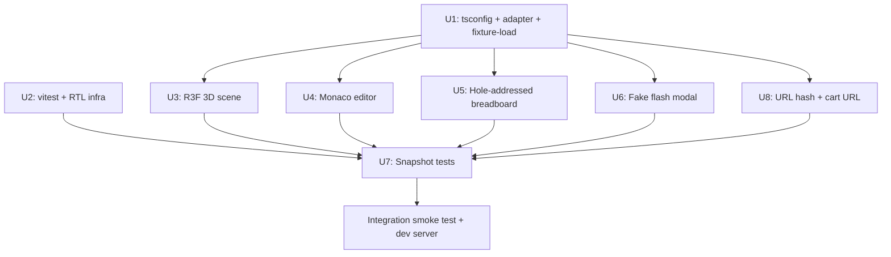

# Complete Track 1 (UI) for Volteux v0

## Overview

Ship the remaining Track 1 (UI/frontend) work for Volteux v0 in a ~4-hour wall-clock window using parallel build agents. The UI scaffold (Vite + React + TypeScript) is already running at `app/`; this plan covers the eight remaining deliverables to bring the UI to v0-complete per `docs/PLAN.md` § Track 1 weeks 1-4.

The plan is sequenced so that one foundation unit unblocks five parallel build units, with snapshot tests landing last against fresh baselines.

---

## Problem Frame

Talia's UI track has a working scaffold but is still wired to canned mock data. To hit v0 acceptance the UI must:

1. Consume the canonical `VolteuxProjectDocument` shape (from `schemas/document.zod.ts` + `fixtures/uno-ultrasonic-servo.json`) so it can swap to Kai's pipeline output without a UI rewrite.
2. Honor `components/registry.ts` as the single source of truth for static component metadata (descriptions, icons, hotspot positions, pin layouts).
3. Replace placeholder renderings (artistic SVG hero, colored-span code viewer, hand-drawn wiring) with the documented v0 implementations (R3F 3D scene, Monaco read-only editor, hole-addressed breadboard).
4. Have a believable flash UX (FAKE animation only — real Web Serial deferred to v0.5 because hardware testing across 3 platforms is out of scope for a 4-hour window).
5. Carry snapshot tests so the UI CI requirement in `CLAUDE.md` is satisfied.
6. Persist the current project to the URL hash so a friend can be sent a link.

Track 2 (pipeline/backend) is owned by Kai and is OUT OF SCOPE for this plan. The UI consumes Track 2 outputs as black boxes.

---

## Requirements Trace

- R1. The result view renders the project from `fixtures/uno-ultrasonic-servo.json` (parsed via Zod, adapted via `components/registry.ts`) — not from canned data — by default. → U1
- R2. The 3D hero is a React-Three-Fiber scene with the 5 archetype-1 components as primitive meshes, each with a clickable hotspot whose position comes from registry `pin_metadata.anchor`. Orbit + zoom controls only; reset-view button visible. → U3
- R3. The code panel is a Monaco read-only editor with `language="cpp"` rendering `document.sketch.main_ino` verbatim. Existing copy + expand buttons still work. → U4
- R4. The wiring panel renders a hole-addressed breadboard grid (a-j × 1-30) driven by `breadboard_layout.components[].anchor_hole` and `pin_layout`. Connections rendered as polylines using `wire_color`. Existing expand button still works. → U5
- R5. All static component metadata in the UI (icons, descriptions, hotspot positions) is sourced from `components/registry.ts`. The current ad-hoc descriptions in `app/src/data/projects.ts` are removed. → U1, U5
- R6. Clicking "Flash to my Uno" opens a multi-step animated modal (Connect → Compile → Upload → Verify → Done) with no real Web Serial calls. Real `avrgirl-arduino` integration is explicitly deferred. → U6
- R7. There is at least one snapshot test per top-level view (`LandingView`, `LoadingView`, `ResultView`). The `ResultView` test consumes `fixtures/uno-ultrasonic-servo.json` through the real adapter. `npm test` from `app/` passes. → U7
- R8. The current project document is encoded into `window.location.hash` on every change and restored on page load. The "Buy on Adafruit" button opens a real wishlist URL composed from `document.components[].sku`. → U8
- R9 (system). `npx tsc --noEmit` from `app/` passes after every unit. The dev server (`npm run dev`) continues to start cleanly. The Landing → Loading → Result flow, chat refinements, drag handles, expand mode, sign-in modal, and tweaks panel all keep working. → all units

---

## Scope Boundaries

- **Pipeline/backend code is OUT.** No edits to `pipeline/`, `infra/server/`, `schemas/document.zod.ts`, or any Track 2 surface. Track 2 outputs are consumed only.
- **Real `avrgirl-arduino` + Web Serial integration is OUT.** Only the FAKE flash animation lands here (deferred to follow-up).
- **Real `.glb` 3D models are OUT.** R3F scene uses drei primitives keyed by component type.
- **Cross-platform flash testing on real hardware is OUT.** No Arduino in hand for this session; physically can't test 3 platforms in 4 hours.
- **Eval harness, meta-harness, Wokwi, multi-archetype support, share-link service, AvantLink affiliate IDs are OUT** (all explicitly weeks-5+ work in `docs/PLAN.md`).
- **Visual identity rework is OUT.** The 28 unresolved visual-identity decisions in `docs/PLAN.md` § Visual Design stay deferred. Existing slate/violet palette is honored as-is.

### Deferred to Follow-Up Work

- Real Web Serial / `avrgirl-arduino` integration → separate Track 1 follow-up after archetype 2 lands.
- Production `.glb` component models → separate visual-identity work-stream.
- Snapshot tests for `ChatPanel` and individual `panels/*` components → follow-up once Wave 2 components stabilize.
- Server-side share-link service (CLAUDE.md mentions it for v0; URL hash covers the demo flow without it) → follow-up when hash payloads start exceeding ~1800 bytes.

---

## Context & Research

### Relevant Code and Patterns

- `app/src/types.ts:24-79` — current UI `Project`/`Part`/`WireColor`/`CodeLine` shape; will be partially replaced by direct consumption of `VolteuxProjectDocument` after the adapter lands.
- `app/src/data/projects.ts` — canned PROJECTS catalog + `bestMatch` + `applyRefinement`. After U1, only `applyRefinement` survives (chat refinement still works against the real document); `bestMatch` is removed in favor of fixture-load.
- `app/src/App.tsx:78-81` — `finishLoading()` calls `bestMatch(prompt)`; this is the swap point for U1.
- `app/src/App.tsx:88-110` — `refine()` uses `applyRefinement(project, refinement)`; survives U1 but its inputs change shape.
- `app/src/panels/HeroPanel.tsx:140-273` — inline `SceneSvg` is the replacement target for U3.
- `app/src/panels/CodePanel.tsx:29-48` — colored-span sketch renderer is the replacement target for U4.
- `app/src/panels/WiringPanel.tsx:42-126` — hand-drawn breadboard SVG is the replacement target for U5.
- `app/src/views/ResultView.tsx:127-132` + `app/src/App.tsx:158-161` — current toast-based flash demo; replacement target for U6.
- `app/src/panels/PartsPanel.tsx:67-69` — currently no-op cart button; wire target for U8.
- `components/registry.ts:91-318` — `COMPONENTS` map keyed by SKU with `pin_metadata`, `pin_layout`, `model_url`, `education_blurb`, `type`. `lookupBySku(sku)` is the canonical accessor. Only 5 SKUs (`"50"`, `"3942"`, `"169"`, `"239"`, `"758"`) are valid v0 components.
- `schemas/document.zod.ts:171-186` — `VolteuxProjectDocumentSchema`; exports `VolteuxProjectDocument` type. Zod v3 (matches `app/package.json:20`).
- `fixtures/uno-ultrasonic-servo.json` — parses cleanly against the schema. `breadboard_layout.components[]` has 3 entries (board, sensor, servo); breadboard `b1` and wires `w1` are in `components[]` but not in `breadboard_layout` (per `components/registry.ts:33-39` `TYPES_REQUIRING_LAYOUT`).
- `app/src/styles.css:4-39` — design tokens (`--bg`, `--surface`, `--accent`, `--ink`, `--display`, `--mono`, …). Honor these in any new component (R3F materials, Monaco theme, FlashModal styling).
- `app/src/views/LoadingView.tsx:54-75` — stepper pattern to mirror in U6's FlashModal.

### Institutional Learnings

- `docs/solutions/security-issues/sha256-cache-key-canonical-json-serialization-2026-04-26.md` — canonical-envelope serialization principle. Apply to U8: serialize the whole document via `JSON.stringify` once before gzip+base64, never concatenate fields with separators. Also reinforces "Zod is law" — Zod-validate the decoded hash before trusting it.
- No directly-relevant Track 1 learnings exist yet. Capture our own via `/ce-compound` after each unit lands, especially for U3 (R3F + drei primitives in StrictMode) and U6 (which will inform the real flash spike later).

### External References

- `@react-three/fiber` v8 docs — pinned to React 18 line; do NOT upgrade to v9.
- `@monaco-editor/react` v4 — `<Editor>` API, `theme` and `options.readOnly`.
- `vitest` + `@testing-library/react` + `jsdom` — standard React snapshot pattern.
- `CompressionStream` MDN — for U8's gzip step (zero-dep, ships in all modern browsers).
- Adafruit wishlist URL pattern: `https://www.adafruit.com/wishlists/?wl_name=<name>&q=<sku1>,<sku2>,...` (informal; confirm with team before locking).

---

## Key Technical Decisions

- **`tsconfig.json` widening (smallest viable diff).** Add `"../schemas/**/*.ts"` and `"../components/**/*.ts"` to `app/tsconfig.json`'s `include`. Vite resolves the `..` paths fine at runtime; `paths` mapping or symlinks add complexity without benefit. *Rationale:* every later unit needs cross-package imports; do this once in U1 instead of N times.
- **Keep the `Project` view-model shim, don't pass `VolteuxProjectDocument` to panels.** The adapter returns a UI-friendly `Project` derived from the document + registry. *Rationale:* every existing panel consumes `Project`; passing the raw document forces N-way panel rewrites. The adapter is one place that absorbs the schema-vs-UI shape diff.
- **R3F scene uses drei primitive meshes (`<Box>`, `<Cylinder>`, `<Plane>`) keyed by `entry.type`** for v0. *Rationale:* `model_url` paths in the registry point to nonexistent `.glb` files; loading them would 404. Production models are a separate visual-identity work-stream.
- **`CompressionStream` for URL-hash gzip, not `pako`.** *Rationale:* zero-dep, ships in all evergreen browsers. Smaller bundle, no supply-chain surface.
- **Mock Monaco and R3F `<Canvas>` at the vitest test-setup level.** *Rationale:* both render heavy non-deterministic DOM that snapshots can't reliably capture. `vi.mock("@monaco-editor/react", () => ({ default: ({ value }) => <pre>{value}</pre> }))` and similar for `<Canvas>` keep snapshots small and stable.
- **Wire color palette: only schema-allowed colors propagate forward.** The UI's `WireColor` keeps `purple` as a legacy alias (the chat's "add a beep" path adds a buzzer with purple wire), but the breadboard renderer maps any unknown color to a fallback grey. *Rationale:* avoid silent failures when the schema and UI disagree, but don't break the chat-driven refinement path.
- **`useState` only — no Redux/Zustand/Context.** *Rationale:* matches the existing `App.tsx` pattern; no app-state library is justified at this size.
- **One snapshot per top-level view (Landing/Loading/Result), not per leaf component.** *Rationale:* satisfies the CLAUDE.md UI CI requirement; per-component coverage is a follow-up.

---

## Open Questions

### Resolved During Planning

- *Adapter approach — adapter file or convert types in-place?* → New `app/src/data/adapter.ts` returning a `Project` view-model. Existing panels keep their `Project` props. (See Key Technical Decisions.)
- *Where does fixture loading happen?* → `App.tsx`'s `finishLoading()` (synchronous Vite import: `import fixture from "../../fixtures/uno-ultrasonic-servo.json"`).
- *Should U2 add `vitest` to `app/package.json` or root `package.json`?* → `app/package.json` (root uses `bun test` for pipeline; the UI lane stays independent).
- *Snapshot strategy for non-deterministic state (autoTour interval, refining timeouts)* → `vi.useFakeTimers()` per test + reset between tests. ResultView snapshot is taken before any timer ticks.

### Deferred to Implementation

- *Exact Monaco theme name* — implementer picks between `"vs-dark"` (default) or a custom-defined theme matching `--surface`/`--accent`. Either acceptable; pick whichever lands in <10 min.
- *FlashModal animation timing* — implementer picks step durations (suggest ~600ms/step). User-facing feel matters more than spec.
- *Breadboard-grid hole spacing in CSS px* — geometric tuning during U5; the data layer (anchor_hole, pin_layout offsets) is fixed.

### Open for Talia (need answer before U8 ships)

- **Adafruit cart URL format.** No canonical pattern is documented in the repo. Default is the wishlist URL (`https://www.adafruit.com/wishlists/?wl_name=Volteux&q=<comma-sku-list>`). Talia/Kai should confirm before merge. If they say "use individual product links instead," U8 swaps to opening the first SKU's product page.

---

## Implementation Units

- U1. **Foundation: `tsconfig` widen, schema-to-`Project` adapter, fixture-driven `ResultView` flow**

  **Goal:** Replace canned `bestMatch(prompt)` with a fixture-loaded, schema-validated, registry-joined `Project`. Establish the cross-package import path so every later unit can `import { VolteuxProjectDocumentSchema } from "../../../schemas/document.zod"` and `import { lookupBySku } from "../../../components/registry"`.

  **Requirements:** R1, R5, R9

  **Dependencies:** None — this is the foundation.

  **Files:**
  - Modify: `app/tsconfig.json` — widen `include` to `["src", "vite.config.ts", "../schemas/**/*.ts", "../components/**/*.ts"]`
  - Create: `app/src/data/adapter.ts` — `pipelineToProject(doc: VolteuxProjectDocument): Project`
  - Create: `app/src/data/fixtures.ts` — `loadDefaultFixture(): VolteuxProjectDocument` (Vite static JSON import + Zod validate)
  - Modify: `app/src/App.tsx` — `finishLoading()` swaps `bestMatch(prompt)` for `pipelineToProject(loadDefaultFixture())`
  - Modify: `app/src/data/projects.ts` — strip the canned PROJECTS map, keep `applyRefinement` (which now operates on the adapted `Project`), `bestMatch` is deleted, `examples` stays
  - Modify: `app/src/types.ts` — `Project` may grow a `documentId` or `archetypeId` field for traceability; existing `Part`/`WireColor`/`CodeLine` shapes preserved

  **Approach:**
  - `adapter.ts` accepts a parsed `VolteuxProjectDocument`, walks `components[]`, calls `lookupBySku(c.sku)` for each, and emits `Part[]` with: `id` (from component_id), `name` + `desc` + `icon` (from registry; map registry `type` → `IconKind`), `pos` (default to grid-projected position from `breadboard_layout.components[].anchor_hole`, fallback to evenly-spaced if missing), `pulse` (sensors only).
  - Wires: map `connections[]` → `WiringConnection[]`, with the "purple is UI-only" fallback documented in code.
  - Code: tokenize `document.sketch.main_ino` into the existing `CodeLine[]` shape using a tiny C++-aware splitter, OR pass the raw string through and let U4's Monaco editor render it (preferred — tokenized fallback is dead code once Monaco lands). Recommend: keep one `CodeLine[]`-shaped fallback for the brief window before U4 lands, then remove.
  - `loadDefaultFixture()` does `import fixtureJson from "../../../fixtures/uno-ultrasonic-servo.json"` (Vite handles `.json` natively) → `VolteuxProjectDocumentSchema.parse(fixtureJson)` → throw with a clear error if invalid.
  - `App.tsx`: `finishLoading()` is now `setProject(pipelineToProject(loadDefaultFixture()))`. The prompt parameter is preserved for display in `Header` but no longer drives matching.

  **Patterns to follow:**
  - Prop-typing via `interface FooProps`, function components, local `useState` only (`app/src/App.tsx:28-39`).
  - Schema-validate at boundaries (CLAUDE.md "Zod is law").
  - No silent failures (CLAUDE.md): adapter throws on missing-from-registry SKU with a clear message; the error boundary surfaces it.

  **Test scenarios:**
  - Happy path: fixture parses, adapter returns `Project` with 5 parts (Uno, HC-SR04, SG90, breadboard, jumper wires), 7 wires, full sketch text. Assert `project.parts.length === 5`, `project.wiring.length === 7`, `project.title` is set from registry/archetype-derived label.
  - Edge: a component_id that doesn't resolve to a registered SKU → adapter throws `Error("Unknown SKU: <sku>")`.
  - Edge: schema-invalid fixture (missing required field) → Zod throws with the field path.
  - Integration: `App.tsx` `finishLoading()` produces a `Project` that the existing `ResultView` renders without TypeScript or React errors. (Verified by U7's ResultView snapshot.)

  **Verification:**
  - `npx tsc --noEmit` passes from `app/`.
  - Dev server (`npm run dev`) loads the landing page, "Build it" → loading animation → result view shows the fixture's project (Waving robot arm-equivalent) with 5 parts in the parts list and the sketch in the code panel.
  - The chat panel's "add a beep" still works (refinement against the new Project shape).

  **Open question / gotcha:** When U1 strips `PROJECTS` from `app/src/data/projects.ts`, the chat refinement's `applyRefinement` still references project-key-specific paths (`project.key === "robot-arm-wave"` for the wave-N-times branch). The fixture's archetype_id is `"archetype-1"`, not `"robot-arm-wave"`. **Decision:** soften `applyRefinement` to key off `archetype_id` instead of `key`, OR map `archetype-1` → `robot-arm-wave` in the adapter so the chat keeps working. Implementer chooses; default to mapping in the adapter (smaller blast radius).

---

- U2. **Testing infrastructure: vitest + jsdom + Testing Library**

  **Goal:** Add a working `npm test` to `app/` so U7 can land snapshot tests. No test files yet — that's U7's scope.

  **Requirements:** R7, R9

  **Dependencies:** None (parallel-safe with U1).

  **Files:**
  - Modify: `app/package.json` — add devDeps `vitest`, `@vitest/ui`, `@testing-library/react`, `@testing-library/jest-dom`, `@testing-library/user-event`, `jsdom`, `@types/jsdom`. Add scripts `"test": "vitest"`, `"test:ci": "vitest run"`, `"test:ui": "vitest --ui"`
  - Create: `app/vitest.config.ts` — extends Vite config; sets `test.environment: "jsdom"`, `test.setupFiles: ["./src/test-setup.ts"]`, `test.globals: true`
  - Create: `app/src/test-setup.ts` — `import "@testing-library/jest-dom"`, `vi.mock("@monaco-editor/react", ...)`, `vi.mock("@react-three/fiber", ...)` for the `<Canvas>` component
  - Create: `app/src/__tests__/sanity.test.tsx` — one trivial render-and-assert test to prove the setup wires correctly (delete or repurpose during U7)

  **Approach:**
  - Vitest config inherits Vite's plugin chain so JSX/TSX transforms work without duplication.
  - Monaco mock: `default: ({ value }: { value: string }) => <pre data-testid="monaco-editor">{value}</pre>`
  - R3F mock: replace `<Canvas>` with `
{children}
` so child components don't crash trying to use `useThree()` outside a real canvas. Don't mock `@react-three/drei` — let drei components render as their declared mesh types; they no-op outside a canvas but typecheck.
  - Sanity test: `render(
hello
); expect(screen.getByText("hello")).toBeInTheDocument();`

  **Patterns to follow:**
  - Use Vitest's auto-imported `describe/it/expect` (`test.globals: true`).

  **Test scenarios:**
  - Happy path: `npm test -- --run` exits 0 with the sanity test passing.

  **Verification:**
  - `npm test -- --run` from `app/` exits 0.
  - `npm run typecheck` from `app/` passes.

  **Open question / gotcha:** `@testing-library/react` v16 needs React 18 (matches our pin). If install resolves a v15, downgrade explicitly. Newer @types might pull in React 19 type defs — pin `@types/react@^18` if needed.

---

- U3. **React-Three-Fiber 3D scene replacing the SVG hero**

  **Goal:** Replace `SceneSvg` in `HeroPanel.tsx` with an R3F `<Canvas>` rendering 5 archetype-1 components as drei primitive meshes. Each component has a clickable hotspot driven by `pin_metadata.anchor`. Orbit + zoom controls only (no pan), with a visible reset-view button.

  **Requirements:** R2

  **Dependencies:** U1 (needs the adapter so HeroPanel receives parts derived from the registry).

  **Files:**
  - Modify: `app/src/panels/HeroPanel.tsx` — replace inline `SceneSvg` with `<Canvas>` + scene tree
  - Create: `app/src/panels/HeroScene.tsx` — pure R3F scene component (so HeroPanel's overlay UI keeps its structure)
  - Modify: `app/src/styles.css` — add `.hero-canvas-wrap` rules if needed for `<Canvas>` sizing (`width: 100%; height: 100%; touch-action: none`)

  **Approach:**
  - `<Canvas camera={{ position: [3, 2.5, 4], fov: 45 }} dpr={[1, 2]} flat>`. Lights: `<ambientLight intensity={0.6} /><directionalLight position={[5, 5, 5]} intensity={0.8} />`.
  - Scene tree: a flat plane (workspace) + per-component meshes positioned in 3D. Map `entry.type` → primitive: `mcu` → `<Box args={[2, 0.2, 1.4]}>` (Uno blue PCB material), `sensor` → `<Box args={[1.2, 0.4, 0.5]}>` (HC-SR04), `actuator` → `<Cylinder args={[0.4, 0.4, 0.6]}>` (servo body) + `<Box>` arm, `breadboard` → `<Box args={[2.5, 0.15, 1.6]}>` (cream material), `wire` → don't render (visual noise; future deliverable).
  - Hotspots: `<Html>` from drei, positioned at each component's mesh center. Reuse the existing `.hotspot` CSS class. `onClick` calls the existing `setSelectedPart(id)` handler.
  - Controls: `<OrbitControls enablePan={false} maxPolarAngle={Math.PI / 2.1} />`. Reset: ref the controls, call `controls.current?.reset()` from a button overlaid on the canvas (reuse existing `.hero-controls` styling).
  - StrictMode-safe: do not allocate textures or geometries inside render; let drei components handle resources. No `useEffect` with side effects in the scene tree.

  **Patterns to follow:**
  - Existing `HeroPanel` overlay UI (callouts, hint, tour button, controls) wraps the canvas — do not rewrite it.
  - Material colors mirror existing SVG palette (PCB blue `#1E5C8A`, breadboard cream `#FBFAF6`, sensor blue `#1A4A82`, servo dark `#3A4255`).

  **Test scenarios:**
  - Happy path (manual): scene renders in dev server; orbit by drag; zoom by scroll; reset button returns camera to initial position.
  - Snapshot (via U7): `<Canvas>` is mocked to a `data-testid="r3f-canvas"` div, so the snapshot captures the wrapping HeroPanel structure + hotspot overlays, not the WebGL scene.
  - Edge: a component_id with no registry entry → render as a fallback grey `<Box>` (same fallback the adapter uses).
  - Integration: clicking a hotspot fires `setSelectedPart(id)` and the existing callout opens (the existing chrome UI keeps working).

  **Verification:**
  - `npx tsc --noEmit` passes.
  - Dev server renders the result view; the hero shows a 3D scene (not the old SVG); orbit + zoom + reset all work; clicking any of the 5 hotspots opens the existing callout.

  **Open question / gotcha:** R3F's `<Canvas>` needs a sized parent or it collapses to 0×0. Confirm `.hero-canvas` has `position: relative; width: 100%; height: 100%`. The existing CSS already does this — verify before adding a wrap div.

  **Do not touch:** `CodePanel.tsx`, `WiringPanel.tsx`, `PartsPanel.tsx`, `App.tsx`, `data/`, `lib/`.

---

- U4. **Monaco read-only sketch editor in CodePanel**

  **Goal:** Replace the colored-span renderer in `CodePanel.tsx` with `<Editor language="cpp" readOnly>` rendering `document.sketch.main_ino`. Keep copy + expand buttons working.

  **Requirements:** R3

  **Dependencies:** U1 (needs `Project.code` to expose the raw `.ino` string, OR the adapter to attach `sketchSource: string` to the `Project`).

  **Files:**
  - Modify: `app/src/panels/CodePanel.tsx` — swap the line/span loop for `<Editor>`
  - Modify: `app/src/types.ts` — add `sketchSource: string` to `Project` (alongside `code: CodeLine[]` for backwards compat during U1's brief window)
  - Modify: `app/src/data/adapter.ts` (touch from U1's diff) — populate `sketchSource` from `document.sketch.main_ino`
  - Modify: `app/src/views/ResultView.tsx:53-64` — `copyCode` callback copies `project.sketchSource` directly (not the tokenized lines)

  **Approach:**
  - `<Editor height="100%" defaultLanguage="cpp" theme="vs-dark" value={project.sketchSource} options={{ readOnly: true, minimap: { enabled: false }, fontSize: 13, fontFamily: "JetBrains Mono, ui-monospace, monospace", lineNumbers: "on", scrollBeyondLastLine: false, padding: { top: 12, bottom: 12 } }} />`
  - `copy` button reads `project.sketchSource` → `navigator.clipboard.writeText`.
  - `expand` button keeps current toggle wiring.

  **Patterns to follow:**
  - Existing `panel-head` chrome stays unchanged.
  - Color tokens flow via Monaco's theme (`vs-dark` is close enough for v0; custom theme is a follow-up).

  **Test scenarios:**
  - Happy path (manual): code panel renders the fixture's sketch (Servo includes, setup, loop) with C++ syntax highlighting and line numbers.
  - Edge: empty `sketchSource` → renders empty editor with no error.
  - Snapshot (via U7): Monaco is mocked to `<pre>{value}</pre>`; snapshot captures the panel chrome + the raw sketch text.
  - Integration: `copy` button → clipboard contains the raw `.ino` string. `expand` button → panel goes to fullscreen (existing behavior).

  **Verification:**
  - `npx tsc --noEmit` passes.
  - Dev server: code panel shows Monaco-rendered sketch; copy works; expand works.

  **Open question / gotcha:** Monaco is heavy (~5 MB on first load). For a 4-hour MVP this is acceptable, but flag in the PR description that production builds will want `@monaco-editor/react`'s `loader` configured to lazy-load.

  **Do not touch:** `HeroPanel.tsx`, `WiringPanel.tsx`, `PartsPanel.tsx`, `lib/`, `App.tsx` (beyond the `copyCode` callback).

---

- U5. **Hole-addressed 2D breadboard view in WiringPanel**

  **Goal:** Refactor `WiringPanel.tsx` from artistic SVG to grid-positioned rendering driven by `breadboard_layout.components[].anchor_hole` + `components/registry.ts` `pin_layout`. Connections rendered as polylines using `wire_color`. Expand button keeps working.

  **Requirements:** R4, R5

  **Dependencies:** U1 (needs adapter outputs); also reads `components/registry.ts` directly for `pin_layout` (which the adapter doesn't carry forward).

  **Files:**
  - Modify: `app/src/panels/WiringPanel.tsx` — replace hand-drawn SVG with grid renderer
  - Create: `app/src/panels/breadboard-geometry.ts` — pure helpers: `holeToXY(hole: string): {x: number, y: number}`, `placeComponent(anchor: string, layout: PinLayout): {x: number, y: number}[]`, color map from `WireColor` → CSS variable

  **Approach:**
  - Grid: 30 cols × 10 rows (a-j). Hole spacing: ~14px on a 480-wide viewBox (matches existing SVG dimensions). Two halves: a-e (top) and f-j (bottom), separated by the center channel (~12px).
  - Render: outer breadboard rect + center channel + per-hole circles.
  - For each `breadboard_layout.components[i]`: look up component in registry by SKU, use `pin_layout` to compute each pin's hole position relative to `anchor_hole`, draw the component footprint (rectangle covering the pins) + a label at the center.
  - For each `connections[i]`: find both endpoints by `(component_id, pin_label)` and draw a polyline using the wire color. Endpoints whose component isn't on the breadboard (e.g., the Uno itself) draw to the outside-edge "rail" stub.
  - Color map: `wire_color` → CSS color (red/black/yellow/blue/green/white/orange map to canonical hex values; unknown → `#888` fallback).
  - Keep the legend at the bottom with the first 5 connections.

  **Patterns to follow:**
  - SVG `viewBox` and `preserveAspectRatio` keep the old responsive behavior.
  - Honor design tokens (`--surface`, `--ink-3`) for the grid + labels.

  **Test scenarios:**
  - Happy path: fixture renders 3 component placements (board u1 special-cased, sensor s1 at e15, servo a1 at e22 — actual values from fixture) + 7 connections as colored polylines.
  - Edge: a component_id missing from registry → renders as a labeled grey rectangle at its anchor_hole (don't crash).
  - Edge: a connection referencing a non-existent component → log a console warning, skip the polyline.
  - Snapshot (via U7): captures the SVG markup.
  - Integration: expand button still toggles fullscreen.

  **Verification:**
  - `npx tsc --noEmit` passes.
  - Dev server: wiring panel shows a hole-addressed breadboard with 3 placed components + 7 colored wires; visual fidelity is "v0 acceptable" (clean grid, readable labels).

  **Open question / gotcha:** Per `components/registry.ts:33-39`, only certain `type` values get a `breadboard_layout` entry. The Uno (`type: mcu`) is NOT on the breadboard — render it as an off-board box on the left edge, with wires running into the breadboard. Same for jumper wires (`type: wire`) — they're connection metadata, not placed components.

  **Do not touch:** `HeroPanel.tsx`, `CodePanel.tsx`, `PartsPanel.tsx`, `App.tsx`, `lib/`.

---

- U6. **Fake flash UX (multi-step animated modal)**

  **Goal:** Replace the existing toast-based "Flash to my Uno" demo with a multi-step animated modal. NO real Web Serial calls. NO real `avrgirl-arduino`. The modal is pure UX scaffolding so the real spike (deferred to v0.5) can drop in later.

  **Requirements:** R6

  **Dependencies:** None (the existing `onFlash` button is already wired in U1's intermediate state).

  **Files:**
  - Create: `app/src/components/FlashModal.tsx` — overlay modal with stepper, mirrors `LoadingView`'s visual pattern
  - Modify: `app/src/App.tsx` — add `flashing: boolean` state + `setFlashing` handler; pass `onFlash={() => setFlashing(true)}` to `ResultView`; render `<FlashModal open={flashing} onClose={() => setFlashing(false)} project={project} />` near the `<SignInModal>` slot
  - Modify: `app/src/views/ResultView.tsx` — remove the existing `setRefineToast("Flashing...")` toast pattern; the button now calls `onFlash` directly without inline state

  **Approach:**
  - FlashModal uses the same `auth-overlay` + centered-modal pattern as `SignInModal` (or extracted to a shared `Modal` if the diff stays small).
  - Steps: `["Connecting to Arduino", "Compiling sketch", "Uploading to board", "Verifying", "Done"]`. Each step auto-advances after ~700ms. After the last step, show a success state ("Your Uno is running your code 🎉" — or text without emoji per CLAUDE.md; pick the version that fits the tone).
  - Show the project title at the top of the modal so the user knows what's being flashed.
  - Esc + backdrop-click close the modal at any time (cancels the fake flash).
  - "No silent failures" (CLAUDE.md): even though this is a fake, structure the FlashModal so a future real implementation can throw a typed error and the modal renders an error state with a retry button. Don't ship the error UI yet — just leave the slot.

  **Patterns to follow:**
  - `LoadingView.tsx:54-75` stepper.
  - `SignInModal.tsx` overlay + Esc-handler.

  **Test scenarios:**
  - Happy path (manual): click "Flash to my Uno" → modal opens → steps advance → success state appears → close.
  - Edge: Esc closes mid-flow → no warning, no leftover state.
  - Snapshot (via U7): one snapshot of the modal in the "uploading" step (use fake timers to advance).

  **Verification:**
  - `npx tsc --noEmit` passes.
  - Dev server: button click triggers the modal; full flow runs in ~5s; close works.

  **Open question / gotcha:** The CLAUDE.md "No `.hex` download fallback" rule means the modal should not offer "download the hex file instead" if the fake fails. The error state slot should say "we couldn't reach your board — check the cable and try again," not "click here to download."

  **Do not touch:** `HeroPanel.tsx`, `CodePanel.tsx`, `WiringPanel.tsx`, `PartsPanel.tsx`, `lib/` (beyond what U1/U8 do).

---

- U7. **UI snapshot tests for Landing, Loading, and Result views**

  **Goal:** One snapshot test per top-level view consuming the real fixture. Satisfies the CLAUDE.md UI CI requirement that "every fixture in `fixtures/` snapshots against every view."

  **Requirements:** R7

  **Dependencies:** U1 (adapter), U2 (vitest infra), U3 + U4 + U5 + U6 (the views render with the new components — snapshots will baseline against the post-build state).

  **Files:**
  - Create: `app/src/__tests__/LandingView.test.tsx`
  - Create: `app/src/__tests__/LoadingView.test.tsx`
  - Create: `app/src/__tests__/ResultView.test.tsx`
  - Modify: `app/src/test-setup.ts` (touch from U2's diff) — finalize Monaco + R3F mocks based on what U3 + U4 actually render
  - Delete: `app/src/__tests__/sanity.test.tsx` (replaced by the real tests)

  **Approach:**
  - LandingView test: render with default props, snapshot the DOM. Assert "Type your idea" tagline visible. Assert "Get started" button visible.
  - LoadingView test: render with `prompt="test prompt"` and a no-op `onComplete`. Snapshot. Assert "Reading your idea" step active. Use `vi.useFakeTimers()` to keep the snapshot deterministic.
  - ResultView test: load fixture via `loadDefaultFixture()` + `pipelineToProject()`, render `<ResultView project={...} onRefine={vi.fn()} refining={false} onFlash={vi.fn()} refineToast={null} />`. Snapshot. Assert the parts list shows 5 parts (count by `.part` selector).
  - Use `vi.useFakeTimers()` in beforeEach; `vi.useRealTimers()` in afterEach.
  - Mocks (in test-setup): `vi.mock("@monaco-editor/react", () => ({ default: ({ value }: any) => <pre data-testid="monaco">{value}</pre> }))`. For R3F: `vi.mock("@react-three/fiber", async (orig) => ({ ...(await orig()), Canvas: ({ children }: any) => 
{children}
 }))`.

  **Patterns to follow:**
  - `@testing-library/react` `render` + `screen.getByText` for assertions.
  - Vitest snapshots stored in `__snapshots__/` next to the test files.

  **Test scenarios:**
  - Happy path: all 3 snapshots stable across runs (no timestamp/random content); `npm test -- --run` exits 0.
  - Regression: snapshot mismatch on subsequent runs fails CI loudly.
  - Integration (covers AE for fixture render): ResultView test confirms the fixture flows end-to-end through adapter + every panel without runtime errors.

  **Verification:**
  - `npm test -- --run` from `app/` passes with all 3 snapshot files committed under `app/src/__tests__/__snapshots__/`.
  - `npx tsc --noEmit` passes.

  **Open question / gotcha:** The `ResultView` snapshot will include `selectedPart=null`, `autoTour=false`, no `refining`. Don't try to snapshot every state — those are integration-test territory, not snapshot-test territory.

  **Do not touch:** Production source files (only the test files + test-setup).

---

- U8. **URL hash persistence + Adafruit cart URL**

  **Goal:** Persist the current document to `window.location.hash` (base64+gzip) and restore on page load. Wire the "Buy on Adafruit" button to a real wishlist URL composed from `document.components[].sku`.

  **Requirements:** R8

  **Dependencies:** U1 (operates on the document the adapter consumed; needs the document available in `App.tsx` state alongside the `Project`).

  **Files:**
  - Create: `app/src/lib/urlHash.ts` — `encode(doc: VolteuxProjectDocument): string` and `decode(hash: string): VolteuxProjectDocument | null` (Zod-validate before returning)
  - Create: `app/src/lib/adafruitCart.ts` — `cartUrl(doc: VolteuxProjectDocument): string`
  - Modify: `app/src/App.tsx` — add a `useEffect` on mount to read hash + restore project; add a `useEffect` on project change to write hash; track raw document alongside the adapted Project (small state shape change)
  - Modify: `app/src/panels/PartsPanel.tsx:67-69` — wire `btn-cart` `onClick` to `window.open(cartUrl(document), "_blank")`
  - Modify: `app/src/types.ts` — add `document?: VolteuxProjectDocument` field to `Project`, OR pass document as a separate prop chain (implementer chooses; prop-chaining is cleaner)

  **Approach:**
  - `encode`:
    1. `JSON.stringify(doc)` — canonical, no whitespace
    2. `new Blob([str]).stream().pipeThrough(new CompressionStream("gzip"))` → `Response` → `arrayBuffer`
    3. base64 the bytes (`btoa(String.fromCharCode(...new Uint8Array(buf)))`) — URL-safe variant: replace `+`/`/` with `-`/`_`, strip `=`
    4. Return prefixed: `#v1:<base64>`
  - `decode` is the reverse: strip prefix, base64-decode, `DecompressionStream("gzip")`, `JSON.parse`, `VolteuxProjectDocumentSchema.safeParse`. Return `null` on any failure (don't throw — caller falls back to fixture).
  - `cartUrl(doc)`: `https://www.adafruit.com/wishlists/?wl_name=Volteux&q=${doc.components.map(c => c.sku).filter(Boolean).join(",")}`. Open in new tab.
  - `App.tsx` mount effect: if `window.location.hash` is non-empty and decodes successfully, use that document → `pipelineToProject` → `setProject` + `setView("result")`. Otherwise stay on landing.
  - `App.tsx` project-change effect: when `project` changes (and is non-null), call `encode(document)` and write `window.location.hash = encoded`. Skip the write on the initial restore to avoid loops.

  **Patterns to follow:**
  - Canonical-JSON principle from `docs/solutions/security-issues/sha256-cache-key-canonical-json-serialization-2026-04-26.md` — serialize via `JSON.stringify(doc)` once; do not concatenate fields.
  - "Zod is law" (CLAUDE.md): always Zod-validate the decoded document before trusting it.

  **Test scenarios:**
  - Happy path: encode → decode round-trip preserves the fixture document.
  - Edge: hash is empty string → `decode` returns `null`; app loads landing as normal.
  - Edge: hash contains gibberish → `decode` returns `null`; landing renders; no console error spam.
  - Edge: hash decodes to invalid Zod shape → `decode` returns `null`.
  - Edge: a document with 0 components → cart URL is well-formed but with empty `q=`.
  - Integration: load page with a hash from a previous session → result view renders with the persisted document.

  **Verification:**
  - `npx tsc --noEmit` passes.
  - Dev server: build a project → URL hash updates → copy URL → open in new tab → result view shows the same project.
  - "Buy on Adafruit" → opens a new tab with a URL containing the 5 fixture SKUs.

  **Open question / gotcha (NEEDS TALIA INPUT BEFORE MERGE):** Adafruit cart URL format. The wishlist URL is the documented public pattern; if Talia/Kai have a different preferred format (per-product links, affiliate-aware URLs), swap in U8.

  **Do not touch:** `HeroPanel.tsx`, `CodePanel.tsx`, `WiringPanel.tsx`, `lib/` files owned by U6 if any overlap.

---

## Execution Sequencing

**Wave 1 (parallel):** U1 + U2 — touch disjoint files (`tsconfig.json` + adapter vs. `package.json` + test setup).

**Wave 2 (parallel after Wave 1):** U3 + U4 + U5 + U6 + U8 — each touches its own panel/component file. The two `App.tsx` writers (U6 and U8) make additive, non-overlapping diffs (one adds `flashing` state, the other adds hash effects).

**Wave 3 (after Wave 2):** U7 — snapshots take fresh baselines after Wave 2 components exist.

**Wave 4 (manual):** integration smoke test (`npm run dev` + click through Landing → Loading → Result → flash → URL share → reload) + `npm test -- --run` + `npx tsc --noEmit`.

---

## System-Wide Impact

- **Interaction graph:** New components (FlashModal, FlashOverlay, R3F scene, Monaco editor) all hang off existing event handlers (`onFlash`, `setSelectedPart`, `onCopy`, `onExpandToggle`). No new global state.
- **Error propagation:** Adapter throws on missing-from-registry SKU; React error boundary surfaces it. URL-hash decode returns `null` (no throw) so a broken share link gracefully falls back to landing.
- **State lifecycle risks:** URL-hash effect must skip the initial write to avoid an infinite mount→write→mount loop. Use a `restoredFromHash` ref to gate.
- **API surface parity:** None — UI remains internal.
- **Integration coverage:** ResultView snapshot in U7 is the cross-layer integration test (fixture → Zod parse → adapter → registry join → every panel renders).
- **Unchanged invariants:** Landing-view layout, header chrome, sign-in modal, tweaks panel, drag-resize handles, expand mode, chat panel UX. None of these change.

---

## Risks & Dependencies

| Risk | Mitigation |
|------|------------|
| **`tsconfig.json` widening unexpectedly type-checks Kai's pipeline files and surfaces errors that block the UI build** | Widen `include` to `../schemas/**/*.ts` and `../components/**/*.ts` only — NOT `../pipeline/**` or `../infra/**`. Keep blast radius scoped to shared contract files. |
| **R3F StrictMode double-invocation breaks scene state** | Use drei primitives + `<Html>` overlays only; no manual `useEffect` resource allocation in the scene tree. Ref-based controls cleanup is StrictMode-safe by construction. |
| **Monaco's ~5MB bundle inflates dev build cold-start** | Acceptable for v0; flag in PR description that `loader.config({ paths: { vs: "..." } })` for CDN-loading is a follow-up if needed. |
| **Vitest tests flake on Monaco/R3F non-determinism** | Mock both at test-setup level (decided in Key Technical Decisions). Use `vi.useFakeTimers()` for any time-based UI. |
| **Wire-color enum mismatch (`purple` in UI, not in schema) crashes the renderer** | U1's adapter normalizes wire colors; U5's renderer has a `?? "#888"` fallback. Both layers agree the mismatch is non-fatal. |
| **Adafruit cart URL format wrong → demo button opens a 404** | Default to wishlist URL; flag as open question requiring Talia/Kai confirmation BEFORE merging U8. PR cannot merge without confirmation comment. |
| **U6 and U8 both edit `App.tsx` and conflict at integration** | Carefully scoped: U6 adds a `flashing` state and `<FlashModal>` render; U8 adds `useEffect` for hash sync. The two diffs touch different lines. If a conflict surfaces, integration agent resolves additively. |
| **Snapshot tests are taken before Wave 2 lands → test file references components that don't yet match** | U7 is sequenced AFTER Wave 2 in Wave 3; snapshots baseline against the post-build state. |
| **A 4-hour budget for 8 units in 4 waves is aggressive** | Wave 1 ~30 min, Wave 2 bottlenecked on U3 (R3F) ~60 min, Wave 3 ~30 min, Wave 4 ~30 min. Total ~2.5 hours of work + 1.5 hour buffer for review/fixes/integration debugging. If a unit blows budget, drop it to follow-up — U6 (FAKE flash) and U8 (URL hash) are the cheapest to defer; do not drop U1 or U7. |

---

## Documentation / Operational Notes

- After all units land, capture two `/ce-compound` learnings:
  1. **R3F + drei primitives + StrictMode** — what worked, what surprised, lessons for the real `.glb` integration.
  2. **Schema-to-Project adapter pattern** — what fields the schema underspecifies for UI use (icons, descriptions, hotspot positions) and how `components/registry.ts` fills the gap.
- Update `docs/PLAN.md` Track 1 progress when v0 acceptance is met (Talia's call).
- The PR description should call out: schema/component-registry imports added; vitest infra added; FAKE flash modal (NOT real); URL-hash format `v1:` prefix is versioned for future compat.

---

## Sources & References

- **Origin:** No upstream brainstorm/requirements doc; planning context comes directly from `docs/PLAN.md` § Track 1 and the user's enumeration of 8 deliverables.
- Related code: `schemas/document.zod.ts`, `components/registry.ts`, `fixtures/uno-ultrasonic-servo.json`, `app/src/**`
- Related plans: `docs/plans/2026-04-25-001-feat-v01-pipeline-archetype-1-plan.md` (Kai's pipeline plan — reference only; UI consumes its outputs)
- External docs: `@react-three/fiber@^8`, `@monaco-editor/react@^4`, `vitest`, `@testing-library/react@^16`, `CompressionStream` MDN
- Institutional learning: `docs/solutions/security-issues/sha256-cache-key-canonical-json-serialization-2026-04-26.md` (canonical-JSON principle for U8)
