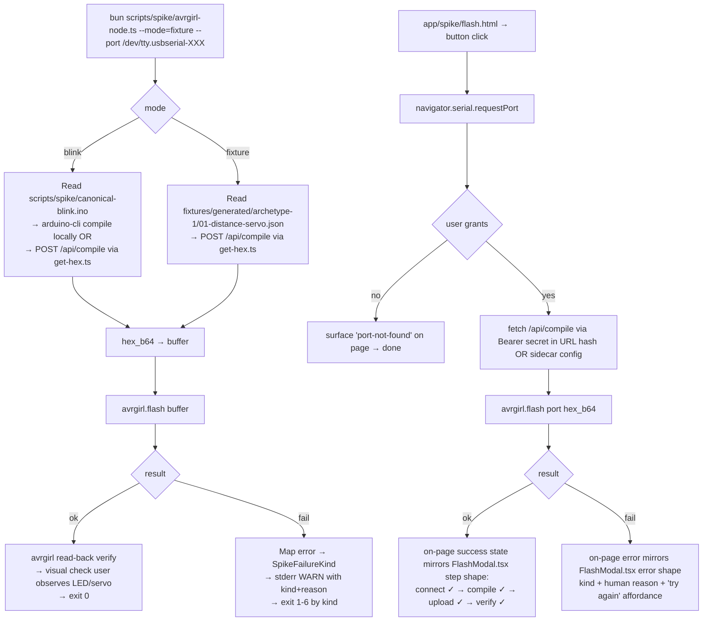

# feat: v0 Uno browser-direct flash spike (avrgirl-arduino + Web Serial)

## Overview

Resolve the v0 keystone risk: prove that a Chromium tab can flash a real Arduino Uno with a `.hex` produced by Volteux's pipeline, using `avrgirl-arduino` over Web Serial, on at least three host platforms. The outcome is binary. Either the spike succeeds and the v0 friend-demo path (week 10-12) is unblocked — at which point Kai + Talia jointly amend CLAUDE.md and `docs/PLAN.md` to drop the "WebUSB" hedge and replace it with the verified library + Web API. Or the spike fails and the day it fails is a re-plan day, with three documented fallback triggers (forked avrgirl with custom Web Serial transport, hand-rolled `stk500-v1`, library swap) that are NOT executed inside this batch.

The spike ships **two** harnesses: a Node/Bun harness (proves the library works at all against real serial) and a browser harness (proves the v0 UX is viable). Both consume `.hex` artifacts via the existing Compile API or hand-built canonical `blink.ino` / `servo.ino` baselines. End-state: `docs/spikes/2026-04-26-avrgirl-spike.md` (gitignored) records per-platform results; if the report concludes PASS, it is promoted to a non-gitignored doc and the joint-signoff edits to CLAUDE.md + `docs/PLAN.md` land in the same PR.

This batch runs IN PARALLEL with v0.5 (Wokwi behavior simulation) on a separate branch (`feat/v0-uno-flash-spike` already exists). The two batches do not share code surfaces — pipeline / gates / schemas / acceptance are untouched here.

## Problem Frame

CLAUDE.md § "Critical risk to track" names this exactly: *"The browser-direct Uno flash spike is the v0 go/no-go. End of week 1, on real hardware, on at least 3 host platforms. … If neither works, this is a real blocker — re-plan that day. There is no `.hex` download fallback in v0."* Until the spike concludes, three downstream pieces are blocked or under-specified:

1. **Talia's `app/src/components/FlashModal.tsx` integration** is scaffolded as a 4-step placeholder (`connect → compile → upload → verify`) with timer-driven progress (700ms / 900ms / 1100ms / 600ms — all fake). Without a verified status-event surface from the spike, that integration would harden against an interface that doesn't match what the library actually emits, and the placeholder timings would calcify into "this is what flashing looks like" before any real wire-up.
2. **CLAUDE.md and `docs/PLAN.md` carry hedge language** ("treat 'WebUSB' as 'browser-direct flash (likely Web Serial)' until the spike confirms otherwise"). Both docs need a coordinated edit at conclusion time, with both Kai + Talia signatures per the schema-discipline cadence. Until the edit lands, every new contributor reads the docs and wonders which API is real.
3. **The v0 friend-demo gate** in CLAUDE.md ("flashes the binary onto a real Uno") is unprovable until at least one platform succeeds end-to-end with a Servo-using sketch (the kind the pipeline will actually emit). A blink-only verification would still leave the v0 demo at risk because Servo's PWM timing exercises code paths that simple GPIO toggling does not.

The non-obvious split this plan must make explicit: **Talia owns "WebUSB flash UX" per CLAUDE.md track ownership; Kai owns the spike per `docs/PLAN.md` line 63 ("pipeline person proves a `.hex`… on Kai's primary Mac")**. The spike-vs-integration boundary is not in either doc as a single sentence. Spike = "does the library + Web API combination work on real hardware at all"; integration = "wire the verified surface into the React app's stepper UX". This batch ships only the spike. The handoff to Talia is the verified `SpikeStepEvent` contract + per-platform driver prerequisites + verbatim error strings — three deliverables that her integration batch consumes as input, not as parallel discovery.

Three additional pieces of context shape the design:

- **The library reality differs from how PLAN.md describes the path.** `avrgirl-arduino@5.0.1` was published 2021-02-07; the README labels Web Serial support as alpha. The 5-year-since-release gap is itself a risk signal — Chromium has shipped ~40 stable channel versions since then, and the alpha Web Serial transport may have bit-rotted against the current API surface. The Day 1 Node-first harness eliminates "is the library even functional with serial in 2026" as a confounding variable BEFORE the browser path adds Web Serial as a second variable.
- **The spike runs in parallel with v0.5 (Wokwi behavior simulation).** Both are unblocked work that does not share code surfaces. The branch shape is `feat/v0-uno-flash-spike` (this batch) on its own off main; v0.5 is `feat/v05-wokwi-behavior-axis` (already created). Neither blocks the other; merging order is determined by which finishes first.
- **The spike's outcome is binary in a way most plans aren't.** Most feature plans degrade gracefully — partial implementation is partial value. This one does not. Either the harness flashes a Uno on a Chromium tab or it doesn't. There is no "we got 60% there"; there is "PASS on Mac AS, second platform pending" which still passes the binary, OR "FAIL on the library entirely" which fires a re-plan day. The plan structure reflects this: success-path and failure-path branches are documented as parallel artifacts (joint-signoff edits vs re-plan trigger menu) rather than as continuous degradation.

## Requirements Trace

- **R1** — Prove `avrgirl-arduino@5.0.1` can flash a real Uno via Web Serial from a Chromium tab on Kai's primary Mac (Apple Silicon) by EOD Day 2, with both a hand-built `blink.ino` AND a Servo-using sketch produced by the local Compile API. (Origin doc § Critical risk to track, week-1 milestone.)
- **R2** — Cross-platform validation on a second host platform within ~1 week (best-effort third). Acceptable platform shortlist: Mac Apple Silicon, Mac Intel, Linux x86, Windows x86, Windows ARM, Linux ARM. Pick 2–3.
- **R3** — Surface a `SpikeFailureKind` discriminated union covering `port-not-found | write-failed | verify-mismatch | transport | compile-api-unreachable | aborted` with `assertNeverSpikeFailureKind` exhaustiveness guard, mirroring the pattern now load-bearing across `pipeline/gates/compile.ts` and `pipeline/llm/generate.ts`.
- **R4** — Reuse the existing `POST /api/compile` contract (`infra/server/compile-api.ts`) for HEX retrieval; same `Authorization: Bearer` shape, same response envelope. The spike does NOT add a new server-side surface.
- **R5** — Produce a status-event surface in the Node + browser harnesses shape-compatible with `FlashModal.tsx`'s existing 4-step stepper (`connect | compile | upload | verify`) so Talia's post-spike integration is a wire-up, not a redesign.
- **R6** — Spike report `docs/spikes/2026-04-26-avrgirl-spike.md` documents methodology, per-platform results table, library + Web API recommendation, and action items (success → Talia integration plan; failure → re-plan triggers).
- **R7** — On success: joint-signoff PR amends CLAUDE.md + `docs/PLAN.md` to drop the hedge language. Both Kai + Talia signatures on the commit per CLAUDE.md schema discipline cadence.

## Scope Boundaries

- **No UI integration.** `app/src/components/FlashModal.tsx` is read for shape but NOT modified. Talia's integration phase consumes the spike's verified surface in a follow-up batch.
- **No `.hex` download fallback.** CLAUDE.md is explicit; the spike does not add one even as an escape hatch.
- **No multi-board flash paths.** ESP32-WROOM, ESP32-C3, Pi Pico are v1.5 (per `docs/PLAN.md` § Flash Mechanism per Board). The spike is Uno-only.
- **No production telemetry.** No Sentry, no analytics, no metrics. The harness writes structured failure codes to stderr and exit codes; that's it.
- **No `package.json` PROD-dependency change for `avrgirl-arduino` unless the spike succeeds.** Add to `devDependencies` for the spike. Promote to `dependencies` only when integration lands (Talia's batch).
- **No changes to `pipeline/`, `infra/`, `schemas/`, `tests/acceptance/`, or `app/src/`.** The spike lives strictly in `scripts/spike/`, `app/spike/`, and `docs/spikes/`.
- **No CI integration.** The spike's truth is hands-on hardware. The harness's mocked unit tests run locally; the hardware verification is manual and reported via the spike doc.
- **No execution of fallback library work.** Forked avrgirl + custom Web Serial transport, hand-rolled `stk500-v1`, library swap are documented as re-plan triggers but NOT scaffolded in this batch.

### Deferred to Separate Tasks

- **`FlashModal.tsx` integration with the verified surface** → Talia's track, post-spike. The status-event shape ships in this batch as the integration contract.
- **Cross-platform validation beyond the chosen 2–3 platforms** → opportunistic; documented in spike report as "untested" rather than re-running the spike per platform.
- **Talia's second-platform run** → coordinated async via the weekly Friday sync. Coordination risk acknowledged in Risks table.
- **Joint-signoff edits to CLAUDE.md + `docs/PLAN.md`** → land in the spike's PR2 only on success. On failure, the docs stay hedged and a separate re-plan batch supersedes this one.
- **Promote `avrgirl-arduino` from `devDependencies` to `dependencies`** → Talia's integration batch.
- **WebUSB or File System Access path proof** → out of scope here; v1.5 ships ESP32 + Pi Pico paths (per `docs/PLAN.md`).

## Context & Research

### Relevant Code and Patterns

- `infra/server/compile-api.ts` — the `POST /api/compile` contract (Bearer auth, `{fqbn, sketch_main_ino, additional_files?, libraries[]}`, success envelope `{ok: true, artifact_b64, artifact_kind: "hex", stderr, cache_hit, toolchain_version_hash}`). The spike's `scripts/spike/get-hex.ts` posts to this server unchanged. Reuse, never reshape.
- `pipeline/gates/compile.ts` — the canonical client shape for hitting the Compile API. The spike's `get-hex.ts` mirrors its request construction (Bearer header, JSON body, 30s `AbortController`); failure-kind union maps onto the spike's `SpikeFailureKind` (`compile-api-unreachable` rolls up `transport | timeout | auth | rate-limit | queue-full` from the gate).
- `pipeline/gates/compile.ts` + `pipeline/llm/generate.ts` — `assertNeverCompileGateFailureKind` / equivalent exhaustiveness pattern that `assertNeverSpikeFailureKind` replicates. Discriminated-union-with-exhaustive-guard is now load-bearing across 9+ modules; the spike inherits it for consistency, not novelty.
- `app/src/components/FlashModal.tsx` — current placeholder with `STEPS = [connect, compile, upload, verify]` (timer-driven). The spike's status-event surface emits the same 4 step IDs so future integration is a 1:1 wire-up. Surface contract documented in the spike report.
- `fixtures/generated/archetype-1/01-distance-servo.json` — the canonical Servo-using document the spike consumes for the realistic flash path. v0.1 acceptance committed 19 such files; the spike picks `01-distance-servo.json` as the primary because it is the simplest archetype-1 document and exercises the Servo library.
- `infra/server/compile-api.ts` `buildApp(deps)` factory pattern — the spike's Compile API client wrapper (a tiny lazy-init module that holds a configured `fetch` closure) follows the in-flight-Promise + `__testing` namespace shape per the lazy-init learning, so the spike's tests can reset the singleton between runs.
- `.gitignore` — already contains `docs/spikes/`. The Unit 2 report writes there; the file is gitignored until promotion. Already contains `traces/` and `traces-raw/` for unrelated reasons.

### Institutional Learnings

- `docs/solutions/logic-errors/lazy-init-singleton-in-flight-promise-bun-test-isolation-2026-04-26.md` — REQUIRED reading for any module-level lazy-init in the harness (e.g., the Compile API client wrapper). Three test shapes: object-identity dedup under concurrent `Promise.all`, synchronous-promise-reference test pinning `function` not `async function`, reset test proving the namespace escape hatch evicts.
- CLAUDE.md § Coding conventions — "No silent failures": every failure surfaces via discriminated union OR stderr WARN.
- Wire-contract uniformity across the codebase: `{ok: true, ...} | {ok: false, kind, ...}`. The spike's harness output follows the same shape.

### External References

| Topic | Reference | Key takeaway |
|---|---|---|
| `avrgirl-arduino` current release | npm registry + GitHub releases (verified 2026-04-26 by WebFetch) | Latest is **v5.0.1**, published **2021-02-07**. README explicitly says "🆕 Alpha release of web serial support for some Arduino boards 🆕". The library is Node-first; browser path is alpha and depends on Web Serial. |
| Web Serial browser support | caniuse.com/web-serial (per origin doc Unit 2 research; Web Serial is Chromium-only) | Chrome 89+ stable, Edge 89+; **Firefox does not support; Safari does not support**. Preserves CLAUDE.md's "Chromium only" framing. |
| Origin spike specification | `docs/plans/2026-04-25-001-feat-v01-pipeline-archetype-1-plan.md` Unit 2 | Establishes the spike folder convention, the Day 1-2 timebox, the alternatives shortlist (`stk500-v1`/`stk500-v2`, forked avrgirl), and the per-platform report shape. |
| Compile API contract | `infra/server/compile-api.ts` + `docs/PLAN.md` § Compile API contract | The spike consumes the same request/response envelope as the pipeline. Library allowlist must include `Servo` for the canonical archetype-1 fixture (already does in v0.1). |
| `FlashModal.tsx` step shape | `app/src/components/FlashModal.tsx` | 4-step stepper: `connect | compile | upload | verify`. The spike's status-event surface emits these step IDs verbatim so integration is mechanical. |
| `fixtures/generated/archetype-1/` | v0.1 acceptance run (committed 19 fixtures) | The spike's `--prompt`/`--fixture` mode consumes one of these to produce a realistic `.hex`. `01-distance-servo.json` recommended because it is the simplest archetype-1 fixture using `Servo.h`. |

### Pre-existing infrastructure consumed by the spike

The spike does NOT build new infrastructure; it consumes existing surfaces. Verifying these are in place before Day 1 saves a half-day of confusion:

- **Compile API runs locally via Docker.** `bun run compile:up` in the root starts the container; `GET http://localhost:8787/api/health` returns `{ok: true}` when ready. `COMPILE_API_SECRET` env var must be set to a 32+ byte secret (the server refuses to start otherwise per `infra/server/compile-api.ts`).
- **Compile API library allowlist includes `Servo`** for the archetype-1 fixture path. Already in v0.1.
- **Generated fixtures from v0.1 acceptance** at `fixtures/generated/archetype-1/01-distance-servo.json` (and 18 more). The spike reads these as committed JSON; no regeneration needed.
- **`@anthropic-ai/sdk` and pipeline LLM modules** are NOT consumed — the spike never calls Sonnet or Haiku. The `--prompt` driver mode is deferred per Key Technical Decisions.
- **`bun:test` runtime** is the test runner. Mocked tests run in `bun test tests/spike/`.

### Hardware Inventory (must be known before Day 1)

The spike is hands-on. The Day 1-2 go/no-go cannot run without:

- **At least one Arduino Uno R3** (genuine or compatible). Cheap clones with the CH340 USB-to-UART chip are acceptable but introduce a per-platform driver step; genuine Unos with the ATmega16U2 USB chip require no driver. The spike report records which chip is on the test boards.
- **A USB-A → USB-B cable** (the standard Uno cable). USB-C-only Macs need a USB-C → USB-A adapter or a USB-C-equipped hub.
- **A SG90 (or compatible) micro-servo** + jumper wires (for the fixture-mode visual verification). Servo wired per `fixtures/generated/archetype-1/01-distance-servo.json` — likely VCC→5V, GND→GND, signal→pin 9 (verify against the fixture's `connections[]`).
- **A 9V battery or 5V supply** is NOT needed; the Uno can power the SG90 from USB at low duty.
- **Chromium-based browser**, version 89+ (modern Chrome / Edge). The spike report records the exact build (`chrome://version`).

Pre-flight on Day 1: confirm the Uno + servo wired correctly with a sanity-check sketch (loaded via standard Arduino IDE OR `arduino-cli upload` directly) so any subsequent failure can be attributed to the spike harness, not the hardware setup.

### Slack / Organizational Context

Not searched. No Slack tools wired into this workspace; the prompt did not request it; CLAUDE.md and `docs/PLAN.md` already capture the relevant cross-team coordination cadence (weekly Friday EOD sync, schema-discipline joint-signoff cadence).

## Key Technical Decisions

- **`avrgirl-arduino@5.0.1` pinned (the current and only release; verify Web Serial alpha status on day 1).** Pinned to a specific npm version per the prompt's "Decisions that MUST become resolved" table. As of 2026-04-26, npm latest is `5.0.1`, published 2021-02-07; the README labels Web Serial support as alpha. Pin date: 2026-04-26 (record this in the spike report). If a newer release ships during the spike window, evaluate before bumping.
- **Two harnesses, executed in sequence: Node/Bun first, then browser.** Node-first proves the library can write to a real serial port at all (eliminates "transport works in principle" as an unknown). Browser-second proves the v0 UX is viable (eliminates "navigator.serial.requestPort() integrates cleanly with the same library code path"). Running them in either order would force more re-debugging than the sequence saves; Node first is cheaper to instrument and reveals lower-level failures faster.
- **Browser harness is a tiny standalone HTML+JS at `app/spike/flash.html`, separate from the main React app.** Less coupling, easier to throw away, and avoids polluting `app/src/` with non-production code that would otherwise ship to users via Vite's build. The standalone page imports `avrgirl-arduino` via a Vite-bundled IIFE OR a CDN ESM build (decided at first-write — whichever resolves browser-side easier).
- **HEX source: both (b) compile fresh per spike-run via local Compile API + (c) hand-built canonical blink baseline.** A `--mode=blink` flag uses `scripts/spike/canonical-blink.ino` as the baseline ("is the BOARD even responsive?") so failure on a fresh-compile servo .hex doesn't conflate "the library can't flash this board today" with "the library can't flash THIS specific .hex". A `--mode=fixture` flag points at `fixtures/generated/archetype-1/01-distance-servo.json` and round-trips through the Compile API for the realistic verification target.
- **Cross-platform validation: Mac AS primary (Kai), Mac AS + 1 other (Talia covers the second), third platform best-effort.** Kai's primary Mac is the Day 1-2 go/no-go; Talia covers a second platform via the weekly Friday sync. The third platform is opportunistic — the spike does not block on it. Per origin doc § Critical risk to track, the bar is "≥3 host platforms" for the v0 milestone; the spike documents 2 firmly + 1 best-effort + the rest as "untested" rather than pretending coverage.
- **Verification of "did it flash" is BOTH avrgirl read-back AND visual.** Avrgirl read-back proves the bytes hit the board; visual (LED blink for blink mode, servo sweep for fixture mode) proves the board executed them. The Servo-using sketch is the harder verification target — if read-back passes but the servo doesn't move, that's a real signal (potential STK500v1 protocol drift, or a Servo library timing issue at the .hex level) that the spike must capture.
- **Fallback if avrgirl fails: documented as re-plan triggers, NOT executed.** Three options carried verbatim from the predecessor plan Unit 2 alternatives shortlist:
  1. Forked `avrgirl-arduino` with a custom Web Serial transport (the README's alpha web-serial transport replaced with a maintained one).
  2. Hand-rolled STK500v1 protocol over `navigator.serial` (~300-500 LOC; the protocol is tractable and documented).
  3. Library swap to `stk500-v1`/`stk500-v2` (Node-only) wrapped behind a `web-serial-polyfill`-style shim (more parts, more risk).
  The spike does NOT execute any of these — they are surfaced as the re-plan menu when (if) the binary outcome is "fail".
- **`SpikeFailureKind = "port-not-found" | "write-failed" | "verify-mismatch" | "transport" | "compile-api-unreachable" | "aborted"` with `assertNeverSpikeFailureKind` exhaustiveness guard.** Six literals; each maps to a distinct exit code in the Node harness (1 / 2 / 3 / 4 / 5 / 6). The browser harness routes the same six kinds to the on-page error surface so Talia's post-spike integration has a stable contract.
- **`buildSpikeHarness(deps)` factory pattern for the Node harness's avrgirl wrapper.** Mirrors `buildApp(deps)` and `buildGenerator(deps)` from the pipeline. Tests construct deps inline; production wires the real avrgirl client + real `fetch` for the Compile API client. The harness's `defaultSpikeDeps()` follows the in-flight-Promise lazy init + `__testing.resetDefaultSpikeDeps()` namespace form per the lazy-init learning.
- **No `package.json` change to add `avrgirl-arduino` as a top-level prod dep.** The spike's nested `scripts/spike/package.json` (or a `devDependencies` entry on the root) holds it. Promotion is Talia's call when integration lands. Avoids polluting the production bundle with an alpha library that may be re-evaluated.
- **`bun:test` for unit tests; hardware truth via manual harness runs.** Per the rest of the codebase. Mock the avrgirl client in tests; the spike's truth is hands-on hardware and lives in the spike report, not in `bun test`.
- **The spike's `--prompt <text>` driver mode is deferred.** The original prompt mentions both `--hex <path>` and `--prompt <text>` (the latter would drive a fresh Compile API run via the LLM pipeline). The `--prompt` path is deferred because it would couple the spike to `pipeline/llm/{generate,classify}.ts` initialization (Anthropic API key required, classify+generate latency ~10s added to every iteration, cost ~$0.05/run) for marginal additional verification value. The `--fixture <path>` mode is the realistic flash path the spike actually needs; `--prompt` re-enters the conversation only if integration discovers a missing variable.
- **The spike's status-event surface lives in `spike-types.ts` so it can be re-imported by Talia's batch.** The 4-step shape (`connect | compile | upload | verify`) and the `SpikeFailureKind` union are exported as named TypeScript types so `app/src/components/FlashModal.tsx` integration imports them rather than re-defining. This is the contract handoff in code.
- **No telemetry of any kind.** The spike harness writes step events to stdout (Node) or fires `CustomEvent` (browser); it does not write to disk beyond the spike report; it does not call analytics; it does not write traces. The hands-on nature of hardware verification makes telemetry low-value during the spike window — and a future production telemetry concern is Talia's integration batch, not this one.

## Open Questions

### Resolved During Planning

- **avrgirl version pin** → `avrgirl-arduino@5.0.1` (npm latest as of 2026-04-26; published 2021-02-07; alpha Web Serial support per README). Spike report records the pin date.
- **Primary harness target** → Node + serialport AND Browser + Web Serial in sequence (Node first, browser second). Node-first proves the library works at all; browser-second proves v0 UX viability.
- **Browser harness shape** → Tiny standalone HTML+JS at `app/spike/flash.html`, separate from the main React app. Less coupling, easier to throw away.
- **HEX source** → Both: (b) compile fresh per spike-run via local Compile API for the realistic Servo path, AND (c) hand-built `canonical-blink.ino` for the "is the board responsive?" baseline. Harness supports both via `--mode=blink|fixture`.
- **Cross-platform validation scope** → Mac AS primary (Kai), Mac AS + 1 other (Talia covers the second), third platform best-effort. Documented coverage, not pretended.
- **Verification of "did it flash"** → Both avrgirl read-back AND visual confirmation. Servo sweep is the harder verification target.
- **Fallback if avrgirl fails** → Documented as re-plan triggers (forked avrgirl with custom Web Serial transport, hand-rolled STK500v1, library swap to `stk500-v1`/`stk500-v2`). NOT executed in this batch.
- **`SpikeFailureKind` literal set** → 6 literals (`port-not-found | write-failed | verify-mismatch | transport | compile-api-unreachable | aborted`) + `assertNeverSpikeFailureKind`. Exit codes 1–6 mapped 1:1.
- **Spike folder convention** → `scripts/spike/` for Node + helpers; `app/spike/` for browser harness; `docs/spikes/` for the report (already gitignored). Three directories so Vite's main app build never picks up spike code.

### Deferred to Hardware

- **Whether the alpha Web Serial transport in `avrgirl-arduino@5.0.1` actually flashes the Uno on Chromium 130+ (current as of 2026-04).** The README labels it alpha; the only way to know is to plug in a Uno on Day 1 and try. If the transport is broken in current Chromium, the spike escalates to one of the documented re-plan triggers.
- **CH340-vs-FTDI USB-to-UART driver behavior across platforms.** Cheap Unos use the CH340 chip; some Macs/Linux distros need a driver install. The spike captures the driver requirement per platform in the report rather than pre-deciding it.
- **Whether the Servo library at the .hex level introduces timing differences that confuse STK500v1 verification.** Blink alone won't catch this; the fixture-mode test does. If servo flashes byte-correct but doesn't physically sweep, the spike captures the symptom and escalates as a real risk (could indicate STK500v1 verify is matching but power/timing on the board is off).

## Output Structure

```text
volteux/
├── scripts/
│   └── spike/                                     # NEW — Node/Bun harness scope
│       ├── package.json                           # NEW — nested; isolates avrgirl + serialport from root
│       ├── avrgirl-node.ts                        # NEW (Unit 1) — Bun script: --port, --mode=blink|fixture, --hex <path>, --prompt <text>
│       ├── canonical-blink.ino                    # NEW (Unit 1) — hand-built blink (200ms on / 800ms off; distinctive pattern)
│       ├── canonical-servo.ino                    # NEW (Unit 1) — optional baseline Servo sketch (sweep 0→180 once)
│       ├── get-hex.ts                             # NEW (Unit 1) — POSTs to local /api/compile; reuses pipeline contract
│       ├── spike-types.ts                         # NEW (Unit 1) — SpikeFailureKind discriminated union + assertNeverSpikeFailureKind
│       └── spike-deps.ts                          # NEW (Unit 1) — defaultSpikeDeps() + __testing.resetDefaultSpikeDeps()
├── app/
│   └── spike/                                     # NEW — Browser harness scope (NOT under app/src/)
│       ├── flash.html                             # NEW (Unit 2) — standalone page; one button: "request port → flash → verify"
│       ├── flash.js                               # NEW (Unit 2) — harness logic; navigator.serial.requestPort() + avrgirl Web Serial
│       └── README.md                              # NEW (Unit 2) — how to serve (vite dev OR python -m http.server); how to wire the Uno
├── docs/
│   ├── spikes/
│   │   └── 2026-04-26-avrgirl-spike.md            # NEW (Unit 2) — gitignored report; promoted on success
│   └── plans/
│       └── 2026-04-27-002-feat-v0-uno-flash-spike-plan.md  # THIS FILE
├── tests/
│   └── spike/                                     # NEW — mocked unit tests for the Node harness
│       ├── spike-failure-kind.test.ts             # NEW (Unit 1) — exhaustiveness + assertNever sibling test
│       ├── avrgirl-node.test.ts                   # NEW (Unit 1) — mocked avrgirl + mocked Compile API
│       └── get-hex.test.ts                        # NEW (Unit 1) — mocked fetch
├── package.json                                   # MODIFY (Unit 1) — add "spike:flash": "bun scripts/spike/avrgirl-node.ts"
└── .gitignore                                     # UNCHANGED — docs/spikes/ already gitignored
```

## High-Level Technical Design

> *This illustrates the intended approach and is directional guidance for review, not implementation specification. The implementing agent should treat it as context, not code to reproduce.*

### Spike harness flow (Node + browser, shared HEX source)



### `SpikeFailureKind` decision matrix

| Kind | Trigger | Node exit code | Browser surface | Re-plan implication |
|---|---|---|---|---|
| `port-not-found` | `--port` device missing OR user cancelled `requestPort()` | 1 | "Plug in your Uno and click again." | None — user error |
| `write-failed` | avrgirl `flash()` rejected mid-write | 2 | "Couldn't write to the board. Unplug and replug, then try again." | If reproducible → escalate |
| `verify-mismatch` | avrgirl read-back returned bytes ≠ written | 3 | "Wrote bytes but the board says they don't match. Likely STK500v1 protocol drift." | Real signal — escalate to fallback menu |
| `transport` | Web Serial open() failed, USB disconnected mid-flash, EOF on read | 4 | "Lost the connection. Check your USB cable." | Hardware-environmental — re-test before escalating |
| `compile-api-unreachable` | `get-hex.ts` fetch failed (`bun run compile:up` not running, 401/429/500/etc) | 5 | "Build server unavailable; the spike harness cannot retrieve a fresh hex." | Pre-flight failure — fix env, not the spike |
| `aborted` | User Ctrl+C in Node; `AbortSignal` in browser | 6 | "Cancelled." | None — caller-driven |

### Status-event surface (for Talia's post-spike integration)

The Node + browser harnesses both emit a stream of step events shaped to match `FlashModal.tsx`'s existing 4-step stepper:

```ts
type SpikeStepEvent =
  | { step: "connect", state: "active" | "complete" | "failed", reason?: string }
  | { step: "compile", state: "active" | "complete" | "failed", reason?: string }
  | { step: "upload", state: "active" | "complete" | "failed", reason?: string, progress_pct?: number }
  | { step: "verify", state: "active" | "complete" | "failed", reason?: string };
```

Node harness writes one event per line to stdout (JSON-Lines); browser harness fires a `CustomEvent('spike-step', { detail })` so `flash.html` can render the same shape its production cousin uses. Talia's integration consumes this contract verbatim — her batch's PR is "subscribe to the verified event stream and render".

## Implementation Units

- [ ] **Unit 1: Node/Bun spike harness + canonical hex fetch (Day 1-2 — go/no-go on Kai's Mac)**

**Goal:** Prove `avrgirl-arduino@5.0.1` can flash a real Uno from Bun via Node's `serialport` on Kai's primary Mac (Apple Silicon), with both a hand-built blink baseline AND a Servo-using sketch retrieved from the local Compile API. Ship the harness scaffold + 5+ mocked unit tests + the `SpikeFailureKind` exhaustiveness pattern.

**Requirements:** R1, R3, R4, R5

**Dependencies:** Local Compile API running (`bun run compile:up &`) for fixture mode. None for blink mode (uses `arduino-cli` directly OR a precompiled `.hex` file).

**Files:**
- Create: `scripts/spike/package.json` (nested; `avrgirl-arduino@5.0.1`, `serialport@^12`, `commander` or `bun`-native flag parsing)
- Create: `scripts/spike/spike-types.ts` (`SpikeFailureKind` 6-literal union + `assertNeverSpikeFailureKind` exhaustiveness guard)
- Create: `scripts/spike/spike-deps.ts` (`defaultSpikeDeps()` + `__testing.resetDefaultSpikeDeps()` per lazy-init learning)
- Create: `scripts/spike/get-hex.ts` (POSTs to `COMPILE_API_URL` with Bearer auth; reuses `pipeline/gates/compile.ts`-shaped request; returns `{ok: true, hex_b64} | {ok: false, kind: "compile-api-unreachable", reason}`)
- Create: `scripts/spike/avrgirl-node.ts` (Bun script entry; flag parsing; orchestrates `get-hex.ts` → `avrgirl.flash()` → read-back verify; emits JSON-Lines step events to stdout)
- Create: `scripts/spike/canonical-blink.ino` (hand-built; LED on pin 13; 200ms on / 800ms off — distinctive enough that "is the board running THIS hex" is unambiguous)
- Create: `scripts/spike/canonical-servo.ino` (optional baseline; Servo on pin 9; sweep 0→180 once after 2s startup delay)
- Create: `tests/spike/spike-failure-kind.test.ts` (`@ts-expect-error` sibling test for missing kind; assertNever exhaustiveness)
- Create: `tests/spike/avrgirl-node.test.ts` (mocked avrgirl client + mocked `get-hex` → 5 scenarios)
- Create: `tests/spike/get-hex.test.ts` (mocked `fetch` → 4 scenarios)
- Modify: `package.json` add `"scripts": { "spike:flash": "bun scripts/spike/avrgirl-node.ts" }`

**Approach:**
- `avrgirl-node.ts` flags: `--port <device>` (required for Node harness), `--mode <blink|fixture>` (default `fixture`), `--hex <path>` (override; bypasses get-hex), `--fixture <path>` (default `fixtures/generated/archetype-1/01-distance-servo.json`). The `--prompt <text>` flag is deferred per Key Technical Decisions.
- Step events emitted to stdout as JSON-Lines: `{step: "connect", state: "active"}` → `{step: "connect", state: "complete"}` → `{step: "compile", state: "active"}` → `{step: "compile", state: "complete"}` → `{step: "upload", state: "active", progress_pct: 0}` → `…progress…` → `{step: "upload", state: "complete"}` → `{step: "verify", state: "active"}` → `{step: "verify", state: "complete"}`. Failures emit `state: "failed"` + `reason` and exit with the kind's mapped code. The progress events on `upload` are emitted by avrgirl's progress callback (if exposed by the library) OR by sampling at fixed intervals during the write; whichever the library actually supports lands in the report.
- Read-back verify: avrgirl's protocol supports reading flashed bytes back; compare against the written buffer using `Buffer.compare` or equivalent. Mismatch → `verify-mismatch` with the offsets of the first `N` differing bytes captured in the failure reason for debugging.
- Pre-flight: check `--port` device exists (`fs.access`) before opening; map `ENOENT` → `port-not-found`. macOS device paths look like `/dev/tty.usbserial-XXXX` (CH340) or `/dev/tty.usbmodem-XXXX` (genuine Uno); the harness does NOT auto-detect — the user passes the explicit device path so the spike captures whether auto-detection should be a v1.0 integration concern.
- Compile API client: respects `COMPILE_API_URL` env (default `http://localhost:8787`) + `COMPILE_API_SECRET`; 30s `AbortController` timeout matches `pipeline/gates/compile.ts`. Pre-flight `GET /api/health` BEFORE attempting compile; fail fast with `compile-api-unreachable` if 503 or unreachable. The pre-flight uses `fetch` without auth (health is unauthed in `infra/server/compile-api.ts`); the actual compile uses `Authorization: Bearer <secret>`.
- Reuse `assertNeverCompileGateFailureKind`-style pattern: `assertNeverSpikeFailureKind` lives next to the union type; failure kinds funnel through one switch in the CLI's exit code mapper. The exhaustiveness sibling test (`@ts-expect-error` for an intentionally-omitted kind) replicates the test shape from `tests/llm/sdk-helpers.test.ts` and `tests/gates/compile.test.ts`.
- `defaultSpikeDeps()` lazy init mirrors `defaultGenerateDeps()`: holds an in-flight `Promise<{compileClient, avrgirlClient}>` so concurrent `runSpike()` calls in tests share the same instance; `__testing.resetDefaultSpikeDeps()` evicts. The factory `function` (NOT `async function`) returns a synchronous Promise reference so the in-flight dedup test can pin it.
- `buildSpikeHarness(deps)` returns `{runSpike(opts): Promise<SpikeResult>}` where `SpikeResult = {ok: true, hex_size_bytes, latency_ms} | {ok: false, kind, reason}`. The DI-bundle `deps` includes `avrgirl: AvrgirlClient`, `getHex: GetHexClient`, `now: () => number` (for latency timing in tests). Production wiring constructs all three at module load via `defaultSpikeDeps()`.

**Patterns to follow:**
- `pipeline/gates/compile.ts` for the Compile API client request shape + AbortController timeout + failure-kind union
- `infra/server/compile-api.ts` `buildApp(deps)` factory pattern for `buildSpikeHarness(deps)` testability
- `docs/solutions/logic-errors/lazy-init-singleton-in-flight-promise-bun-test-isolation-2026-04-26.md` for `defaultSpikeDeps()` shape
- CLAUDE.md § Coding conventions: TypeScript strict, no `any` without justification, no silent failures

**Test scenarios:**
1. **Happy path (mocked avrgirl)** — `runSpike({mode: "blink"})` with a fake avrgirl that resolves `flash()` and returns matching bytes on read-back returns `{ok: true}` and exits 0; emits all 4 step events with `state: "complete"`.
2. **Port not found** — `runSpike({port: "/dev/nonexistent"})` returns `{ok: false, kind: "port-not-found"}` and exits 1; emits `{step: "connect", state: "failed", reason: "..."}`.
3. **Write failed** — fake avrgirl rejects `flash()` mid-write; returns `{ok: false, kind: "write-failed"}` and exits 2.
4. **Verify mismatch** — fake avrgirl resolves `flash()` but read-back returns different bytes; returns `{ok: false, kind: "verify-mismatch"}` and exits 3.
5. **Compile API unreachable** — mocked `fetch` rejects with `ECONNREFUSED`; `runSpike({mode: "fixture"})` returns `{ok: false, kind: "compile-api-unreachable"}` and exits 5; the `connect` step never starts.
6. **Aborted** — caller passes an `AbortSignal` and triggers it mid-flash; returns `{ok: false, kind: "aborted"}` and exits 6.
7. **Exhaustiveness** — `tests/spike/spike-failure-kind.test.ts` `@ts-expect-error` for missing kind; `assertNeverSpikeFailureKind` is called in the kind switch.
8. **`get-hex.ts` happy path** — mocked `fetch` returns Compile API success envelope → `{ok: true, hex_b64: "..."}`.
9. **`get-hex.ts` 401** — mocked `fetch` returns 401 → `{ok: false, kind: "compile-api-unreachable", reason: "auth"}`.
10. **`get-hex.ts` 503 queue-full** — mocked `fetch` returns 503 with `Retry-After` → `{ok: false, kind: "compile-api-unreachable", reason: "queue-full"}`.

**Test expectation:** mocked unit tests run in `bun test`. The SPIKE truth is hands-on hardware — the `bun spike:flash` invocation against a real Uno is the actual go/no-go signal, captured in the spike report (Unit 2).

**Verification:**
- All 10 mocked test scenarios green
- Manual hardware run on Kai's Mac AS by EOD Day 2: `bun run spike:flash --mode=blink --port /dev/tty.usbserial-<actual>` produces a blinking LED with the distinctive 200ms/800ms pattern, AND `bun run spike:flash --mode=fixture --port /dev/tty.usbserial-<actual>` produces a one-time servo sweep with no errors. Both runs exit 0 and emit clean JSON-Lines step events.
- If servo fails but blink works (or vice versa), the result is captured in the spike report as a partial signal and the failure kind drives the re-plan trigger menu.

---

- [ ] **Unit 2: Browser spike harness + cross-platform validation + spike report (Day 3-7)**

**Goal:** Repeat the Day-2 success in a Chromium browser via `navigator.serial.requestPort()` + `avrgirl-arduino`'s alpha Web Serial transport, on Kai's Mac AS first, then Talia's second platform, then a best-effort third. Capture per-platform results in `docs/spikes/2026-04-26-avrgirl-spike.md`. On overall PASS, prepare the joint-signoff PR that drops hedge language from CLAUDE.md and `docs/PLAN.md`.

**Requirements:** R1, R2, R5, R6, R7

**Dependencies:** Unit 1 (the harness's status-event shape, the `SpikeFailureKind` union, the `get-hex.ts` Compile API client) — these all transfer to the browser context with minor adjustments (browser uses `navigator.serial`, not `serialport`; `fetch` is native; `AbortController` is native). Unit 1's hardware go/no-go on Kai's Mac MUST land before this unit starts — if Unit 1 fails on hardware on Day 2, Unit 2 does NOT begin and re-plan triggers fire.

**Files:**
- Create: `app/spike/flash.html` (standalone page; single "Connect & Flash" button; status panel rendering the 4-step stepper shape; error panel rendering `SpikeFailureKind` + reason)
- Create: `app/spike/flash.js` (harness logic; imports `avrgirl-arduino` via Vite-bundled IIFE OR CDN ESM build; consumes `navigator.serial.requestPort()`; reuses `scripts/spike/spike-types.ts` union via TS path import or duplicate definition if cross-package import is awkward — duplicate is acceptable in a spike)
- Create: `app/spike/README.md` (how to serve: `cd app && python3 -m http.server 8000` OR `vite --root app/spike`; required env: `COMPILE_API_URL`, `COMPILE_API_SECRET` — embed via URL hash params, e.g., `flash.html#api=http://localhost:8787&secret=...`; how to wire the Uno + USB cable; required Chromium version 89+; warning that Firefox + Safari will not work)
- Create: `docs/spikes/2026-04-26-avrgirl-spike.md` (gitignored; sections: Methodology, Per-platform results table, Library + Web API recommendation, Action items: success path → Talia integration plan + joint-signoff edit list; failure path → which re-plan trigger fires)
- Modify (CONDITIONAL on overall PASS): `CLAUDE.md` § "Critical risk to track" — drop hedge language; record library + Web API verdict
- Modify (CONDITIONAL on overall PASS): `docs/PLAN.md` § "2026-04-25 update — flash API for Uno" + § "Flash mechanism per board" Uno row — drop hedge language; record library + Web API verdict
- Modify (CONDITIONAL on overall PASS): promote `docs/spikes/2026-04-26-avrgirl-spike.md` from gitignored to committed by removing the `docs/spikes/` line from `.gitignore` AND committing the report file. (Alternative: add the file individually with `git add -f`; the entry-removal is cleaner.)

**Approach:**
- **Day 3 (Kai, Mac AS):** scaffold `flash.html` + `flash.js`. Reuse the Compile API client logic via a tiny re-import (or duplicate `~30 LOC` if module sharing is awkward across `scripts/` ↔ `app/`). Wire the same 4-step stepper shape. Test against the real Uno; capture results in the spike report. The page is served via `python3 -m http.server 8000` from `app/spike/` (zero build step) OR `vite --root app/spike` (allows ESM imports + fast HMR for iteration). Default to `python3 -m http.server` for the simplest reproducer; document the Vite alternative for iteration speed.
- **Day 4-7 (async):** Talia runs the same harness on a second platform (her primary Mac AS or another). Third platform best-effort — Kai or Talia tries Linux x86 OR Windows x86 if a machine is available; otherwise documented as "untested" in the report. Talia's run does NOT require Compile API access — she can use the browser harness with mode=blink (precompiled `.hex` shipped in the spike folder) for the simplest cross-platform check, and then optionally do a fixture run if her dev environment has the Compile API spun up.
- **Per-platform spike report row:** `{platform, OS version, Chrome version, web API used (Web Serial confirmed / WebUSB / other), library + version, blink result (PASS/FAIL/error class), servo result (PASS/FAIL/error class), USB driver requirement (CH340 driver yes/no), error strings captured verbatim, USB-to-UART chip on tested Uno (CH340 / ATmega16U2 / other), serial port path observed, timestamp}`. The verbatim error strings become Talia's v1.0 error-boundary copy and the spike's contribution to `FlashModal.tsx` failure messaging. The chip identification matters because beginner Unos sold on Amazon are nearly always CH340 — knowing the driver footprint per platform shapes the empty-state UI Talia ships.
- **Authentication for browser harness:** `COMPILE_API_SECRET` is sensitive; the browser harness reads it from the URL hash (`flash.html#api=...&secret=...`) so it never lands in the browser history's URL bar via search params, and the standalone HTML page never embeds it. This matches the v1.0 production approach where the secret will live in a backend the React app talks to (not the browser directly), but for the spike a hash param is sufficient and avoids pretending the spike has a v1.0 auth model. The README documents this trade-off.
- **Joint-signoff edit list (success only):**
  - CLAUDE.md line 3 callout block: drop the "WebUSB" hedge note; replace with "v0 flashes Uno via avrgirl-arduino + Web Serial (verified on $platforms)".
  - CLAUDE.md § Stack table "Browser-direct Uno flash" row: change "(candidate; see flash API note above)" to "(verified by spike $date)".
  - CLAUDE.md § Critical risk to track: change "the v0 go/no-go" to "RESOLVED $date — see `docs/spikes/2026-04-26-avrgirl-spike.md`".
  - `docs/PLAN.md` top callout (line 1-30 area, the 2026-04-25 update on flash API): drop the hedge; replace with verdict.
  - `docs/PLAN.md` § Flash Mechanism per Board, Uno row: drop the hedge; replace with confirmed library + API.
  - The PR commit message includes both Kai + Talia signatures per CLAUDE.md schema discipline cadence.
- **On failure** (one or more platforms fail in a way that blocks v0): the report's "Action items" section names which re-plan trigger fires, and the docs stay hedged. A separate re-plan batch supersedes this one; the spike branch may be left open or closed at user discretion.

**Patterns to follow:**
- `scripts/spike/avrgirl-node.ts` step-event shape (the browser harness mirrors it via `CustomEvent('spike-step', { detail })`)
- CLAUDE.md § Schema discipline cadence (joint signoff for cross-track doc edits)
- `app/src/components/FlashModal.tsx` 4-step stepper for the on-page render shape

**Test scenarios:**
1. **Happy path (Mac AS, blink)** — clicking "Connect & Flash" with a connected Uno, mode=blink, results in the 200ms/800ms LED pattern within 8s on Kai's Mac AS. Step events progress connect→compile→upload→verify all complete.
2. **Happy path (Mac AS, fixture/servo)** — same as above with mode=fixture; results in a single 0→180 servo sweep within 8s. Tests the realistic .hex shape.
3. **Error path: no Uno connected** — clicking "Connect & Flash" then dismissing the `requestPort()` dialog surfaces `port-not-found` on the page with a clear "Plug in your Uno and click again." message.
4. **Error path: wrong board** — connecting a non-Uno (e.g., an ESP32) and granting the port surfaces `write-failed` (board doesn't speak STK500v1) with a captured error string in the page error panel.
5. **Edge case: double-click within 100ms** — the second click is debounced/no-ops (or in any event the harness does not corrupt the in-flight flash). Document the actual behavior.
6. **Edge case: pull USB mid-flash** — surfaces `transport` on the page with "Lost the connection. Check your USB cable." Re-flashing after re-connecting works (the Uno is in a recoverable state).
7. **Cross-platform: second platform (Talia)** — repeat scenarios 1+2 on a second host. Capture results in spike report.
8. **Cross-platform: third platform (best-effort)** — repeat scenarios 1+2 on a third host if accessible. Capture or note "untested".
9. **Browser non-Chromium** — opening `flash.html` in Firefox or Safari shows a clear "Web Serial requires Chromium-based browser (Chrome / Edge)" message and the button is disabled. (One-line `if (!navigator.serial) { ... }` check.)
10. **Compile API unreachable** — running with `compile:up` not started shows `compile-api-unreachable` on the page; the connect step never starts.

**Test expectation:** all scenarios are hands-on hardware. The unit-level mocking from Unit 1 covers the harness logic; this unit's truth is real browsers on real machines with real Unos. Results captured in the spike report.

**Cross-platform validation matrix (target):**

| Platform | Owner | Required modes | Status field in report | v0 milestone weight |
|---|---|---|---|---|
| Mac Apple Silicon (Kai's primary) | Kai | blink + fixture, Node + browser | required PASS for Day-2 go/no-go | primary |
| Mac Apple Silicon (Talia's machine) OR Mac Intel OR Linux x86 | Talia | blink (browser); fixture optional | required PASS for v0 milestone "≥3 platforms" relaxation to "2 confirmed" | secondary |
| Linux x86 OR Windows x86 OR Windows ARM OR Linux ARM | best-effort | blink (browser) | OPTIONAL — "untested" acceptable | tertiary |

The matrix's purpose is to make explicit which platforms the spike COMMITS to verifying (Kai's Mac, plus Talia's whatever) versus which platforms are best-effort. The CLAUDE.md success-criteria language ("at least 3 host platforms") is preserved as the v0 BAR but the spike's outcome can land at "2 + 1 untested" with a documented relaxation note in the spike report. The relaxation is acceptable because:

1. The library question (does avrgirl + Web Serial work in 2026-Chromium at all?) is fully answered by 1 platform succeeding;
2. The cross-platform question (is the path consistent across host OSes?) needs 2+ for the basic invariant; 3 is more confidence but with diminishing returns;
3. The third platform can land asynchronously without blocking v0 friend-demo if 2 platforms confirm.

**Verification:**
- End of Day 3 (Kai's Mac AS): scenarios 1, 2, 3, 9, 10 executed; results in `docs/spikes/2026-04-26-avrgirl-spike.md`.
- End of Week 1 (Talia covers her platform; third platform best-effort): scenarios 1, 2 executed on at least 1 additional platform; results in spike report.
- Spike report names the verified library + Web API verdict (e.g., "PASS — `avrgirl-arduino@5.0.1` over Web Serial on Chromium 130+ on Mac AS + Mac AS (Talia)") OR names the re-plan trigger (e.g., "FAIL — verify-mismatch on servo path; escalate to fallback (2): hand-rolled STK500v1").
- On overall PASS: Kai + Talia jointly review and sign off the doc edit PR; the spike report is promoted from gitignored to committed; `feat/v0-uno-flash-spike` branch closes via the merge.
- Spike outcome shared with Talia at the next Friday EOD sync per CLAUDE.md cadence.

## System-Wide Impact

- **Interaction graph:** the spike harness is a leaf node. Inbound edges: a developer running `bun run spike:flash` or opening `app/spike/flash.html`. Outbound edges: (a) the Compile API at `localhost:8787` (HTTP, contract unchanged), (b) `avrgirl-arduino` library calls (which translate to serial/Web Serial), (c) stdout JSON-Lines step events (Node harness only), (d) the spike report on disk. No callbacks into `pipeline/`, `app/src/`, or `infra/`.
- **Error propagation:** every failure routes through `SpikeFailureKind` → exit code (Node) OR on-page error surface (browser). No silent failures; no thrown errors that escape the harness without classification. The `assertNeverSpikeFailureKind` guard ensures a missing kind in the switch becomes a TypeScript compile error, not a runtime fall-through.
- **State lifecycle risks:**
  - The Node harness's `serialport` handle MUST be closed in a `finally` block so a failed flash doesn't leak the port (re-flashing after a failure could otherwise hit `port-busy` until the OS reaps it). Same for the browser harness's `navigator.serial` port.
  - The `defaultSpikeDeps()` lazy-init singleton must reset cleanly between tests via the `__testing` namespace (per learning).
  - The Compile API's per-secret rate limit (10/60s) is shared with pipeline runs — back-to-back spike iterations during dev could trip 429. Mitigation: the harness pre-flights health AND the spike's iteration cadence is hands-on (slow), so the limit is not realistically hit during this batch.
- **API surface parity:** no new server endpoints. The spike consumes `POST /api/compile` + `GET /api/health` unchanged. `FlashModal.tsx`'s 4-step shape becomes a contract the spike's status-event surface must respect — that contract is documented in this plan and the spike report.
- **Integration coverage:** mocked unit tests live in `tests/spike/`; hardware verification lives in the spike report. No CI changes.
- **Unchanged invariants:**
  - `pipeline/`, `infra/`, `schemas/`, `app/src/`, `tests/acceptance/` are untouched.
  - `docs/spikes/` remains gitignored unless the spike succeeds (then promoted by removing the `.gitignore` entry).
  - The wire-contract uniformity discipline (`{ok: true, ...} | {ok: false, kind, ...}`) is preserved in the spike harness.
  - The discriminated-failure-kind + `assertNever*` pattern is preserved (now load-bearing across 9+ modules + this batch).
  - The schema (`schemas/document.zod.ts`) is NOT touched. The spike consumes already-generated `fixtures/generated/archetype-1/*.json` documents via the Compile API; it does NOT generate new documents.
  - The Compile API contract is NOT changed. The spike consumes `POST /api/compile` and `GET /api/health` exactly as documented in `infra/server/compile-api.ts` — no new endpoints, no new request fields, no new response fields.
  - `package.json` adds one new script (`spike:flash`) but no new top-level `dependencies` entry. Spike-specific deps live in `scripts/spike/package.json` (nested) until promotion is warranted.
  - `app/package.json` is NOT modified. The browser harness lives in `app/spike/` but does NOT participate in the main app's Vite build — it is served standalone.
- **Test isolation:** the spike's mocked tests in `tests/spike/` use the `__testing.resetDefaultSpikeDeps()` namespace pattern between tests so module-level lazy-init state cannot leak between cases. This mirrors `tests/llm/defaults.test.ts` and `tests/server/cache.test.ts` shapes.
- **Integration handoff contract (the spike's output for Talia's batch):**
  - **Library + Web API verdict** — one of `{verified | failed | partial}` with the chosen library + version + transport. On `verified`, this becomes the v0 stack-table entry.
  - **`SpikeStepEvent` type** — exported from `scripts/spike/spike-types.ts`; Talia's batch imports it directly into `app/src/components/FlashModal.tsx`. The 4 step IDs (`connect | compile | upload | verify`) match the existing placeholder. Forward-compatible additions (`progress_pct`, `byte_offset`) are allowed; field renames/removals are NOT.
  - **`SpikeFailureKind` type** — exported from the same file; Talia's error-boundary integration switches on these kinds. Beginner-readable copy lives in Talia's batch, not here.
  - **Per-platform driver requirements** — the spike report's table is the source for the empty-state UI's "before you click flash" prerequisites.
  - **Verbatim error strings** — captured per `SpikeFailureKind` per platform. Talia's batch uses these as raw input for translating into beginner-readable error-boundary copy.
  - **USB-to-UART chip identification** — knowledge of which Uno variants need driver installs shapes the v0 demo doc and the empty-state UI.
  - **Hash-param auth pattern for the browser harness** — documented as a spike-only expedient. Talia's v1.0 integration replaces it with a backend-mediated approach (the React app talks to a backend that talks to the Compile API; the secret never reaches the browser).

## Risks & Dependencies

| Risk | Mitigation |
|------|------------|
| **avrgirl-arduino's Web Serial transport is alpha (per README) and the library hasn't shipped a release since 2021-02-07** — the support may be broken on current Chromium 130+ even if it worked on 2021's Chromium. | Unit 1's Node harness eliminates "library is broken on serial transport in general" as a confounding variable BEFORE the browser test. If Node passes and browser fails, the failure is isolated to the alpha Web Serial path and the re-plan menu is more focused (forked avrgirl with custom Web Serial transport, OR hand-rolled STK500v1 with `navigator.serial`). |
| **Chromium-only browser constraint** — Web Serial is not in Firefox or Safari and there is no signal of imminent support. | This is a CLAUDE.md-locked constraint, not a risk to mitigate. The browser harness emits a clear "Web Serial requires Chromium" message on non-Chromium browsers (test scenario 9). The constraint is documented in CLAUDE.md and reaffirmed in the spike report; v0 is desktop-Chromium-only and the empty-state UI in `app/src/` already enforces this. |
| **USB driver issues per platform** — cheap Unos use the CH340 chip; macOS may need a CH340 driver from WCH; Windows usually has it; some Linux distros need `dialout` group membership. | The spike report captures driver requirements per platform verbatim. If a platform requires a driver install before the harness works, that requirement becomes a documented prerequisite for v0 users on that platform — Talia's integration phase surfaces it in the empty-state UI. NOT a blocker for the spike outcome itself; a blocker for users. |
| **"Talia covers second platform" coordination risk** — Talia's UI track is busy and the second platform may slip past the week-1 milestone. | Kai's Mac AS Day 1-2 result is sufficient for the binary go/no-go on the LIBRARY question. Cross-platform validation slipping by a week shifts the v0 milestone slightly but does NOT block re-plan-on-failure. If by Friday EOD Week 1 only Kai's Mac is covered, the spike report records "1 platform PASS, 2 outstanding" and the joint-signoff PR is conditional ("verified on Mac AS; cross-platform pending"). The hedge in CLAUDE.md/`docs/PLAN.md` STAYS in place until ≥2 platforms confirm, per origin doc § Critical risk to track ("at least 3 host platforms" — relax to 2 confirmed + 1 best-effort if needed, document the relaxation). |
| **Spike fails → re-plan day** — if Unit 1 hardware fails on Day 2 OR Unit 2 fails on Kai's Mac on Day 3, the binary outcome flips and v0 keystone risk fires. | Documented re-plan triggers (forked avrgirl + custom transport / hand-rolled STK500v1 / library swap to `stk500-v1` wrapped via `web-serial-polyfill`). The spike does NOT execute the fallback; the re-plan day produces a follow-up batch that picks the trigger. Until then, work on v0.5 (Wokwi) continues in parallel because they don't share code surfaces; the v0 friend-demo gate slips. |
| **Compile API local availability** — the spike depends on `bun run compile:up &` running for fixture mode. Forgetting to start it before a hands-on iteration wastes a minute per attempt. | Pre-flight `GET /api/health` in the harness; clear stderr message if the server is not reachable. The `--mode=blink` path uses a precompiled `.hex` and does not require the Compile API, so the spike has a fallback mode for "is the BOARD even responsive?" without the server running. |
| **`avrgirl-arduino@5.0.1` is published 5 years ago and may have transitive-dep CVEs** | Pinning to a specific version is intentional per this plan. The spike's `scripts/spike/package.json` is nested and never ships to users; CVEs in transitive deps are dev-only risk. Re-evaluation lands when Talia integrates (her batch promotes the dep to prod, at which point a re-audit happens). |
| **Spike report contains verbatim error strings that may include sensitive paths** — debugging output sometimes echoes `$HOME`, USB device serial numbers, etc. | The report is gitignored until promotion. Before promotion (success path), Kai redacts user-specific paths and device serials. The report's "verbatim error strings" section calls this out as an acknowledged review step. |
| **Browser harness imports avrgirl via CDN** — runtime fetch from a CDN URL means a CDN outage blocks the spike. | Decide at first-write between CDN ESM build vs Vite-bundled IIFE; default to Vite bundling for spike reproducibility. CDN is acceptable only as a Day-3 expedient; the Friday spike-report PASS criterion requires a self-contained harness. |
| **The spike's status-event shape drifts from `FlashModal.tsx`'s actual integration contract** — Talia's batch may need to change the contract after consuming it. | Both shapes are 4-step stepper with `{step, state, reason?}` payload; the surface is small and well-typed. If Talia's integration discovers a missing field (e.g., `progress_pct`), it lands as a forward-compatible addition to the type, not a break. The spike report explicitly documents the contract so the integration batch reads it as input. |
| **Web Serial alpha transport in `avrgirl-arduino@5.0.1` may have undocumented timing assumptions** — the library was last tested against Chromium ~2021. Serial port timing in Web Serial has been refined since (e.g., flush semantics, signal handling). | The Node harness (Unit 1) uses `serialport` directly, which has been actively maintained. If both Node and browser fail in the same way, the issue is the avrgirl protocol layer, not the transport. If only browser fails, the issue is Web Serial — and one of the documented re-plan triggers (forked avrgirl with custom Web Serial transport) becomes the immediate fallback. |
| **The spike report contains hardware-specific debug output that may include Mac serial numbers, USB device IDs, or other identifying strings** | Before promoting the report from gitignored to committed, Kai redacts platform-specific identifiers (replace device serial numbers with `<redacted>`, replace `/Users/<name>/` paths with `~/`). The redaction is part of the success-path checklist. |
| **Stale `avrgirl-arduino` may pull in transitive deps with known CVEs** — 5 years of npm dep churn since 2021. | The spike's nested `scripts/spike/package.json` and the dev-only placement mean CVEs in transitive deps are dev-only risk. Run `bun audit` (or `npm audit`) after `bun install` and document any HIGH/CRITICAL findings in the spike report — but they do NOT block the spike outcome. Promotion to production deps is Talia's batch, at which point a fresh audit + remediation lands. |
| **CH340 driver install on macOS has historically required disabling Gatekeeper for the WCH installer** — beginner-hostile and a real onboarding barrier. | The spike report captures the exact driver-install steps observed per platform, verbatim. If the macOS step is "disable Gatekeeper, install kext, re-enable Gatekeeper, reboot," that is the v0 onboarding story for users with CH340 Unos — Talia's empty-state UI and the v0 demo doc must surface it BEFORE the user clicks "Flash to my Uno" only to discover the port is invisible. The spike does NOT solve this; it documents it. |
| **`bun install` of `avrgirl-arduino@5.0.1` may fail due to peer-dep mismatches with current Node ecosystem** — the library declares deps from 2021 (`serialport@^9` or older). | If `bun install` fails on Day 1, the spike escalates same-day to "evaluate library swap to `stk500-v1`" rather than burning days fighting the install. The Day 1-2 timebox includes "if install fails immediately, that's a re-plan trigger." |
| **`navigator.serial.requestPort()` requires user gesture** — clicking outside a click handler context (e.g., on page load) silently rejects. | The harness only invokes `requestPort()` from a button-click handler; verified scenario in the test list. Documented in `app/spike/README.md` so future contributors don't try to invoke it elsewhere. |
| **The Compile API's per-secret rate limit (10/60s) interferes with hands-on iteration** | The spike's iteration cadence is slow (each hardware run takes 30s+ of human attention); 10 compiles per 60s window is more than enough for hands-on work. If hit, the harness surfaces `compile-api-unreachable` with `reason: "rate-limit"` and the user waits. |
| **The spike branch may stay open longer than expected if cross-platform work slips** | The Day 1-2 outcome on Kai's Mac is sufficient for the binary library question. Cross-platform validation can land in a follow-up small PR if needed. The branch closes when EITHER the joint-signoff edits land (success path) OR the re-plan batch supersedes (failure path). The branch is not a long-lived integration branch — it's the spike's working area. |

## Documentation / Operational Notes

- **Day 1-2 timebox:** Kai's focused hardware work on Mac AS. Day 3-7 is async (Talia's second platform + best-effort third). Total spike window ~1 week including Friday EOD sync per CLAUDE.md cadence.
- **Spike report location:** `docs/spikes/2026-04-26-avrgirl-spike.md` (gitignored until success-path promotion).
- **PR shape:**
  - PR1 (Unit 1 — harness scaffold): `scripts/spike/`, `tests/spike/`, `package.json` script. Mocked tests green; hardware verification status documented in the PR description ("Mac AS hardware: PASS / blocked / pending").
  - PR2 (Unit 2 — browser harness + cross-platform + spike report): `app/spike/`, `docs/spikes/2026-04-26-avrgirl-spike.md`. PR2 lands AFTER hardware testing concludes. The doc-edit changes (CLAUDE.md + `docs/PLAN.md`) are in the SAME PR as PR2 if the spike succeeded; otherwise the doc edits are deferred to the re-plan batch.
- **Joint-signoff edit list (CONDITIONAL on overall PASS):**
  - CLAUDE.md callout block at line 3-5: drop hedge; replace with "v0 flashes Uno via avrgirl-arduino + Web Serial (verified $date)".
  - CLAUDE.md § Stack table "Browser-direct Uno flash" row: change "(candidate; see flash API note above)" to "(verified by spike $date)".
  - CLAUDE.md § Critical risk to track: change "the v0 go/no-go" to "RESOLVED $date — see `docs/spikes/2026-04-26-avrgirl-spike.md`".
  - `docs/PLAN.md` top callout (the 2026-04-25 update on flash API): drop hedge; record verdict.
  - `docs/PLAN.md` § Flash Mechanism per Board, Uno row: drop hedge; record verdict.
  - PR commit message format: follow CLAUDE.md commit attribution discipline; both Kai + Talia signatures on the commit.
- **Handoff document for Talia's integration phase:**
  - The spike report's "Action items" section, on PASS, includes a "Status-event surface contract" subsection that documents the `SpikeStepEvent` type and lists the 4 step IDs (`connect | compile | upload | verify`) — these match `FlashModal.tsx`'s `STEPS` array verbatim.
  - The handoff also lists per-platform USB driver requirements (e.g., "macOS: CH340 driver from WCH if Uno chip is CH340; check via System Information → USB"), to be surfaced by Talia's empty-state UI.
  - Captured verbatim error strings per `SpikeFailureKind` go into Talia's error-boundary copy work (currently CLAUDE.md/`docs/PLAN.md` reference "beginner translation" for `flash-failed`); the spike supplies the raw inputs.
- **No CI changes.** The mocked tests run via `bun test`. The hardware verification is manual.
- **No env var changes.** The spike consumes `COMPILE_API_URL` and `COMPILE_API_SECRET` already in `.env.example`; no new vars added.
- **`avrgirl-arduino` dependency placement:** `scripts/spike/package.json` (nested) — keeps it isolated from the root `package.json` so `app/`'s Vite build does not pull it in. Promotion to root `dependencies` is Talia's batch.
- **Pin date for `avrgirl-arduino@5.0.1`:** 2026-04-26 (today). Recorded in spike report. If a newer release ships during the spike window, the report notes "considered $newer; not adopted because $reason".
- **Cost notes:** Compile API calls during fixture mode are local (Docker); $0 cost. No Anthropic calls in the spike (the `--prompt` flag is deferred to "use --fixture pointed at a precompiled doc"). No external service costs.
- **Day-by-day operational sequence:**
  - **Day 1 (Kai, Mac AS):** scaffold `scripts/spike/` (PR1 in-progress); install `avrgirl-arduino@5.0.1` via nested `package.json`; verify `bun install` succeeds; pre-flight harden Compile API health check; write the 5+ mocked tests; do the FIRST hardware run with `--mode=blink` to confirm the library can talk to the board AT ALL. If Day 1's hardware blink works, Day 2 attempts fixture mode; if Day 1's blink fails with no obvious cause within ~3 hours, escalate same-day to user with the captured failure kind + reason.
  - **Day 2 (Kai, Mac AS):** hardware run with `--mode=fixture` against `01-distance-servo.json`; verify both byte-correct flash AND visual servo sweep. If both pass, Unit 1 is hardware-verified and PR1 lands. If only blink passed but fixture fails, capture the failure mode in the spike report with maximum detail — that signal is the actual signal the spike is meant to surface.
  - **Day 3 (Kai, Mac AS):** start Unit 2 (browser harness). Replicate Day 2's success in Chromium. The fact that Day 2 already worked in Node means any Day 3 failure is isolated to Web Serial.
  - **Day 4-5 (Talia, second platform):** Talia pulls the spike branch, runs `bun install` in `scripts/spike/`, and runs both the Node harness and the browser harness on her primary Mac AS. Captures results in the spike report.
  - **Day 6-7 (best-effort third platform):** Kai or Talia tries Linux or Windows if a machine is accessible. If not, the spike report records "untested" and the outcome stands at "2 platforms PASS / 1 best-effort untested" — which IS the success criterion per origin doc § Critical risk to track relaxation discussed in Risks.
  - **Friday EOD sync:** outcome shared. If PASS, the joint-signoff PR is opened with the doc edits + report promotion. If FAIL, the re-plan trigger is named and a follow-up planning batch is requested.
- **Branch + PR lifecycle:**
  - The branch `feat/v0-uno-flash-spike` already exists locally (created off main). The current working branch when starting this batch is `feat/v05-wokwi-behavior-axis` — the implementer must check out `feat/v0-uno-flash-spike` before starting Unit 1 work.
  - PR1 (Unit 1): scaffold + Node harness + mocked tests + hardware-verified status documented. Reviewer: Talia (or solo if she's tied up). Lands when Mac AS hardware test PASSes; the PR description names the verbatim hardware result.
  - PR2 (Unit 2): browser harness + cross-platform results + spike report. PR description names: (a) which platforms passed, (b) the verdict (PASS/FAIL/PARTIAL), (c) the joint-signoff edit list (if PASS) OR the re-plan trigger (if FAIL). On PASS, the PR also contains the CLAUDE.md + `docs/PLAN.md` edits and is signed off by both Kai + Talia.
  - On FAIL, PR2 still lands (the spike report itself has value — failure modes are captured for posterity), but the doc edits are NOT included; a separate re-plan batch handles the path forward.
- **Verification checklist for the success-path PR2:**
  - [ ] Unit 1 hardware verified on Mac AS with both blink AND fixture modes
  - [ ] Unit 2 hardware verified on Mac AS in Chromium with both blink AND fixture modes
  - [ ] Cross-platform: ≥1 additional platform PASSes (Talia's machine OR a third) with at least blink mode
  - [ ] Spike report exists at `docs/spikes/2026-04-26-avrgirl-spike.md` with all per-platform rows filled
  - [ ] Verbatim error strings captured for each `SpikeFailureKind` observed (or noted as "not encountered")
  - [ ] CLAUDE.md hedge language removed (3 sites: callout block, stack table row, critical-risk section)
  - [ ] `docs/PLAN.md` hedge language removed (2 sites: top callout, flash-mechanism table Uno row)
  - [ ] `.gitignore` entry for `docs/spikes/` removed (or replaced with a more specific pattern if other spikes will be gitignored)
  - [ ] Spike report committed (was gitignored)
  - [ ] PR commit message includes both Kai + Talia signatures per CLAUDE.md schema discipline
  - [ ] Mocked unit tests still green (`bun test tests/spike/`)
  - [ ] No changes to `pipeline/`, `infra/`, `schemas/`, `app/src/`, `tests/acceptance/` (verify with `git diff --stat`)
- **Verification checklist for the failure-path artifact:**
  - [ ] Spike report exists with all attempted-platform rows filled
  - [ ] Failure kind + reason captured verbatim
  - [ ] Re-plan trigger named (1 of 3 from Sources & References)
  - [ ] CLAUDE.md and `docs/PLAN.md` hedge language UNCHANGED
  - [ ] `.gitignore` entry for `docs/spikes/` UNCHANGED (report stays gitignored on FAIL)
  - [ ] User notified for re-plan; follow-up batch planned

## Sources & References

- **Origin document:** [docs/plans/2026-04-25-001-feat-v01-pipeline-archetype-1-plan.md](./2026-04-25-001-feat-v01-pipeline-archetype-1-plan.md) Unit 2 — the original spike specification + alternative-library investigation
- **CLAUDE.md** § "Critical risk to track" (v0 go/no-go framing), § "Track ownership (locked)" (Talia owns WebUSB UX; Kai owns the spike per origin doc), § "Schema discipline" (joint-signoff cadence)
- **docs/PLAN.md** § "2026-04-25 update — flash API for Uno" (top callout, hedge language) + § "Flash Mechanism per Board" (Uno row, hedge language) — both targets of the joint-signoff edit on success
- **`infra/server/compile-api.ts`** — Compile API contract reused by the spike's `get-hex.ts`
- **`pipeline/gates/compile.ts`** — canonical client shape mirrored by `get-hex.ts`; failure-kind union mapped to `SpikeFailureKind`
- **`app/src/components/FlashModal.tsx`** — 4-step stepper shape mirrored by the spike's status-event surface
- **`fixtures/generated/archetype-1/01-distance-servo.json`** — canonical Servo-using document consumed by the spike's fixture mode
- **avrgirl-arduino npm registry** (verified 2026-04-26): latest `5.0.1`, published 2021-02-07 — [github.com/noopkat/avrgirl-arduino](https://github.com/noopkat/avrgirl-arduino) README labels Web Serial as alpha
- **Web Serial API browser support:** Chromium 89+ stable; not in Firefox or Safari — [caniuse.com/web-serial](https://caniuse.com/web-serial) (per origin doc Unit 2 research)
- **Lazy-init learning:** [docs/solutions/logic-errors/lazy-init-singleton-in-flight-promise-bun-test-isolation-2026-04-26.md](../solutions/logic-errors/lazy-init-singleton-in-flight-promise-bun-test-isolation-2026-04-26.md) — required for `defaultSpikeDeps()` shape
- **Discriminated-failure-kind + `assertNever*` pattern:** load-bearing across `pipeline/gates/compile.ts`, `pipeline/llm/generate.ts`, `pipeline/llm/classify.ts`, `pipeline/index.ts`, `pipeline/repair.ts`, `pipeline/honest-gap.ts`, `pipeline/gates/library-allowlist.ts`, `pipeline/gates/cross-consistency.ts`, `infra/server/compile-api.ts` — the spike inherits the pattern as `SpikeFailureKind` + `assertNeverSpikeFailureKind`
- **Re-plan trigger menu (NOT executed in this batch):**
  1. Forked `avrgirl-arduino` with a custom Web Serial transport (alpha transport replaced with maintained one)
  2. Hand-rolled STK500v1 over `navigator.serial` (~300-500 LOC; protocol documented)
  3. Library swap to `stk500-v1`/`stk500-v2` (Node-only) wrapped behind `web-serial-polyfill`
