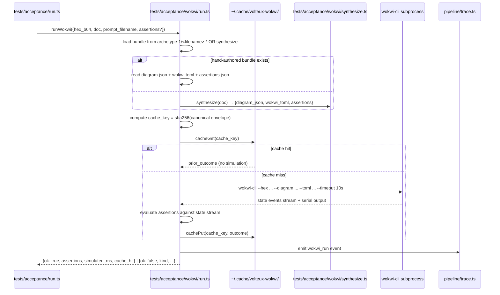

# feat: v0.5 Wokwi behavior simulation (4th acceptance axis) + eval-CI gating + residual cleanup

## Overview

Land the 4th acceptance-harness axis (behavior-correctness via Wokwi headless), promote eval-CI from honor-system to enforceable, and clear the residual deferral docket from v0.1. After v0.5, the acceptance harness measures all four axes from origin doc § Success Criteria week-7 milestone (schema-validity / compile-pass / rules-clean / behavior-correctness) and the v0.9 meta-harness has the signal it needs to optimize against.

This is a single-phase batch with 5 implementation units, intended to ship as 4-5 stacked PRs. v0.1-pipeline-io closed empirically on 2026-04-26; the orchestrator (`pipeline/index.ts`), trace writer (`pipeline/trace.ts`), cost tracker (`pipeline/cost.ts`), and acceptance harness (`tests/acceptance/run.ts`) are all on `main` and behaviorally clean. The 4th axis has been shape-prepared since Unit 8 (`PromptScore.behavior_correctness?: boolean` is already in the type). v0.5 fills it in.

End state: an operator runs `bun run compile:up &` and `bun run acceptance --with-wokwi`; the runner produces a 4-axis aggregate including a 4th axis backed by per-prompt Wokwi behavior assertions against simulated Uno + HC-SR04 + Servo hardware. The acceptance gate tightens to require ≥85% behavior-correctness on tuning. CI runs the same pipeline on every PR touching `pipeline/prompts/`, `pipeline/rules/`, `meta/`, or `schemas/` and blocks merge if any axis drops below baseline.

## Problem Frame

The acceptance harness currently scores 3 axes (schema-validity, compile-pass, rules-clean). All three are syntax / static-analysis signals — they confirm "the LLM produced a JSON document of the right shape, the sketch compiled without error, no rule fired red." None of them confirms **the sketch actually does what the user asked for**. A sketch can compile, pass every rule, and still be functionally broken: the servo could be initialized but never updated, the HC-SR04's pulseIn could read the wrong pin, the threshold logic could be inverted. With only 3 axes, those failures ship clean.

Wokwi's headless simulator runs the compiled hex against a virtualized Uno + peripherals and exposes runtime state (servo angle at timestamp, serial output, GPIO levels) that an assertion DSL can grade. This is the first time in the pipeline that we measure behavior, not structure.

Two non-obvious constraints driving the v0.5 design:

- **Per-prompt assertions are the bottleneck, not the runner.** Wokwi simulates fast (~2-5s per prompt). Authoring a meaningful behavior assertion per prompt — "servo angle reaches 90° within 3 seconds when an object enters detection range" — is hand-work that doesn't generalize across prompts. v0.5 ships hand-authored bundles for the 5 canonical archetype-1 prompts (smoke set + the canonical fixture) and a derivation rule for the rest using the document's connections graph. This split keeps the v0.5 batch tractable while still raising the empirical bar.
- **Eval-CI changes the failure mode for prompt-iteration.** Today an operator can iterate `pipeline/prompts/archetype-1-system.md` locally, run acceptance, and merge if the gate clears. After v0.5, CI runs the same gate; merging requires CI green. This means Wokwi's variance and license-token-availability become CI hard dependencies. The plan addresses both via cache-key short-circuit + an explicit `--no-wokwi` CI-only escape for documented infrastructure failures.

The residual cleanup docket is small individual items but collectively unblocks v0.9: typed `emitEvent` lets the meta-harness consume traces without per-event runtime parsing; the `__testing` namespace migration removes the last legacy reset shape; the `compile=skip` display fix and `compile:up` env-passthrough remove operator confusion that surfaced during v0.1 closure.

## Requirements Trace

- **R7** — Pipeline output includes JSON-lines traces shaped for v0.5 eval. Unit 7 shipped the writer; v0.5 extends `TraceEvent` with the `wokwi_run` variant.
- **Origin doc § Success Criteria week-7 milestone** — schema-validity ≥ 99%, compile-pass ≥ 95%, rules-clean ≥ 90%, **behavior-correctness ≥ 85%**. v0.5 ships the 4th axis; first measurement happens once Wokwi bundles land.
- **Origin doc § Eval CI policy** — "PRs touching `pipeline/prompts/`, `rules/`, `meta/`, or `schemas/` trigger eval CI. PR fails if any 4-axis score drops below baseline." v0.5 implements this as `.github/workflows/acceptance.yml`.
- **Plan 2026-04-27-001 § Deferred to Separate Tasks** — Wokwi behavior simulation + 4th axis (this batch); residual review findings #14 and #17 (this batch); per-call-site typed `emitEvent` (this batch); brace-balanced `messages` scrubber (this batch); LLM-modules `__testing` namespace migration (this batch).
- **Plan 002 § Agent-Native Gap 1 / KT-002 / AC-004** — `GateResult.errors` discriminated-union refactor — addressed in Unit 5 only if Wokwi assertions consume per-check sub-discriminators (decided below as: defer; Wokwi consumes at the gate boundary, not per-check).

## Scope Boundaries

- **No VPS deploy of the Compile API.** v0.2 territory; co-scheduled with Talia's UI integration around week 8-9.
- **No meta-harness proposer.** v0.9 territory; depends on v0.5's 4-axis signal but does not land here.
- **No UI integration of Wokwi behavior surface.** Talia's track does not show simulator state to the user; v0.5 runs Wokwi in CI/local-only.
- **No archetype 2-5 Wokwi bundles.** v1.5 territory.
- **No new orchestrator failure-kind literal.** Wokwi runs AFTER `runPipeline()` returns; failures surface at the Wokwi runner boundary as `WokwiFailureKind`, not as a `PipelineFailureKind` literal.
- **No CORS handling for the Compile API.** v1.0 territory.
- **No schema change.** R6 invariant. The `wokwi_run` TraceEvent variant extends the discriminated union but is not a schema change to `VolteuxProjectDocumentSchema`.

### Deferred to Separate Tasks

- **VPS deploy of the Compile API**: v0.2.
- **Meta-harness proposer**: v0.9.
- **Talia's UI integration of avrgirl harness output**: post-spike, separate batch on her track.
- **Archetypes 2-5 Wokwi bundles**: v1.5.
- **Cross-consistency `errors` discriminated-union refactor**: defer to v0.5+1 unless Wokwi assertions force it.
- **`fixtures/generated/archetype-1/` regeneration cadence**: separate operator workflow; not part of v0.5.

## Context & Research

### Relevant Code and Patterns

- `tests/acceptance/run.ts` — the runner the 4th axis wires into. `PromptScore.behavior_correctness?: boolean` is already shape-prepared; v0.5 populates it. Currently 1156 LOC; if Wokwi integration grows the runner past ~1300 LOC, Unit 3 extracts the frontmatter parser + scoring/aggregation into siblings (deferred from Unit 8).
- `tests/acceptance/prompts/archetype-1/{tuning,holdout}/*.txt` — 30 calibration prompts. Each gets a Wokwi bundle (canonical) or a derivation rule (the rest). Holdout files are SHA-256-fingerprinted at `tests/acceptance/holdout-fingerprints.json`; v0.5 extends the fingerprint check to include the holdout's Wokwi bundle so behavior-axis edits cannot silently violate holdout discipline.
- `pipeline/trace.ts` — Unit 7's trace writer. The 4th axis adds a new TraceEvent variant `wokwi_run` (`outcome`, `simulated_ms`, `assertion_results`, `cache_hit`, `bundle_sha256`). Conforms to the existing event-schema discipline + scrub policy; `assertion_results` carries no SDK error content, so scrub-misses are not a concern here.
- `pipeline/index.ts` — the orchestrator. **Untouched in v0.5**, except via the Unit 5 cleanup pass that retypes the `emitEvent` calls to construct fully-typed `TraceEvent` variants (eliminates the existing `as unknown as TraceEvent` cast at the writer boundary).
- `pipeline/cost.ts` — Wokwi adds a 0-cost dimension at v0.1 local-cost ($0; the simulator is local). v0.5 may add a `wokwi_runs` count field for trace summaries; no cost-rate addition needed.
- `fixtures/generated/archetype-1/*.json` — regenerated docs from v0.1 acceptance run. The Wokwi runner consumes `sketch.main_ino` from these (or from a fresh `runPipeline` call for live runs). Bundle authoring uses the canonical fixture's connections graph as the wiring source-of-truth.
- `infra/server/cache.ts` — single-envelope `JSON.stringify` precedent for SHA-256. Wokwi simulation cache key uses the same canonical-envelope rule: `sha256(JSON.stringify({hex_b64, diagram_json_sha256, wokwi_toml_sha256, assertions_sha256}))`.
- `package.json` — already pins Bun, Hono, Anthropic SDK, Zod. v0.5 adds `wokwi-cli` to devDependencies + the `acceptance:wokwi` script (or extends `acceptance` with the `--with-wokwi` flag).

### Institutional Learnings

- `docs/solutions/best-practices/c-preprocessor-modelling-in-llm-output-gates-2026-04-25.md` — REQUIRED. Apply to Wokwi behavior assertions: replicate the simulator's signal-interpretation pipeline before matching. The simulator's view of the sketch is the compiled hex executed against a virtual chip + peripherals; assertions written against the SOURCE SKETCH would drift if the sketch's variable names / loop structure differed from the runtime behavior. Wokwi assertions fire against runtime state (GPIO levels, serial output, timer values), not against source-text patterns.
- `docs/solutions/security-issues/sha256-cache-key-canonical-json-serialization-2026-04-26.md` — REQUIRED for the Wokwi runner's simulation cache. Single-envelope `JSON.stringify` over `{hex_b64, diagram_json_sha256, wokwi_toml_sha256, assertions_sha256}`. The NUL-collision class is the same hazard as the Compile API cache key.
- `docs/solutions/logic-errors/lazy-init-singleton-in-flight-promise-bun-test-isolation-2026-04-26.md` — REQUIRED for the Wokwi runner's lazy-init. The `wokwi-cli` subprocess wrapper + license-token reader is a module-level lazy-init seam. Ship the `__testing.resetX()` namespace form per the learning's forward-going prescription.

### External References

| Surface | Reference | Key takeaway |
|---|---|---|
| `wokwi-cli` | https://github.com/wokwi/wokwi-cli | Official npm distribution. Requires `WOKWI_CLI_TOKEN` env var. License: paid for CI use; free trial for individual eval. Plan must document the cost projection at v0.5 CI volume. |
| Wokwi diagram.json schema | https://docs.wokwi.com/diagram-format | Project bundle format: `version`, `parts: [{type, id, ...}]`, `connections: [[from, to, color, []]]`. Each part has a `type` (e.g. `wokwi-arduino-uno`, `wokwi-hc-sr04`, `wokwi-servo`). Mapping from VolteuxProjectDocument.components/connections to diagram.json is mechanical for archetype-1's 5-component shape. |
| Wokwi TOML config | https://docs.wokwi.com/guides/cli | `wokwi.toml` declares `[wokwi] version = 1` + `firmware = "<path-to-hex>"` + optional `elf = "<path>"` + simulation timeout. The runner constructs this per-run; not committed per-prompt. |
| Wokwi scenario assertions | https://docs.wokwi.com/guides/scenarios | YAML-shaped scenario files with `expect`/`set-control`/`wait-serial` directives. v0.5 adopts a JSON-shaped variant for tooling consistency (Zod validation; fits the canonical-envelope cache-key shape). |
| Web Serial / browser support (for cleanup item #1, the `compile:up` env fix) | N/A — server-side change | Switch to `--env-file .env` per `infra/deploy.md` v0.2 convention. |
| GitHub Actions: secret + workflow path filter | https://docs.github.com/en/actions/learn-github-actions/contexts | `WOKWI_CLI_TOKEN`, `ANTHROPIC_API_KEY`, `COMPILE_API_SECRET` go into repo secrets. Path filter matches CLAUDE.md's eval-CI policy. |

### Slack / Organizational Context

Not searched. The Wokwi adoption decision is documented in CLAUDE.md ("Behavior eval | Wokwi headless (`wokwi-cli`)"); no organizational drift.

## Key Technical Decisions

- **Wokwi CLI: `wokwi-cli` (official, npm-distributed).** Pin `wokwi-cli@^0.16` (verify latest before install). Alternatives — Wokwi Docker image, hand-rolled VS-Code-extension reuse — rejected: the Docker image adds 1.5GB to CI and the VS-Code path is unsupported as a standalone tool.

- **License: `WOKWI_CLI_TOKEN` env var, with cost projection committed in `tests/acceptance/wokwi/run.ts` header.** Token rotation policy documented in operational notes. Free trial covers Day-1 spike; CI use requires a paid plan (~$10-25/month at v0.5 volume; one full acceptance run = 30 simulations; CI budget at 5 PRs/week × 2 runs/PR × 4 weeks = ~1200 simulations/month). Token leak risk: lives in repo secrets + `.env` (gitignored); never logged. Scrub policy in `pipeline/trace.ts` already redacts `Bearer` tokens; same regex catches `WOKWI_CLI_TOKEN` if it ever appears in an error message.

- **Per-prompt Wokwi project bundles location: `tests/acceptance/wokwi/archetype-1/<prompt-no-ext>.{diagram.json,wokwi.toml,assertions.json}`.** Parallel to the prompt files. The 5 canonical bundles (`01-distance-servo`, `02-pet-bowl`, `03-wave-on-approach`, `04-doorbell-style`, `05-misspelled`) + the canonical fixture (`fixtures/uno-ultrasonic-servo`) are HAND-AUTHORED. The remaining 19 in-scope tuning + 5 holdout prompts use a derivation rule that synthesizes a bundle from the doc's `components` + `connections` graph (since archetype 1 has only 5 parts and a small wiring shape, the synthesis is mechanical). The synthesized bundles are written to `tests/acceptance/wokwi/.generated/<prompt-no-ext>.{diagram.json,wokwi.toml}` (gitignored — they're a function of the doc).

- **Behavior assertion contract: layered (state-at-timestamp + duration-only).** State assertions (e.g., `{at_ms: 2000, expect: {servo_angle: {min: 80, max: 100}}}`) catch the strongest failure modes (servo never moves, threshold inverted). Duration-only assertions (`{run_for_ms: 5000, expect: {no_crash: true}}`) catch the cheapest failure modes (sketch crashes immediately). Layered means a passing prompt clears BOTH. Regex-on-serial-output is REJECTED as primary contract (too brittle to source-text changes); allowed only as an OPTIONAL secondary assertion in hand-authored bundles.

- **Wokwi assertion DSL: JSON schema with `state` + `duration` + optional `serial_regex` fields.** Lives in `assertions.json` per bundle. Zod-validated by `tests/acceptance/wokwi/assertions.zod.ts`. Single canonical-envelope hash via `sha256(JSON.stringify(assertions))` for the simulation cache key. JSON over YAML chosen for tooling consistency (Zod, JSON.stringify, etc.).

- **4th axis gate threshold: ≥85% on tuning + ≥1/2 on holdout (matches existing 3-axis gate shape).** Tuning gate matches origin doc § Week-7 (≥85% behavior-correctness). Holdout gate matches the existing 3-axis ≥1/2 pattern. Both must hold for `bun run acceptance --with-wokwi` to exit 0.

- **Acceptance runner growth: extract to siblings if Wokwi adds >200 LOC.** `tests/acceptance/run.ts` is currently 1156 LOC. Wokwi integration adds ~150-300 LOC depending on whether assertion evaluation lives inline or in `tests/acceptance/wokwi/run.ts`. **Decision: assertion evaluation lives in a dedicated module** (`tests/acceptance/wokwi/run.ts`); only the `--with-wokwi` flag handling + per-prompt invocation + aggregate axis math live in `run.ts` (~80 LOC delta). Frontmatter parser + scoring/aggregation extraction is **deferred** — re-evaluate at v0.9 if the runner crosses 1300 LOC.

- **Eval-CI workflow: `.github/workflows/acceptance.yml` with path-filter triggered on PR.** Path filter: `pipeline/prompts/**`, `pipeline/rules/**`, `meta/**`, `schemas/**`, `tests/acceptance/wokwi/archetype-1/**`, `pipeline/index.ts`, `pipeline/repair.ts`, `pipeline/honest-gap.ts`. Workflow: spin up Compile API via the existing Dockerfile, run `bun run acceptance --with-wokwi --json`, fail PR if any axis below baseline. Secrets: `WOKWI_CLI_TOKEN`, `ANTHROPIC_API_KEY`, `COMPILE_API_SECRET` (32+ bytes). `--no-wokwi` CI-only escape for documented Wokwi infrastructure failures (escape requires explicit reviewer ack via PR comment).

- **Wokwi runner caching: cache simulation results by `sha256(JSON.stringify({hex_b64, diagram_json_sha256, wokwi_toml_sha256, assertions_sha256}))` via single-envelope.** Cache stored at `~/.cache/volteux-wokwi/<key>.json` (per-developer; not in repo). On cache hit, skip the `wokwi-cli` subprocess and replay the prior assertion-evaluation result. Re-simulating 30 prompts adds 60-150s per acceptance run; caching cuts to ~5s on warm runs (assertion evaluation only). Cache invalidation: any change to hex / diagram / toml / assertions misses cache by construction (sha256 inputs change). No TTL — hash inputs are deterministic.

- **`compile:up` env-passthrough fix folded into Unit 5 cleanup.** Switch `package.json` `compile:up` script from `-e COMPILE_API_SECRET="$COMPILE_API_SECRET"` (shell-pass-through; failed during v0.1 operator validation) to `--env-file .env` (matches `infra/deploy.md` v0.2 convention).

- **`compile=FAIL` → `compile=skip` display fix folded into Unit 5 cleanup.** `tests/acceptance/run.ts`'s per-prompt log line currently shows `compile=FAIL` for any out-of-scope outcome (compile didn't run vs compile failed). Two-line change: emit `compile=skip` when the prompt routed to out-of-scope before reaching the compile gate.

- **Per-call-site typed `emitEvent` refactor folded into Unit 5 cleanup.** `pipeline/index.ts` currently has one `as unknown as TraceEvent` cast at the writer boundary. Refactor each emit call site to construct fully-typed variants. Mechanical diff. Touches `runPipeline`, the gate-emit helpers, and the repair-attempt emit. Tests already cover all 6 event types — no new test scenarios needed; existing tests just gain the type-safe surface.

- **Brace-balanced `messages` scrubber: ship streaming JSON parser unconditionally.** Defense-in-depth for what gets persisted to disk. Implementation: replace the regex `/("messages":\s*)\[.*?\]/g` with a tiny brace-balanced extractor in `pipeline/trace.ts`. Tests: the existing scrub-policy tests in `tests/trace.test.ts` extend with nested-`[]` inputs that the regex would mis-handle.

- **`pipeline/llm/{generate,classify}.ts` `__testing` namespace migration folded into Unit 5 cleanup.** Migrate from legacy `_resetDefaultDepsForTest()` standalone form to namespace form (`__testing.resetDefaultDeps()`). Diff is small; touches `tests/llm/defaults.test.ts` and any other consumer.

- **Cross-consistency `errors` discriminated-union refactor: deferred to v0.5+1.** Wokwi assertions consume gate outcomes at the BOUNDARY (`xc.ok` vs `xc.kind`), not per-check sub-discriminators. The refactor's consumer is the v0.9 meta-harness proposer; defer until v0.9 needs it.

- **Residual review #14 (`ClassifyResult.errors`) closed in Unit 5.** Cosmetic plan-vs-impl drift. Plan said `errors: ZodIssue[]`; impl ships `errors: ReadonlyArray<string | ZodIssue>`. The ergonomic shape is the impl; update the plan reference.

- **Residual review #17 (SDK deep import) closed in Unit 5.** `@anthropic-ai/sdk/lib/transform-json-schema.js` is an internal path. Audit current SDK release notes for a public surface; if available, swap. If not, guard with a feature detection that falls back to the deep import + emits a stderr WARN.

- **`--regen-fingerprints` workflow formalization folded into Unit 5 cleanup.** Add a PR template line: "If `tests/acceptance/holdout-fingerprints.json` changes, paste the rationale + the prior fingerprints as an audit trail."

## Open Questions

### Resolved During Planning

- **Wokwi CLI choice** → `wokwi-cli` (official npm).
- **License/token storage** → `WOKWI_CLI_TOKEN` env var; repo secret in CI; `.env` locally; never logged.
- **Bundle location** → `tests/acceptance/wokwi/archetype-1/<prompt-no-ext>.{diagram.json,wokwi.toml,assertions.json}`.
- **Synthesized bundles** → `tests/acceptance/wokwi/.generated/<prompt-no-ext>.*` (gitignored).
- **Assertion contract** → layered (state-at-timestamp + duration-only); regex-on-serial allowed as optional secondary.
- **Assertion DSL** → JSON; Zod-validated.
- **4th axis gate** → ≥85% on tuning + ≥1/2 on holdout; matches existing 3-axis gate shape.
- **Runner growth threshold** → extract sibling modules if `tests/acceptance/run.ts` crosses 1300 LOC; Wokwi adds ~80 LOC to `run.ts`, so this batch stays monolithic.
- **Eval-CI workflow shape** → `.github/workflows/acceptance.yml` with path filter; `--no-wokwi` escape requires reviewer ack.
- **Simulation caching** → `sha256(JSON.stringify({hex_b64, diagram_json_sha256, wokwi_toml_sha256, assertions_sha256}))`; cache at `~/.cache/volteux-wokwi/`.
- **Cleanup item ordering** → fold into Unit 5 except for the typed `emitEvent` refactor (could equally land in any earlier unit's PR; pick by reviewer cadence).
- **Brace-balanced scrubber** → ship unconditionally; tests cover nested `[]` cases.
- **Cross-consistency `errors` refactor** → deferred to v0.9.

### Deferred to Implementation

- **Exact assertion bodies for the 5 canonical hand-authored bundles.** The plan specifies the layered contract; the actual `at_ms` values, `expect.servo_angle.min/max` ranges, and `run_for_ms` durations are calibrated empirically during Unit 2 implementation. Pick conservative ranges (servo angle ±10°; run duration 5s) and tighten if false-positives surface.
- **Synthesis rule for non-canonical bundles.** Plan specifies "mechanical from doc.components + doc.connections"; the exact mapping (which Wokwi part-type for SKU 3942 = HC-SR04, etc.) is a small SKU → wokwi-part lookup table. Author during Unit 2 against the registry.
- **CI runtime budget.** Plan estimates ~5-10 min per CI run (compile API spin-up + 30 prompts + Wokwi). If actual runtime exceeds 15 min, the workflow needs caching / matrix-split. Decide at first CI run.

## Output Structure

```
volteux/
├── tests/
│   └── acceptance/
│       ├── run.ts                              # MODIFY (Unit 3) — add --with-wokwi flag, populate behavior_correctness
│       ├── run.test.ts                         # MODIFY (Unit 3) — add --with-wokwi scenarios + 4-axis aggregate tests
│       └── wokwi/
│           ├── run.ts                          # NEW (Unit 1) — Wokwi runner; buildWokwiHarness(deps); WokwiFailureKind
│           ├── run.test.ts                     # NEW (Unit 1) — runner unit tests
│           ├── assertions.zod.ts               # NEW (Unit 1) — Zod schema for assertions.json
│           ├── synthesize.ts                   # NEW (Unit 2) — derive diagram.json + wokwi.toml from a doc
│           ├── synthesize.test.ts              # NEW (Unit 2) — synthesis unit tests
│           ├── archetype-1/                    # NEW (Unit 2) — hand-authored bundles
│           │   ├── 01-distance-servo.diagram.json
│           │   ├── 01-distance-servo.wokwi.toml
│           │   ├── 01-distance-servo.assertions.json
│           │   ├── 02-pet-bowl.{diagram.json,wokwi.toml,assertions.json}
│           │   ├── 03-wave-on-approach.{diagram.json,wokwi.toml,assertions.json}
│           │   ├── 04-doorbell-style.{diagram.json,wokwi.toml,assertions.json}
│           │   ├── 05-misspelled.{diagram.json,wokwi.toml,assertions.json}
│           │   └── canonical-fixture.{diagram.json,wokwi.toml,assertions.json}
│           └── .generated/                     # gitignored — synthesized bundles
├── pipeline/
│   ├── index.ts                                # MODIFY (Unit 5) — typed emitEvent refactor
│   ├── trace.ts                                # MODIFY (Unit 1 + Unit 5) — add wokwi_run TraceEvent variant; brace-balanced scrubber
│   ├── trace.test.ts                           # MODIFY (Unit 1 + Unit 5) — wokwi_run shape tests; nested-[] scrub tests
│   └── llm/
│       ├── generate.ts                         # MODIFY (Unit 5) — _resetDefaultDepsForTest → __testing.resetDefaultDeps
│       └── classify.ts                         # MODIFY (Unit 5) — same migration
├── .github/
│   └── workflows/
│       └── acceptance.yml                      # NEW (Unit 4) — eval-CI gating
├── package.json                                # MODIFY — add wokwi-cli devDep; add acceptance:wokwi script; fix compile:up env passthrough
├── .gitignore                                  # MODIFY (Unit 1) — add tests/acceptance/wokwi/.generated/
└── docs/plans/2026-04-27-003-feat-v05-wokwi-behavior-axis-plan.md   # THIS FILE
```

## High-Level Technical Design

> *This illustrates the intended approach and is directional guidance for review, not implementation specification.*

### Wokwi runner end-to-end



### `WokwiFailureKind` discriminated union

`"missing-bundle" | "synthesis-failed" | "cli-not-installed" | "license-missing" | "timeout" | "assertion-failed" | "transport" | "aborted"` — 8 literals + `assertNeverWokwiFailureKind` exhaustiveness guard. Justification:

| Kind | Trigger | Caller handling |
|---|---|---|
| `missing-bundle` | hand-authored bundle expected, not found | runner skip + stderr WARN; behavior_correctness = `null` for this prompt |
| `synthesis-failed` | doc structure can't synthesize a bundle (missing components, etc.) | log + skip; behavior_correctness = `null` |
| `cli-not-installed` | `wokwi-cli` binary not on PATH | exit 1 pre-flight; halt acceptance |
| `license-missing` | `WOKWI_CLI_TOKEN` env unset | exit 1 pre-flight; halt acceptance |
| `timeout` | simulation exceeded 10s | behavior_correctness = `false` (the sketch hung) |
| `assertion-failed` | simulation completed but ≥1 assertion did not match | behavior_correctness = `false`; structured assertion result in trace |
| `transport` | `wokwi-cli` subprocess crashed / 5xx from cloud / network | behavior_correctness = `null`; stderr WARN; do not gate-fail (infra) |
| `aborted` | AbortSignal fired | behavior_correctness = `null`; halt acceptance |

### `wokwi_run` TraceEvent variant

```text
{
  ts: <iso>,
  run_id: <run-id>,
  event: "wokwi_run",
  prompt_filename: <name>,
  cache_hit: boolean,
  bundle_sha256: <hex>,
  cache_key: <hex>,
  outcome: "ok" | WokwiFailureKind,
  simulated_ms: number,
  assertion_results: [
    {kind: "state", at_ms: 2000, target: "servo_angle", expected_range: [80, 100], actual: 87, passed: true},
    {kind: "duration", run_for_ms: 5000, target: "no_crash", actual: true, passed: true}
  ]
}
```

## Implementation Units

- [ ] **Unit 1: Wokwi runner core**

**Goal:** Ship `tests/acceptance/wokwi/run.ts` with `buildWokwiHarness(deps)` factory + `WokwiFailureKind` 8-literal discriminated union + `assertNeverWokwiFailureKind` + simulation cache + lazy-init `__testing.reset*` namespace + `wokwi-cli` subprocess wrapper. Add the `wokwi_run` TraceEvent variant to `pipeline/trace.ts`.

**Requirements:** R7 (TraceEvent extension); origin doc § Week-7 4-axis (this unit's runner is the workhorse).

**Dependencies:** None. Independent of Units 2-5.

**Files:**
- Create: `tests/acceptance/wokwi/run.ts` — `WokwiFailureKind` literal-union (8 literals), `WokwiResult` discriminated union, `WokwiDeps` interface, `buildWokwiHarness(deps)` factory, `runWokwi(args)` convenience, `defaultWokwiDeps()` lazy in-flight-Promise factory, `__testing.resetDefaultWokwiDeps()` reset, `assertNeverWokwiFailureKind`. **Discriminated failure kinds (Files entry, not Approach):**
  - `"missing-bundle"` — hand-authored bundle expected, not found
  - `"synthesis-failed"` — synthesis fallback failed
  - `"cli-not-installed"` — `wokwi-cli` not on PATH
  - `"license-missing"` — `WOKWI_CLI_TOKEN` env unset
  - `"timeout"` — simulation exceeded 10s
  - `"assertion-failed"` — assertion evaluation produced ≥1 failed assertion
  - `"transport"` — subprocess crash / network 5xx
  - `"aborted"` — AbortSignal fired
- Create: `tests/acceptance/wokwi/assertions.zod.ts` — Zod schema for `assertions.json` (the JSON DSL): `{state?: [{at_ms, expect: {<target>: <range-or-value>}}], duration?: [{run_for_ms, expect: {no_crash?: boolean, …}}], serial_regex?: [{pattern, must_match: boolean}]}`.
- Create: `tests/acceptance/wokwi/run.test.ts` — full unit test matrix (10+ scenarios across happy / edge / error / integration). Mocks `wokwi-cli` via dependency injection.
- Modify: `pipeline/trace.ts` — extend `TraceEvent` discriminated union with the `wokwi_run` variant (per High-Level Technical Design § wokwi_run TraceEvent variant). The variant goes through the existing scrub/canonical-envelope/append-only discipline; `assertion_results` is structured-only (no SDK error content), so scrub policy passes through without redaction.
- Modify: `pipeline/trace.test.ts` — add 3 scenarios for the `wokwi_run` variant (shape, scrub, append).
- Modify: `.gitignore` — add `tests/acceptance/wokwi/.generated/`.
- Modify: `package.json` — add `"wokwi-cli": "^0.16"` to devDependencies (verify version on install).

**Approach:**
- `defaultWokwiDeps()` reads `WOKWI_CLI_TOKEN` from env at call time; lazy in-flight Promise per the lazy-init learning. `__testing.resetDefaultWokwiDeps()` namespace form.
- `wokwi-cli` invocation uses `Bun.spawn` with explicit argv (no shell interpolation). Args: `--hex <path> --diagram <path> --toml <path> --timeout 10s --json`. The `--json` flag (verify wokwi-cli supports; if not, parse stdout). Stdout is the state event stream the assertion evaluator consumes.
- Simulation cache: `~/.cache/volteux-wokwi/<sha256-key>.json`. Cache hit replays the prior outcome verbatim; no `wokwi-cli` invocation.
- Assertion evaluator: pure function over the state stream + assertions.json. Layered evaluation (all `state` assertions must pass + all `duration` assertions must pass). `serial_regex` if present must also pass. Returns `{ok: true, results}` or `{ok: false, kind: "assertion-failed", results}` where `results` is the per-assertion outcome list.
- License pre-flight: if `WOKWI_CLI_TOKEN` is unset, runner returns `{ok: false, kind: "license-missing"}` immediately without invoking `wokwi-cli`. Acceptance runner (Unit 3) treats this as a halt signal in non-`--no-wokwi` mode.

**Patterns to follow:**
- `pipeline/llm/generate.ts` — `buildGenerator(deps)` factory pattern + lazy in-flight Promise; mirror exactly.
- `pipeline/gates/compile.ts` — `CompileGateFailureKind` discriminated union shape; hyphenated lowercase literals matching wire-contract style.
- `infra/server/cache.ts` — `__testing.resetMemoizedHash()` namespace pattern.
- `docs/solutions/security-issues/sha256-cache-key-canonical-json-serialization-2026-04-26.md` — single-envelope `JSON.stringify` for cache key.
- `docs/solutions/logic-errors/lazy-init-singleton-in-flight-promise-bun-test-isolation-2026-04-26.md` — three-test contract for in-flight Promise.
- `docs/solutions/best-practices/c-preprocessor-modelling-in-llm-output-gates-2026-04-25.md` — assertions fire against runtime state, not source-text patterns.

**Test scenarios:**
- *Happy path (mocked)* — `runWokwi({hex_b64: <known-good>, bundle: <hand-authored>})` returns `{ok: true, assertions: [pass×N], simulated_ms: <number>, cache_hit: false}` and emits one `wokwi_run` trace event.
- *Happy path (cache hit)* — second call with identical inputs returns `{ok: true, ..., cache_hit: true}` without invoking `wokwi-cli` (mock asserts zero subprocess invocations).
- *Edge case (cache key collision)* — NUL-byte injection into hex_b64 produces a distinct cache key vs the same hex_b64 with NUL in diagram.json (canonical-envelope test mirroring the cache-key learning's prevention #3).
- *Edge case (assertion evaluator: state pass)* — state assertion `{at_ms: 2000, expect: {servo_angle: {min: 80, max: 100}}}` against a state stream where servo_angle is 87 at t=2000 → pass.
- *Edge case (assertion evaluator: state fail)* — same assertion against a state stream where servo_angle is 0 at t=2000 → fail; result carries actual value.
- *Edge case (assertion evaluator: duration pass)* — duration assertion `{run_for_ms: 5000, expect: {no_crash: true}}` against a stream that runs 5s without panic → pass.
- *Edge case (assertion evaluator: duration fail)* — same against a stream that crashes at t=2000 → fail.
- *Error path (cli-not-installed)* — `wokwi-cli` not on PATH → `{ok: false, kind: "cli-not-installed"}` after pre-flight.
- *Error path (license-missing)* — `WOKWI_CLI_TOKEN` unset → `{ok: false, kind: "license-missing"}`.
- *Error path (timeout)* — mock subprocess that runs >10s → `{ok: false, kind: "timeout"}`.
- *Error path (transport)* — mock subprocess crashes → `{ok: false, kind: "transport"}`.
- *Error path (missing-bundle)* — caller passes `prompt_filename` with no hand-authored bundle and synthesis disabled → `{ok: false, kind: "missing-bundle"}`.
- *Edge case (synthesis fallback)* — caller passes `prompt_filename` with no hand-authored bundle but synthesis enabled + valid doc → bundle synthesized + simulation runs.
- *Edge case (abort)* — pre-fired AbortSignal → `{ok: false, kind: "aborted"}`.
- *Exhaustiveness guard* — TypeScript fails to compile a sibling test that adds a literal to `WokwiFailureKind` without updating the switch (`// @ts-expect-error`).
- *Lazy-init contract* — three tests per the lazy-init learning: object-identity dedup under `Promise.all`, sync-promise-reference, reset evicts.
- *Trace event shape* — `wokwi_run` event emitted with all required fields; `bundle_sha256` deterministic given identical bundle inputs.

**Verification:**
- `bun test tests/acceptance/wokwi/run.test.ts` is green with mocked `wokwi-cli`.
- `bunx tsc --noEmit` clean.
- A manual `bun run -e 'import {runWokwi} from "./tests/acceptance/wokwi/run.ts"; ...'` invocation against a real `wokwi-cli` install + a hand-authored bundle produces a passing simulation outcome.

---

- [ ] **Unit 2: Per-prompt Wokwi project bundles + synthesis fallback**

**Goal:** Author 5 hand-authored bundles for the canonical archetype-1 prompts + the canonical fixture, plus a synthesis rule (`tests/acceptance/wokwi/synthesize.ts`) that derives bundles for the remaining 19+5 prompts mechanically from each doc's `components` + `connections` graph.

**Requirements:** Origin doc § Week-7 4-axis (without bundles, the runner has nothing to grade).

**Dependencies:** Unit 1 (consumes `tests/acceptance/wokwi/run.ts` + `assertions.zod.ts`).

**Files:**
- Create: `tests/acceptance/wokwi/archetype-1/01-distance-servo.diagram.json` — 5-component diagram (Uno + HC-SR04 + Servo + power + ground rails).
- Create: `tests/acceptance/wokwi/archetype-1/01-distance-servo.wokwi.toml` — declares `firmware = "<runtime-injected>"` + simulation timeout 10s.
- Create: `tests/acceptance/wokwi/archetype-1/01-distance-servo.assertions.json` — layered assertions: `{state: [{at_ms: 2000, expect: {servo_angle: {min: 0, max: 180}}}], duration: [{run_for_ms: 5000, expect: {no_crash: true}}]}` (calibrate during impl).
- Create: `tests/acceptance/wokwi/archetype-1/{02..05}-*.{diagram.json,wokwi.toml,assertions.json}` — 4 more canonical bundles.
- Create: `tests/acceptance/wokwi/archetype-1/canonical-fixture.{diagram.json,wokwi.toml,assertions.json}` — bundle for the canonical fixture (`fixtures/uno-ultrasonic-servo.json`).
- Create: `tests/acceptance/wokwi/synthesize.ts` — `synthesizeBundle(doc): {diagram_json, wokwi_toml, assertions}`. Maps `doc.components` (SKU-keyed) to Wokwi part types via a small lookup (`SKU_TO_WOKWI_PART`); maps `doc.connections` to Wokwi connections; emits a default duration-only assertion (`{run_for_ms: 5000, expect: {no_crash: true}}`) since the synthesizer can't infer behavior intent.
- Create: `tests/acceptance/wokwi/synthesize.test.ts` — 8+ scenarios.

**Approach:**
- Hand-authored bundles use the canonical fixture's wiring as the template. Each prompt file's bundle is byte-similar except for the assertion ranges (some prompts emphasize a specific behavior — e.g., "wave at 90°" vs "doorbell flag").
- Synthesizer is a deterministic mapping function, no LLM. SKU lookup table:
  - `50` (Uno) → `wokwi-arduino-uno`
  - `3942` (HC-SR04) → `wokwi-hc-sr04`
  - `169` (SG90 servo) → `wokwi-servo`
  - additional rail/power components map to `wokwi-vcc` / `wokwi-gnd`
- Synthesizer's default assertion is duration-only — the cheapest behavior signal that catches "the sketch crashes" but not "the sketch is correct." That's intentional: hand-authored bundles exist for prompts where stronger assertions are warranted.
- Holdout bundles: 5 hand-authored OR synthesized — decide per-prompt during impl. The holdout fingerprint at `tests/acceptance/holdout-fingerprints.json` extends to include the bundle SHA-256 if hand-authored.

**Patterns to follow:**
- `tests/acceptance/prompts/archetype-1/tuning/*.txt` — file-naming convention parallels.
- `components/registry.ts` — SKU-to-metadata lookup; the synthesizer's SKU-to-wokwi-part table is a sibling concept.

**Test scenarios:**
- *Synthesizer happy path* — canonical fixture doc → bundle that loads cleanly into the runner.
- *Synthesizer: SKU not in lookup* → `synthesis-failed` (caller's `runWokwi` surfaces as that kind).
- *Synthesizer: missing connection target* → handled gracefully.
- *Hand-authored 01-distance-servo bundle* — runner returns `{ok: true}` against a known-good hex.
- *Hand-authored 02-pet-bowl bundle* — runner returns `{ok: true}`.
- *Hand-authored 03-wave-on-approach bundle* — runner returns `{ok: true}`.
- *Hand-authored 04-doorbell-style bundle* — runner returns `{ok: true}`.
- *Hand-authored 05-misspelled bundle* — runner returns `{ok: true}` (sketch shape is identical to 01).
- *Canonical fixture bundle* — runner returns `{ok: true}`.
- *Bundle SHA-256 stability* — the same bundle emits the same `bundle_sha256` across runs (canonical-envelope discipline).
- *Holdout bundle fingerprint* — fingerprint check extends to hand-authored holdout bundles; modifying any byte fails the fingerprint check.

**Verification:**
- `bun test tests/acceptance/wokwi/synthesize.test.ts` green.
- All 5 hand-authored bundles + canonical-fixture bundle run cleanly through `runWokwi` against a real `wokwi-cli`.
- Synthesizer produces valid bundles for all 30 calibration prompts (verified by feeding each `fixtures/generated/archetype-1/*.json` doc through `synthesizeBundle`).

---

- [ ] **Unit 3: 4th axis wired into `tests/acceptance/run.ts`**

**Goal:** Add `--with-wokwi` flag to the acceptance runner. Per-prompt `runWokwi` invocation populates `PromptScore.behavior_correctness`. Aggregate gate logic extends to 4 axes. Per-prompt log line includes `behavior=ok|fail|skip|null`.

**Requirements:** R7; origin doc § Week-7 4-axis gate.

**Dependencies:** Unit 1 (the runner) + Unit 2 (the bundles).

**Files:**
- Modify: `tests/acceptance/run.ts` — add `--with-wokwi` flag handling; per-prompt invoke `runWokwi(...)` after `runPipeline(...)` returns ok-true; populate `behavior_correctness` field; extend `gates_pass` aggregation; per-prompt log line and JSON output reflect 4-axis.
- Modify: `tests/acceptance/run.test.ts` — add 8+ scenarios covering `--with-wokwi` flag, behavior axis aggregation, 4-axis gate logic, `behavior=skip` for out-of-scope, `behavior=null` for runner-failure cases.

**Approach:**
- `--with-wokwi` is opt-in. Without the flag, `behavior_correctness` stays `undefined` and the existing 3-axis gate runs unchanged.
- With the flag, after `runPipeline()` returns ok-true (out-of-scope and pipeline-failure prompts skip Wokwi entirely), invoke `runWokwi({hex_b64, doc, prompt_filename, ...})`. Map outcome to `behavior_correctness`:
  - `runWokwi` returns `{ok: true}` → `behavior_correctness: true`
  - `runWokwi` returns `{ok: false, kind: "assertion-failed"}` or `"timeout"` → `behavior_correctness: false`
  - `runWokwi` returns `{ok: false, kind: "transport" | "missing-bundle" | ...}` → `behavior_correctness: null` (infrastructure issue; doesn't gate-fail on its own)
- Aggregate gate logic: tuning gate adds `behavior_correctness_rate >= 0.85` (excluding null). Holdout gate adds `behavior_passed >= 1` (mirrors compile_pass shape). Both must hold.
- `--no-wokwi` flag: explicit opt-out for CI escape (skip Wokwi entirely). Mutually exclusive with `--with-wokwi`. Default behavior (neither flag) is `--no-wokwi` (unchanged from v0.1).

**Patterns to follow:**
- `tests/acceptance/run.ts` existing aggregation logic (`schema_validity_rate`, `compile_pass_rate`, etc.) — mirror for the 4th axis.
- The existing `oos_excluded` exclusion pattern for compile-pass denominator — same applies to behavior_correctness denominator.

**Test scenarios:**
- *Happy path (mocked, --with-wokwi)* — 25 prompts all pass behavior; aggregate `behavior_correctness_rate = 1.0`.
- *Edge case (out-of-scope behavior=skip)* — out-of-scope prompts log `behavior=skip` and are excluded from the denominator.
- *Edge case (runner-failure behavior=null)* — Wokwi returns `transport` → `behavior=null`; excluded from denominator; surface as stderr WARN.
- *Error path (gate fails: behavior below threshold)* — 5 of 25 prompts behavior-fail → rate = 20/25 = 80% < 85% → exit 2; stderr names the failing axis.
- *Error path (license-missing pre-flight)* — `--with-wokwi` without `WOKWI_CLI_TOKEN` → exit 1 before iterating prompts.
- *Edge case (--no-wokwi explicit)* — runner skips Wokwi entirely; aggregate is 3-axis only; `behavior_correctness` undefined in output.
- *Default (no flag)* — unchanged from v0.1; 3-axis gate.
- *Edge case (--with-wokwi --no-wokwi conflict)* — runner errors with "mutually exclusive flags" before iterating.
- *Holdout 4-axis* — holdout gate requires `behavior_passed >= 1` AND existing schema/compile thresholds.

**Verification:**
- `bun test tests/acceptance/run.test.ts` green (3-axis tests still pass; 4-axis tests added).
- `bun run acceptance --with-wokwi` against a real Compile API + Anthropic key + Wokwi token + the hand-authored bundles produces 4-axis output.
- `bun run acceptance` (no flags) produces unchanged 3-axis output.

---

- [ ] **Unit 4: Eval-CI workflow**

**Goal:** Ship `.github/workflows/acceptance.yml` triggered on PR with a path filter matching CLAUDE.md's eval-CI policy. Runs `bun run acceptance --with-wokwi --json`; fails the PR if any axis below baseline. Provides `--no-wokwi` CI escape for documented Wokwi infrastructure failures (requires reviewer ack).

**Requirements:** Origin doc § Eval CI policy.

**Dependencies:** Units 1-3.

**Files:**
- Create: `.github/workflows/acceptance.yml` — workflow definition.
- Modify: `package.json` — ensure `acceptance` script accepts `--with-wokwi`/`--no-wokwi`; add `compile:up:ci` variant if needed for non-interactive Docker startup.
- Create: `.github/PULL_REQUEST_TEMPLATE.md` (or modify if exists) — add lines for "Have you run `bun run acceptance --with-wokwi` locally? Paste the aggregate axis line." + "If `tests/acceptance/holdout-fingerprints.json` changed, paste rationale."

**Approach:**
- Workflow triggers: `pull_request` with `paths: [pipeline/prompts/**, pipeline/rules/**, meta/**, schemas/**, tests/acceptance/wokwi/archetype-1/**, pipeline/index.ts, pipeline/repair.ts, pipeline/honest-gap.ts, .github/workflows/acceptance.yml]`.
- Workflow steps: checkout, setup Bun, install deps, build Compile API Docker image, start container in background, wait for `/api/health`, run `bun run acceptance --with-wokwi --json > acceptance-result.json`, parse + post comment with the aggregate axis line, fail step if exit code != 0.
- Secrets: `WOKWI_CLI_TOKEN`, `ANTHROPIC_API_KEY`, `COMPILE_API_SECRET` from `${{ secrets.* }}`.
- `--no-wokwi` CI escape: workflow checks PR labels; if PR is labeled `acceptance:no-wokwi`, runs without Wokwi + posts a comment "Wokwi skipped (label-driven). Reviewer ack required."
- Comment shape: aggregate axis line + per-axis pass/fail + a link to the failing prompts' traces (uploaded as workflow artifacts).

**Patterns to follow:**
- Standard GitHub Actions Bun setup (`oven-sh/setup-bun@v1`).
- Compile API local-Docker pattern that v0.1 uses (`bun run compile:up &` + `--env-file`).

**Test scenarios:**
- *Workflow syntax valid* — `actionlint` or equivalent passes.
- *Path filter triggers correctly* — PR touching `pipeline/prompts/archetype-1-system.md` triggers workflow.
- *Path filter does NOT trigger on UI work* — PR touching `app/src/**` skips workflow.
- *Secret presence pre-flight* — workflow fails fast with a clear message if any of the 3 secrets is missing.
- *Comment shape* — aggregate axis line is human-readable.
- *--no-wokwi label behavior* — labeled PR runs 3-axis only + posts the "Wokwi skipped" comment.

**Verification:**
- A test PR that intentionally regresses a prompt (e.g., breaks `pipeline/prompts/archetype-1-system.md`) shows red CI.
- A test PR with the `acceptance:no-wokwi` label runs successfully on 3 axes.
- Workflow runtime is ≤15 min; if longer, decide caching/matrix-split.

---

- [ ] **Unit 5: Cleanup pass (10 residual items from v0.1)**

**Goal:** Clear the residual deferral docket so v0.9 starts from a clean baseline.

**Requirements:** Plan 2026-04-27-001 § Documentation / Operational Notes (deferred items).

**Dependencies:** None for most items; some items couple with Units 1-4 (e.g., the typed-emitEvent refactor must land alongside Unit 1's `wokwi_run` variant).

**Files:**
- Modify: `package.json` — `compile:up` script switches from `-e COMPILE_API_SECRET="$COMPILE_API_SECRET"` to `--env-file .env`. Add `compile:up:ci` for CI's non-interactive variant.
- Modify: `tests/acceptance/run.ts` — `compile=FAIL` → `compile=skip` for skipped-compile cases (out-of-scope outcomes).
- Modify: `pipeline/index.ts` — typed `emitEvent` refactor; eliminate the `as unknown as TraceEvent` cast at the writer boundary; each call site constructs its variant.
- Modify: `pipeline/trace.ts` — replace the regex `/("messages":\s*)\[.*?\]/g` with a brace-balanced extractor.
- Modify: `pipeline/trace.test.ts` — add 3 scenarios for nested-`[]` request body fragments that the regex would mis-handle.
- Modify: `pipeline/llm/generate.ts` + `tests/llm/defaults.test.ts` — migrate from `_resetDefaultDepsForTest()` standalone form to `__testing.resetDefaultDeps()` namespace form.
- Modify: `pipeline/llm/classify.ts` + (any consumer test files) — same migration.
- Modify: (residual #14) Documentation / plan reference for `ClassifyResult.errors` shape — single comment fix in any place the plan-vs-impl drift surfaces. Locate via grep.
- Modify: (residual #17) `pipeline/llm/sdk-helpers.ts` — audit current Anthropic SDK release notes for a public surface replacing `@anthropic-ai/sdk/lib/transform-json-schema.js`. If available, swap. If not, guard with a `try { import("…/lib/transform-json-schema.js") } catch { ... fallback }` + stderr WARN.
- Modify: `.github/PULL_REQUEST_TEMPLATE.md` — add the holdout-fingerprint audit-trail line.

**Approach:**
- Each item is a small, scoped diff. Land items individually OR fold into a single cleanup PR.
- Typed `emitEvent` is the largest mechanical diff; covered by existing tests.
- Brace-balanced scrubber: tiny extractor function. Unit tests prove the regex would have mis-handled `{"messages": [{"content": "[1, 2, 3]"}]}` (nested `[`) but the extractor handles it.
- `__testing` namespace migration: one-line addition + remove the standalone export. Tests update import.
- SDK deep-import: best-effort swap; if the public surface doesn't exist, the guard is the deliverable.

**Patterns to follow:**
- `infra/server/cache.ts` — `__testing` namespace pattern.
- `pipeline/llm/sdk-helpers.ts` — existing extractor functions.

**Test scenarios:**
- *compile:up env passthrough* — `bun run compile:up` (without exporting `COMPILE_API_SECRET`) starts the container successfully when `.env` has the secret.
- *compile=skip display* — runner output for an out-of-scope prompt shows `compile=skip` (not `compile=FAIL`).
- *Typed emitEvent: tsc clean* — `bunx tsc --noEmit` passes without the `as unknown as TraceEvent` cast.
- *Brace-balanced scrubber: nested-[] case* — input `{"messages": [{"content": "[1,2,3]"}]}` is fully redacted (regex would have stopped at the first `]`).
- *Brace-balanced scrubber: existing scenarios pass* — all v0.1 scrub-policy scenarios still pass.
- *__testing namespace migration: tests pass* — `tests/llm/defaults.test.ts` imports from `__testing.resetDefaultDeps()` and is green.
- *Residual #14: tests pass* — no test relies on the plan-vs-impl shape difference.
- *Residual #17: tsc clean either way* — feature-detected import path works with the current SDK; tsc passes.

**Verification:**
- All Unit-5 changes pass `bun test tests/`.
- `bunx tsc --noEmit` clean (no `as unknown as` casts in `pipeline/index.ts`).
- `bun run compile:up` works without exporting env vars manually (loads from `.env`).

## System-Wide Impact

- **Interaction graph:** New module `tests/acceptance/wokwi/run.ts` invoked from `tests/acceptance/run.ts` per-prompt when `--with-wokwi` set. New `wokwi_run` TraceEvent variant emitted from the Wokwi runner. New CI workflow at `.github/workflows/acceptance.yml`. Unit 5 cleanup touches `pipeline/index.ts`, `pipeline/trace.ts`, `pipeline/llm/{generate,classify}.ts`, `package.json`, and `tests/acceptance/run.ts`.
- **Error propagation:** `WokwiFailureKind` failures surface at the runner boundary; non-fatal classes (`transport`, `missing-bundle`, `synthesis-failed`) become `behavior_correctness: null` in `PromptScore` + stderr WARN; fatal classes (`license-missing`, `cli-not-installed`) halt acceptance. `runPipeline` is unchanged — Wokwi runs after it returns.
- **State lifecycle risks:** Wokwi simulation cache lives at `~/.cache/volteux-wokwi/` (per-developer; not shared across CI runs by default). CI cache miss is the default; warm cache on a per-repo Actions cache is a v0.5+1 optimization. Synthesized bundles at `tests/acceptance/wokwi/.generated/` are gitignored — they regenerate on each run.
- **API surface parity:** No schema change. `TraceEvent` discriminated union extends but does not break existing consumers (additive). `PromptScore` adds `behavior_correctness?: boolean` (already shape-prepared). New `tests/acceptance/wokwi/*.ts` is internal; no external consumers.
- **Integration coverage:** The 4-axis acceptance gate is the cross-unit integration coverage. Unit 1's mocks prove the runner logic; the live `--with-wokwi` run against real bundles is the system-wide signal.
- **Unchanged invariants:** `schemas/document.zod.ts` unchanged. `pipeline/index.ts`'s `runPipeline` API unchanged. `pipeline/cost.ts` unchanged (Wokwi cost is $0). `components/registry.ts` unchanged (the synthesizer's SKU-to-wokwi-part lookup is a sibling, not a registry edit).

## Risks & Dependencies

| Risk | Mitigation |
|---|---|
| `wokwi-cli` API drift between plan time and install time | Pin `wokwi-cli@^0.16` (verify on first install). Smoke-test with the canonical fixture bundle before completing Unit 1. |
| Wokwi license-token expiry / revocation | `WOKWI_CLI_TOKEN` rotation is documented in operational notes; CI pre-flight catches missing/invalid token. Free-tier covers Day-1 spike; paid plan kicks in for CI. |
| Wokwi simulation flakiness (timing-sensitive assertions) | Layered contract (state + duration) is robust to small timing variance. Conservative ranges in hand-authored assertions (servo angle ±10°). Cache short-circuits successful runs so flakiness only hits cold paths. |
| Wokwi simulation cost at v0.5 CI volume | Estimated ~1200 simulations/month at 5 PRs/week × 2 runs/PR. Cache hits dominate after first run per bundle. Cost projection: $10-25/month. |
| Synthesizer mis-maps a SKU → wrong simulation | Lookup table is small (5 SKUs for archetype 1); reviewer audits during Unit 2 PR. Unknown SKUs surface as `synthesis-failed` (no silent miss). |
| Eval-CI runtime exceeds 15 min | Initial run measured at first CI invocation. If exceeded, options: cache simulation results across CI runs (Actions cache); matrix-split tuning vs holdout; reduce timeout-per-prompt. |
| Eval-CI escape (`--no-wokwi` label) is abused | PR template requires reviewer ack; label removal triggers re-run. Audit trail in PR comments. |
| Cross-consistency `errors` refactor blocks Wokwi | Decision: defer. Wokwi consumes at gate boundary, not per-check. If a Wokwi assertion needs per-check sub-discriminators, escalate to a v0.5+1 micro-PR. |
| Brace-balanced scrubber regression vs regex | Existing scrub-policy tests cover the easy cases; new tests cover the nested-`[]` case. Side-by-side comparison output for first integration run. |
| Holdout fingerprint expansion (now includes bundles) | Editing a hand-authored holdout bundle without rotating fingerprints breaks the gate. PR template line + `--regen-fingerprints` workflow formalization in Unit 5 covers the legitimate refresh path. |
| `wokwi-cli` subprocess hangs (no SIGINT response) | 10s wall-clock timeout via `setTimeout` + `subprocess.kill("SIGKILL")`. Surfaces as `kind: "timeout"`. |
| Synthesized bundle for an in-scope prompt fails Wokwi | Surface as `behavior_correctness: false` (the doc compiled but doesn't behave). Calibration cycle: hand-author the bundle for that prompt OR investigate the doc shape. |
| Unit 5 cleanup item churn (10 small items) | Land items individually if review cadence prefers; otherwise one cleanup PR. Each item has independent test coverage. |

## Documentation / Operational Notes

- **Updates to `docs/PLAN.md` and `CLAUDE.md`:** None in this batch. The Wokwi adoption decision is already documented in CLAUDE.md ("Behavior eval | Wokwi headless"). The eval-CI policy is already in CLAUDE.md and `docs/PLAN.md`; v0.5 implements it.
- **Wokwi license rotation policy:** `WOKWI_CLI_TOKEN` rotates quarterly. Repo secret + `.env` (gitignored) are the only persistence sites. If leaked, rotate via wokwi.com dashboard + update both. Never logged; scrubbed by `pipeline/trace.ts`'s Bearer regex.
- **Cost projection:**
  - Local acceptance run with Wokwi: $1.65 (Anthropic) + $0 (local Compile API) + $0 (Wokwi simulator runtime) = **$1.65 per cold run; $0.85 per warm run** (Wokwi cache hits + Compile API cache hits).
  - CI per-PR: ~$1.65-$2.00 depending on cache state. Estimated 5 PRs/week × $1.80 avg = ~$9/week ≈ **$36/month Anthropic + $10-25/month Wokwi license = ~$45-60/month total CI cost.**
- **PR-template additions:**
  - "Have you run `bun run acceptance --with-wokwi` locally? Paste the aggregate axis line." (replaces the v0.1 line that referenced 3-axis only).
  - "If `tests/acceptance/holdout-fingerprints.json` changed, paste rationale + the prior fingerprints as an audit trail."
- **Operational sequence for v0.5 PRs:**
  1. Unit 1 (Wokwi runner core) — lands first.
  2. Unit 2 (bundles + synthesizer) — lands second; depends on Unit 1's interface.
  3. Unit 3 (4th axis wired into runner) — lands third; depends on Units 1-2.
  4. Unit 4 (eval-CI workflow) — lands fourth; depends on Unit 3 to be working.
  5. Unit 5 (cleanup pass) — can land in parallel with any of the above; folds into the most contextually-relevant PR OR ships standalone.

## Sources & References

- **Predecessor plan:** [docs/plans/2026-04-27-001-feat-v01-pipeline-units-6-7-8-plan.md](2026-04-27-001-feat-v01-pipeline-units-6-7-8-plan.md) (Units 6-8 just shipped; § Deferred to Separate Tasks names the v0.5 cleanup items).
- **Origin design:** [docs/PLAN.md](../PLAN.md) (§ Pipeline Architecture; § Success Criteria week-7 milestone; § Eval CI policy).
- **Track ownership and conventions:** [CLAUDE.md](../../CLAUDE.md).
- **Compound learnings (REQUIRED reading per Unit):**
  - Unit 1: [docs/solutions/logic-errors/lazy-init-singleton-in-flight-promise-bun-test-isolation-2026-04-26.md](../solutions/logic-errors/lazy-init-singleton-in-flight-promise-bun-test-isolation-2026-04-26.md) + [docs/solutions/security-issues/sha256-cache-key-canonical-json-serialization-2026-04-26.md](../solutions/security-issues/sha256-cache-key-canonical-json-serialization-2026-04-26.md).
  - Unit 1 + 2: [docs/solutions/best-practices/c-preprocessor-modelling-in-llm-output-gates-2026-04-25.md](../solutions/best-practices/c-preprocessor-modelling-in-llm-output-gates-2026-04-25.md) (assertions fire against runtime state, not source-text patterns).
- **Existing code consumed:**
  - `tests/acceptance/run.ts` (3-axis aggregator + shape-prepared `behavior_correctness?: boolean` slot).
  - `pipeline/trace.ts` (TraceEvent discriminated union + scrub policy + canonical-envelope hashes).
  - `pipeline/index.ts`, `pipeline/cost.ts`, `pipeline/cli.ts` (orchestrator).
  - `infra/server/cache.ts` (`__testing` namespace pattern; canonical-envelope precedent).
  - `components/registry.ts` (SKU lookup; consumed by the synthesizer's SKU-to-wokwi-part table).
- **Wokwi documentation:**
  - https://github.com/wokwi/wokwi-cli (CLI source + README).
  - https://docs.wokwi.com/diagram-format (project bundle schema).
  - https://docs.wokwi.com/guides/cli (TOML config).
  - https://docs.wokwi.com/guides/scenarios (assertion patterns; v0.5 adapts to JSON DSL).
- **GitHub Actions:**
  - https://docs.github.com/en/actions/learn-github-actions/contexts (secret + path-filter).
