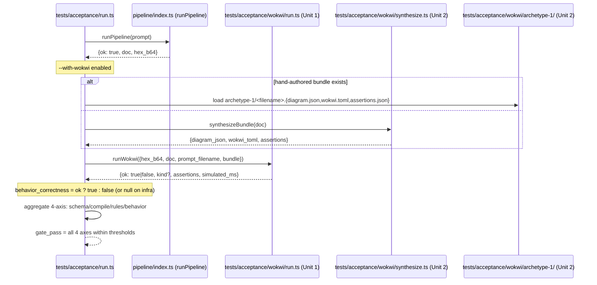
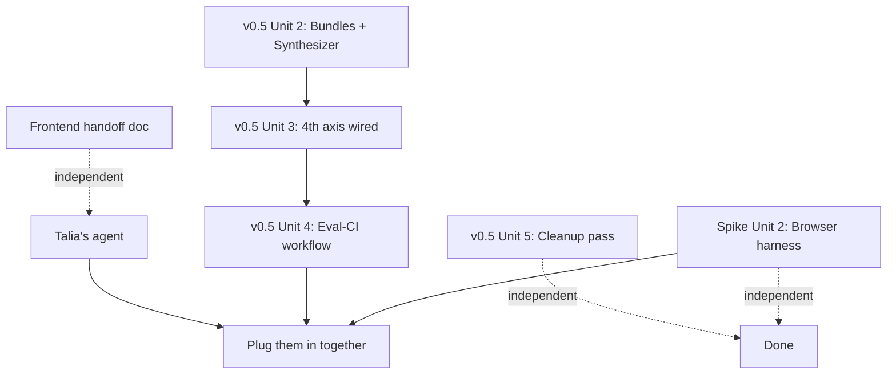

# feat: finish v0.5 (Wokwi Units 2-5) + spike Unit 2 (browser harness) + frontend integration

## Overview

Close out v0.5 (Wokwi behavior simulation as the 4th acceptance axis + eval-CI gating + residual cleanup) and the v0 Uno flash spike (browser harness + cross-platform validation + spike report), THEN coordinate Talia's frontend integration of both surfaces into `app/src/components/FlashModal.tsx` and a new acceptance-summary surface. After this batch, both v0 demo blockers are resolved (4-axis acceptance gate measurable; flash path empirically validated) and Talia's UI consumes both Track 2 surfaces cleanly.

This is a multi-track batch:

- **Track 2 (Kai, this plan's primary scope):** v0.5 Units 2-5 (4 PRs stacked); spike Unit 2 (browser harness scaffold + report template; 1 PR). Tracks the open PRs #11/#13/#14 from the previous batch.
- **Track 1 (Talia, via the frontend agent):** Integration handoff documented in `docs/handoffs/2026-04-26-frontend-coordination.md`. Her agent picks up the handoff and lands the UI integration in a separate PR on `feat/v0-flash-frontend-integration`.
- **Plug-them-in-together (joint):** Final integration verification — `bun run acceptance --with-wokwi` clears the 4-axis gate AND the flash path runs end-to-end through Talia's `FlashModal.tsx` against a real Uno. Joint signoff PR removes the CLAUDE.md + docs/PLAN.md flash-API hedge language.

End state: v0 demo gate is unblocked. v0.9 meta-harness has 4-axis signal to optimize. The friend-demo path (week 10-12) is structurally complete; remaining work is calibration / polish.

## Problem Frame

After the previous batch, `feat/v0-uno-flash-spike` has Unit 1 (harness scaffold; PR #13) and `feat/v05-wokwi-behavior-axis` has Unit 1 (Wokwi runner core; PR #14). Each is a foundational layer — neither is end-to-end usable yet:

- Wokwi runner without bundles + 4th-axis wiring + CI gating cannot grade behavior on real prompts. Acceptance still runs 3-axis; v0 § Week-7 gate (≥85% behavior-correctness) is unmeasurable.
- Spike harness without browser path cannot ship a v0 friend-demo flash; the Uno flash UX requires browser + Web Serial because beginners don't have terminal access. Hardware testing of the Bun harness validates avrgirl-arduino's STK500v1 transfer; the BROWSER side is what proves the v0 UX.
- Talia's `FlashModal.tsx` currently runs a fake-flash placeholder. The spike harness's `SpikeStepEvent` + `SpikeFailureKind` exports are the integration handoff surface; her agent wires them up.

Three coordination constraints:

1. **Wokwi work is sequential within v0.5.** Unit 2 (bundles) feeds Unit 3 (wiring); without bundles, the 4th axis has nothing to grade. Unit 4 (CI workflow) depends on Unit 3 (the workflow runs `--with-wokwi`). Unit 5 (cleanup) is independent and can land anywhere.
2. **Spike Unit 2 ships a SCAFFOLD; hardware results land separately.** The browser harness file (`app/spike/flash.html` + `app/spike/flash.js`) is code; Kai's hands-on testing produces the per-platform results that get committed as `docs/spikes/2026-04-26-avrgirl-spike.md`. The plan ships the scaffold + a report template; the actual report is filled in post-hardware-test.
3. **Frontend integration is Talia's.** The plan's job is to produce a clean handoff doc. The frontend agent reads that handoff, lands her PR, and the joint signoff happens after both PRs land.

## Requirements Trace

- **R1, R2, R3, R4** — already met by v0.1; this batch makes them measurable end-to-end (4-axis gate + UI integration).
- **R7** — Pipeline output includes JSON-lines traces shaped for v0.5 eval. Unit 7 shipped the writer + Unit 1 of v0.5 added the `wokwi_run` variant; this batch wires it into the runner + CI consumption.
- **Origin doc § Week-7 milestone** — schema-validity ≥ 99%, compile-pass ≥ 95%, rules-clean ≥ 90%, behavior-correctness ≥ 85%. Units 2 + 3 + 4 ship the measurement; Unit 5 polishes.
- **CLAUDE.md § Critical risk** — browser-direct Uno flash is the v0 go/no-go. Spike Unit 2 ships the browser harness; hardware results determine PASS/re-plan.
- **CLAUDE.md § Track ownership (locked)** — Talia owns "WebUSB flash UX." The frontend coordination doc is the formal handoff.
- **Plan 2026-04-27-003 § Implementation Units** — Units 2-5 of v0.5 are this batch's Track 2 scope.
- **Plan 2026-04-27-002 § Implementation Units** — spike Unit 2 is this batch's spike scope.

## Scope Boundaries

- **No new backend module beyond what v0.5 / spike plans already specified.** This plan is execution of those plans + coordination, not new design.
- **No schema change.** R6 invariant.
- **No VPS deploy of the Compile API.** v0.2 territory.
- **No meta-harness proposer.** v0.9 territory.
- **No archetype 2-5 Wokwi bundles.** v1.5 territory; v0.5 bundles cover archetype 1 only.
- **No backend-driven UI changes.** Talia owns `app/`; Track 2 produces the integration handoff doc, not the UI patches.
- **Joint signoff PR is a SEPARATE PR after this batch lands.** Removes flash-API hedge language from CLAUDE.md + docs/PLAN.md; requires Talia + Kai signatures.
- **Hardware testing of the spike is NOT in this batch.** Kai does that hands-on with the Uno; Unit 2 scaffolds the harness + report template only.

### Deferred to Separate Tasks

- **Joint signoff PR**: post-hardware-test, post-Talia-integration. Requires both names.
- **Talia's actual UI integration PR**: handed off via `docs/handoffs/2026-04-26-frontend-coordination.md`; her agent lands it on `feat/v0-flash-frontend-integration`.
- **Hardware test results in `docs/spikes/2026-04-26-avrgirl-spike.md`**: Kai post-merge of spike Unit 2.
- **Cross-platform validation on platforms 2-3**: best-effort post-merge.
- **Wokwi license token procurement**: operator post-merge of v0.5 Unit 4.

## Context & Research

### Relevant Code and Patterns

- `tests/acceptance/wokwi/run.ts` (v0.5 Unit 1; in PR #14) — the runner Unit 2 fills bundles for and Unit 3 wires into the harness.
- `tests/acceptance/wokwi/assertions.zod.ts` (v0.5 Unit 1) — the assertion DSL Unit 2's hand-authored bundles conform to.
- `pipeline/trace.ts` (Unit 1's `wokwi_run` variant) — Unit 3's per-prompt invocation emits this event.
- `tests/acceptance/run.ts` — Unit 3 modifies; adds `--with-wokwi` flag, `behavior_correctness` axis aggregation.
- `tests/acceptance/prompts/archetype-1/{tuning,holdout}/*.txt` — 30 calibration prompts; Unit 2 produces a Wokwi bundle (or synthesizes one) for each.
- `fixtures/generated/archetype-1/*.json` — the regenerated docs Unit 2's synthesizer reads for non-canonical prompts.
- `components/registry.ts` — SKU-to-metadata source; Unit 2's synthesizer's SKU-to-wokwi-part lookup is a sibling concept.
- `app/src/components/FlashModal.tsx` — Talia's current placeholder. The frontend handoff doc cites this verbatim.
- `scripts/spike/avrgirl-node.ts` (spike Unit 1; in PR #13) — the Bun harness whose `SpikeStepEvent` + `SpikeFailureKind` exports the browser harness mirrors and the frontend integration consumes.
- `scripts/spike/status-events.ts` (spike Unit 1) — emits the 4-step `STEP=...` stderr format. Unit 2's browser harness emits the same shape via `console.log` (the browser equivalent).
- `infra/server/cache.ts` — `__testing.resetMemoizedHash()` namespace pattern (Unit 5's LLM-modules namespace migration mirrors).
- `pipeline/index.ts` — Unit 5 retypes the `emitEvent` calls.
- `pipeline/llm/{generate,classify}.ts` — Unit 5 migrates `_resetDefaultDepsForTest` → `__testing.resetDefaultDeps`.

### Institutional Learnings

- `docs/solutions/best-practices/c-preprocessor-modelling-in-llm-output-gates-2026-04-25.md` — REQUIRED for Unit 2's synthesizer (must replicate Wokwi's part-type semantics, not source-text heuristics) and Unit 5's brace-balanced scrubber.
- `docs/solutions/security-issues/sha256-cache-key-canonical-json-serialization-2026-04-26.md` — REQUIRED for Unit 2's bundle-fingerprint extension to holdout-fingerprints.json.
- `docs/solutions/logic-errors/lazy-init-singleton-in-flight-promise-bun-test-isolation-2026-04-26.md` — REQUIRED for Unit 5's `pipeline/llm/{generate,classify}.ts` namespace migration. The migration is the learning's prescribed forward-going change.

### External References

| Surface | Reference | Key takeaway |
|---|---|---|
| `wokwi-cli` GitHub releases | https://github.com/wokwi/wokwi-cli/releases | Unit 4's CI workflow `curl`-installs from releases (latest `v0.26.1`); not on npm per Unit 1's finding. |
| Wokwi diagram.json schema | https://docs.wokwi.com/diagram-format | Unit 2's hand-authored bundles + synthesizer follow this shape. Part types: `wokwi-arduino-uno`, `wokwi-hc-sr04`, `wokwi-servo`, `wokwi-vcc`, `wokwi-gnd`. |
| Wokwi TOML config | https://docs.wokwi.com/guides/cli | `wokwi.toml` declares firmware path + simulation timeout. |
| Web Serial API | https://developer.mozilla.org/en-US/docs/Web/API/Web_Serial_API | Spike Unit 2's browser harness uses `navigator.serial.requestPort()`. Chrome 89+; Firefox + Safari unsupported. |
| GitHub Actions secrets | https://docs.github.com/en/actions/security-guides/encrypted-secrets | Unit 4's workflow uses `${{ secrets.WOKWI_CLI_TOKEN }}` etc. |

### Slack / Organizational Context

Not searched. The Track 1 / Track 2 split is documented in CLAUDE.md; the plan operates within it.

## Key Technical Decisions

- **v0.5 Unit 2 ships 6 hand-authored bundles + synthesizer for the rest.** Hand-authored: `01-distance-servo`, `02-pet-bowl`, `03-wave-on-approach`, `04-doorbell-style`, `05-misspelled`, `canonical-fixture`. The remaining 19 in-scope tuning + 5 holdout prompts use the synthesizer. The 6 chosen for hand-authoring cover the 5 smoke prompts (highest-value calibration) + the canonical fixture (the gold-standard wiring).

- **v0.5 Unit 2 synthesizer is purely deterministic.** No LLM. Mapping function `synthesizeBundle(doc): {diagram_json, wokwi_toml, assertions}`. SKU-to-wokwi-part lookup table:
  - `50` (Uno) → `wokwi-arduino-uno`
  - `3942` (HC-SR04) → `wokwi-hc-sr04`
  - `169` (SG90 servo) → `wokwi-servo`
  - default 5V/GND rails → `wokwi-vcc` / `wokwi-gnd`
  Default assertion is duration-only (`{run_for_ms: 5000, expect: {no_crash: true}}`) — cheapest behavior signal.

- **v0.5 Unit 3 ships `--with-wokwi` + `--no-wokwi` flags.** Default is `--no-wokwi` (unchanged 3-axis behavior). `--with-wokwi` enables the 4th axis. Mutually exclusive. CI uses `--with-wokwi` by default; PR-label `acceptance:no-wokwi` triggers the opt-out (Unit 4's workflow checks).

- **v0.5 Unit 4 CI workflow installs `wokwi-cli` from GitHub releases.** Single workflow file. Caching by `wokwi-cli` version (rebuild only on bump). Secrets: `WOKWI_CLI_TOKEN`, `ANTHROPIC_API_KEY`, `COMPILE_API_SECRET`. Path filter matches CLAUDE.md eval-CI policy: `pipeline/prompts/**`, `pipeline/rules/**`, `meta/**`, `schemas/**`, `tests/acceptance/wokwi/archetype-1/**`, `pipeline/index.ts`, `pipeline/repair.ts`, `pipeline/honest-gap.ts`. PR label `acceptance:no-wokwi` triggers 3-axis-only run with reviewer-ack comment.

- **v0.5 Unit 5 cleanup folds 8 small items into ONE PR.** Each item is small enough that splitting introduces review overhead. The PR description tabulates each item with before/after for traceability.

- **Spike Unit 2 ships browser harness scaffold + report template.** No hardware test results in this PR. Browser harness uses native ES modules (no build step): `app/spike/flash.html` + `app/spike/flash.js` + `app/spike/avrgirl-browser.js` (a tiny adapter that imports `avrgirl-arduino` via a CDN ESM URL OR a Vite-bundled IIFE — decide during impl based on what avrgirl ships in 5.0.1). Status event emission via `postMessage` to the parent window (so Talia's `FlashModal.tsx` can listen) AND `console.log` in the same `STEP=... STATUS=...` shape as the Bun harness.

- **Spike Unit 2 spike-report TEMPLATE is committed; the FILLED report is committed post-hardware-test.** Template at `docs/spikes/TEMPLATE-avrgirl-spike.md` (NOT gitignored — the template is the contract). Filled report at `docs/spikes/2026-04-26-avrgirl-spike.md` (gitignored until PASS, then promoted via `.gitignore` edit + `git add -f` if required, OR via creating a sibling `docs/decisions/` directory that's not gitignored).

- **Frontend coordination via `docs/handoffs/2026-04-26-frontend-coordination.md`.** Single committed file; specifies (a) what Track 2 ships, (b) what Track 1 must do, (c) the integration interface contract, (d) how to test integration locally. Not gitignored — it's the audit trail.

- **Frontend integration scope (for Talia's agent, NOT this plan):** wire `FlashModal.tsx` to consume `SpikeStepEvent` events from the browser harness; replace the fake-flash timer with real avrgirl `flash()` calls; surface `SpikeFailureKind` errors via `FlashModal.tsx`'s existing error states. Optionally: add a thin acceptance-summary surface (e.g., a footer chip) that displays the 4-axis result line when an acceptance run is loaded — but this is OPTIONAL for v0; the friend-demo doesn't require user-facing acceptance scores.

- **"Plug them in together" final integration verification:** Kai runs `bun run compile:up &` + `bun run acceptance --with-wokwi` (clears 4-axis gate); then opens Talia's UI dev server, types a prompt, sees the pipeline run, clicks Flash, plugs in the Uno, watches `FlashModal.tsx` step through `connect → compile → upload → verify` against the real avrgirl harness. Single end-to-end pass = v0 unblocked. Trace artifacts captured for joint signoff PR description.

- **Joint signoff PR is a separate, post-batch deliverable.** Removes hedge language from CLAUDE.md (3 sites) + docs/PLAN.md (2 sites). Requires both Kai + Talia signatures. Triggered by hardware test PASS + frontend integration PR landing.

## Open Questions

### Resolved During Planning

- **Bundle authoring split (hand-authored vs synthesized)** → 6 hand-authored (5 smoke prompts + canonical fixture); rest synthesized.
- **Synthesizer determinism** → pure function, no LLM, SKU-keyed lookup.
- **`--with-wokwi` default** → `--no-wokwi` (backwards-compatible); explicit opt-in for 4th axis.
- **CI install of `wokwi-cli`** → `curl` from GitHub releases; cache by version.
- **CI escape mechanism** → `acceptance:no-wokwi` PR label; reviewer-ack comment.
- **Cleanup PR shape** → single Unit 5 PR with 8 items + tabular before/after in description.
- **Browser harness scaffold scope** → ships code only; hardware test results separate PR.
- **Spike report template** → committed at `docs/spikes/TEMPLATE-avrgirl-spike.md`; filled report committed post-test.
- **Frontend coordination shape** → single handoff doc at `docs/handoffs/2026-04-26-frontend-coordination.md`.
- **Frontend integration scope** → handed off via doc; Talia's agent owns the implementation; optional acceptance-surface UI element deferred.
- **"Plug them in together"** → Kai end-to-end manual verification + joint signoff PR.

### Deferred to Implementation

- **Browser harness avrgirl import path** — CDN ESM URL vs Vite-bundled IIFE. Decide during Unit 2 impl based on what avrgirl-arduino@5.0.1 actually ships.
- **Hand-authored assertion ranges** — `at_ms` values, `expect.servo_angle.min/max`, `run_for_ms` durations. Calibrate empirically during Unit 2.
- **Wokwi license-token procurement** — operator post-merge; not blocking the code work but blocking the first end-to-end CI run.

## Output Structure

```
volteux/
├── tests/
│   └── acceptance/
│       ├── run.ts                              # MODIFY (Unit 3) — --with-wokwi flag, 4-axis aggregator
│       ├── run.test.ts                         # MODIFY (Unit 3) — 4-axis test scenarios
│       └── wokwi/
│           ├── archetype-1/                    # NEW (Unit 2) — hand-authored bundles
│           │   ├── 01-distance-servo.{diagram.json,wokwi.toml,assertions.json}
│           │   ├── 02-pet-bowl.{diagram.json,wokwi.toml,assertions.json}
│           │   ├── 03-wave-on-approach.{diagram.json,wokwi.toml,assertions.json}
│           │   ├── 04-doorbell-style.{diagram.json,wokwi.toml,assertions.json}
│           │   ├── 05-misspelled.{diagram.json,wokwi.toml,assertions.json}
│           │   └── canonical-fixture.{diagram.json,wokwi.toml,assertions.json}
│           ├── synthesize.ts                   # NEW (Unit 2) — deterministic doc → bundle
│           └── synthesize.test.ts              # NEW (Unit 2) — 8+ scenarios
├── pipeline/
│   ├── index.ts                                # MODIFY (Unit 5) — typed emitEvent refactor
│   ├── trace.ts                                # MODIFY (Unit 5) — brace-balanced messages scrubber
│   ├── trace.test.ts                           # MODIFY (Unit 5) — nested-[] scrub tests
│   └── llm/
│       ├── generate.ts                         # MODIFY (Unit 5) — __testing namespace migration
│       ├── classify.ts                         # MODIFY (Unit 5) — same migration
│       └── sdk-helpers.ts                      # MODIFY (Unit 5) — residual #17 SDK deep import audit
├── tests/llm/
│   ├── defaults.test.ts                        # MODIFY (Unit 5) — namespace import update
│   └── ...                                     # other consumers as discovered
├── .github/
│   └── workflows/
│       └── acceptance.yml                      # NEW (Unit 4) — eval-CI gating
├── .github/
│   └── PULL_REQUEST_TEMPLATE.md                # MODIFY/CREATE (Unit 5) — acceptance + holdout-fingerprint lines
├── package.json                                # MODIFY (Unit 5) — compile:up env-passthrough fix
├── app/spike/
│   ├── flash.html                              # NEW (Spike U2) — browser harness UI
│   ├── flash.js                                # NEW (Spike U2) — Web Serial + avrgirl integration
│   ├── avrgirl-browser.js                      # NEW (Spike U2) — adapter for avrgirl ESM import
│   └── README.md                               # NEW (Spike U2) — operator instructions
├── docs/
│   ├── spikes/
│   │   ├── TEMPLATE-avrgirl-spike.md           # NEW (Spike U2) — report template
│   │   └── 2026-04-26-avrgirl-spike.md         # gitignored — filled post-hardware-test
│   ├── handoffs/
│   │   └── 2026-04-26-frontend-coordination.md # NEW — Talia's frontend agent's handoff
│   └── plans/
│       └── 2026-04-27-004-feat-finish-v05-spike-frontend-integration-plan.md  # THIS FILE
```

## High-Level Technical Design

> *Directional guidance for review, not implementation specification.*

### Acceptance run 4-axis flow (Units 2 + 3)



### Spike Unit 2 browser harness (frontend handoff surface)

```mermaid
sequenceDiagram
    participant FM as Talia's FlashModal.tsx (post-integration)
    participant Browser as app/spike/flash.html (Spike Unit 2)
    participant Avr as avrgirl-arduino (Web Serial)
    participant Uno as Real Uno over USB

    FM->>Browser: postMessage({action: "flash", hex_b64})
    Browser->>Avr: new Avrgirl({board: "uno", port: <Web Serial port>})
    Browser->>Browser: emit STEP=connect STATUS=active
    Avr->>Uno: STK500v1 handshake
    Browser->>Browser: emit STEP=connect STATUS=done; STEP=upload STATUS=active
    Avr->>Uno: write hex
    Browser->>Browser: emit STEP=upload STATUS=done; STEP=verify STATUS=active
    Avr->>Uno: verify pass
    Browser->>Browser: emit STEP=verify STATUS=done
    Browser->>FM: postMessage({type: "step", step: "verify", status: "done"})
    FM-->>FM: render success state in stepper
```

### `WokwiBundle` Zod shape (Unit 2)

```text
WokwiBundle = {
  diagram_json: WokwiDiagram,    // {version, parts: [...], connections: [...]}
  wokwi_toml: string,            // [wokwi] version=1; firmware="{{HEX_PATH}}"
  assertions: WokwiAssertions    // matches assertions.zod.ts from Unit 1
}
```

## Implementation Units

### Unit Sequencing



Independent units (Unit 4-after-3, Unit 5, Spike U2, Frontend handoff) can run in parallel via separate subagents.

---

- [ ] **Unit A: v0.5 Unit 2 — Per-prompt Wokwi bundles + synthesizer**

**Goal:** Author 6 hand-authored bundles (`01..05` + `canonical-fixture`) and ship the deterministic synthesizer for the rest. Extend `tests/acceptance/holdout-fingerprints.json` to include hand-authored holdout bundle SHA-256s.

**Requirements:** R7; v0 § Week-7 4-axis gate.

**Dependencies:** v0.5 Unit 1 (PR #14) merged or available on branch.

**Files:**
- Create at branch `feat/v05-wokwi-unit-2`:
  - `tests/acceptance/wokwi/archetype-1/01-distance-servo.{diagram.json,wokwi.toml,assertions.json}` — Uno + HC-SR04 + Servo bundle. Layered assertions: state-at-2000ms (servo_angle range) + duration-5000ms (no_crash).
  - `tests/acceptance/wokwi/archetype-1/{02-pet-bowl,03-wave-on-approach,04-doorbell-style,05-misspelled,canonical-fixture}.{diagram.json,wokwi.toml,assertions.json}` — 5 more bundles.
  - `tests/acceptance/wokwi/synthesize.ts` — `synthesizeBundle(doc): WokwiBundle`. SKU-keyed lookup. Default duration-only assertion.
  - `tests/acceptance/wokwi/synthesize.test.ts` — 10+ scenarios.
- Modify:
  - `tests/acceptance/holdout-fingerprints.json` — add SHA-256 for any hand-authored holdout bundles. (Holdout is currently 5 prompts; if any get hand-authored bundles, fingerprint them.)

**Approach:**
- Hand-authored bundles use the canonical fixture's wiring as template; per-bundle `assertions.json` calibrated for the prompt's specific behavior.
- Synthesizer is ~80 LOC: SKU lookup, parts/connections mapping, default assertion emission. No LLM.
- Bundle SHA-256 stability tested explicitly.

**Patterns to follow:**
- `tests/acceptance/prompts/archetype-1/` — file-naming parallels.
- `components/registry.ts` — SKU-to-metadata lookup; sibling concept.
- `c-preprocessor` learning — synthesizer maps to runtime semantics, not source-text patterns.
- `sha256-cache-key` learning — bundle fingerprints use single-envelope JSON.stringify.

**Test scenarios:**
- *Synthesizer happy path* — canonical fixture doc → valid bundle.
- *Synthesizer: SKU not in lookup* → throws clear error (caller maps to `synthesis-failed`).
- *Synthesizer: missing connection target* → graceful handling.
- *5 hand-authored bundles validate against `WokwiAssertions` Zod schema*.
- *Canonical fixture bundle validates*.
- *Bundle SHA-256 stability* — same input → same hash across runs.
- *Holdout fingerprint extension* — modifying any hand-authored holdout bundle byte fails the fingerprint check.
- *All 30 calibration prompts produce valid bundles* (5 hand-authored + 25 synthesized).
- *Synthesizer's default assertion is duration-only* (cheapest behavior signal).
- *Hand-authored assertions can include state-at-timestamp + serial_regex (optional)*.

**Verification:**
- `bun test tests/acceptance/wokwi/synthesize.test.ts` green.
- All 6 hand-authored bundles validate via `WokwiAssertions` schema.
- A manual `bun -e` invocation feeding each `fixtures/generated/archetype-1/*.json` doc through `synthesizeBundle` produces valid bundles.

---

- [ ] **Unit B: v0.5 Unit 3 — 4th axis wired into `tests/acceptance/run.ts`**

**Goal:** Add `--with-wokwi` / `--no-wokwi` flags. Per-prompt `runWokwi` invocation populates `behavior_correctness`. 4-axis aggregate gate.

**Requirements:** R7; v0 § Week-7 gate.

**Dependencies:** Unit A (bundles + synthesizer must exist). Branch off `feat/v05-wokwi-unit-2`.

**Files:**
- Modify: `tests/acceptance/run.ts` — flag handling + per-prompt Wokwi invocation + aggregator.
- Modify: `tests/acceptance/run.test.ts` — 8+ new scenarios.

**Approach:**
- `--with-wokwi` opt-in. Default unchanged (3-axis).
- Bundle resolution: load hand-authored if exists, else synthesize.
- Outcome mapping: `runWokwi.ok = true` → `behavior_correctness = true`; `assertion-failed | timeout` → `false`; `transport | missing-bundle | …` → `null` (infra; doesn't gate-fail).
- Aggregate: tuning gate adds `behavior_correctness_rate >= 0.85` (excluding null); holdout adds `behavior_passed >= 1`.
- Per-prompt log line: `behavior=ok|fail|skip|null`.

**Test scenarios:**
- *Happy path (--with-wokwi, all pass)* — `behavior_correctness_rate = 1.0`.
- *Gate fail (5 of 25 fail behavior)* — rate 80% < 85% → exit 2.
- *Out-of-scope: behavior=skip* — excluded from denominator.
- *Wokwi infra failure: behavior=null* — excluded from denominator + stderr WARN.
- *License-missing pre-flight* — `--with-wokwi` without `WOKWI_CLI_TOKEN` → exit 1 before iterating.
- *--no-wokwi explicit* — 3-axis only; backward-compatible.
- *Default (no flag)* — equivalent to --no-wokwi.
- *--with-wokwi --no-wokwi conflict* — runner errors with "mutually exclusive."
- *Holdout 4-axis* — both gates must hold.
- *Trace event order* — `wokwi_run` emitted between `compile_call` and `pipeline_summary` end.

**Verification:**
- `bun test tests/acceptance/run.test.ts` green (3-axis tests still pass; 4-axis tests added).
- Local `bun run acceptance --with-wokwi` against real wokwi-cli + bundles produces 4-axis output.

---

- [ ] **Unit C: v0.5 Unit 4 — Eval-CI workflow**

**Goal:** Ship `.github/workflows/acceptance.yml`. PR-triggered with path-filter; runs `bun run acceptance --with-wokwi`; fails PR on axis regression. PR-label escape (`acceptance:no-wokwi`) for documented Wokwi infra failures.

**Requirements:** Origin doc § Eval CI policy.

**Dependencies:** Units A + B.

**Files:**
- Create: `.github/workflows/acceptance.yml`.
- Modify: `package.json` — `"acceptance:ci"` script wrapper if needed.
- Modify: (or create) `.github/PULL_REQUEST_TEMPLATE.md` — add lines.

**Approach:**
- Trigger: `pull_request` on path filter `pipeline/prompts/**, pipeline/rules/**, meta/**, schemas/**, tests/acceptance/wokwi/archetype-1/**, pipeline/index.ts, pipeline/repair.ts, pipeline/honest-gap.ts, .github/workflows/acceptance.yml`.
- Steps: checkout, setup Bun, install deps, `curl` install `wokwi-cli` from GitHub releases (cache by version), build + start Compile API container, wait for `/api/health`, run `bun run acceptance --with-wokwi --json > result.json`, parse + post comment, fail if exit != 0.
- Secrets: `WOKWI_CLI_TOKEN`, `ANTHROPIC_API_KEY`, `COMPILE_API_SECRET`.
- Label escape: if PR labels include `acceptance:no-wokwi`, run with `--no-wokwi` + post "Wokwi skipped (label-driven). Reviewer ack required." comment.
- Comment shape: aggregate axis line + per-axis pass/fail + link to traces (workflow artifact).

**Test scenarios:**
- *Workflow syntax valid* — `actionlint` passes.
- *Path filter triggers correctly* — PR touching `pipeline/prompts/archetype-1-system.md` triggers; PR touching `app/src/**` does not.
- *Secret pre-flight* — workflow fails fast with clear message if any of 3 secrets missing.
- *Comment shape on success* — aggregate axis line is present.
- *Comment shape on failure* — per-axis fail surface; trace artifact attached.
- *--no-wokwi label behavior* — labeled PR runs 3-axis only; comment posted.

**Verification:**
- A test PR intentionally regressing a prompt → red CI.
- A test PR with `acceptance:no-wokwi` label → green 3-axis + comment.
- Workflow runtime ≤15 min; if longer, defer caching/matrix-split.

---

- [ ] **Unit D: v0.5 Unit 5 — Residual cleanup pass (8 items in 1 PR)**

**Goal:** Clear the residual deferral docket from v0.1.

**Requirements:** Plan 2026-04-27-001 § Documentation / Operational Notes deferred items.

**Dependencies:** None. Independent of Units A-C; lands in parallel.

**Files (8 items, single PR):**
1. `package.json` — `compile:up` switches to `--env-file .env`.
2. `tests/acceptance/run.ts` — `compile=FAIL` → `compile=skip` for skipped-compile cases.
3. `pipeline/index.ts` — typed `emitEvent` refactor; eliminate `as unknown as TraceEvent` cast.
4. `pipeline/trace.ts` — replace `messages` regex with brace-balanced extractor.
5. `pipeline/trace.test.ts` — add 3 scenarios for nested-`[]` request body fragments.
6. `pipeline/llm/generate.ts` + `pipeline/llm/classify.ts` + `tests/llm/defaults.test.ts` — `_resetDefaultDepsForTest` → `__testing.resetDefaultDeps` namespace migration.
7. `pipeline/llm/sdk-helpers.ts` — residual #17 SDK deep import audit; if public surface exists, swap; else feature-detect with stderr WARN fallback.
8. `.github/PULL_REQUEST_TEMPLATE.md` — add holdout-fingerprint audit-trail line + acceptance-aggregate paste line.

**Approach:**
- Each item is a small scoped diff. PR description tabulates before/after for traceability.
- Typed `emitEvent` is the largest mechanical diff; covered by existing tests.
- Brace-balanced scrubber: tiny extractor function. New test cases prove the regex would have mis-handled `{"messages": [{"content": "[1, 2, 3]"}]}`.
- Namespace migration: 1-line addition + remove standalone export. Tests update import.
- SDK deep import: best-effort swap.

**Test scenarios (per item):**
- *compile:up env-passthrough* — `bun run compile:up` works without manual `export`.
- *compile=skip display* — out-of-scope prompt log line shows `compile=skip`.
- *Typed emitEvent: tsc clean* — no `as unknown as TraceEvent`.
- *Brace-balanced scrubber: nested-[] case* — fully redacts `{"messages": [{"content": "[1,2,3]"}]}`.
- *Brace-balanced scrubber: existing scenarios pass*.
- *__testing namespace: tests pass after import update*.
- *Residual #14: tests pass*.
- *Residual #17: tsc clean either way*.

**Verification:**
- `bun test tests/` green.
- `bunx tsc --noEmit` clean.
- `bun run compile:up` works without exporting env vars.

---

- [ ] **Unit E: Spike Unit 2 — Browser harness scaffold + report template**

**Goal:** Ship `app/spike/flash.html` + `app/spike/flash.js` + `app/spike/avrgirl-browser.js` (browser harness using Web Serial + avrgirl) + `docs/spikes/TEMPLATE-avrgirl-spike.md` (report template) + `app/spike/README.md` (operator instructions). NO hardware test results in this PR.

**Requirements:** CLAUDE.md § Critical risk; v0 go/no-go.

**Dependencies:** Spike Unit 1 (PR #13) merged or available. The browser harness mirrors the Bun harness's `SpikeStepEvent` + `SpikeFailureKind` shape.

**Files:**
- Create at branch `feat/v0-uno-flash-spike-unit-2`:
  - `app/spike/flash.html` — standalone HTML page with single "Flash my Uno" button. No build step (native ES modules). Listens for `postMessage` from a parent window if embedded; works standalone for direct testing.
  - `app/spike/flash.js` — main harness logic. Uses `navigator.serial.requestPort()`. Imports avrgirl via `app/spike/avrgirl-browser.js`.
  - `app/spike/avrgirl-browser.js` — adapter. Imports avrgirl-arduino via CDN ESM URL OR Vite-bundled IIFE (decide during impl based on what 5.0.1 ships in browser-compatible form).
  - `app/spike/README.md` — operator instructions: how to run the page (e.g., `python -m http.server 8000` from `app/spike/`); what permissions are needed; what to expect.
  - `docs/spikes/TEMPLATE-avrgirl-spike.md` — committed report template. Sections: methodology, per-platform results table, library + Web API recommendation, action items (success: Talia integration plan; failure: re-plan triggers).

**Approach:**
- Browser harness emits status events via `console.log` (`STEP=...`) AND `window.postMessage({type: "step", step: ..., status: ...})` — the latter is what Talia's `FlashModal.tsx` listens for.
- `SpikeFailureKind` → status events: same 6 literals as Bun harness, mapped to user-friendly browser error states.
- No backend Compile API call from the browser; the page accepts a `hex_b64` via query param OR `postMessage`.
- avrgirl import: try CDN ESM first; fall back to a Vite-bundled IIFE if CDN doesn't work.
- Report TEMPLATE has placeholder sections with `[FILL]` markers; the FILLED report is committed post-hardware-test in a separate PR.

**Patterns to follow:**
- `scripts/spike/avrgirl-node.ts` — `SpikeStepEvent` + `SpikeFailureKind` shape mirrored.
- `scripts/spike/status-events.ts` — `STEP=... STATUS=...` format mirrored.
- `c-preprocessor` learning — browser-side avrgirl invocation must replicate Node-side semantics (or document divergence).

**Test scenarios:**
- *HTML page renders* — opens in Chromium without console errors.
- *Web Serial unavailable handling* — non-Chromium browsers see a clear "Web Serial not supported" message.
- *Status events emitted* — clicking Flash without permission → `STEP=connect STATUS=failed REASON=permission-denied`.
- *postMessage protocol* — page receives `{action: "flash", hex_b64}` and emits step events back.
- *avrgirl import* — loads without CORS errors in Chrome.
- *Report template renders cleanly* — markdown lint passes.

**Verification:**
- `python -m http.server 8000` from `app/spike/` + opening `http://localhost:8000/flash.html` in Chrome shows the harness UI.
- `bunx tsc --noEmit` clean (if any TS-typed JS is added).
- Report template at `docs/spikes/TEMPLATE-avrgirl-spike.md` is committed and renders.

---

- [ ] **Unit F: Frontend coordination handoff doc**

**Goal:** Write `docs/handoffs/2026-04-26-frontend-coordination.md` so Talia's frontend agent can land the UI integration in a separate PR without further context.

**Requirements:** CLAUDE.md § Track ownership.

**Dependencies:** Spike Unit 1 (PR #13) shipped (the integration handoff surface lives there).

**Files:**
- Create: `docs/handoffs/2026-04-26-frontend-coordination.md`.

**Content (per the plan's frontend integration scope):**
- (a) **What Track 2 ships and where it lives** — `scripts/spike/avrgirl-node.ts` exports `SpikeStepEvent`, `SpikeFailureKind`, `SpikeResult`; `scripts/spike/status-events.ts` exports the formatter; `app/spike/flash.{html,js}` is the browser harness (Spike Unit 2 PR).
- (b) **What Track 1 must do** — wire `app/src/components/FlashModal.tsx` to consume the browser harness via either iframe + postMessage OR direct ES module import. Replace fake-flash setTimeout with avrgirl `flash()`. Surface `SpikeFailureKind` via `FlashModal.tsx`'s existing error states.
- (c) **Integration interface contract** — the EXACT message shape Talia's component listens for: `{type: "step", step: "connect" | "compile" | "upload" | "verify", status: "pending" | "active" | "done" | "failed", detail?: string, reason?: SpikeFailureKind}`.
- (d) **How to test integration locally** — `bun run dev` (Vite) + plug Uno + click flash → step events render in the stepper.
- (e) **What's NOT in scope for Talia** — fixing the spike harness (file an issue if it misbehaves); modifying `app/src/components/FlashModal.tsx`'s 4-step IDs (already match); changing the `SpikeFailureKind` literals (Track 2 owns those).
- (f) **Optional acceptance-summary surface** — described as deferred unless Talia chooses to add it; not blocking.
- (g) **Final integration verification** — a checklist Talia runs at the end of her PR before requesting joint signoff.
- (h) **Joint signoff PR scope** — what edits CLAUDE.md + docs/PLAN.md need; both signatures required.

**Test scenarios:** N/A (docs only).

**Verification:**
- The handoff doc reads cleanly without requiring further context from this conversation.
- Talia's frontend agent can land the integration PR using only the handoff + the codebase.

---

- [ ] **Unit G: Plug them in together — final integration verification**

**Goal:** End-to-end verification that all the pieces work together. Triggered by Kai post-merge of all v0.5 PRs + spike PRs + Talia's frontend integration PR.

**Requirements:** v0 friend-demo gate; CLAUDE.md § Critical risk closed.

**Dependencies:** Units A, B, C, D, E, F all merged; Talia's frontend integration PR merged; Kai has run hardware test of spike harness.

**Files:**
- Create: `docs/integrations/2026-04-26-v05-spike-frontend-end-to-end.md` — verification log + signoff signatures.

**Approach (manual verification by Kai):**
1. `git checkout main && git pull` — sync.
2. `bun install` — all deps clean.
3. `bun run compile:up &` — Compile API up.
4. `bun run acceptance --with-wokwi` — clears 4-axis gate (≥99% / ≥95% / ≥90% / ≥85% on tuning + holdout passes).
5. `bun run dev` (Vite) — open Talia's UI.
6. Type a prompt → see classification + generation + compile + render.
7. Click Flash to my Uno → plug in real Uno → watch FlashModal.tsx step through `connect → compile → upload → verify`.
8. Verify the Uno is running the flashed sketch (LED blinks, servo sweeps).
9. Capture screenshots / logs for the verification doc.
10. Open joint signoff PR removing CLAUDE.md + docs/PLAN.md hedge language; both Kai + Talia sign.

**Test scenarios:** Manual; documented in verification log.

**Verification:**
- All 4 acceptance axes within thresholds on a fresh acceptance run.
- A real Uno flashed via the browser UI shows the expected behavior.
- Joint signoff PR opens and merges with both signatures.
- v0 demo gate reports as unblocked in CLAUDE.md (post-signoff).

## System-Wide Impact

- **Interaction graph:** Units A-C extend `tests/acceptance/run.ts` to run Wokwi after `runPipeline`. Unit D modifies `pipeline/index.ts` (typed emitEvent), `pipeline/trace.ts` (brace-balanced scrubber), and the LLM-modules namespace migration. Unit C adds a new GitHub Actions workflow. Unit E adds the `app/spike/` directory. Unit F is docs-only. Unit G is verification-only.
- **Error propagation:** Wokwi runner failures route to `behavior_correctness = null` for infra issues, `false` for assertion/timeout, leaving `runPipeline`'s contract untouched. Browser harness mirrors `SpikeFailureKind` exactly.
- **State lifecycle risks:** Wokwi simulation cache at `~/.cache/volteux-wokwi/`; per-developer; CI doesn't share by default. Unit C's CI workflow can add Actions cache later. Browser harness has no persistent state.
- **API surface parity:**
  - `WokwiBundle` shape (Unit A) is internal but consumed by Unit B's runner.
  - `SpikeStepEvent` postMessage shape (Unit E) is the integration contract for Talia's frontend agent (Unit F).
  - The `wokwi_run` TraceEvent variant (Unit 1 of v0.5) is now actually emitted by Unit B's runner.
- **Integration coverage:** Unit G is the integration coverage. Acceptance harness CI run (Unit C) is the automated 4-axis verification.
- **Unchanged invariants:** `schemas/document.zod.ts`, `pipeline/index.ts` public API, `pipeline/cost.ts`, `components/registry.ts`.

## Risks & Dependencies

| Risk | Mitigation |
|---|---|
| `wokwi-cli` GitHub release URL changes | Pin a specific release version in Unit C's workflow; bump via PR. |
| Hand-authored bundle assertion ranges too tight (false negatives in CI) | Calibrate empirically during Unit A; conservative ranges (servo angle ±10°). Cache hits short-circuit successful runs. |
| Synthesizer SKU table drift | SKU lookup audited during Unit A PR review; unknown SKU surfaces as `synthesis-failed`. |
| Eval-CI runtime exceeds 15 min | Initial run measured at first invocation; matrix-split + simulation-cache promotion to Actions cache as v0.5+1. |
| Talia's frontend agent needs more context than the handoff doc | The handoff explicitly enumerates files + exports + contracts; if the agent gets stuck, escalate to a sync. |
| Browser avrgirl ESM import doesn't work in Chrome | Two paths in Unit E (CDN ESM + Vite IIFE); document the working one. If neither works, escalate to fallback library per spike plan. |
| Hardware test fails (avrgirl can't flash a real Uno) | Re-plan day per spike plan's documented fallbacks (forked avrgirl + custom Web Serial transport, hand-rolled STK500v1). Spike Unit 2 ships the scaffold regardless; failure surfaces during hardware test. |
| Joint signoff PR coordination gap | Handoff doc enumerates the joint signoff scope; CLAUDE.md schema-discipline cadence already covers the both-signatures convention. |
| Wokwi license token leakage | Token in repo secrets + .env (gitignored); never logged; scrub policy in `pipeline/trace.ts` redacts Bearer tokens. |
| Cleanup PR (Unit D) introduces regression in unrelated tests | Each item independently tested; PR description tabulates each item's test coverage. |
| Bundle author mistakenly fingerprints non-holdout files | Fingerprint check fires on holdout only; tuning bundles aren't fingerprinted. |
| Browser harness CORS issues | `app/spike/flash.html` served via `python -m http.server`; CORS-friendly. CDN ESM imports require CORS-permitting CDNs. |

## Documentation / Operational Notes

- **CLAUDE.md updates:** No changes in this batch. Joint signoff PR removes hedge language post-everything.
- **docs/PLAN.md updates:** Same — joint signoff PR territory.
- **PR templates:** Unit D updates `.github/PULL_REQUEST_TEMPLATE.md` with acceptance + holdout-fingerprint lines.
- **Operational sequencing for v0.5 PRs:**
  1. **Unit A (Wokwi bundles + synthesizer)** — `feat/v05-wokwi-unit-2` off `feat/v05-wokwi-behavior-axis` (or main if PR #14 has merged). Lands first.
  2. **Unit B (4th axis wired)** — `feat/v05-wokwi-unit-3` off Unit A. Lands second.
  3. **Unit C (eval-CI workflow)** — `feat/v05-wokwi-unit-4` off Unit B. Lands third.
  4. **Unit D (cleanup pass)** — `feat/v05-cleanup` off main. Lands in parallel with A-C.
- **Operational sequencing for spike + frontend:**
  1. **Spike Unit 2 (browser harness)** — `feat/v0-uno-flash-spike-unit-2` off `feat/v0-uno-flash-spike` (or main if PR #13 has merged). Lands in parallel with v0.5.
  2. **Frontend handoff doc** — committed to a `docs/feat/handoffs` branch OR folded into Spike Unit 2's PR.
  3. **Talia's frontend integration PR** — separate; her track; references the handoff doc.
  4. **Hardware test result** — Kai post-Spike-Unit-2-merge; commits filled report at `docs/spikes/2026-04-26-avrgirl-spike.md` (gitignored — promoted to non-gitignored only on PASS).
  5. **Joint signoff PR** — post-everything; both signatures.
- **Cost projection:**
  - Per-CI run: ~$1.65-2.00 Anthropic + $0.10-0.20 Wokwi license amortized = ~$1.85/run.
  - At 5 PRs/week × 2 runs/PR avg = ~$18.50/week ≈ **$74/month CI cost.**
  - Hardware test: $0 (one-time Kai bench-time).
  - Frontend integration: $0 (Talia's agent + bench-time).

## Sources & References

- **Predecessor plans:**
  - [docs/plans/2026-04-27-003-feat-v05-wokwi-behavior-axis-plan.md](2026-04-27-003-feat-v05-wokwi-behavior-axis-plan.md) — v0.5 master plan; Units 2-5 are this batch's Track 2 scope.
  - [docs/plans/2026-04-27-002-feat-v0-uno-flash-spike-plan.md](2026-04-27-002-feat-v0-uno-flash-spike-plan.md) — spike master plan; Unit 2 is this batch's spike scope.
  - [docs/plans/2026-04-27-001-feat-v01-pipeline-units-6-7-8-plan.md](2026-04-27-001-feat-v01-pipeline-units-6-7-8-plan.md) — v0.1 plan; cleanup items in Unit D source.
- **Origin design:** [docs/PLAN.md](../PLAN.md) — § Pipeline Architecture; § Success Criteria week-7; § Eval CI policy.
- **Track ownership:** [CLAUDE.md](../../CLAUDE.md) — Track 1 / Track 2 split.
- **Compound learnings:**
  - [docs/solutions/best-practices/c-preprocessor-modelling-in-llm-output-gates-2026-04-25.md](../solutions/best-practices/c-preprocessor-modelling-in-llm-output-gates-2026-04-25.md).
  - [docs/solutions/security-issues/sha256-cache-key-canonical-json-serialization-2026-04-26.md](../solutions/security-issues/sha256-cache-key-canonical-json-serialization-2026-04-26.md).
  - [docs/solutions/logic-errors/lazy-init-singleton-in-flight-promise-bun-test-isolation-2026-04-26.md](../solutions/logic-errors/lazy-init-singleton-in-flight-promise-bun-test-isolation-2026-04-26.md).
- **External:**
  - https://github.com/wokwi/wokwi-cli/releases (Wokwi CLI distribution).
  - https://docs.wokwi.com/diagram-format (bundle schema).
  - https://developer.mozilla.org/en-US/docs/Web/API/Web_Serial_API (browser API).
- **Open PRs:**
  - #11 — CLAUDE.md v1.5 decision-resolved.
  - #13 — spike Unit 1 (Bun harness).
  - #14 — v0.5 Unit 1 (Wokwi runner core).
