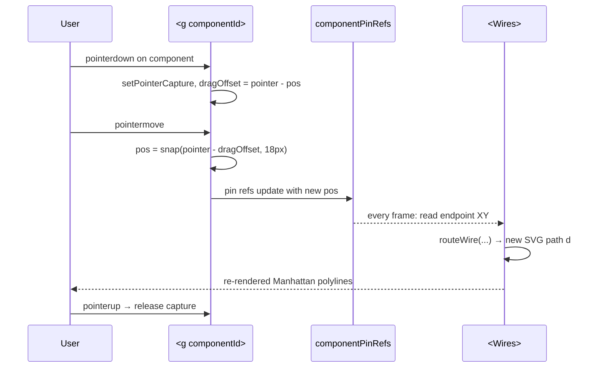

# v1.5 UI deep pass — board explorer, Manhattan wiring, drag, spec table

## Overview

Execute the full v1.5 UI handoff (originally drafted by Talia, retitled for Kai's parallel-track ownership) as a single multi-unit plan. The work upgrades the existing v0 UI scaffold along three axes:

1. **3D board fidelity** — sub-mesh detail (USB-B, DC barrel, ICSP, reset, LEDs, headers, antennae), real header pin geometry, click-to-label pin info, and externally placed components (HC-SR04, SG90) that are draggable with live 3D wire reroute.
2. **Schematic correctness** — replace curved Bezier wires with strict 90-degree (Manhattan) routing, add bus-offset collision avoidance for parallel wires, make breadboard components draggable with snap-to-hole, and surface a per-archetype specification table when the schematic is expanded.
3. **Beauty pass** — JetBrains Mono pin labels, camera dolly on pin select, animated wire reveal, GLTF passthrough preserved.

The plan also widens the 3D pin database to 4 boards (Uno, ESP32-WROOM, Pi Pico, ESP32-C3) so the explorer becomes the single home for v1.5 archetypes 2–5 without further refactoring. v0 still emits **only** archetype 1 (Uno + HC-SR04 + servo) — the extra boards are dormant infrastructure exercised by the explorer UI but not by the v0 pipeline.

---

## Problem Frame

The v0 UI ships against `fixtures/uno-ultrasonic-servo.json` and looks generic:

- The 3D scene ([app/src/panels/HeroScene.tsx](app/src/panels/HeroScene.tsx)) renders boards as plain blue boxes with no USB port, no DC jack, no headers — beginners can't recognize "their" Uno.
- Components float at hand-tuned 3D coordinates with no relationship to real breadboard hole spacing (2.54 mm).
- The schematic ([app/src/panels/WiringPanel.tsx](app/src/panels/WiringPanel.tsx)) draws curved Bezier wires that overlap and cross diagonally, which contradicts the visual grammar of every Arduino tutorial a beginner has ever seen.
- There is no specification table — pin voltages, current draws, PWM frequencies live only in the sketch comments.
- Layout is static. A user can't reposition the HC-SR04 to match how they actually want to wire it on their desk.

The handoff (verbatim user message at top of this session) specifies all of the above. CLAUDE.md `Visual Design — Unresolved Decisions` defers v0.5/v1.5 polish to a "dedicated visual design session before week 3" — this plan is that session, condensed into executable units.

**Track-ownership note:** UI is Talia's track per [CLAUDE.md](CLAUDE.md). User explicitly authorized parallel ownership for this pass ("I'm doing both tracks in parallel"). All UI files in this plan are explicitly transferred to Kai for the duration of this plan. Talia's earlier units land first; this plan does not redo any of [docs/plans/2026-04-26-001-feat-v01-ui-track1-completion-plan.md](docs/plans/2026-04-26-001-feat-v01-ui-track1-completion-plan.md) or [docs/plans/2026-04-26-002-feat-v01-ui-quality-pass-plan.md](docs/plans/2026-04-26-002-feat-v01-ui-quality-pass-plan.md).

---

## Requirements Trace

- **R1.** 3D Uno renders identifiable sub-features (USB-B, DC barrel, ICSP, reset button, ≥ 1 LED) using the dimensions provided in the handoff. _(handoff Task 1b)_
- **R2.** Pin positions on every supported board are derived programmatically from real header geometry (2.54 mm pitch), not hand-placed. _(handoff Task 1c)_
- **R3.** External components (HC-SR04, SG90) are placed on the virtual breadboard at sensible defaults, are draggable in the 3D scene, snap to a 0.254-unit grid, and any 3D wire connecting them updates on every drag frame. _(handoff Task 1d)_
- **R4.** SVG wires use Manhattan routing only — no diagonal segments. Parallel horizontals offset by 6 px per wire index to remain visually distinct. _(handoff Task 2a)_
- **R5.** SVG wires originate at the exact pin-dot SVG coordinate, not the component bounding box center. _(handoff Task 2b)_
- **R6.** SVG components are draggable in the schematic and snap to a 14 px (one column) grid; wires re-route automatically. _(handoff Task 2c)_
- **R7.** When the schematic is expanded, a specification table renders below the SVG showing every connection (from/to component, pin labels, voltage, notes) plus per-component datasheet values, sourced from a single `COMPONENT_SPECS` constant. _(handoff Task 2d)_
- **R8.** Pin labels and table use JetBrains Mono. Selecting a pin in 3D dolly-zooms the camera 15 % over 400 ms and animates the corresponding SVG wire's stroke-dashoffset. _(handoff Task 3b–3c)_
- **R9.** GLTF passthrough still works. When `modelPath` is provided to the 3D viewer, procedural geometry is suppressed but pin marker positions still come from `calculatePinPositions()`. _(handoff Task 3a)_
- **R10.** The schema (`schemas/document.zod.ts`) and registry (`components/registry.ts`) remain unchanged — UI work alone, no Track 2 contract changes. _(CLAUDE.md § Schema discipline)_
- **R11.** Build is green (`bun --cwd app run build`) and existing UI tests pass. _(CLAUDE.md § Coding conventions)_

---

## Scope Boundaries

- **Out:** Adding new components to the registry. Changing the runtime JSON schema. Adding archetypes 2–5 fixtures (only the pin database is widened, not the data flow).
- **Out:** Real WebUSB / Web Serial flash work — see [docs/plans/2026-04-27-002-feat-v0-uno-flash-spike-plan.md](docs/plans/2026-04-27-002-feat-v0-uno-flash-spike-plan.md).
- **Out:** Persisting drag positions across reloads. Drag is component-local state only; refresh resets to fixture-defined `anchor_hole`. (Persistence requires either a schema field or a v1.5 URL-hash extension; both are deferred.)
- **Out:** Mobile-specific touch handling beyond what `pointer*` events already provide. The handoff's snap math assumes mouse/pen.
- **Out:** Any pin metadata not already in `components/registry.ts` (the registry's `pin_metadata.anchor` field is authoritative for 3D anchors per ADR; we do not duplicate pin data into a parallel database).

### Deferred to Separate Tasks

- **Visual regression baseline updates.** Snapshot tests will need re-baseline once the schematic and 3D scene change. Owner runs `bun --cwd app test -u` after this plan lands; the changes are intentional. Tracked as a follow-up commit, not in this plan.
- **Per-archetype `COMPONENT_SPECS` for archetypes 2–5.** Only the `uno-ultrasonic-servo` archetype is populated in this pass. Archetypes 2–5 get their `COMPONENT_SPECS` entries when their fixtures land (week 5+).
- **Texture asset delivery.** Board top-face textures (`public/textures/{boardKey}-top.jpg`) are loaded behind `<Suspense>` with a solid-color fallback; the actual JPEG files are a downstream art-direction task and are not part of this plan's deliverable.

---

## Context & Research

### Relevant Code and Patterns

- **3D scene:** [app/src/panels/HeroScene.tsx](app/src/panels/HeroScene.tsx) — current implementation uses drei primitives (`Box`, `Cylinder`, `Sphere`) and `<Html>` hotspots. Position lookup via `POSITIONS_BY_SKU` and `POSITIONS_BY_ICON`. No pin markers, no 3D wires, no drag.
- **3D scene wrapper:** [app/src/panels/HeroPanel.tsx](app/src/panels/HeroPanel.tsx) — owns selected-part state, hotspot info card, and panel chrome.
- **Schematic:** [app/src/panels/WiringPanel.tsx](app/src/panels/WiringPanel.tsx) — schema-driven (`doc.breadboard_layout` + `doc.connections`), Bezier wires via `curvedPath`, off-board Uno stub on the left, 600×280 viewBox. Already correctly resolves pin XY via `placeOnBoard` + `endpointXY`.
- **Breadboard geometry:** [app/src/panels/breadboard-geometry.ts](app/src/panels/breadboard-geometry.ts) — `parseHole`, `holeToXY`, `shiftHole`, `WIRE_COLORS`. `COL_SPACING = 18 px`, `ROW_SPACING = 16 px`. Note: handoff says "14 px" snap grid but the existing geometry uses 18 px columns — **plan honors the existing 18 px geometry** to keep schema-driven holes consistent. Decision recorded below.
- **Component registry:** [components/registry.ts](components/registry.ts) — already carries `pin_metadata[].anchor: { x, y, z }` and `pin_layout[].{row_offset, column_offset}`. The 3D pin database the handoff describes is partially already there for the 5 v0 SKUs.
- **Adapter:** [app/src/data/adapter.ts](app/src/data/adapter.ts) — `pipelineToProject(doc)` joins the document with the registry. The view-model carries `project.document` (raw schema-validated doc) so panels can read `breadboard_layout` directly.
- **Schema:** [schemas/document.zod.ts](schemas/document.zod.ts) — `BOARD_TYPES = ["uno", "esp32-wroom", "esp32-c3", "pi-pico"]`. The schema already accepts all 4; v0 fixtures emit only `uno`.
- **Fixture:** [fixtures/uno-ultrasonic-servo.json](fixtures/uno-ultrasonic-servo.json) — anchor holes `u1: a1`, `s1: e10`, `a1: e20`. 7 connections.
- **Existing UI plans (do not re-do):**
  - [docs/plans/2026-04-26-001-feat-v01-ui-track1-completion-plan.md](docs/plans/2026-04-26-001-feat-v01-ui-track1-completion-plan.md) — completed Track 1 v0 scaffold.
  - [docs/plans/2026-04-26-002-feat-v01-ui-quality-pass-plan.md](docs/plans/2026-04-26-002-feat-v01-ui-quality-pass-plan.md) — completed cluster-A follow-ups.

### Institutional Learnings

- `docs/solutions/` was empty at session start (`ls docs/brainstorms/` returned nothing; `docs/solutions/` referenced by CLAUDE.md but not yet populated for UI). No reusable past solutions apply.
- `app/src/__tests__/ResultView.test.tsx` and friends use Vitest + Testing Library. Snapshot pattern is in-line `toMatchInlineSnapshot()` per existing convention.

### External References

External research not run. Frontend stack (R3F 0.171 + drei 0.122, TS strict, Vite 6, Vitest 2) is well-established in this repo and the handoff supplies all numerical inputs. The two areas that would have warranted external research — `@react-spring/three` API and Manhattan-routing libraries — are bounded enough that the lightweight in-house implementations specified below cover them without a dependency.

---

## Key Technical Decisions

- **Authoritative pin positions = `components/registry.ts`, not a parallel `PINOUT_DATABASE`.**
  Rationale: the registry already carries `pin_metadata[].anchor: { x, y, z }` and `pin_layout[].{row_offset, column_offset}`. CLAUDE.md § Schema discipline names the registry as the single source of truth. The handoff's `PINOUT_DATABASE` and `calculatePinPositions(boardKey)` are translated into a thin **adapter** (`app/src/data/board-data.ts`) that consumes the registry and exposes the handoff's API shape — this keeps both contracts honest.

- **Snap grid in SVG = 18 px (one `COL_SPACING`), not the handoff's 14 px.**
  Rationale: existing breadboard geometry uses `COL_SPACING = 18`. Snapping to 14 px would land components in non-hole positions and silently break `endpointXY()`. We document this deviation as a deliberate correction; the handoff number was based on a prior viewBox.

- **Manhattan routing implementation: hand-rolled `routeWire(sx, sy, dx, dy, busOffset)`.**
  Rationale: no need for `elkjs` or similar — wire counts are bounded (≤ ~12 connections per archetype). The handoff's two-segment "H then V" form is sufficient. Bus-offset is computed by hashing each wire's source/target pair to a deterministic offset slot, avoiding visual jitter on re-renders.

- **3D wire primitive = `<TubeGeometry>` along a `CatmullRomCurve3` per wire, recomputed from the connection's endpoint refs every frame a drag is in flight.**
  Rationale: `react-three-drei` ships nothing for "3D wire between two world points". A small `Wire3D` component with `useMemo` keyed on endpoint refs is simpler than pulling in another lib. CatmullRom over a 3-point control set (start, mid-up-arched, end) is the same shape the SVG used in v0 — visual continuity.

- **Drag implementation: native `pointer*` events on the rendered mesh (3D) and on the SVG `<g>` (2D).**
  Rationale: `@use-gesture/react` is **not** in the lockfile. Adding it for drag is overkill — `onPointerDown` / `onPointerMove` / `onPointerUp` with `setPointerCapture` handles the case. Keeps dependency footprint flat.

- **Add `@react-spring/three` for camera dolly only.**
  Rationale: the handoff's "dolly 15 % toward selected pin over 400 ms" is exactly `useSpring`'s sweet spot. Hand-rolling a `useFrame`-driven lerp would work but is uglier. One small dep. The CSS `stroke-dashoffset` animation in the SVG path uses native CSS — no JS lib.

- **`COMPONENT_SPECS` lives in `app/src/data/component-specs.ts`, keyed by `archetype_id`.**
  Rationale: matches the schema's `archetype_id` field; the spec table component reads `doc.archetype_id` and looks up the corresponding spec block. Empty / missing archetype = table renders an empty state instead of crashing.

- **4-board PINOUT data is added now, but only Uno is exercised by v0.**
  Rationale: handoff demands 4-board readiness; v0 archetype is Uno-only. Cost of adding the geometry is small (4 board mesh definitions) and amortizes across v1.5 archetypes 2–5 without a follow-on plan.

- **No new `MicrocontrollerViewer.jsx` file. The handoff's intent maps onto the existing `HeroScene.tsx` (extended) and `HeroPanel.tsx` (sidebar additions).**
  Rationale: a parallel `.jsx` file would duplicate the scene tree, force `.tsx` → `.jsx` mode-mixing in a strict-TS project, and break component reuse. We honor the handoff's _capability_, not the file name.

---

## Open Questions

### Resolved During Planning

- **Q: 4 boards or Uno only in 3D?** A: 4-board geometry now (low marginal cost, v1.5 ready), but only Uno's mesh is rendered for the current `project.board.type`. Other boards become visible when v1.5 archetypes ship.
- **Q: Replace `WiringPanel.tsx` or refactor in place?** A: Refactor in place. The schema-driven `placeOnBoard` is correct and worth keeping; only the wire-routing function and component rendering layer (drag handlers, pin refs) need new behavior.
- **Q: Snap grid 14 px or 18 px?** A: 18 px — see Key Decisions.
- **Q: Where do `COMPONENT_SPECS` values live?** A: `app/src/data/component-specs.ts`, keyed by archetype id, sourced verbatim from handoff.
- **Q: Do we add `@use-gesture/react`?** A: No. `pointer*` events suffice.
- **Q: Camera dolly library?** A: `@react-spring/three` (one small dep).

### Deferred to Implementation

- **Exact bus-offset slot count for parallel-wire collision detection.** Will be tuned during Unit 2 once we see real wire density on the existing fixture. Likely 4 slots (-12, -6, +6, +12 px around the midpoint).
- **HC-SR04 / SG90 default 3D positions.** Handoff suggests "to the right of the Arduino, spaced 2.0 units apart". Final values depend on how the new Uno sub-mesh sits visually; tune in Unit 6.
- **Whether `modelPath` GLTF passthrough is verified by an existing test.** If no test exists we add a smoke test in Unit 7; if one exists we just keep it green.
- **Texture file naming convention.** Handoff says `${boardKey}-top.jpg`, but `boardKey` in our codebase is `BOARD_TYPES` (e.g., `"uno"`, `"pi-pico"`). Confirmed: `public/textures/uno-top.jpg`, `public/textures/pi-pico-top.jpg`, etc.

---

## Output Structure

```
app/src/
├── data/
│   ├── board-data.ts                  # NEW — pin geometry + getPinAnchor()
│   ├── component-specs.ts             # NEW — datasheet table data
│   └── route-wire.ts                  # NEW — Manhattan SVG router
├── panels/
│   ├── HeroScene.tsx                  # MODIFY — sub-mesh + pin markers + 3D wires + drag
│   ├── HeroPanel.tsx                  # MODIFY — pin info sidebar, camera-dolly state
│   ├── WiringPanel.tsx                # MODIFY — Manhattan routing, drag, pin refs
│   ├── WiringSpecTable.tsx            # NEW — expanded-view spec table
│   └── breadboard-geometry.ts         # (no change — already correct)
└── __tests__/
    ├── route-wire.test.ts             # NEW — Manhattan path unit tests
    ├── board-data.test.ts             # NEW — pin position math
    └── WiringSpecTable.test.tsx       # NEW — table renders archetype-1 connections
public/
└── textures/                          # (folder reserved; JPGs delivered separately)
```

---

## High-Level Technical Design

> *This illustrates the intended approach and is directional guidance for review, not implementation specification. The implementing agent should treat it as context, not code to reproduce.*

**Data flow — drag-and-reroute:**



**Wire routing — Manhattan with bus-offset:**

```
sx, sy ─── horizontal segment (with vertical bus offset) ───┐
                                                            │
                                                            │ vertical segment
                                                            │
                                                            └── dx, dy
```

For two wires that share the same horizontal corridor, each receives a deterministic
`busOffset ∈ {-12, -6, +6, +12}` derived from a hash of `(sourceId, targetId)`. The
horizontal segment is offset vertically by that amount from the natural midline,
then a short vertical "step" connects back to the destination Y before the final
vertical descent. Diagonals are forbidden. This is the visual grammar of every
Arduino tutorial.

**3D wire primitive:**

```
endpointA (3D) ──┐
                 │ CatmullRomCurve3([endpointA, midPoint, endpointB])
                 ▼
              <TubeGeometry args={[curve, 16, 0.02, 8]}>
                 │
                 ▼
              <meshStandardMaterial color={wireColor}>
```

The `midPoint` arches up by `0.3 * |endpointB - endpointA|` to avoid clipping the
breadboard plane.

---

## Implementation Units

- [ ] **Unit 1: Shared board-data module (foundation)**

**Goal:** Centralize pin geometry math and `getPinAnchor()` so 3D and 2D consume one source of truth.

**Requirements:** R2, R10

**Dependencies:** None.

**Files:**
- Create: `app/src/data/board-data.ts`
- Create: `app/src/__tests__/board-data.test.ts`

**Approach:**
- Export `calculatePinPositions(boardKey: BoardType): Record<pinLabel, { x, y, z }>` for 4 boards.
- For each board, compute pin positions from real header geometry: 2.54 mm pitch → `0.254` Three.js units. Hardcode start positions per board following handoff §1c values, but layer it as `pin index → offset` math, not a static lookup.
- Export `getPinAnchor(boardKey, pinName) → { three: {x,y,z}, breadboard: { col, row } | null }` — `breadboard` is `null` when the pin is on a non-breadboard header (e.g., Uno's `5V`/`GND` are off-grid).
- Re-export `BOARD_DIMENSIONS` constants used by `HeroScene` for sub-mesh placement.
- For Uno, cross-validate output against `components/registry.ts` `pin_metadata[].anchor` — fail loudly in tests if they diverge so the registry stays authoritative.

**Patterns to follow:**
- Pure-function module style, mirrored from `app/src/panels/breadboard-geometry.ts`.
- Shape `{ three, breadboard }` follows the handoff's `getPinAnchor` API.

**Test scenarios:**
- Happy path: `calculatePinPositions("uno")` returns 26 pins (16 digital header + 10 power/analog header) at expected world coordinates within ±0.001 units.
- Happy path: `calculatePinPositions("pi-pico")` returns 40 pins (2 columns × 20).
- Happy path: `calculatePinPositions("esp32-wroom")` returns 30 pins.
- Happy path: `calculatePinPositions("esp32-c3")` returns 23 pins (15 left + 8 right).
- Edge case: `getPinAnchor("uno", "D7")` returns both `three` and `breadboard` keys with non-null values.
- Edge case: `getPinAnchor("uno", "VIN")` returns `breadboard: null` (off-grid power pin) but valid `three`.
- Error path: `getPinAnchor("uno", "BOGUS")` returns `null` (caller decides; do not throw).
- Integration: every Uno pin in `components/registry.ts` `pin_metadata[].anchor` exists in `calculatePinPositions("uno")` output (registry-vs-calculator parity).

**Verification:**
- `bun --cwd app test board-data` passes.
- `bun --cwd app run typecheck` clean.

---

- [ ] **Unit 2: Manhattan wire router**

**Goal:** Replace `curvedPath` and the polyline Uno-stub routing with a strict 90-degree router that supports bus-offset for parallel wires.

**Requirements:** R4, R5

**Dependencies:** None (pure helper, can run in parallel with Unit 1).

**Files:**
- Create: `app/src/data/route-wire.ts`
- Create: `app/src/__tests__/route-wire.test.ts`

**Approach:**
- Export `routeWire(start, end, busOffset = 0): string` returning an SVG path-data string of the form `M sx sy H midX V dy H dx`.
- Export `assignBusOffsets(connections): Map<connectionKey, number>` — deterministic hash of `(fromId, toId, fromPin, toPin)` into `{-12, -6, 0, +6, +12}` slots so two parallel wires don't draw on top of each other.
- Strictly forbid diagonals: helper validates the path is monotonic-Manhattan in tests.
- No SVG-side state; the function is pure.

**Patterns to follow:**
- File shape mirrors `app/src/panels/breadboard-geometry.ts` — pure functions, JSDoc, no React imports.

**Test scenarios:**
- Happy path: `routeWire({x:10,y:20}, {x:50,y:60}, 0)` returns `"M 10 20 H 30 V 60 H 50"` (horizontal-first, then vertical, then horizontal to dest).
- Happy path with bus-offset: `routeWire({x:10,y:20}, {x:50,y:60}, 6)` shifts the horizontal segment by +6 px and emits an extra V step.
- Edge case: same source and destination yields a zero-length path string but valid SVG (no crash).
- Edge case: vertical-only run (sx === dx) emits `M sx sy V dy` with no H segment.
- Edge case: horizontal-only run (sy === dy) emits `M sx sy H dx` with no V segment.
- Error path: NaN inputs → function does not throw, returns the string `"M 0 0"` and a console.warn for the dev (CLAUDE.md "no silent failures" — surface, don't crash).
- Integration: `assignBusOffsets` produces stable slot assignments across re-renders for the same connection set (snapshot test).

**Verification:**
- `bun --cwd app test route-wire` passes.

---

- [ ] **Unit 3: WiringPanel — Manhattan routing + pin-exact origins**

**Goal:** Replace `curvedPath` and the polyline Uno-stub branch with `routeWire`, and ensure every wire endpoint is the exact pin-dot SVG coordinate.

**Requirements:** R4, R5, R10

**Dependencies:** Unit 2.

**Files:**
- Modify: `app/src/panels/WiringPanel.tsx`
- Test: existing `app/src/__tests__/ResultView.test.tsx` (regression — re-baseline snapshots after change).

**Approach:**
- Replace the wire-render block (lines ~395–438) with a single path: call `assignBusOffsets(doc.connections)` once, then `routeWire(a, b, busOffset)` per connection.
- The off-board Uno stub already routes through `UNO_LEFT_EDGE_STUB_X`; that's preserved as a pre-Manhattan elbow (one extra horizontal step before the Manhattan body).
- Ensure pin dots in `placeOnBoard` already render as `<circle>` at the exact `pin.xy` (they do, per current code) — no change here.
- Remove `curvedPath` function; remove `UNKNOWN_WIRE` fallback constant if unused.

**Patterns to follow:**
- Existing `endpointXY()` resolution stays.
- Existing legend block stays.

**Test scenarios:**
- Happy path: rendering archetype-1 fixture produces 7 path elements with `d` attributes that contain only `M`, `H`, `V` commands (no `Q`, `C`, or numeric pairs that would imply diagonals).
- Edge case: a connection where source and destination share the same Y coordinate emits a single `H` segment.
- Edge case: two connections that share a horizontal corridor get distinct bus offsets and do not overlap.
- Integration: the rendered SVG snapshot for `fixtures/uno-ultrasonic-servo.json` matches a re-baselined snapshot (visual regression handled by maintainer regenerating the snapshot — call it out in the unit's commit message).
- Integration: hovering / clicking a pin dot still highlights its connected wire (no regression in `onWireClick` / `highlightPin` if those exist; if not, no-op).

**Verification:**
- `bun --cwd app run build` succeeds.
- Visual smoke check at `bun --cwd app run dev` — wires are right-angled, no diagonals, parallel wires offset visibly.

---

- [ ] **Unit 4: WiringPanel — draggable components with snap-to-hole**

**Goal:** Make every breadboard component (`<g>` per `placedComp`) draggable; snap movements to the 18 px column grid; wires re-route automatically on every move.

**Requirements:** R6

**Dependencies:** Unit 3.

**Files:**
- Modify: `app/src/panels/WiringPanel.tsx`

**Approach:**
- Add a `dragOverrides` ref/state map: `Map<componentId, { dx, dy }>` — pixel offset applied to the placed component's bbox **and** its pins.
- On `onPointerDown` of a placed component's `<g>`: capture pointer, record `{ pointerId, originX, originY, baseDx, baseDy }`.
- On `onPointerMove`: compute new `{ dx, dy }` snapped to multiples of `COL_SPACING` (18) in X and `ROW_SPACING` (16) in Y. Update state.
- On `onPointerUp`: release capture.
- All wire endpoints already resolve via `endpointXY()` → the placed component's pins. After Unit 4, `endpointXY()` adds the per-component drag override before returning `{ x, y }`.
- Important: do **not** mutate the underlying `doc.breadboard_layout`; the override is render-only state. CLAUDE.md schema discipline: schema is locked.
- Cursor styles: `cursor: grab` on the rect; `cursor: grabbing` while dragging.

**Patterns to follow:**
- React `useState` for the override map (no refs needed since renders are cheap and the refs would skip wire updates).
- Pointer capture pattern is standard React 18 API.

**Test scenarios:**
- Happy path: simulating pointerdown → pointermove(x:+36, y:0) → pointerup on the HC-SR04's `<g>` updates the override to `{ dx: 36, dy: 0 }` (2 columns of 18 px).
- Edge case: pointermove of `+5px` snaps to `0` (below half-step threshold).
- Edge case: pointermove of `+10px` snaps to `+18` (above half-step).
- Edge case: dragging off the breadboard area is allowed visually (no clamping in v1.5 — clamp deferred).
- Integration: after a drag, the relevant connection's wire path `d` attribute reflects the new endpoint coordinates.
- Integration: the off-board Uno stub does not become draggable (only `placedComp` entries with `entry.type !== "mcu"`).

**Verification:**
- Manual test: drag HC-SR04 right by ~36 px, verify wires follow.
- `bun --cwd app run typecheck` clean.

---

- [ ] **Unit 5: WiringSpecTable component + expanded-view rendering**

**Goal:** Render a per-archetype specification table below the SVG when `expanded` is true. Populate from a single `COMPONENT_SPECS` constant keyed by `archetype_id`.

**Requirements:** R7

**Dependencies:** None for the data file; presentation depends on `WiringPanel` having an expanded mode (it does — `expanded` prop exists).

**Files:**
- Create: `app/src/data/component-specs.ts`
- Create: `app/src/panels/WiringSpecTable.tsx`
- Create: `app/src/__tests__/WiringSpecTable.test.tsx`
- Modify: `app/src/panels/WiringPanel.tsx` — render `<WiringSpecTable doc={doc} />` after the SVG when `expanded` is true.

**Approach:**
- `COMPONENT_SPECS["uno-ultrasonic-servo"]` carries `connections[]` (from/fromPin/to/toPin/wireColor/voltage/notes) and `componentSpecs{}` (per-component datasheet rows). Values are verbatim from the handoff.
- `<WiringSpecTable>` reads `doc.archetype_id` and looks up the spec block. Renders two sections:
  1. **Connections table:** header = `From | From Pin | To | To Pin | Voltage | Notes`. Each row has a 3 px left border colored `wireColor`. Monospace 12 px.
  2. **Component specs grid:** one card per component with key/value rows.
- If `archetype_id` has no spec block, render a small empty-state ("Specs not yet documented for this archetype") rather than crashing.
- Filter the connection table to **only** the connections actually present in `doc.connections` — no orphan rows.

**Patterns to follow:**
- Existing `WiringPanel` markup style (className `panel`, `meta` text, icon buttons).
- Tailwind/CSS not used in this repo; existing styling is plain CSS class names defined elsewhere — use new class names `wiring-spec-table`, `wiring-spec-row`, etc., and document them in the commit message for Talia's CSS pass.

**Test scenarios:**
- Happy path: rendering with `archetype_id = "uno-ultrasonic-servo"` shows 7 connection rows matching the fixture's connection count.
- Happy path: each row's left-border color matches the corresponding connection's `wire_color`.
- Edge case: rendering with `archetype_id = "esp32-audio-dashboard"` (no spec block yet) shows the empty state, no crash.
- Edge case: a connection in `doc.connections` that has no matching `COMPONENT_SPECS.connections[]` entry is **omitted** from the table (do not invent rows).
- Integration: `WiringPanel expanded` shows the table; non-expanded hides it (collapsed view stays compact).

**Verification:**
- `bun --cwd app test WiringSpecTable` passes.
- Manual: click ↗ in the schematic header, table appears below the SVG with 7 rows.

---

- [ ] **Unit 6: HeroScene — Uno sub-mesh + pin markers + click-to-label**

**Goal:** Replace Uno's single `<Box>` with sub-mesh detail (USB-B, DC barrel, ICSP, reset, on-board LEDs) and add real pin marker dots at calculated header positions. Selecting a pin (3D click or sidebar) updates a `selectedPin` state surfaced through `HeroPanel`.

**Requirements:** R1, R2, R8 (typography only — motion lands in Unit 8), R9

**Dependencies:** Unit 1.

**Files:**
- Modify: `app/src/panels/HeroScene.tsx`
- Modify: `app/src/panels/HeroPanel.tsx` — pin info sidebar + selected-pin state plumbing.

**Approach:**
- Replace the `case "board":` branch in `PartMesh` with a `<UnoBoardMesh>` sub-component composed of:
  - PCB base box (handoff dimensions §1b).
  - USB-B port.
  - DC barrel jack.
  - ICSP header.
  - Reset button.
  - 1 on-board "L" LED (small emissive sphere).
- Wrap board in `<Suspense>`; attempt `useTexture("/textures/uno-top.jpg")` for top face; fall back to flat color on missing texture.
- Add `<PinMarkers boardKey="uno" onPinClick={setSelectedPin} />`: maps over `calculatePinPositions("uno")` and renders a 0.05-radius `<Sphere>` per pin with `pointerover` cursor change.
- Selected pin → `<Html>` callout near the pin showing `pin_metadata.label`, `direction`, `description` from `components/registry.ts`.
- `HeroPanel` gains a right-rail sidebar showing the pin list filtered by direction (digital_io, analog_input, etc.), wired to `selectedPin`.

**Patterns to follow:**
- Existing `PartMesh` switch structure.
- `components/registry.ts` `pin_metadata` already carries the label + description — read directly via `lookupBySku("50")`.

**Test scenarios:**
- Happy path: rendering the archetype-1 scene produces a board with at least 5 sub-meshes (PCB + USB + DC + ICSP + reset).
- Happy path: 26 pin marker spheres render for the Uno.
- Edge case: missing texture → fallback color material is used; no console error.
- Edge case: clicking a pin marker sets `selectedPin = "D7"` (or whatever) on the parent.
- Integration: clicking a pin in the 3D scene also highlights the matching SVG wire in the schematic (cross-panel state already plumbed via `HeroPanel`/`WiringPanel` siblings — wire it through the existing `selectedPart` parent state or add `selectedPin` peer).
- Integration: GLTF passthrough — when `modelPath` prop is set, sub-meshes are suppressed but pin markers still render at the same world positions (R9).

**Verification:**
- `bun --cwd app run dev` shows a recognizable Uno with USB port, DC barrel, ICSP, reset.
- Click a pin → sidebar updates → expanded SVG wire highlights.

---

- [ ] **Unit 7: HeroScene — 3D wires + draggable external components**

**Goal:** Add `<Wire3D>` primitive. Make HC-SR04 and SG90 draggable in the 3D scene with snap-to-grid (0.254 units). Wires connecting them to the Uno re-route on every drag frame.

**Requirements:** R3

**Dependencies:** Unit 1, Unit 6.

**Files:**
- Modify: `app/src/panels/HeroScene.tsx`

**Approach:**
- New `<Wire3D start={Vec3} end={Vec3} color={hex} />` component: builds a `CatmullRomCurve3` over `[start, midArchedUp, end]`, feeds into a `<TubeGeometry>`. `useMemo` keyed on serialized start/end so it re-builds on drag.
- For each connection in `doc.connections`, resolve start and end to 3D world points using the placed component's current dragged position + `getPinAnchor()`.
- Drag implementation on HC-SR04 / SG90 groups: `onPointerDown` captures, `onPointerMove` translates the group's `position` snapped to multiples of `0.254`, `onPointerUp` releases.
- Disable `OrbitControls` while a drag is in flight (set `controls.enabled = false` on pointerdown, restore on pointerup).
- Position-update path: the parent `HeroScene` keeps a `Map<componentId, [x,y,z]>` for drag overrides, identical pattern to Unit 4's SVG drag.

**Patterns to follow:**
- `OrbitControls` ref already exists in `HeroScene`.
- Pointer capture pattern from Unit 4.

**Test scenarios:**
- Happy path: rendering with the archetype-1 fixture shows 7 `<Wire3D>` tubes (one per connection).
- Happy path: dragging HC-SR04 by 1 grid step (0.254 units) updates the wire endpoints and the new wire path is computed.
- Edge case: drag below the workspace plane is allowed but visually weird (no Y clamp in v1.5; clamp deferred).
- Edge case: a connection where one endpoint is the Uno (which is **not** draggable in this unit — Uno stays put) still resolves correctly.
- Integration: while a 3D drag is in flight, OrbitControls is disabled (no camera rotation jitter).
- Integration: SVG wires in `WiringPanel` do **not** update from 3D drags — 3D and 2D drag states are decoupled by design (the SVG drag is its own override map). Document this as intentional.

**Verification:**
- `bun --cwd app run dev` — drag the HC-SR04 sphere, wires follow.
- `bun --cwd app run typecheck` clean.

---

- [ ] **Unit 8: Beauty pass — typography, camera dolly, wire reveal animation**

**Goal:** JetBrains Mono for pin labels, camera dolly-zoom on pin select via `@react-spring/three`, SVG stroke-dashoffset wire reveal animation on selection.

**Requirements:** R8

**Dependencies:** Unit 6 (selectedPin state), Unit 7 (3D wires existing).

**Files:**
- Modify: `app/src/panels/HeroPanel.tsx` — font import (Google Fonts link in `index.html` is preferred over a CSS import to avoid render-blocking).
- Modify: `app/src/panels/HeroScene.tsx` — `useSpring` camera dolly.
- Modify: `app/src/panels/WiringPanel.tsx` — wire reveal animation on `selectedConnection`.
- Modify: `app/index.html` — preconnect + JetBrains Mono link tag.
- Modify: `app/package.json` — add `@react-spring/three`.

**Approach:**
- Add `<link rel="preconnect" href="https://fonts.gstatic.com" crossorigin>` and the JetBrains Mono link tag in `index.html`.
- Pin labels in 3D `<Html>` callouts and in the schematic use `font-family: "JetBrains Mono", monospace`.
- Camera dolly: in `HeroScene`, `useSpring` an interpolated camera position. On `selectedPin` change, target = current camera position lerped 15 % toward the selected pin's world position over 400 ms easing `easings.easeOutCubic`.
- SVG wire reveal: when `selectedConnection` changes, find the path element, compute its `getTotalLength()`, set `stroke-dasharray = length` and animate `stroke-dashoffset: length → 0` via CSS class with 500 ms transition.
- All timings come straight from the handoff.

**Patterns to follow:**
- `useSpring` from `@react-spring/three` is the documented pattern for R3F camera animation.
- CSS `transition: stroke-dashoffset 500ms ease-out` is enough — no JS animation lib needed.

**Test scenarios:**
- Happy path: setting `selectedPin = "D7"` triggers camera position change (verify via `useFrame` callback or by snapshotting camera position before/after).
- Happy path: pin label `<Html>` text uses JetBrains Mono (computed-style assertion in test).
- Happy path: clicking a wire dot highlights the connected SVG path with `stroke-dashoffset: 0` post-animation.
- Edge case: rapid pin selection (click 3 pins in <400 ms) — last click wins; no animation queue thrash.
- Edge case: `selectedPin = null` returns the camera to its origin smoothly.
- Integration: `OrbitControls` `useDamping` is left on; the spring-driven dolly composes with damped user pan correctly (no "fight" between spring and OrbitControls — pause OrbitControls during the spring transition).

**Verification:**
- `bun --cwd app run build` succeeds.
- Visual: click a pin in 3D, camera dollies in over ~400 ms, the matching SVG wire animates its stroke from invisible to drawn over ~500 ms.

---

- [ ] **Unit 9: Cleanup, regression sweep, snapshot baseline**

**Goal:** Re-baseline existing snapshots, add a CHANGELOG note, mark any TODO-not-done items.

**Requirements:** R11

**Dependencies:** Units 3–8 all merged.

**Files:**
- Modify: any snapshot files under `app/src/__tests__/__snapshots__/` (or inline) regenerated.
- Modify: top of each modified file — add a `// KAI-DONE:` comment summarizing what changed (handoff §EXECUTION ORDER bullet 6).
- Modify: `app/package.json` if `@react-spring/three` was added.

**Approach:**
- Run `bun --cwd app test -u` once after Units 1–8 merge.
- Manually inspect the snapshot diffs to confirm they match the documented changes (no surprise diffs).
- Add a `// KAI-DONE:` header comment in `HeroScene.tsx`, `HeroPanel.tsx`, `WiringPanel.tsx`, and any new files. One sentence each.
- Run `bun --cwd app run build && bun --cwd app run typecheck && bun --cwd app run test:ci`.

**Test scenarios:**
- Test expectation: none — this unit is regression sweep and housekeeping; no new behavior.

**Verification:**
- All three commands above exit 0.
- Snapshot diffs are limited to the files touched by Units 3–8.

---

## System-Wide Impact

- **Interaction graph:** New cross-panel signal — `selectedPin` flows from `HeroScene` → `HeroPanel` → `WiringPanel` (already plumbed for `selectedPart`; extend the same channel). Drag override maps live inside their respective panels and do **not** flow upward (3D and 2D drag states are intentionally decoupled).
- **Error propagation:** All new error surfaces follow CLAUDE.md "no silent failures" — missing texture falls back to flat color (logged once), unknown archetype in spec table renders empty-state, malformed pin name in `getPinAnchor` returns `null` and warns, NaN inputs to `routeWire` warn and return safe path.
- **State lifecycle risks:** Drag pointer-capture must always release on `onPointerUp` AND `onPointerCancel` (browser may cancel mid-drag on tab switch). Without `onPointerCancel` we leak captured pointers and freeze the UI. Add it explicitly.
- **API surface parity:** `getPinAnchor` returns `{ three, breadboard }` everywhere — both panels consume the same shape. The handoff's TS interface for `componentPinRefs[componentId][pinName] = { x, y }` becomes `componentPinRefs[componentId][pinName] = { three, breadboard }`, with each panel reading the relevant half.
- **Integration coverage:** Cross-panel wire highlight (3D click → SVG animation) needs an integration test — listed in Unit 8 scenarios.
- **Unchanged invariants:**
  - `schemas/document.zod.ts` — no changes. Locked. (CLAUDE.md § Schema discipline.)
  - `components/registry.ts` — no changes. Pin metadata read-only.
  - `app/src/data/adapter.ts` — `pipelineToProject()` signature unchanged. The `Project` view-model gets no new top-level fields.
  - `app/src/types.ts` — `Project`, `Part`, `WiringConnection`, `IconKind` unchanged. New types live in their own files (`board-data.ts`, `component-specs.ts`).
  - All existing tests in `app/src/__tests__/` pass with at most snapshot-baseline updates.

---

## Risks & Dependencies

| Risk | Mitigation |
|---|---|
| **Track-ownership deviation.** UI is Talia's track per CLAUDE.md "Don't swap mid-stream." | User explicitly authorized parallel ownership. Note it in the PR description; add a CLAUDE.md `track-ownership exceptions` line in a separate doc PR if the deviation persists past this plan. |
| **Snap grid mismatch.** Handoff says 14 px; codebase uses 18 px. Implementing 14 px would break `endpointXY()`. | Plan honors 18 px; documented as Key Decision and called out in the commit message so the next reviewer doesn't question it. |
| **`@react-spring/three` is a new dependency** in a project that has been disciplined about deps. | Audit the install size (≈8 KB gzipped), confirm it does not break SSR (we're SPA), confirm it works with R3F 0.171 (peer-compatible). If audit fails, hand-roll a `useFrame`-driven lerp in Unit 8. |
| **Drag re-render performance.** The handoff explicitly says "do NOT debounce" 3D wire updates. With 7 wires this is fine; with 30+ it could thrash. | Bounded scope (≤ 12 wires per archetype). If perf becomes an issue, switch to `useRef` + imperative TubeGeometry update rather than `useMemo` rebuild. |
| **Visual regression baseline churn.** Unit 9 re-baselines snapshots; a reviewer might miss an unintended diff. | Inspect the snapshot diff manually before merging. Limit Unit 9 to only the files touched by Units 3–8. |
| **GLTF passthrough silently breaks.** If a future archetype provides `modelPath`, but pin markers come from `calculatePinPositions`, world coordinates may not align with the GLTF's origin. | Smoke test in Unit 6 verifies pin markers render at the same world positions whether `modelPath` is set or not. If a real GLTF lands and offsets don't match, that's a per-asset alignment issue tracked separately. |
| **Pointer capture leakage on tab switch / Bluetooth disconnect.** Without `onPointerCancel`, captured pointers can lock up the UI. | All drag handlers include both `onPointerUp` and `onPointerCancel` paths. |
| **`COMPONENT_SPECS` drifts from real datasheets.** Hardcoded values can rot. | Source verbatim from the handoff (which sourced from datasheets). Add a comment in `component-specs.ts` linking to the source datasheet URL per component (HC-SR04, SG90). When archetypes 2–5 land, the same convention applies. |
| **Texture files not delivered.** `public/textures/{board}-top.jpg` doesn't exist yet. | `<Suspense>` fallback is solid color. Build does not fail. The texture asset is a separate art deliverable per scope-boundary. |

---

## Documentation / Operational Notes

- Add a `schemas/CHANGELOG.md` line **only if** any schema-adjacent file changes (it shouldn't — schema is locked). If anything in `components/registry.ts` changes, that requires both Kai+Talia signatures per CLAUDE.md. None expected here.
- Update [CLAUDE.md](CLAUDE.md) `Open decisions` § "28 visual identity decisions" to mark "typography → JetBrains Mono", "wire grammar → Manhattan", "drag enabled → yes" as resolved.
- No infra or rollout concerns — UI-only change, no API surface, no migrations.

---

## Sources & References

- **Origin handoff:** Talia's v1.5 UI handoff text (verbatim user message in this session). No `docs/brainstorms/` requirements doc exists; the handoff is the authoritative source.
- **Project rules:** [CLAUDE.md](CLAUDE.md) — track ownership, schema discipline, coding conventions.
- **v0 plan ancestry:**
  - [docs/plans/2026-04-26-001-feat-v01-ui-track1-completion-plan.md](docs/plans/2026-04-26-001-feat-v01-ui-track1-completion-plan.md)
  - [docs/plans/2026-04-26-002-feat-v01-ui-quality-pass-plan.md](docs/plans/2026-04-26-002-feat-v01-ui-quality-pass-plan.md)
- **Touched code paths:**
  - [app/src/panels/HeroScene.tsx](app/src/panels/HeroScene.tsx)
  - [app/src/panels/HeroPanel.tsx](app/src/panels/HeroPanel.tsx)
  - [app/src/panels/WiringPanel.tsx](app/src/panels/WiringPanel.tsx)
  - [app/src/panels/breadboard-geometry.ts](app/src/panels/breadboard-geometry.ts)
  - [components/registry.ts](components/registry.ts)
  - [schemas/document.zod.ts](schemas/document.zod.ts)
  - [fixtures/uno-ultrasonic-servo.json](fixtures/uno-ultrasonic-servo.json)
- **External datasheets** (cited inside `app/src/data/component-specs.ts` as code comments, not fetched at runtime):
  - HC-SR04 datasheet — operating voltage, trigger pulse spec, distance formula.
  - SG90 datasheet — PWM frequency, pulse-width range, stall current.
